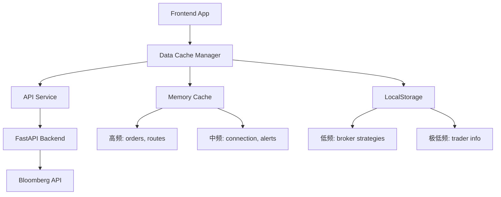
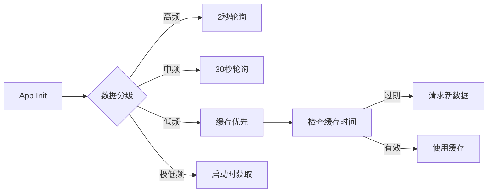

## 产品概述

优化EMSX交易系统的数据更新频率管理和缓存策略，通过数据分级更新机制减少不必要的API调用，提升系统响应速度和用户体验。

## 核心需求

### 1. 数据分级更新管理

- **高频数据**（1-2秒）：订单数据、路由数据、实时价格
- **中频数据**（30秒）：监控告警计数、连接状态检查
- **低频数据**（日/周级）：交易员信息、Broker Strategies、Strategy参数定义

### 2. 本地缓存优化

- 对变化极少的数据（Broker Strategies、Strategy参数）实现前端本地缓存
- 缓存失效策略：按时间（每日）或手动刷新
- 减少Bloomberg API调用和等待时间

### 3. 现有问题修复

- 交易员信息每2秒轮询 → 优化为每日/启动时获取
- Broker Strategies每次打开对话框都重新请求 → 实现本地缓存
- 缺乏增量更新机制 → 添加时间戳比对

## 变量时效性分析

| 数据类型 | 变化频率 | 当前更新频率 | 建议更新频率 |
| --- | --- | --- | --- |
| 订单数据 (orders) | 高（秒级） | 2秒轮询 | 保持2秒 |
| 路由数据 (routes) | 高（秒级） | 2秒轮询 | 保持2秒 |
| 交易员信息 (traderInfo) | 极低（日级） | 2秒轮询 | 启动时/每日 |
| Broker Strategies | 极低（周/月） | 每次请求 | 本地缓存24小时 |
| Strategy参数定义 | 极低（周/月） | 每次请求 | 本地缓存24小时 |
| 监控告警计数 | 中（依赖orders） | 实时计算 | useMemo优化 |


## 技术栈

### 前端技术栈

- **框架**：React 19 + TypeScript
- **构建工具**：Vite 7.x
- **状态管理**：React Hooks (useState, useCallback, useMemo, useEffect)
- **样式**：TailwindCSS + shadcn/ui
- **存储**：LocalStorage + 内存缓存

### 后端技术栈

- **框架**：FastAPI + Python 3.11+
- **API**：Bloomberg EMSX API (blpapi)

## 技术架构

### 数据分层架构



### 更新频率策略



## 核心实现方案

### 1. 创建数据缓存管理器

- 统一管理不同频率数据的获取和缓存
- 实现缓存失效检查和刷新逻辑
- 支持手动刷新和自动刷新两种模式

### 2. 优化前端轮询逻辑

- App.tsx中分离高频、中频、低频数据的轮询
- 使用独立的useEffect和定时器管理不同频率
- 页面隐藏时降低轮询频率或暂停

### 3. 实现Broker Strategy缓存

- api.ts中添加缓存层
- route-modify-dialogs.tsx优先使用缓存数据
- 添加缓存时间戳和手动刷新按钮

## 关键代码结构

```typescript
// 数据频率配置
interface DataFrequencyConfig {
  key: string;
  interval: number;      // 轮询间隔ms
  cacheDuration: number; // 缓存有效期ms
  storage: 'memory' | 'localStorage';
}

// 缓存管理器接口
interface CacheManager<T> {
  get(): T | null;
  set(data: T): void;
  isValid(): boolean;
  invalidate(): void;
}
```

## 性能优化要点

1. **减少API调用**：低频数据使用缓存，预计减少30-50%请求
2. **减少等待时间**：Broker Strategy对话框打开时直接使用缓存，无需等待
3. **优化渲染**：使用useMemo减少不必要的重计算
4. **错误降级**：网络错误时优先使用缓存数据

## 实现注意事项

1. **向后兼容**：保持现有API接口不变
2. **错误处理**：缓存失效时自动回退到API请求
3. **内存管理**：限制缓存大小，避免内存泄漏
4. **并发控制**：避免同时发起多个相同请求