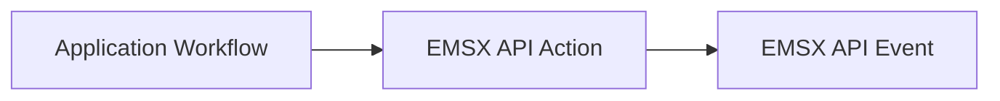
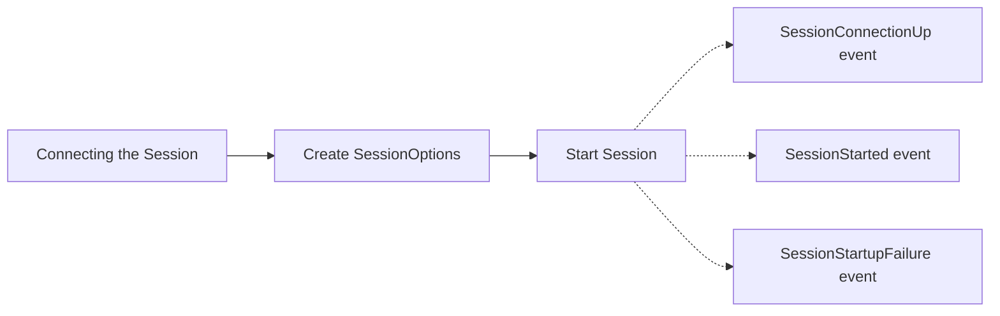
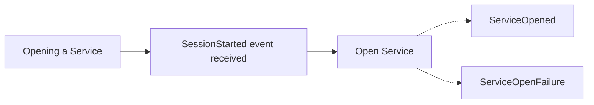
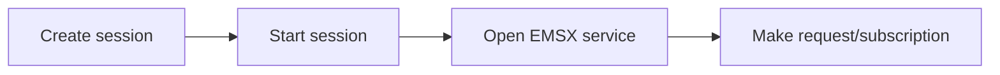

## EMSX API Developer's Guide

---

- [Introduction](#introduction)
- [Understanding EMSX API](#understanding-emsx-api)
- [Using Subscriptions](#using-subscriptions)
- [Reference - Requests](#reference-requests)
- [Reference - Elements](#reference-elements)
- [Trading API Server](#trading-api-server)
- [F.A.Q.](#f-a-q)
## Introduction

### Overview

The EMSX API is a service of the Bloomberg API. It provides integration with Bloomberg's EMSX terminal product. It gives Bloomberg users the ability to manage and automate Equities, Futures and Options trading via EMSX.

The Bloomberg API provides the ability to programmatically connect to the EMSX API service via library support for the following languages:

- Python
- Java
- .NET (including .NET Core)
- C++

It  allows users to access the full 2000+ global execution venues available through EMSX. The EMSX API requires separate authorization by the receiving broker, in addition to the Bloomberg authorization.

### Pre-requisites

#### EMSX function

---

The Bloomberg EMSX API requires a full understanding of how the Bloomberg EMSX<GO> function works within the Bloomberg terminal. Before starting on any EMSX API project, please have your local EMSX representative provide comprehensive training on the EMSX<GO> function. This documentation does not include any details on how EMSX<GO> works.

Due to the trading nature with the various Trading API's at Bloomberg (e.g. EMSX API, IOI API, etc.) Bloomberg cannot  assist on the client-side coding other than providing a high-level overview of the service, advice on some of the best practices approach to use the request/response paradigm and the asynchronous event-driven nature of the subscription.

It is highly recommended that the technical resource working on the Trading API has extensive programming experiences and a solid understanding of software application architecture.

---

#### Bloomberg API

---

This document describes the EMSX API service.  Although it may provide some necessary details of  the functionality, it does not cover the Bloomberg API in detail. Please refer to the real-time services documentation on this site for a deeper understanding of the Bloomberg API.

---

### Microsoft Excel

#### Excel add-in for EMSX

For users looking to access EMSX capabilities directly from Microsoft Excel, please refer to the in-build help of the Bloomberg ribbon in Excel.

> **图：Bloomberg Excel Ribbon 界面**
>
> | 功能区 | 说明 |
> |---|---|
> | EMSX Panel | Trading |
> | Data Navigation | Explore |
> | Help | 帮助文档 |
> | Diagnostics | Help and Support |

### Tradebook integration

# What is tradebook

# EMSX API as it relates to tradebook

# Support/onboarding

# nuances/caveats

### Support

#### Bloomberg Tradedesk

If you are unable to find the support you need within this documentation, the code samples or the tutorials, or if you have questions regarding your EMSX API data, please contact the Bloomberg Trade Desk team. They can be reached through:

- Help Help (F1 F1) on the Bloomberg terminal.
- EC<GO> on the Bloomberg terminal, or visit [https://console.bloomberg.com](https://console.bloomberg.com).
 - If you do not have an account, please create one.
 - Select Request Help, choose EMSX as the request type.
 - Be sure to mention EMSX API in the body of the request to ensure it gets forwarded to the EMSX API specialists.

## Understanding EMSX API

### General Principles

#### Sessions and Services

The EMSX API is a service of the Bloomberg API. The Bloomberg API is a session and service based solution.

The session controls the connection to the Bloomberg back end, while the service deals with the nature of the data or the function the user is working with.  Once a session has been successfully established, the application is connected to Bloomberg. Once the service has been successfully opened, the capabilities of that service are now available within the application.

Each service is backed by a schema, which defines the capabilities of the service, and this schema can make use of one or both of the paradigms available in the Bloomberg API. These are:

- Request/Response
- Subscription

Some services might be entirely request/response based, and others might be purely subscription based. Certain services, such as EMSX API, may use both paradigms in the same schema.

#### Request/Response and Subscriptions

The EMSX API service utilizes both of the paradigms on the Bloomberg API  in order to provide the fully transactional behavior necessary to support trading.

- EMSX API requests
 - The means by which a client application can send information and/or instructions to Bloomberg's EMSX product.
 - This is where the workflow is created by assembling a series of actions (requests), and populating these requests with the data needed to execute that request.
 - For example, a CreateOrder request (the instruction), which contains all the data necessary for that new order (the information).
 - The result of this request would be a response confirming that a new order had been created.
- EMSX API subscriptions
 - The means by which a client application can capture and maintain a real-time copy of the EMSX order and routes blotters for a given user or team.
 - Only two subscription are supported, one for the orders and one for the routes.
 - The blotter is the lowest level of granularity. It is not possible to subscribe to a particular order or route.
 - The signals received on this subscription are based on the C.R.U.D. paradigm,  ( **C**reate, **R**ead, **U**pdate and **D**elete)
 - Every event on an EMSX API subscription contains a message, and this message contains the data relating to a specific order or route. Every event is as-at-now, meaning it represents the current view of that order or route.
 - This data should be used to build and maintain a copy of the blotters locally within the application, or in an externally stored model. The business logic should them interact with this local copy of the data.

### Establishing the connection

To make an EMSX API request, you must have completed the following steps:

- Created and successfully started a Session.
- Successfully opened the EMSX API service.

The Bloomberg API supports both synchronous and asynchronous workflows.

- **Synchronous**
 - The execution of each step of the application's EMSX API interactions happen in a linear fashion. The client side is responsible for waiting for the return value of the previous step before continuing on to the next instruction.  This involves polling the event queue to see if an event is waiting to be processed.
- **Asynchronous**
 - When starting the session, the client creates an EventHandler object which acts as a callback. This handler will be called whenever a new event is received, passing the event through to be processed.

### Creating a session

A single application may use more than one session, although there is no advantage in doing so except for separation of concern. The session determines the connectivity to the Bloomberg back-end. It is the pipe through which the application connects to one or more services.

In order to create a session, you must first create the SessionOptions object and configure the correct values for the session. The neccesary values are:

- **Host**
 - Identifies the means of connecting to Bloomberg. Can be either
 - "localhost", meaning the application is designed to run on a machine running a logged in Bloomberg Terminal. This leverages the Bloomberg Terminal connectivity via the underlying BBCOMM communication layer to reach the Bloomberg backend. This is commonly referred to as DAPI, or Desktop API.
 - IP Address/URL of Trading API Server instance, meaning the application is designed to run in a server environment, connecting to Bloomberg over the Enterprise infrastructure. This requires the deployment of a Trading API Server product. *See [Trading API Server](#dc172)*
- **Port**
 - The port on which the Desktop API or Trading API Server instance is listening. Default is 8194

### Synchronous

```python
sessionOptions = blpapi.SessionOptions()
sessionOptions.setServerHost("localhost")
sessionOptions.setServerPort(8194)
session = blpapi.Session(sessionOptions)
if not session.start():
print("Failed to start session.")
return

```

### Asynchronous

```
sessionOptions = blpapi.SessionOptions()
sessionOptions.setServerHost('localhost')
sessionOptions.setServerPort(8194)
eventHandler = SessionEventHandler()
session = blpapi.Session(sessionOptions, eventHandler.processEvent)
ifnot session.startAsync():
print ("Failed to start session.")

```

### Opening the service

Multiple services can be opened on a single session. All events relating to the opened services will be sent to the event queue of the session under which they were opened.

The EMSX API services end-point determines the environment the client wishes to connect to:

- **//blp/emapisvc** – Production
 - This maps to the production EMSX terminal function. Creating an order in the API using this endpoint will result in that order appearing the production blotter of EMSX in the terminal.
- **//blp/emapisvc_beta** – UAT
 - This maps to the full UAT capability of the EMSX function on the Bloomberg terminal.  Creating an order using this endpoint will result in that order appearing in the UAT blotter of EMSX in terminal. This is where all development and testing should be performed. To access the UAT environment on the terminal, please run UAT ON<GO> on the terminal.
 *Please contact TradeDesk for further information.*

### Events

This section describes the expected events for certain workflow actions.



- The intended *application workflow* is the trigger, the application state from which the actions and events will follow.
- The *EMSX API action*is the call made to an API action in order to achieve an expected outcome.
- The *EMSX API event* is what the application can expect to receive as a results of the API action that was called

Each EMSX API event received through the API will carry an event type attribute. For EMSX API, you can expect to receive the following event types:

- SESSION_STATUS
- SERVICE_STATUS
- AUTHORIZATION_STATUS
- SUBSCRIPTION_STATUS
- REPONSE & PARTIAL_RESPONSE
- SUBSCRIPTION_DATA
- ADMIN

#### Connecting the session

Once you create the session options and start the session (synchronous or asynchronous, see above), one or more SessionStatus events will occur. For a successful connection, a SessionConnectionUp event will be immediately followed by a SessionStarted event.

If the session fails to start for any reason, a SessionStartupFailure event will be received. The content of the event message will detail the reason.



#### Opening a service

In order for a client application to be able to create requests for a service, a service must first be opened. Once an active session has been successfully started, the open service method is available to be used. Simply specify the service name to be opened (for example "//blp/emapisvc").

If a service is successfully opened, a SERVICE_STATUS event will be received with a message type of ServiceOpened.

If an error occurs, then a message type of ServiceOpenFailure will be received, and the message content will detail the cause of the error.



#### Sending a request

Sending an EMSX API request involves creating an empty request object, populating the relevant mandatory and optional fields with data, and sending the request. The request is then processed and a response will be sent back to the client application as a result. This will come in the form of a RESPONSE or PARTIAL_RESPONSE event type, with the  message type indicating the nature of the response.

So, for example, the response to a *CreateOrder* request will have CreateOrder as the message type for a successful request. For a failure, the message type will be *ErrorInfo*, with the message content indicating the nature of the failure.

Where the results of a single request are too large to be contained in a single response, the client application will receive one or more PARTIAL_RESPONSE events, followed by a final REPONSE event. Both the partial response and final response events are treated in exactly the same way. The data contained in the response is extracted, and can then be either processed in it's own right, or first collated with the data from previous messages before the entirety is processed as a whole.

```mermaid
flowchart LR
    A[Sending a request] --> B[ServiceOpened event received]
    B --> C[Create Request]
    C --> D[Send Request]
    D -.-> E[Response]
    D -.-> F[PartialResponse]
    D -.-> G[ErrorInfo Response]
```csharp

#### Understanding correlation IDs

The Bloomberg API uses correlation IDs to connect a request to a response.  When a request is created, a new correlation ID object can be created and associated with the request. Any response to that request will contain the same correlation ID value. Correlation IDs can also be applied to a subscription. Every event for that subscription will carry the correlation ID.

NOTE

The value contained in a correlation ID can be manually set by assigning the value as a parameter in the constructor. But to guarantee uniqueness, it is best to leave the constructor empty and allow the API to generate a unique correlation ID.

#### Managing capacity

The overall performance of any system written around EMSX API depends on a number of factors:

- Number of orders
- Number of routes
- Number of fills
- Hardware performance (CPU/memory)
- Connectivity (network capacity)

Any one of the above factors can be adjusted to increase the capacity of the system.  Additionally, there are certain best practices in the code that should be observed in order to maximize performance:

- Manage outstanding requests
 - If a very large number of requests are sent in rapid succession, these will enter a queue to be processed in the back-end. The first requests is likely to be processed immediately, but the last request must wait in the queue until all previous requests have been processed. Each request has a in-queue timeout. If it spends too long in the queue, it will be considered a stale request, and rejected with a TIMEOUT error.  In order to prevent this, simply manage the number of outstanding request. An outstanding request is one that has been sent, but for which no response has been received.  Set a tunable value that determines the maximum number of outstanding requests. When a request is set, the count is incremented. When it reaches the tunable value, stop sending requests. Every time a response is received, decrease the count. If the count goes below the tunable value, continue sending requests until all requests have been sent.  During testing and in the early days of release, should any TIMEOUT events be indicated, simply tune the value downwards until the issue is mitigated.
- Managing incoming event queue
 - A BLPAPI session has an internal queue of incoming events. The sessionOptions.maxEventQueueSize value may be changed to increase or decrease that queue size. However, once this value has been tuned to suit the needs of the system and available hardware resources, it still remains important to maximize the ability of the code to handle the expected peek rate or events. Whether using the asynchronous or synchronous model, the time spent inside the loop that captures and processes the individual events should be minimized. This means being as efficient as possible, reducing the amount/complexity of processing, or deferring that processing to another thread. Using a thread-safe mechanisms to transfer incoming data to another internal queue is a possible solution. This may also be leveraged to allow processing on multiple cores in parallel.
- Monitor ADMIN events
 - The BLPAPI provides important information about the state of the incoming events queue through the use of ADMIN events.  For more information, please see [Administrative Events](https://developer.bloomberg.com/portal/apis/blpapi?chapterId=5393&entityType=document#event_handling-administrative_events)

## Using Subscriptions

### Capturing the blotters

The EMSX API subscription provides a way of accessing and monitoring real-time updates on orders and routes in the user's blotter. This utilises the subscription paradigm of the Bloomberg API.

There are two possible subscriptions in EMSX API, one for orders and one for routes. The user subscribes to the entire blotter. There is no lower level of granularity.  The purpose of these two subscriptions is to allow the client to build and maintain, in real time,  a copy of their orders and routes inside the application.

These subscriptions follow general C.R.U.D principles.  That is, the messages that are sent through each subscription use database replication principles to allow the client application to build a copy of the orders and routes stored in EMSX, and capture real-time events to keep this data up to date. Each event has an EVENT_STATUS element which indicates the nature of the event, as follows:

EMSX API Subscription Event

EVENT_STATUS value

C.R.U.D. Event

New

6

(C)reate - every new order or route created either through the terminal, FIX staging or EMSX API will result in a New event being received in the subscription.

Initial Paint

4

(R)ead - The intial paint process is the first step following the start of a new subscription. It provides a snapshot of current orders or routes in the blotter, with one event per order or route.

Update

7

(U)pdate - Whenever a change occurs to an order or route, a corresponding Update event will be received reflecting the change.

Delete

8

(D)elete - This is used to indicate that the order or route has rolled off the blotter after expiry.

The following additional events are also published:

EMSX API Subscription Event

EVENT_STATUS value

Description

Heartbeat

1

The heartbeat event occurs every second on both the order and route subscriptions.

End of Initial Paint

11

This is used to inform the client application that all initial paint events on a subscription have been sent and the initial paint process is now complete on that subscription.

### Subscription workflow

Once a session has been created, the client application prepares a topic string to specify the type of subscription, and the elements of interest.

orderTopic = "//blp/emapisvc_beta/order?fields=API_SEQ_NUM,EMSX_ACCOUNT,EMSX_AMOUNT,EMSX_AVG_PRICE,EMSX_BASKET_NAME,EMSX_BROKER …

routeTopic = "//blp/emapisvc_beta/route;team=MYTEAM?fields=API_SEQ_NUM,EMSX_AMOUNT,EMSX_APA_MIC,EMSX_AVG_PRICE,EMSX_BROKER …

The EMSX API topic string has the following components:

Component

Description

`//blp/emapisvc_beta`

The name of the service being used

`/order` or `/route`

The specific subscription. For EMSX API , this is either `order` or `route`

`;team=MYTEAM`

An optional team name

`?fields=...`

The beginning of the fields list

`API_SEQ_NUM,EMSX_ACCOUNT,...`

A comma separated list of field names

Once the topic string has been constructed, it is added to a `SubscriptionList()` object and submitted to the service via the `subscribe()` method of the `session` object.

```
def createOrderSubscription(self, session):
print ("Create Order subscription")
#orderTopic = d_emsx + "/order;team = MYTEAM?fields = "
 orderTopic = d_emsx +"/order?fields = "
 orderTopic = orderTopic +"API_SEQ_NUM, "
 orderTopic = orderTopic +"EMSX_ACCOUNT, "
 orderTopic = orderTopic +"EMSX_AMOUNT, "
 ...
 orderTopic = orderTopic +"EMSX_USER_FEES, "
 orderTopic = orderTopic +"EMSX_USER_NET_MONEY, "
 orderTopic = orderTopic +"EMSX_WORK_PRICE, "
 orderTopic = orderTopic +"EMSX_WORKING, "
 orderTopic = orderTopic +"EMSX_YELLOW_KEY"
print("Subscription: "+ orderTopic)
 subscriptions = blpapi.SubscriptionList()
 subscriptions.add(topic = orderTopic, correlationId = orderSubscriptionID)
 session.subscribe(subscriptions)

```

### Sample

csharppython

```csharp
# EMSXSubscriptions.py
import blpapi
import sys
# for additional DEBUG logging
#os.environ['BLPAPI_LOGLEVEL'] = 'DEBUG'
ORDER_ROUTE_FIELDS = blpapi.Name("OrderRouteFields")
SLOW_CONSUMER_WARNING = blpapi.Name("SlowConsumerWarning")
SLOW_CONSUMER_WARNING_CLEARED = blpapi.Name("SlowConsumerWarningCleared")
SESSION_STARTED = blpapi.Name("SessionStarted")
SESSION_TERMINATED = blpapi.Name("SessionTerminated")
SESSION_STARTUP_FAILURE = blpapi.Name("SessionStartupFailure")
SESSION_CONNECTION_UP = blpapi.Name("SessionConnectionUp")
SESSION_CONNECTION_DOWN = blpapi.Name("SessionConnectionDown")
SERVICE_OPENED = blpapi.Name("ServiceOpened")
SERVICE_OPEN_FAILURE = blpapi.Name("ServiceOpenFailure")
SUBSCRIPTION_FAILURE = blpapi.Name("SubscriptionFailure")
SUBSCRIPTION_STARTED = blpapi.Name("SubscriptionStarted")
SUBSCRIPTION_TERMINATED = blpapi.Name("SubscriptionTerminated")
EXCEPTIONS = blpapi.Name("exceptions")
FIELD_ID = blpapi.Name("fieldId")
REASON = blpapi.Name("reason")
CATEGORY = blpapi.Name("category")
DESCRIPTION = blpapi.Name("description")
API_SEQ_NUM = blpapi.Name("API_SEQ_NUM")
DESCRIPTION = blpapi.Name("description")
EMSX_ACCOUNT = blpapi.Name("EMSX_ACCOUNT")
EMSX_AMOUNT = blpapi.Name("EMSX_AMOUNT")
EMSX_APA_MIC = blpapi.Name("EMSX_APA_MIC")
EMSX_ASSET_CLASS = blpapi.Name("EMSX_ASSET_CLASS")
EMSX_ASSIGNED_TRADER = blpapi.Name("EMSX_ASSIGNED_TRADER")
EMSX_AVG_PRICE = blpapi.Name("EMSX_AVG_PRICE")
EMSX_BASKET_NAME = blpapi.Name("EMSX_BASKET_NAME")
EMSX_BASKET_NUM = blpapi.Name("EMSX_BASKET_NUM")
EMSX_BLOCK_ID = blpapi.Name("EMSX_BLOCK_ID")
EMSX_BROKER = blpapi.Name("EMSX_BROKER")
EMSX_BROKER_COMM = blpapi.Name("EMSX_BROKER_COMM")
EMSX_BROKER_LEI = blpapi.Name("EMSX_BROKER_LEI")
EMSX_BROKER_SI = blpapi.Name("EMSX_BROKER_SI")
EMSX_BROKER_STATUS = blpapi.Name("EMSX_BROKER_STATUS")
EMSX_BSE_AVG_PRICE = blpapi.Name("EMSX_BSE_AVG_PRICE")
EMSX_BSE_FILLED = blpapi.Name("EMSX_BSE_FILLED")
EMSX_BUYSIDE_LEI = blpapi.Name("EMSX_BUYSIDE_LEI")
EMSX_CFD_FLAG = blpapi.Name("EMSX_CFD_FLAG")
EMSX_CLEARING_ACCOUNT = blpapi.Name("EMSX_CLEARING_ACCOUNT")
EMSX_CLEARING_FIRM = blpapi.Name("EMSX_CLEARING_FIRM")
EMSX_CLIENT_IDENTIFICATION = blpapi.Name("EMSX_CLIENT_IDENTIFICATION")
EMSX_COMM_DIFF_FLAG = blpapi.Name("EMSX_COMM_DIFF_FLAG")
EMSX_COMM_RATE = blpapi.Name("EMSX_COMM_RATE")
EMSX_CURRENCY_PAIR = blpapi.Name("EMSX_CURRENCY_PAIR")
EMSX_CUSTOM_ACCOUNT = blpapi.Name("EMSX_CUSTOM_ACCOUNT")
EMSX_CUSTOM_NOTE1 = blpapi.Name("EMSX_CUSTOM_NOTE1")
EMSX_CUSTOM_NOTE2 = blpapi.Name("EMSX_CUSTOM_NOTE2")
EMSX_CUSTOM_NOTE3 = blpapi.Name("EMSX_CUSTOM_NOTE3")
EMSX_CUSTOM_NOTE4 = blpapi.Name("EMSX_CUSTOM_NOTE4")
EMSX_CUSTOM_NOTE5 = blpapi.Name("EMSX_CUSTOM_NOTE5")
EMSX_DATE = blpapi.Name("EMSX_DATE")
EMSX_DAY_AVG_PRICE = blpapi.Name("EMSX_DAY_AVG_PRICE")
EMSX_DAY_FILL = blpapi.Name("EMSX_DAY_FILL")
EMSX_DIR_BROKER_FLAG = blpapi.Name("EMSX_DIR_BROKER_FLAG")
EMSX_EXCHANGE = blpapi.Name("EMSX_EXCHANGE")
EMSX_EXCHANGE_DESTINATION = blpapi.Name("EMSX_EXCHANGE_DESTINATION")
EMSX_EXEC_INSTRUCTION = blpapi.Name("EMSX_EXEC_INSTRUCTION")
EMSX_EXECUTE_BROKER = blpapi.Name("EMSX_EXECUTE_BROKER")
EMSX_FILL_ID = blpapi.Name("EMSX_FILL_ID")
EMSX_FILLED = blpapi.Name("EMSX_FILLED")
EMSX_GPI = blpapi.Name("EMSX_GPI")
EMSX_GTD_DATE = blpapi.Name("EMSX_GTD_DATE")
EMSX_HAND_INSTRUCTION = blpapi.Name("EMSX_HAND_INSTRUCTION")
EMSX_IDLE_AMOUNT = blpapi.Name("EMSX_IDLE_AMOUNT")
EMSX_INVESTOR_ID = blpapi.Name("EMSX_INVESTOR_ID")
EMSX_IS_MANUAL_ROUTE = blpapi.Name("EMSX_IS_MANUAL_ROUTE")
EMSX_ISIN = blpapi.Name("EMSX_ISIN")
EMSX_LAST_CAPACITY = blpapi.Name("EMSX_LAST_CAPACITY")
EMSX_LAST_FILL_DATE = blpapi.Name("EMSX_LAST_FILL_DATE")
EMSX_LAST_FILL_TIME = blpapi.Name("EMSX_LAST_FILL_TIME")
EMSX_LAST_FILL_TIME_MICROSEC = blpapi.Name("EMSX_LAST_FILL_TIME_MICROSEC")
EMSX_LAST_MARKET = blpapi.Name("EMSX_LAST_MARKET")
EMSX_LAST_PRICE = blpapi.Name("EMSX_LAST_PRICE")
EMSX_LAST_SHARES = blpapi.Name("EMSX_LAST_SHARES")
EMSX_LEG_FILL_DATE_ADDED = blpapi.Name("EMSX_LEG_FILL_DATE_ADDED")
EMSX_LEG_FILL_PRICE = blpapi.Name("EMSX_LEG_FILL_PRICE")
EMSX_LEG_FILL_SEQ_NO = blpapi.Name("EMSX_LEG_FILL_SEQ_NO")
EMSX_LEG_FILL_SHARES = blpapi.Name("EMSX_LEG_FILL_SHARES")
EMSX_LEG_FILL_SIDE = blpapi.Name("EMSX_LEG_FILL_SIDE")
EMSX_LEG_FILL_TICKER = blpapi.Name("EMSX_LEG_FILL_TICKER")
EMSX_LEG_FILL_TIME_ADDED = blpapi.Name("EMSX_LEG_FILL_TIME_ADDED")
EMSX_LIMIT_PRICE = blpapi.Name("EMSX_LIMIT_PRICE")
EMSX_MIFID_II_INSTRUCTION = blpapi.Name("EMSX_MIFID_II_INSTRUCTION")
EMSX_MISC_FEES = blpapi.Name("EMSX_MISC_FEES")
EMSX_ML_ID = blpapi.Name("EMSX_ML_ID")
EMSX_ML_LEG_QUANTITY = blpapi.Name("EMSX_ML_LEG_QUANTITY")
EMSX_ML_NUM_LEGS = blpapi.Name("EMSX_ML_NUM_LEGS")
EMSX_ML_PERCENT_FILLED = blpapi.Name("EMSX_ML_PERCENT_FILLED")
EMSX_ML_RATIO = blpapi.Name("EMSX_ML_RATIO")
EMSX_ML_REMAIN_BALANCE = blpapi.Name("EMSX_ML_REMAIN_BALANCE")
EMSX_ML_STRATEGY = blpapi.Name("EMSX_ML_STRATEGY")
EMSX_ML_TOTAL_QUANTITY = blpapi.Name("EMSX_ML_TOTAL_QUANTITY")
EMSX_MOD_PEND_STATUS = blpapi.Name("EMSX_MOD_PEND_STATUS")
EMSX_NOTES = blpapi.Name("EMSX_NOTES")
EMSX_NSE_AVG_PRICE = blpapi.Name("EMSX_NSE_AVG_PRICE")
EMSX_NSE_FILLED = blpapi.Name("EMSX_NSE_FILLED")
EMSX_ORD_REF_ID = blpapi.Name("EMSX_ORD_REF_ID")
EMSX_ORDER_AS_OF_DATE = blpapi.Name("EMSX_ORDER_AS_OF_DATE")
EMSX_ORDER_AS_OF_TIME_MICROSEC = blpapi.Name("EMSX_ORDER_AS_OF_TIME_MICROSEC")
EMSX_ORDER_TYPE = blpapi.Name("EMSX_ORDER_TYPE")
EMSX_ORIGINATE_TRADER = blpapi.Name("EMSX_ORIGINATE_TRADER")
EMSX_ORIGINATE_TRADER_FIRM = blpapi.Name("EMSX_ORIGINATE_TRADER_FIRM")
EMSX_OTC_FLAG = blpapi.Name("EMSX_OTC_FLAG")
EMSX_P_A = blpapi.Name("EMSX_P_A")
EMSX_PERCENT_REMAIN = blpapi.Name("EMSX_PERCENT_REMAIN")
EMSX_PM_UUID = blpapi.Name("EMSX_PM_UUID")
EMSX_PORT_MGR = blpapi.Name("EMSX_PORT_MGR")
EMSX_PORT_NAME = blpapi.Name("EMSX_PORT_NAME")
EMSX_PORT_NUM = blpapi.Name("EMSX_PORT_NUM")
EMSX_POSITION = blpapi.Name("EMSX_POSITION")
EMSX_PRINCIPAL = blpapi.Name("EMSX_PRINCIPAL")
EMSX_PRODUCT = blpapi.Name("EMSX_PRODUCT")
EMSX_QUEUED_DATE = blpapi.Name("EMSX_QUEUED_DATE")
EMSX_QUEUED_TIME = blpapi.Name("EMSX_QUEUED_TIME")
EMSX_QUEUED_TIME_MICROSEC = blpapi.Name("EMSX_QUEUED_TIME_MICROSEC")
EMSX_REASON_CODE = blpapi.Name("EMSX_REASON_CODE")
EMSX_REASON_DESC = blpapi.Name("EMSX_REASON_DESC")
EMSX_REMAIN_BALANCE = blpapi.Name("EMSX_REMAIN_BALANCE")
EMSX_ROUTE_AS_OF_DATE = blpapi.Name("EMSX_ROUTE_AS_OF_DATE")
EMSX_ROUTE_AS_OF_TIME_MICROSEC = blpapi.Name("EMSX_ROUTE_AS_OF_TIME_MICROSEC")
EMSX_ROUTE_CREATE_DATE = blpapi.Name("EMSX_ROUTE_CREATE_DATE")
EMSX_ROUTE_CREATE_TIME = blpapi.Name("EMSX_ROUTE_CREATE_TIME")
EMSX_ROUTE_CREATE_TIME_MICROSEC = blpapi.Name("EMSX_ROUTE_CREATE_TIME_MICROSEC")
EMSX_ROUTE_ID = blpapi.Name("EMSX_ROUTE_ID")
EMSX_ROUTE_LAST_UPDATE_TIME = blpapi.Name("EMSX_ROUTE_LAST_UPDATE_TIME")
EMSX_ROUTE_LAST_UPDATE_TIME_MICROSEC = blpapi.Name("EMSX_ROUTE_LAST_UPDATE_TIME_MICROSEC")
EMSX_ROUTE_PRICE = blpapi.Name("EMSX_ROUTE_PRICE")
EMSX_ROUTE_REF_ID = blpapi.Name("EMSX_ROUTE_REF_ID")
EMSX_SEC_NAME = blpapi.Name("EMSX_SEC_NAME")
EMSX_SEDOL = blpapi.Name("EMSX_SEDOL")
EMSX_SEQUENCE = blpapi.Name("EMSX_SEQUENCE")
EMSX_SETTLE_AMOUNT = blpapi.Name("EMSX_SETTLE_AMOUNT")
EMSX_SETTLE_DATE = blpapi.Name("EMSX_SETTLE_DATE")
EMSX_SI = blpapi.Name("EMSX_SI")
EMSX_SIDE = blpapi.Name("EMSX_SIDE")
EMSX_START_AMOUNT = blpapi.Name("EMSX_START_AMOUNT")
EMSX_STATUS = blpapi.Name("EMSX_STATUS")
EMSX_STEP_OUT_BROKER = blpapi.Name("EMSX_STEP_OUT_BROKER")
EMSX_STOP_PRICE = blpapi.Name("EMSX_STOP_PRICE")
EMSX_STRATEGY_END_TIME = blpapi.Name("EMSX_STRATEGY_END_TIME")
EMSX_STRATEGY_PART_RATE1 = blpapi.Name("EMSX_STRATEGY_PART_RATE1")
EMSX_STRATEGY_PART_RATE2 = blpapi.Name("EMSX_STRATEGY_PART_RATE2")
EMSX_STRATEGY_START_TIME = blpapi.Name("EMSX_STRATEGY_START_TIME")
EMSX_STRATEGY_STYLE = blpapi.Name("EMSX_STRATEGY_STYLE")
EMSX_STRATEGY_TYPE = blpapi.Name("EMSX_STRATEGY_TYPE")
EMSX_TICKER = blpapi.Name("EMSX_TICKER")
EMSX_TIF = blpapi.Name("EMSX_TIF")
EMSX_TIME_STAMP = blpapi.Name("EMSX_TIME_STAMP")
EMSX_TIME_STAMP_MICROSEC = blpapi.Name("EMSX_TIME_STAMP_MICROSEC")
EMSX_TRAD_UUID = blpapi.Name("EMSX_TRAD_UUID")
EMSX_TRADE_DESK = blpapi.Name("EMSX_TRADE_DESK")
EMSX_TRADE_REPORTING_INDICATOR = blpapi.Name("EMSX_TRADE_REPORTING_INDICATOR")
EMSX_TRADER = blpapi.Name("EMSX_TRADER")
EMSX_TRADER_NOTES = blpapi.Name("EMSX_TRADER_NOTES")
EMSX_TRANSACTION_REPORTING_MIC = blpapi.Name("EMSX_TRANSACTION_REPORTING_MIC")
EMSX_TS_ORDNUM = blpapi.Name("EMSX_TS_ORDNUM")
EMSX_TYPE = blpapi.Name("EMSX_TYPE")
EMSX_UNDERLYING_TICKER = blpapi.Name("EMSX_UNDERLYING_TICKER")
EMSX_URGENCY_LEVEL = blpapi.Name("EMSX_URGENCY_LEVEL")
EMSX_USER_COMM_AMOUNT = blpapi.Name("EMSX_USER_COMM_AMOUNT")
EMSX_USER_COMM_RATE = blpapi.Name("EMSX_USER_COMM_RATE")
EMSX_USER_FEES = blpapi.Name("EMSX_USER_FEES")
EMSX_USER_NET_MONEY = blpapi.Name("EMSX_USER_NET_MONEY")
EMSX_WAIVER_FLAG = blpapi.Name("EMSX_WAIVER_FLAG")
EMSX_WORK_PRICE = blpapi.Name("EMSX_WORK_PRICE")
EMSX_WORKING = blpapi.Name("EMSX_WORKING")
EMSX_YELLOW_KEY = blpapi.Name("EMSX_YELLOW_KEY")
ERRORCODE = blpapi.Name("errorCode")
EVENT_STATUS = blpapi.Name("EVENT_STATUS")
REASON = blpapi.Name("reason")
SERVICENAME = blpapi.Name("serviceName")
#d_emsx = "//blp/emapisvc" # Production environment
d_emsx ="//blp/emapisvc_beta"# beta/UAT environment
d_host ="localhost"# IP address of the Trading API Server instance.
d_port =8194# The port number configured for ServerAPI (def ault : 8194)
orderSubscriptionID = blpapi.CorrelationId(98)
routeSubscriptionID = blpapi.CorrelationId(99)
class SessionEventHandler(object):
def processEvent(self, event, session):
#for msg in event:
# print(msg)
# pass
try:
if event.eventType() == blpapi.Event.SESSION_STATUS:
self.processSessionStatusEvent(event, session)
elif event.eventType() == blpapi.Event.SERVICE_STATUS:
self.processServiceStatusEvent(event, session)
elif event.eventType() == blpapi.Event.SUBSCRIPTION_STATUS:
self.processSubscriptionStatusEvent(event, session)
elif event.eventType() == blpapi.Event.SUBSCRIPTION_DATA:
self.processSubscriptionDataEvent(event)
else:
self.processMiscEvents(event)
except:
print ("Exception: %s"% sys.exc_info()[0])
return False
def processSessionStatusEvent(self, event, session):
print ("Processing SESSION_STATUS event")
for msg in event:
if msg.messageType() == SESSION_STARTED:
print ("Session started...")
 session.openServiceAsync(d_emsx)
elif msg.messageType() == SESSION_STARTUP_FAILURE:
print ("Error: Session startup failed", file = sys.stderr)
elif msg.messageType() == SESSION_TERMINATED:
print ("Error: Session has been terminated")
elif msg.messageType() == SESSION_CONNECTION_UP:
print ("Session connection is up")
elif msg.messageType() == SESSION_CONNECTION_DOWN:
print ("Error: Session connection is down")
def processServiceStatusEvent(self, event, session):
print ("Processing SERVICE_STATUS event")
for msg in event:
print(msg)
if msg.messageType() == SERVICE_OPENED:
print("EMSX service opened... ")
self.createOrderSubscription(session)
elif msg.messageType() == SERVICE_OPEN_FAILURE:
print ("Error: Service failed to open", file = sys.stderr)
def processSubscriptionStatusEvent(self, event, session):
print ("Processing SUBSCRIPTION_STATUS event")
for msg in event:
if msg.messageType() == SUBSCRIPTION_STARTED:
if msg.correlationIds()[0].value() == orderSubscriptionID.value():
print ("Order subscription started successfully")
self.createRouteSubscription(session)
elif msg.correlationIds()[0].value() == routeSubscriptionID.value():
print ("Route subscription started successfully")
elif msg.messageType() == SUBSCRIPTION_FAILURE:
print ("Error: Subscription failed", file = sys.stderr)
print ("MESSAGE: %s"% (msg), file = sys.stderr)
 reason = msg.getElement("reason");
 errorcode = reason.getElementAsInteger("errorCode")
 description = reason.getElementAsString("description")
print ("Error: (%d) %s"% (errorcode, description), file = sys.stderr)
elif msg.messageType() == SUBSCRIPTION_TERMINATED:
print ("Error: Subscription terminated", file = sys.stderr)
print ("MESSAGE: %s"% (msg), file = sys.stderr)
def processSubscriptionDataEvent(self, event):
#print ("Processing SUBSCRIPTION_DATA event")
for msg in event:
if msg.messageType() == ORDER_ROUTE_FIELDS:
 event_status = msg.getElementAsInteger("EVENT_STATUS")
if event_status ==1:
if msg.correlationIds()[0].value() == orderSubscriptionID.value():
#print ("O", end = ".",)
#print ("O."),
pass
elif msg.correlationIds()[0].value() == routeSubscriptionID.value():
#print ("R", end = ".",)
#print ("R."),
pass
elif event_status ==11:
if msg.correlationIds()[0].value() == orderSubscriptionID.value():
print ("Order - End of initial paint")
elif msg.correlationIds()[0].value() == routeSubscriptionID.value():
print ("Route - End of initial paint")
elif event_status ==4or event_status ==6or event_status ==7:
print ("")
if msg.correlationIds()[0].value() == orderSubscriptionID.value():
 api_seq_num = msg.getElementAsInteger(API_SEQ_NUM) if msg.hasElement(API_SEQ_NUM) else0
 emsx_account = msg.getElementAsString(EMSX_ACCOUNT) if msg.hasElement(EMSX_ACCOUNT) else""
 emsx_amount = msg.getElementAsInteger(EMSX_AMOUNT) if msg.hasElement(EMSX_AMOUNT) else0
 emsx_asset_class = msg.getElementAsString(EMSX_ASSET_CLASS) if msg.hasElement(EMSX_ASSET_CLASS) else""
 emsx_assigned_trader = msg.getElementAsString(EMSX_ASSIGNED_TRADER) if msg.hasElement(EMSX_ASSIGNED_TRADER) else""
 emsx_avg_price = msg.getElementAsFloat(EMSX_AVG_PRICE) if msg.hasElement(EMSX_AVG_PRICE) else0
 emsx_basket_name = msg.getElementAsString(EMSX_BASKET_NAME) if msg.hasElement(EMSX_BASKET_NAME) else""
 emsx_basket_num = msg.getElementAsInteger(EMSX_BASKET_NUM) if msg.hasElement(EMSX_BASKET_NUM) else0
 emsx_block_id = msg.getElementAsString(EMSX_BLOCK_ID) if msg.hasElement(EMSX_BLOCK_ID) else""
 emsx_broker = msg.getElementAsString(EMSX_BROKER) if msg.hasElement(EMSX_BROKER) else""
 emsx_broker_comm = msg.getElementAsFloat(EMSX_BROKER_COMM) if msg.hasElement(EMSX_BROKER_COMM) else0
 emsx_bse_avg_price = msg.getElementAsFloat(EMSX_BSE_AVG_PRICE) if msg.hasElement(EMSX_BSE_AVG_PRICE) else0
 emsx_bse_filled = msg.getElementAsInteger(EMSX_BSE_FILLED) if msg.hasElement(EMSX_BSE_FILLED) else0
 emsx_buyside_lei = msg.getElementAsString(EMSX_BUYSIDE_LEI) if msg.hasElement(EMSX_BUYSIDE_LEI) else""
 emsx_cfd_flag = msg.getElementAsString(EMSX_CFD_FLAG) if msg.hasElement(EMSX_CFD_FLAG) else""
 emsx_client_identification = msg.getElementAsString(EMSX_CLIENT_IDENTIFICATION) if msg.hasElement(EMSX_CLIENT_IDENTIFICATION) else""
 emsx_comm_diff_flag = msg.getElementAsString(EMSX_COMM_DIFF_FLAG) if msg.hasElement(EMSX_COMM_DIFF_FLAG) else""
 emsx_comm_rate = msg.getElementAsFloat(EMSX_COMM_RATE) if msg.hasElement(EMSX_COMM_RATE) else0
 emsx_currency_pair = msg.getElementAsString(EMSX_CURRENCY_PAIR) if msg.hasElement(EMSX_CURRENCY_PAIR) else""
 emsx_custom_note1 = msg.getElementAsString(EMSX_CUSTOM_NOTE1) if msg.hasElement(EMSX_CUSTOM_NOTE1) else""
 emsx_custom_note2 = msg.getElementAsString(EMSX_CUSTOM_NOTE2) if msg.hasElement(EMSX_CUSTOM_NOTE2) else""
 emsx_custom_note3 = msg.getElementAsString(EMSX_CUSTOM_NOTE3) if msg.hasElement(EMSX_CUSTOM_NOTE3) else""
 emsx_custom_note4 = msg.getElementAsString(EMSX_CUSTOM_NOTE4) if msg.hasElement(EMSX_CUSTOM_NOTE4) else""
 emsx_custom_note5 = msg.getElementAsString(EMSX_CUSTOM_NOTE5) if msg.hasElement(EMSX_CUSTOM_NOTE5) else""
 emsx_date = msg.getElementAsInteger(EMSX_DATE) if msg.hasElement(EMSX_DATE) else0
 emsx_day_avg_price = msg.getElementAsFloat(EMSX_DAY_AVG_PRICE) if msg.hasElement(EMSX_DAY_AVG_PRICE) else0
 emsx_day_fill = msg.getElementAsInteger(EMSX_DAY_FILL) if msg.hasElement(EMSX_DAY_FILL) else0
 emsx_dir_broker_flag = msg.getElementAsString(EMSX_DIR_BROKER_FLAG) if msg.hasElement(EMSX_DIR_BROKER_FLAG) else""
 emsx_exchange = msg.getElementAsString(EMSX_EXCHANGE) if msg.hasElement(EMSX_EXCHANGE) else""
 emsx_exchange_destination = msg.getElementAsString(EMSX_EXCHANGE_DESTINATION) if msg.hasElement(EMSX_EXCHANGE_DESTINATION) else""
 emsx_exec_instruction = msg.getElementAsString(EMSX_EXEC_INSTRUCTION) if msg.hasElement(EMSX_EXEC_INSTRUCTION) else""
 emsx_fill_id = msg.getElementAsInteger(EMSX_FILL_ID) if msg.hasElement(EMSX_FILL_ID) else0
 emsx_filled = msg.getElementAsInteger(EMSX_FILLED) if msg.hasElement(EMSX_FILLED) else0
 emsx_gpi = msg.getElementAsString(EMSX_GPI) if msg.hasElement(EMSX_GPI) else""
 emsx_gtd_date = msg.getElementAsInteger(EMSX_GTD_DATE) if msg.hasElement(EMSX_GTD_DATE) else0
 emsx_hand_instruction = msg.getElementAsString(EMSX_HAND_INSTRUCTION) if msg.hasElement(EMSX_HAND_INSTRUCTION) else""
 emsx_idle_amount = msg.getElementAsInteger(EMSX_IDLE_AMOUNT) if msg.hasElement(EMSX_IDLE_AMOUNT) else0
 emsx_investor_id = msg.getElementAsString(EMSX_INVESTOR_ID) if msg.hasElement(EMSX_INVESTOR_ID) else""
 emsx_limit_price = msg.getElementAsFloat(EMSX_LIMIT_PRICE) if msg.hasElement(EMSX_LIMIT_PRICE) else0
 emsx_mifid_ii_instruction = msg.getElementAsString(EMSX_MIFID_II_INSTRUCTION) if msg.hasElement(EMSX_MIFID_II_INSTRUCTION) else""
 emsx_mod_pend_status = msg.getElementAsString(EMSX_MOD_PEND_STATUS) if msg.hasElement(EMSX_MOD_PEND_STATUS) else""
 emsx_notes = msg.getElementAsString(EMSX_NOTES) if msg.hasElement(EMSX_NOTES) else""
 emsx_nse_avg_price = msg.getElementAsFloat(EMSX_NSE_AVG_PRICE) if msg.hasElement(EMSX_NSE_AVG_PRICE) else0
 emsx_nse_filled = msg.getElementAsInteger(EMSX_NSE_FILLED) if msg.hasElement(EMSX_NSE_FILLED) else0
 emsx_order_as_of_date = msg.getElementAsInteger(EMSX_ORDER_AS_OF_DATE) if msg.hasElement(EMSX_ORDER_AS_OF_DATE) else0
 emsx_order_as_of_time_microsec = msg.getElementAsFloat(EMSX_ORDER_AS_OF_TIME_MICROSEC) if msg.hasElement(EMSX_ORDER_AS_OF_TIME_MICROSEC) else0
 emsx_ord_ref_id = msg.getElementAsString(EMSX_ORD_REF_ID) if msg.hasElement(EMSX_ORD_REF_ID) else""
 emsx_order_type = msg.getElementAsString(EMSX_ORDER_TYPE) if msg.hasElement(EMSX_ORDER_TYPE) else""
 emsx_originate_trader = msg.getElementAsString(EMSX_ORIGINATE_TRADER) if msg.hasElement(EMSX_ORIGINATE_TRADER) else""
 emsx_originate_trader_firm = msg.getElementAsString(EMSX_ORIGINATE_TRADER_FIRM) if msg.hasElement(EMSX_ORIGINATE_TRADER_FIRM) else""
 emsx_percent_remain = msg.getElementAsFloat(EMSX_PERCENT_REMAIN) if msg.hasElement(EMSX_PERCENT_REMAIN) else0
 emsx_pm_uuid = msg.getElementAsInteger(EMSX_PM_UUID) if msg.hasElement(EMSX_PM_UUID) else0
 emsx_port_mgr = msg.getElementAsString(EMSX_PORT_MGR) if msg.hasElement(EMSX_PORT_MGR) else""
 emsx_port_name = msg.getElementAsString(EMSX_PORT_NAME) if msg.hasElement(EMSX_PORT_NAME) else""
 emsx_port_num = msg.getElementAsInteger(EMSX_PORT_NUM) if msg.hasElement(EMSX_PORT_NUM) else0
 emsx_position = msg.getElementAsString(EMSX_POSITION) if msg.hasElement(EMSX_POSITION) else""
 emsx_principle = msg.getElementAsFloat(EMSX_PRINCIPAL) if msg.hasElement(EMSX_PRINCIPAL) else0
 emsx_product = msg.getElementAsString(EMSX_PRODUCT) if msg.hasElement(EMSX_PRODUCT) else""
 emsx_queued_date = msg.getElementAsInteger(EMSX_QUEUED_DATE) if msg.hasElement(EMSX_QUEUED_DATE) else0
 emsx_queued_time = msg.getElementAsInteger(EMSX_QUEUED_TIME) if msg.hasElement(EMSX_QUEUED_TIME) else0
 emsx_queued_time_microsec = msg.getElementAsFloat(EMSX_QUEUED_TIME_MICROSEC) if msg.hasElement(EMSX_QUEUED_TIME_MICROSEC) else0
 emsx_reason_code = msg.getElementAsString(EMSX_REASON_CODE) if msg.hasElement(EMSX_REASON_CODE) else""
 emsx_reason_desc = msg.getElementAsString(EMSX_REASON_DESC) if msg.hasElement(EMSX_REASON_DESC) else""
 emsx_remain_balance = msg.getElementAsFloat(EMSX_REMAIN_BALANCE) if msg.hasElement(EMSX_REMAIN_BALANCE) else0
 emsx_route_id = msg.getElementAsInteger(EMSX_ROUTE_ID) if msg.hasElement(EMSX_ROUTE_ID) else0
 emsx_route_price = msg.getElementAsFloat(EMSX_ROUTE_PRICE) if msg.hasElement(EMSX_ROUTE_PRICE) else0
 emsx_sec_name = msg.getElementAsString(EMSX_SEC_NAME) if msg.hasElement(EMSX_SEC_NAME) else""
 emsx_sequence = msg.getElementAsInteger(EMSX_SEQUENCE) if msg.hasElement(EMSX_SEQUENCE) else0
 emsx_settle_amount = msg.getElementAsFloat(EMSX_SETTLE_AMOUNT) if msg.hasElement(EMSX_SETTLE_AMOUNT) else0
 emsx_settle_date = msg.getElementAsInteger(EMSX_SETTLE_DATE) if msg.hasElement(EMSX_SETTLE_DATE) else0
 emsx_si = msg.getElementAsString(EMSX_SI) if msg.hasElement(EMSX_SI) else""
 emsx_side = msg.getElementAsString(EMSX_SIDE) if msg.hasElement(EMSX_SIDE) else""
 emsx_start_amount = msg.getElementAsInteger(EMSX_START_AMOUNT) if msg.hasElement(EMSX_START_AMOUNT) else0
 emsx_status = msg.getElementAsString(EMSX_STATUS) if msg.hasElement(EMSX_STATUS) else""
 emsx_step_out_broker = msg.getElementAsString(EMSX_STEP_OUT_BROKER) if msg.hasElement(EMSX_STEP_OUT_BROKER) else""
 emsx_stop_price = msg.getElementAsFloat(EMSX_STOP_PRICE) if msg.hasElement(EMSX_STOP_PRICE) else0
 emsx_strategy_end_time = msg.getElementAsInteger(EMSX_STRATEGY_END_TIME) if msg.hasElement(EMSX_STRATEGY_END_TIME) else0
 emsx_strategy_part_rate1 = msg.getElementAsFloat(EMSX_STRATEGY_PART_RATE1) if msg.hasElement(EMSX_STRATEGY_PART_RATE1) else0
 emsx_strategy_part_rate2 = msg.getElementAsFloat(EMSX_STRATEGY_PART_RATE2) if msg.hasElement(EMSX_STRATEGY_PART_RATE2) else0
 emsx_strategy_style = msg.getElementAsString(EMSX_STRATEGY_STYLE) if msg.hasElement(EMSX_STRATEGY_STYLE) else""
 emsx_strategy_type = msg.getElementAsString(EMSX_STRATEGY_TYPE) if msg.hasElement(EMSX_STRATEGY_TYPE) else""
 emsx_ticker = msg.getElementAsString(EMSX_TICKER) if msg.hasElement(EMSX_TICKER) else""
 emsx_tif = msg.getElementAsString(EMSX_TIF) if msg.hasElement(EMSX_TIF) else""
 emsx_time_stamp = msg.getElementAsInteger(EMSX_TIME_STAMP) if msg.hasElement(EMSX_TIME_STAMP) else0
 emsx_time_stamp_microsec = msg.getElementAsFloat(EMSX_TIME_STAMP_MICROSEC) if msg.hasElement(EMSX_TIME_STAMP_MICROSEC) else0
 emsx_trad_uuid = msg.getElementAsInteger(EMSX_TRAD_UUID) if msg.hasElement(EMSX_TRAD_UUID) else0
 emsx_trade_desk = msg.getElementAsString(EMSX_TRADE_DESK) if msg.hasElement(EMSX_TRADE_DESK) else""
 emsx_trader = msg.getElementAsString(EMSX_TRADER) if msg.hasElement(EMSX_TRADER) else""
 emsx_trader_notes = msg.getElementAsString(EMSX_TRADER_NOTES) if msg.hasElement(EMSX_TRADER_NOTES) else""
 emsx_ts_ordnum = msg.getElementAsInteger(EMSX_TS_ORDNUM) if msg.hasElement(EMSX_TS_ORDNUM) else0
 emsx_type = msg.getElementAsString(EMSX_TYPE) if msg.hasElement(EMSX_TYPE) else""
 emsx_underlying_ticker = msg.getElementAsString(EMSX_UNDERLYING_TICKER) if msg.hasElement(EMSX_UNDERLYING_TICKER) else""
 emsx_user_comm_amount = msg.getElementAsFloat(EMSX_USER_COMM_AMOUNT) if msg.hasElement(EMSX_USER_COMM_AMOUNT) else0
 emsx_user_comm_rate = msg.getElementAsFloat(EMSX_USER_COMM_RATE) if msg.hasElement(EMSX_USER_COMM_RATE) else0
 emsx_user_fees = msg.getElementAsFloat(EMSX_USER_FEES) if msg.hasElement(EMSX_USER_FEES) else0
 emsx_user_net_money = msg.getElementAsFloat(EMSX_USER_NET_MONEY) if msg.hasElement(EMSX_USER_NET_MONEY) else0
 emsx_user_work_price = msg.getElementAsFloat(EMSX_WORK_PRICE) if msg.hasElement(EMSX_WORK_PRICE) else0
 emsx_working = msg.getElementAsInteger(EMSX_WORKING) if msg.hasElement(EMSX_WORKING) else0
 emsx_yellow_key = msg.getElementAsString(EMSX_YELLOW_KEY) if msg.hasElement(EMSX_YELLOW_KEY) else""
print ("ORDER MESSAGE: CorrelationID(%d) Status(%d)"% (msg.correlationIds()[0].value(),event_status))
print ("MESSAGE: %s"% (msg))
print ("API_SEQ_NUM: %d"% (api_seq_num))
print ("EMSX_ACCOUNT: %s"% (emsx_account))
print ("EMSX_AMOUNT: %d"% (emsx_amount))
print ("EMSX_ASSET_CLASS: %s"% (emsx_asset_class))
print ("EMSX_ASSIGNED_TRADER: %s"% (emsx_assigned_trader))
print ("EMSX_AVG_PRICE: %d"% (emsx_avg_price))
print ("EMSX_BASKET_NAME: %s"% (emsx_basket_name))
print ("EMSX_BASKET_NUM: %d"% (emsx_basket_num))
print ("EMSX_BLOCK_ID: %s"% (emsx_block_id))
print ("EMSX_BROKER: %s"% (emsx_broker))
print ("EMSX_BROKER_COMM: %d"% (emsx_broker_comm))
print ("EMSX_BSE_AVG_PRICE: %d"% (emsx_bse_avg_price))
print ("EMSX_BSE_FILLED: %d"% (emsx_bse_filled))
print ("EMSX_BUYSIDE_LEI: %s"% (emsx_buyside_lei))
print ("EMSX_CFD_FLAG: %s"% (emsx_cfd_flag))
print ("EMSX_CLIENT_IDENTIFICATION: %s"% (emsx_client_identification))
print ("EMSX_COMM_DIFF_FLAG: %s"% (emsx_comm_diff_flag))
print ("EMSX_COMM_RATE: %d"% (emsx_comm_rate))
print ("EMSX_CUSTOM_NOTE1: %s"% (emsx_custom_note1))
print ("EMSX_CUSTOM_NOTE2: %s"% (emsx_custom_note2))
print ("EMSX_CUSTOM_NOTE3: %s"% (emsx_custom_note3))
print ("EMSX_CUSTOM_NOTE4: %s"% (emsx_custom_note4))
print ("EMSX_CUSTOM_NOTE5: %s"% (emsx_custom_note5))
print ("EMSX_CURRENCY_PAIR: %s"% (emsx_currency_pair))
print ("EMSX_DATE: %d"% (emsx_date))
print ("EMSX_DAY_AVG_PRICE: %d"% (emsx_day_avg_price))
print ("EMSX_DAY_FILL: %d"% (emsx_day_fill))
print ("EMSX_DIR_BROKER_FLAG: %s"% (emsx_dir_broker_flag))
print ("EMSX_EXCHANGE: %s"% (emsx_exchange))
print ("EMSX_EXCHANGE_DESTINATION: %s"% (emsx_exchange_destination))
print ("EMSX_EXEC_INSTRUCTION: %s"% (emsx_exec_instruction))
print ("EMSX_FILL_ID: %d"% (emsx_fill_id))
print ("EMSX_FILLED: %d"% (emsx_filled))
print ("EMSX_GPI: %s"% (emsx_gpi))
print ("EMSX_GTD_DATE: %d"% (emsx_gtd_date))
print ("EMSX_HAND_INSTRUCTION: %s"% (emsx_hand_instruction))
print ("EMSX_IDLE_AMOUNT: %d"% (emsx_idle_amount))
print ("EMSX_INVESTOR_ID: %s"% (emsx_investor_id))
print ("EMSX_LIMIT_PRICE: %0.8f"% (emsx_limit_price))
print ("EMSX_MIFID_II_INSTRUCTION: %s"% (emsx_mifid_ii_instruction))
print ("EMSX_MOD_PEND_STATUS: %s"% (emsx_mod_pend_status))
print ("EMSX_NOTES: %s"% (emsx_notes))
print ("EMSX_NSE_AVG_PRICE: %d"% (emsx_nse_avg_price))
print ("EMSX_NSE_FILLED: %d"% (emsx_nse_filled))
print ("EMSX_ORD_REF_ID: %s"% (emsx_ord_ref_id))
print ("EMSX_ORDER_AS_OF_DATE: %d"% (emsx_order_as_of_date))
print ("EMSX_ORDER_AS_OF_TIME_MICROSEC: %0.8f"% (emsx_order_as_of_time_microsec))
print ("EMSX_ORDER_TYPE: %s"% (emsx_order_type))
print ("EMSX_ORIGINATE_TRADER: %s"% (emsx_originate_trader))
print ("EMSX_ORIGINATE_TRADER_FIRM: %s"% (emsx_originate_trader_firm))
print ("EMSX_PERCENT_REMAIN: %d"% (emsx_percent_remain))
print ("EMSX_PM_UUID: %d"% (emsx_pm_uuid))
print ("EMSX_PORT_MGR: %s"% (emsx_port_mgr))
print ("EMSX_PORT_NAME: %s"% (emsx_port_name))
print ("EMSX_PORT_NUM: %d"% (emsx_port_num))
print ("EMSX_POSITION: %s"% (emsx_position))
print ("EMSX_PRINCIPAL: %d"% (emsx_principle))
print ("EMSX_PRODUCT: %s"% (emsx_product))
print ("EMSX_QUEUED_DATE: %d"% (emsx_queued_date))
print ("EMSX_QUEUED_TIME: %d"% (emsx_queued_time))
print ("EMSX_QUEUED_TIME_MICROSEC: %0.8f"% (emsx_queued_time_microsec))
print ("EMSX_REASON_CODE: %s"% (emsx_reason_code))
print ("EMSX_REASON_DESC: %s"% (emsx_reason_desc))
print ("EMSX_REMAIN_BALANCE: %d"% (emsx_remain_balance))
print ("EMSX_ROUTE_ID: %d"% (emsx_route_id))
print ("EMSX_ROUTE_PRICE: %d"% (emsx_route_price))
print ("EMSX_SEC_NAME: %s"% (emsx_sec_name))
print ("EMSX_SEQUENCE: %d"% (emsx_sequence))
print ("EMSX_SETTLE_AMOUNT: %d"% (emsx_settle_amount))
print ("EMSX_SETTLE_DATE: %d"% (emsx_settle_date))
print ("EMSX_SI: %s"% (emsx_si))
print ("EMSX_SIDE: %s"% (emsx_side))
print ("EMSX_START_AMOUNT: %d"% (emsx_start_amount))
print ("EMSX_STATUS: %s"% (emsx_status))
print ("EMSX_STEP_OUT_BROKER: %s"% (emsx_step_out_broker))
print ("EMSX_STOP_PRICE: %d"% (emsx_stop_price))
print ("EMSX_STRATEGY_END_TIME: %d"% (emsx_strategy_end_time))
print ("EMSX_STRATEGY_PART_RATE1: %d"% (emsx_strategy_part_rate1))
print ("EMSX_STRATEGY_PART_RATE2: %d"% (emsx_strategy_part_rate2))
print ("EMSX_STRATEGY_STYLE: %s"% (emsx_strategy_style))
print ("EMSX_STRATEGY_TYPE: %s"% (emsx_strategy_type))
print ("EMSX_TICKER: %s"% (emsx_ticker))
print ("EMSX_TIF: %s"% (emsx_tif))
print ("EMSX_TIME_STAMP: %d"% (emsx_time_stamp))
print ("EMSX_TIME_STAMP_MICROSEC: %0.8f"% (emsx_time_stamp_microsec))
print ("EMSX_TRAD_UUID: %d"% (emsx_trad_uuid))
print ("EMSX_TRADE_DESK: %s"% (emsx_trade_desk))
print ("EMSX_TRADER: %s"% (emsx_trader))
print ("EMSX_TRADER_NOTES: %s"% (emsx_trader_notes))
print ("EMSX_TS_ORDNUM: %d"% (emsx_ts_ordnum))
print ("EMSX_TYPE: %s"% (emsx_type))
print ("EMSX_UNDERLYING_TICKER: %s"% (emsx_underlying_ticker))
print ("EMSX_USER_COMM_AMOUNT: %d"% (emsx_user_comm_amount))
print ("EMSX_USER_COMM_RATE: %d"% (emsx_user_comm_rate))
print ("EMSX_USER_FEES: %d"% (emsx_user_fees))
print ("EMSX_USER_NET_MONEY: %d"% (emsx_user_net_money))
print ("EMSX_WORK_PRICE: %d"% (emsx_user_work_price))
print ("EMSX_WORKING: %d"% (emsx_working))
print ("EMSX_YELLOW_KEY: %s"% (emsx_yellow_key))
elif msg.correlationIds()[0].value() == routeSubscriptionID.value():
 api_seq_num = msg.getElementAsInteger(API_SEQ_NUM) if msg.hasElement(API_SEQ_NUM) else0
 emsx_amount = msg.getElementAsInteger(EMSX_AMOUNT) if msg.hasElement(EMSX_AMOUNT) else0
 emsx_apa_mic = msg.getElementAsString(EMSX_APA_MIC) if msg.hasElement(EMSX_APA_MIC) else""
 emsx_avg_price = msg.getElementAsFloat(EMSX_AVG_PRICE) if msg.hasElement(EMSX_AVG_PRICE) else0
 emsx_broker = msg.getElementAsString(EMSX_BROKER) if msg.hasElement(EMSX_BROKER) else""
 emsx_broker_comm = msg.getElementAsFloat(EMSX_BROKER_COMM) if msg.hasElement(EMSX_BROKER_COMM) else0
 emsx_broker_lei = msg.getElementAsString(EMSX_BROKER_LEI) if msg.hasElement(EMSX_BROKER_LEI) else""
 emsx_broker_si = msg.getElementAsString(EMSX_BROKER_SI) if msg.hasElement(EMSX_BROKER_SI) else""
 emsx_broker_status = msg.getElementAsString(EMSX_BROKER_STATUS) if msg.hasElement(EMSX_BROKER_STATUS) else""
 emsx_bse_avg_price = msg.getElementAsFloat(EMSX_BSE_AVG_PRICE) if msg.hasElement(EMSX_BSE_AVG_PRICE) else0
 emsx_bse_filled = msg.getElementAsInteger(EMSX_BSE_FILLED) if msg.hasElement(EMSX_BSE_FILLED) else0
 emsx_buyside_lei = msg.getElementAsString(EMSX_BUYSIDE_LEI) if msg.hasElement(EMSX_BUYSIDE_LEI) else""
 emsx_clearing_account = msg.getElementAsString(EMSX_CLEARING_ACCOUNT) if msg.hasElement(EMSX_CLEARING_ACCOUNT) else""
 emsx_clearing_firm = msg.getElementAsString(EMSX_CLEARING_FIRM) if msg.hasElement(EMSX_CLEARING_FIRM) else""
 emsx_client_identification = msg.getElementAsString(EMSX_CLIENT_IDENTIFICATION) if msg.hasElement(EMSX_CLIENT_IDENTIFICATION) else""
 emsx_comm_diff_flag = msg.getElementAsString(EMSX_COMM_DIFF_FLAG) if msg.hasElement(EMSX_COMM_DIFF_FLAG) else""
 emsx_comm_rate = msg.getElementAsFloat(EMSX_COMM_RATE) if msg.hasElement(EMSX_COMM_RATE) else0
 emsx_currency_pair = msg.getElementAsString(EMSX_CURRENCY_PAIR) if msg.hasElement(EMSX_CURRENCY_PAIR) else""
 emsx_custom_account = msg.getElementAsString(EMSX_CUSTOM_ACCOUNT) if msg.hasElement(EMSX_CUSTOM_ACCOUNT) else""
 emsx_day_avg_price = msg.getElementAsFloat(EMSX_DAY_AVG_PRICE) if msg.hasElement(EMSX_DAY_AVG_PRICE) else0
 emsx_day_fill = msg.getElementAsInteger(EMSX_DAY_FILL) if msg.hasElement(EMSX_DAY_FILL) else0
 emsx_exchange_destination = msg.getElementAsString(EMSX_EXCHANGE_DESTINATION) if msg.hasElement(EMSX_EXCHANGE_DESTINATION) else""
 emsx_exec_instruction = msg.getElementAsString(EMSX_EXEC_INSTRUCTION) if msg.hasElement(EMSX_EXEC_INSTRUCTION) else""
 emsx_execute_broker = msg.getElementAsString(EMSX_EXECUTE_BROKER) if msg.hasElement(EMSX_EXECUTE_BROKER) else""
 emsx_fill_id = msg.getElementAsInteger(EMSX_FILL_ID) if msg.hasElement(EMSX_FILL_ID) else0
 emsx_filled = msg.getElementAsInteger(EMSX_FILLED) if msg.hasElement(EMSX_FILLED) else0
 emsx_gpi = msg.getElementAsString(EMSX_GPI) if msg.hasElement(EMSX_GPI) else""
 emsx_gtd_date = msg.getElementAsInteger(EMSX_GTD_DATE) if msg.hasElement(EMSX_GTD_DATE) else0
 emsx_hand_instruction = msg.getElementAsString(EMSX_HAND_INSTRUCTION) if msg.hasElement(EMSX_HAND_INSTRUCTION) else""
 emsx_is_manual_route = msg.getElementAsInteger(EMSX_IS_MANUAL_ROUTE) if msg.hasElement(EMSX_IS_MANUAL_ROUTE) else0
 emsx_last_capacity = msg.getElementAsString(EMSX_LAST_CAPACITY) if msg.hasElement(EMSX_LAST_CAPACITY) else""
 emsx_last_fill_date = msg.getElementAsInteger(EMSX_LAST_FILL_DATE) if msg.hasElement(EMSX_LAST_FILL_DATE) else0
 emsx_last_fill_time = msg.getElementAsInteger(EMSX_LAST_FILL_TIME) if msg.hasElement(EMSX_LAST_FILL_TIME) else0
 emsx_last_fill_time_microsec = msg.getElementAsFloat(EMSX_LAST_FILL_TIME_MICROSEC) if msg.hasElement(EMSX_LAST_FILL_TIME_MICROSEC) else0
 emsx_last_market = msg.getElementAsString(EMSX_LAST_MARKET) if msg.hasElement(EMSX_LAST_MARKET) else""
 emsx_last_price = msg.getElementAsFloat(EMSX_LAST_PRICE) if msg.hasElement(EMSX_LAST_PRICE) else0
 emsx_last_shares = msg.getElementAsInteger(EMSX_LAST_SHARES) if msg.hasElement(EMSX_LAST_SHARES) else0
 emsx_leg_fill_date_added = msg.getElementAsInteger(EMSX_LEG_FILL_DATE_ADDED) if msg.hasElement(EMSX_LEG_FILL_DATE_ADDED) else0
 emsx_leg_fill_price = msg.getElementAsFloat(EMSX_LEG_FILL_PRICE) if msg.hasElement(EMSX_LEG_FILL_PRICE) else0
 emsx_leg_fill_seq_no = msg.getElementAsInteger(EMSX_LEG_FILL_SEQ_NO) if msg.hasElement(EMSX_LEG_FILL_SEQ_NO) else0
 emsx_leg_fill_shares = msg.getElementAsFloat(EMSX_LEG_FILL_SHARES) if msg.hasElement(EMSX_LEG_FILL_SHARES) else0
 emsx_leg_fill_side = msg.getElementAsString(EMSX_LEG_FILL_SIDE) if msg.hasElement(EMSX_LEG_FILL_SIDE) else""
 emsx_leg_fill_ticker = msg.getElementAsString(EMSX_LEG_FILL_TICKER) if msg.hasElement(EMSX_LEG_FILL_TICKER) else""
 emsx_leg_fill_time_added = msg.getElementAsInteger(EMSX_LEG_FILL_TIME_ADDED) if msg.hasElement(EMSX_LEG_FILL_TIME_ADDED) else0
 emsx_limit_price = msg.getElementAsFloat(EMSX_LIMIT_PRICE) if msg.hasElement(EMSX_LIMIT_PRICE) else0
 emsx_mifid_ii_instruction = msg.getElementAsString(EMSX_MIFID_II_INSTRUCTION) if msg.hasElement(EMSX_MIFID_II_INSTRUCTION) else""
 emsx_misc_fees = msg.getElementAsFloat(EMSX_MISC_FEES) if msg.hasElement(EMSX_MISC_FEES) else0
 emsx_ml_id = msg.getElementAsString(EMSX_ML_ID) if msg.hasElement(EMSX_ML_ID) else""
 emsx_ml_leg_quantity = msg.getElementAsInteger(EMSX_ML_LEG_QUANTITY) if msg.hasElement(EMSX_ML_LEG_QUANTITY) else0
 emsx_ml_num_legs = msg.getElementAsInteger(EMSX_ML_NUM_LEGS) if msg.hasElement(EMSX_ML_NUM_LEGS) else0
 emsx_ml_percent_filled = msg.getElementAsFloat(EMSX_ML_PERCENT_FILLED) if msg.hasElement(EMSX_ML_PERCENT_FILLED) else0
 emsx_ml_ratio = msg.getElementAsFloat(EMSX_ML_RATIO) if msg.hasElement(EMSX_ML_RATIO) else0
 emsx_ml_remain_balance = msg.getElementAsFloat(EMSX_ML_REMAIN_BALANCE) if msg.hasElement(EMSX_ML_REMAIN_BALANCE) else0
 emsx_ml_strategy = msg.getElementAsString(EMSX_ML_STRATEGY) if msg.hasElement(EMSX_ML_STRATEGY) else""
 emsx_ml_total_quantity = msg.getElementAsInteger(EMSX_ML_TOTAL_QUANTITY) if msg.hasElement(EMSX_ML_TOTAL_QUANTITY) else0
 emsx_notes = msg.getElementAsString(EMSX_NOTES) if msg.hasElement(EMSX_NOTES) else""
 emsx_nse_avg_price = msg.getElementAsFloat(EMSX_NSE_AVG_PRICE) if msg.hasElement(EMSX_NSE_AVG_PRICE) else0
 emsx_nse_filled = msg.getElementAsInteger(EMSX_NSE_FILLED) if msg.hasElement(EMSX_NSE_FILLED) else0
 emsx_order_type = msg.getElementAsString(EMSX_ORDER_TYPE) if msg.hasElement(EMSX_ORDER_TYPE) else""
 emsx_otc_flag = msg.getElementAsString(EMSX_OTC_FLAG) if msg.hasElement(EMSX_OTC_FLAG) else""
 emsx_p_a = msg.getElementAsString(EMSX_P_A) if msg.hasElement(EMSX_P_A) else""
 emsx_percent_remain = msg.getElementAsFloat(EMSX_PERCENT_REMAIN) if msg.hasElement(EMSX_PERCENT_REMAIN) else0
 emsx_principal = msg.getElementAsFloat(EMSX_PRINCIPAL) if msg.hasElement(EMSX_PRINCIPAL) else0
 emsx_queued_date = msg.getElementAsInteger(EMSX_QUEUED_DATE) if msg.hasElement(EMSX_QUEUED_DATE) else0
 emsx_queued_time = msg.getElementAsInteger(EMSX_QUEUED_TIME) if msg.hasElement(EMSX_QUEUED_TIME) else0
 emsx_queued_time_microsec = msg.getElementAsFloat(EMSX_QUEUED_TIME_MICROSEC) if msg.hasElement(EMSX_QUEUED_TIME_MICROSEC) else""
 emsx_reason_code = msg.getElementAsString(EMSX_REASON_CODE) if msg.hasElement(EMSX_REASON_CODE) else""
 emsx_reason_desc = msg.getElementAsString(EMSX_REASON_DESC) if msg.hasElement(EMSX_REASON_DESC) else""
 emsx_remain_balance = msg.getElementAsFloat(EMSX_REMAIN_BALANCE) if msg.hasElement(EMSX_REMAIN_BALANCE) else0
 emsx_route_as_of_date = msg.getElementAsInteger(EMSX_ROUTE_AS_OF_DATE) if msg.hasElement(EMSX_ROUTE_AS_OF_DATE) else0
 emsx_route_as_of_time_microsec = msg.getElementAsFloat(EMSX_ROUTE_AS_OF_TIME_MICROSEC) if msg.hasElement(EMSX_ROUTE_AS_OF_TIME_MICROSEC) else0
 emsx_route_create_date = msg.getElementAsInteger(EMSX_ROUTE_CREATE_DATE) if msg.hasElement(EMSX_ROUTE_CREATE_DATE) else0
 emsx_route_create_time = msg.getElementAsInteger(EMSX_ROUTE_CREATE_TIME) if msg.hasElement(EMSX_ROUTE_CREATE_TIME) else0
 emsx_route_create_time_microsec = msg.getElementAsFloat(EMSX_ROUTE_CREATE_TIME_MICROSEC) if msg.hasElement(EMSX_ROUTE_CREATE_TIME_MICROSEC) else0
 emsx_route_id = msg.getElementAsInteger(EMSX_ROUTE_ID) if msg.hasElement(EMSX_ROUTE_ID) else0
 emsx_route_last_update_time = msg.getElementAsInteger(EMSX_ROUTE_LAST_UPDATE_TIME) if msg.hasElement(EMSX_ROUTE_LAST_UPDATE_TIME) else0
 emsx_route_last_update_time_microsec = msg.getElementAsFloat(EMSX_ROUTE_LAST_UPDATE_TIME_MICROSEC) if msg.hasElement(EMSX_ROUTE_LAST_UPDATE_TIME_MICROSEC) else0
 emsx_route_price = msg.getElementAsFloat(EMSX_ROUTE_PRICE) if msg.hasElement(EMSX_ROUTE_PRICE) else0
 emsx_route_ref_id = msg.getElementAsString(EMSX_ROUTE_REF_ID) if msg.hasElement(EMSX_ROUTE_REF_ID) else""
 emsx_sequence = msg.getElementAsInteger(EMSX_SEQUENCE) if msg.hasElement(EMSX_SEQUENCE) else0
 emsx_settle_amount = msg.getElementAsFloat(EMSX_SETTLE_AMOUNT) if msg.hasElement(EMSX_SETTLE_AMOUNT) else0
 emsx_settle_date = msg.getElementAsInteger(EMSX_SETTLE_DATE) if msg.hasElement(EMSX_SETTLE_DATE) else0
 emsx_status = msg.getElementAsString(EMSX_STATUS) if msg.hasElement(EMSX_STATUS) else""
 emsx_stop_price = msg.getElementAsFloat(EMSX_STOP_PRICE) if msg.hasElement(EMSX_STOP_PRICE) else0
 emsx_strategy_end_time = msg.getElementAsInteger(EMSX_STRATEGY_END_TIME) if msg.hasElement(EMSX_STRATEGY_END_TIME) else0
 emsx_strategy_part_rate1 = msg.getElementAsFloat(EMSX_STRATEGY_PART_RATE1) if msg.hasElement(EMSX_STRATEGY_PART_RATE1) else0
 emsx_strategy_part_rate2 = msg.getElementAsFloat(EMSX_STRATEGY_PART_RATE2) if msg.hasElement(EMSX_STRATEGY_PART_RATE2) else0
 emsx_strategy_start_time = msg.getElementAsInteger(EMSX_STRATEGY_START_TIME) if msg.hasElement(EMSX_STRATEGY_START_TIME) else0
 emsx_strategy_style = msg.getElementAsString(EMSX_STRATEGY_STYLE) if msg.hasElement(EMSX_STRATEGY_STYLE) else""
 emsx_strategy_type = msg.getElementAsString(EMSX_STRATEGY_TYPE) if msg.hasElement(EMSX_STRATEGY_TYPE) else""
 emsx_tif = msg.getElementAsString(EMSX_TIF) if msg.hasElement(EMSX_TIF) else""
 emsx_time_stamp = msg.getElementAsInteger(EMSX_TIME_STAMP) if msg.hasElement(EMSX_TIME_STAMP) else0
 emsx_time_stamp_microsec = msg.getElementAsFloat(EMSX_TIME_STAMP_MICROSEC) if msg.hasElement(EMSX_TIME_STAMP_MICROSEC) else0
 emsx_trade_reporting_indicator = msg.getElementAsString(EMSX_TRADE_REPORTING_INDICATOR) if msg.hasElement(EMSX_TRADE_REPORTING_INDICATOR) else""
 emsx_transaction_reporting_mic = msg.getElementAsString(EMSX_TRANSACTION_REPORTING_MIC) if msg.hasElement(EMSX_TRANSACTION_REPORTING_MIC) else""
 emsx_type = msg.getElementAsString(EMSX_TYPE) if msg.hasElement(EMSX_TYPE) else""
 emsx_urgency_level = msg.getElementAsInteger(EMSX_URGENCY_LEVEL) if msg.hasElement(EMSX_URGENCY_LEVEL) else""
 emsx_user_comm_amount = msg.getElementAsFloat(EMSX_USER_COMM_AMOUNT) if msg.hasElement(EMSX_USER_COMM_AMOUNT) else0
 emsx_user_comm_rate = msg.getElementAsFloat(EMSX_USER_COMM_RATE) if msg.hasElement(EMSX_USER_COMM_RATE) else0
 emsx_user_fees = msg.getElementAsFloat(EMSX_USER_FEES) if msg.hasElement(EMSX_USER_FEES) else0
 emsx_user_net_money = msg.getElementAsFloat(EMSX_USER_NET_MONEY) if msg.hasElement(EMSX_USER_NET_MONEY) else0
 emsx_waiver_flag = msg.getElementAsString(EMSX_WAIVER_FLAG) if msg.hasElement(EMSX_WORKING) else""
 emsx_working = msg.getElementAsInteger(EMSX_WORKING) if msg.hasElement(EMSX_WORKING) else0
 emsx_route_as_of_date = msg.getElementAsInteger(EMSX_ROUTE_AS_OF_DATE) if msg.hasElement(EMSX_ROUTE_AS_OF_DATE) else0
print ("ROUTE MESSAGE: CorrelationID(%d) Status(%d)"% (msg.correlationIds()[0].value(),event_status))
print ("MESSAGE: %s"% (msg))
print ("API_SEQ_NUM: %d"% (api_seq_num))
print ("EMSX_AMOUNT: %d"% (emsx_amount))
print ("EMSX_APA_MIC: %s"% (emsx_apa_mic))
print ("EMSX_AVG_PRICE: %d"% (emsx_avg_price))
print ("EMSX_BROKER: %s"% (emsx_broker))
print ("EMSX_BROKER_COMM: %d"% (emsx_broker_comm))
print ("EMSX_BROKER_LEI: %s"% (emsx_broker_lei))
print ("EMSX_BROKER_SI: %s"% (emsx_broker_si))
print ("EMSX_BROKER_STATUS: %s"% (emsx_broker_status))
print ("EMSX_BSE_AVG_PRICE: %d"% (emsx_bse_avg_price))
print ("EMSX_BSE_FILLED: %d"% (emsx_bse_filled))
print ("EMSX_BUYSIDE_LEI: %s"% (emsx_buyside_lei))
print ("EMSX_CLEARING_ACCOUNT: %s"% (emsx_clearing_account))
print ("EMSX_CLEARING_FIRM: %s"% (emsx_clearing_firm))
print ("EMSX_CLIENT_IDENTIFICATION: %s"% (emsx_client_identification))
print ("EMSX_COMM_DIFF_FLAG: %s"% (emsx_comm_diff_flag))
print ("EMSX_COMM_RATE: %d"% (emsx_comm_rate))
print ("EMSX_CURRENCY_PAIR: %s"% (emsx_currency_pair))
print ("EMSX_CUSTOM_ACCOUNT: %s"% (emsx_custom_account))
print ("EMSX_DAY_AVG_PRICE: %d"% (emsx_day_avg_price))
print ("EMSX_DAY_FILL: %d"% (emsx_day_fill))
print ("EMSX_EXCHANGE_DESTINATION: %s"% (emsx_exchange_destination))
print ("EMSX_EXEC_INSTRUCTION: %s"% (emsx_exec_instruction))
print ("EMSX_EXECUTE_BROKER: %s"% (emsx_execute_broker))
print ("EMSX_FILL_ID: %d"% (emsx_fill_id))
print ("EMSX_FILLED: %d"% (emsx_filled))
print ("EMSX_GPI: %s"% (emsx_gpi))
print ("EMSX_GTD_DATE: %d"% (emsx_gtd_date))
print ("EMSX_HAND_INSTRUCTION: %s"% (emsx_hand_instruction))
print ("EMSX_IS_MANUAL_ROUTE: %d"% (emsx_is_manual_route))
print ("EMSX_LAST_CAPACITY: %s"% (emsx_last_capacity))
print ("EMSX_LAST_FILL_DATE: %d"% (emsx_last_fill_date))
print ("EMSX_LAST_FILL_TIME: %d"% (emsx_last_fill_time))
print ("EMSX_LAST_FILL_TIME_MICROSEC: %0.8f"% (emsx_last_fill_time_microsec))
print ("EMSX_LAST_MARKET: %s"% (emsx_last_market))
print ("EMSX_LAST_PRICE: %d"% (emsx_last_price))
print ("EMSX_LAST_SHARES: %d"% (emsx_last_shares))
print ("EMSX_LEG_FILL_DATE_ADDED: %d"% (emsx_leg_fill_date_added))
print ("EMSX_LEG_FILL_PRICE: %0.8f"% (emsx_leg_fill_price))
print ("EMSX_LEG_FILL_SEQ_NO: %d"% (emsx_leg_fill_seq_no))
print ("EMSX_LEG_FILL_SHARES: %0.8f"% (emsx_leg_fill_shares))
print ("EMSX_LEG_FILL_SIDE: %s"% (emsx_leg_fill_side))
print ("EMSX_LEG_FILL_TICKER: %s"% (emsx_leg_fill_ticker))
print ("EMSX_LEG_FILL_TIME_ADDED: %d"% (emsx_leg_fill_time_added))
print ("EMSX_LIMIT_PRICE: %0.8f"% (emsx_limit_price))
print ("EMSX_MIFID_II_INSTRUCTION: %s"% (emsx_mifid_ii_instruction))
print ("EMSX_MISC_FEES: %d"% (emsx_misc_fees))
print ("EMSX_ML_ID: %s"% (emsx_ml_id))
print ("EMSX_ML_LEG_QUANTITY: %d"% (emsx_ml_leg_quantity))
print ("EMSX_ML_NUM_LEGS: %d"% (emsx_ml_num_legs))
print ("EMSX_ML_PERCENT_FILLED: %d"% (emsx_ml_percent_filled))
print ("EMSX_ML_RATIO: %d"% (emsx_ml_ratio))
print ("EMSX_ML_REMAIN_BALANCE: %d"% (emsx_ml_remain_balance))
print ("EMSX_ML_STRATEGY: %s"% (emsx_ml_strategy))
print ("EMSX_ML_TOTAL_QUANTITY: %d"% (emsx_ml_total_quantity))
print ("EMSX_NOTES: %s"% (emsx_notes))
print ("EMSX_NSE_AVG_PRICE: %d"% (emsx_nse_avg_price))
print ("EMSX_NSE_FILLED: %d"% (emsx_nse_filled))
print ("EMSX_ORDER_TYPE: %s"% (emsx_order_type))
print ("EMSX_OTC_FLAG: %s"% (emsx_otc_flag))
print ("EMSX_P_A: %s"% (emsx_p_a))
print ("EMSX_PERCENT_REMAIN: %d"% (emsx_percent_remain))
print ("EMSX_PRINCIPAL: %d"% (emsx_principal))
print ("EMSX_QUEUED_DATE: %d"% (emsx_queued_date))
print ("EMSX_QUEUED_TIME: %d"% (emsx_queued_time))
print ("EMSX_QUEUED_TIME_MICROSEC: %0.8f"% (emsx_queued_time_microsec))
print ("EMSX_REASON_CODE: %s"% (emsx_reason_code))
print ("EMSX_REASON_DESC: %s"% (emsx_reason_desc))
print ("EMSX_REMAIN_BALANCE: %d"% (emsx_remain_balance))
print ("EMSX_ROUTE_AS_OF_DATE: %d"% (emsx_route_as_of_date))
print ("EMSX_ROUTE_AS_OF_TIME_MICROSEC: %0.8f"% (emsx_route_as_of_time_microsec))
print ("EMSX_ROUTE_CREATE_DATE: %d"% (emsx_route_create_date))
print ("EMSX_ROUTE_CREATE_TIME: %d"% (emsx_route_create_time))
print ("EMSX_ROUTE_CREATE_TIME_MICROSEC: %0.8f"% (emsx_route_create_time_microsec))
print ("EMSX_ROUTE_ID: %d"% (emsx_route_id))
print ("EMSX_ROUTE_LAST_UPDATE_TIME: %d"% (emsx_route_last_update_time))
print ("EMSX_ROUTE_LAST_UPDATE_TIME_MICROSEC: %0.8f"% (emsx_route_last_update_time_microsec))
print ("EMSX_ROUTE_PRICE: %d"% (emsx_route_price))
print ("EMSX_ROUTE_REF_ID: %s"% (emsx_route_ref_id))
print ("EMSX_SEQUENCE: %d"% (emsx_sequence))
print ("EMSX_SETTLE_AMOUNT: %d"% (emsx_settle_amount))
print ("EMSX_SETTLE_DATE: %d"% (emsx_settle_date))
print ("EMSX_STATUS: %s"% (emsx_status))
print ("EMSX_STOP_PRICE: %d"% (emsx_stop_price))
print ("EMSX_STRATEGY_END_TIME: %d"% (emsx_strategy_end_time))
print ("EMSX_STRATEGY_PART_RATE1: %d"% (emsx_strategy_part_rate1))
print ("EMSX_STRATEGY_PART_RATE2: %d"% (emsx_strategy_part_rate2))
print ("EMSX_STRATEGY_START_TIME: %s"% (emsx_strategy_start_time))
print ("EMSX_STRATEGY_STYLE: %s"% (emsx_strategy_style))
print ("EMSX_STRATEGY_TYPE: %s"% (emsx_strategy_type))
print ("EMSX_TIF: %s"% (emsx_tif))
print ("EMSX_TIME_STAMP: %d"% (emsx_time_stamp))
print ("EMSX_TIME_STAMP_MICROSEC: %0.8f"% (emsx_time_stamp_microsec))
print ("EMSX_TRADE_REPORTING_INDICATOR: %s"% (emsx_trade_reporting_indicator))
print ("EMSX_TRANSACTION_REPORTING_MIC: %s"% (emsx_transaction_reporting_mic))
print ("EMSX_TYPE: %s"% (emsx_type))
print ("EMSX_URGENCY_LEVEL: %d"% (emsx_urgency_level))
print ("EMSX_USER_COMM_AMOUNT: %d"% (emsx_user_comm_amount))
print ("EMSX_USER_COMM_RATE: %d"% (emsx_user_comm_rate))
print ("EMSX_USER_FEES: %d"% (emsx_user_fees))
print ("EMSX_USER_NET_MONEY: %d"% (emsx_user_net_money))
print ("EMSX_WAIVER_FLAG: %s"% (emsx_waiver_flag))
print ("EMSX_WORKING: %d"% (emsx_working))
print ("EMSX_ROUTE_AS_OF_DATE: %d"% (emsx_route_as_of_date))
else:
print ("Error: Unexpected message", file = sys.stderr)
def processMiscEvents(self, event):
print ("Processing "+ event.eventType() +" event")
for msg in event:
print ("MESSAGE: %s"% (msg))
def createOrderSubscription(self, session):
print ("Create Order subscription")
#orderTopic = d_emsx + "/order;team = TKTEAM?fields = "
 orderTopic = d_emsx +"/order?fields = "
 orderTopic = orderTopic +"API_SEQ_NUM, "
 orderTopic = orderTopic +"EMSX_ACCOUNT, "
 orderTopic = orderTopic +"EMSX_AMOUNT, "
 orderTopic = orderTopic +"EMSX_ARRIVAL_PRICE, "
 orderTopic = orderTopic +"EMSX_ASSET_CLASS, "
 orderTopic = orderTopic +"EMSX_ASSIGNED_TRADER, "
 orderTopic = orderTopic +"EMSX_AVG_PRICE, "
 orderTopic = orderTopic +"EMSX_BASKET_NAME, "
 orderTopic = orderTopic +"EMSX_BASKET_NUM, "
 orderTopic = orderTopic +"EMSX_BLOCK_ID, "
 orderTopic = orderTopic +"EMSX_BROKER, "
 orderTopic = orderTopic +"EMSX_BROKER_COMM, "
 orderTopic = orderTopic +"EMSX_BSE_AVG_PRICE, "
 orderTopic = orderTopic +"EMSX_BSE_FILLED, "
 orderTopic = orderTopic +"EMSX_BUYSIDE_LEI, "
 orderTopic = orderTopic +"EMSX_CFD_FLAG, "
 orderTopic = orderTopic +"EMSX_CLIENT_IDENTIFICATION, "
 orderTopic = orderTopic +"EMSX_COMM_DIFF_FLAG, "
 orderTopic = orderTopic +"EMSX_COMM_RATE, "
 orderTopic = orderTopic +"EMSX_CUSTOM_NOTE1, "
 orderTopic = orderTopic +"EMSX_CUSTOM_NOTE2, "
 orderTopic = orderTopic +"EMSX_CUSTOM_NOTE3, "
 orderTopic = orderTopic +"EMSX_CUSTOM_NOTE4, "
 orderTopic = orderTopic +"EMSX_CUSTOM_NOTE5, "
 orderTopic = orderTopic +"EMSX_CURRENCY_PAIR, "
 orderTopic = orderTopic +"EMSX_DATE, "
 orderTopic = orderTopic +"EMSX_DAY_AVG_PRICE, "
 orderTopic = orderTopic +"EMSX_DAY_FILL, "
 orderTopic = orderTopic +"EMSX_DIR_BROKER_FLAG, "
 orderTopic = orderTopic +"EMSX_EXCHANGE, "
 orderTopic = orderTopic +"EMSX_EXCHANGE_DESTINATION, "
 orderTopic = orderTopic +"EMSX_EXEC_INSTRUCTION, "
 orderTopic = orderTopic +"EMSX_FILL_ID, "
 orderTopic = orderTopic +"EMSX_FILLED, "
 orderTopic = orderTopic +"EMSX_GPI, "
 orderTopic = orderTopic +"EMSX_GTD_DATE, "
 orderTopic = orderTopic +"EMSX_HAND_INSTRUCTION, "
 orderTopic = orderTopic +"EMSX_IDLE_AMOUNT, "
 orderTopic = orderTopic +"EMSX_INVESTOR_ID, "
 orderTopic = orderTopic +"EMSX_ISIN, "
 orderTopic = orderTopic +"EMSX_LIMIT_PRICE, "
 orderTopic = orderTopic +"EMSX_MIFID_II_INSTRUCTION, "
 orderTopic = orderTopic +"EMSX_MOD_PEND_STATUS, "
 orderTopic = orderTopic +"EMSX_NOTES, "
 orderTopic = orderTopic +"EMSX_NSE_AVG_PRICE, "
 orderTopic = orderTopic +"EMSX_NSE_FILLED, "
 orderTopic = orderTopic +"EMSX_ORD_REF_ID, "
 orderTopic = orderTopic +"EMSX_ORDER_AS_OF_DATE, "
 orderTopic = orderTopic +"EMSX_ORDER_AS_OF_TIME_MICROSEC, "
 orderTopic = orderTopic +"EMSX_ORDER_TYPE, "
 orderTopic = orderTopic +"EMSX_ORIGINATE_TRADER, "
 orderTopic = orderTopic +"EMSX_ORIGINATE_TRADER_FIRM, "
 orderTopic = orderTopic +"EMSX_PERCENT_REMAIN, "
 orderTopic = orderTopic +"EMSX_PM_UUID, "
 orderTopic = orderTopic +"EMSX_PORT_MGR, "
 orderTopic = orderTopic +"EMSX_PORT_NAME, "
 orderTopic = orderTopic +"EMSX_PORT_NUM, "
 orderTopic = orderTopic +"EMSX_POSITION, "
 orderTopic = orderTopic +"EMSX_PRINCIPAL, "
 orderTopic = orderTopic +"EMSX_PRODUCT, "
 orderTopic = orderTopic +"EMSX_QUEUED_DATE, "
 orderTopic = orderTopic +"EMSX_QUEUED_TIME, "
 orderTopic = orderTopic +"EMSX_QUEUED_TIME_MICROSEC, "
 orderTopic = orderTopic +"EMSX_REASON_CODE, "
 orderTopic = orderTopic +"EMSX_REASON_DESC, "
 orderTopic = orderTopic +"EMSX_REMAIN_BALANCE, "
 orderTopic = orderTopic +"EMSX_ROUTE_ID, "
 orderTopic = orderTopic +"EMSX_ROUTE_PRICE, "
 orderTopic = orderTopic +"EMSX_SEC_NAME, "
 orderTopic = orderTopic +"EMSX_SEDOL, "
 orderTopic = orderTopic +"EMSX_SEQUENCE, "
 orderTopic = orderTopic +"EMSX_SETTLE_AMOUNT, "
 orderTopic = orderTopic +"EMSX_SETTLE_DATE, "
 orderTopic = orderTopic +"EMSX_SI, "
 orderTopic = orderTopic +"EMSX_SIDE, "
 orderTopic = orderTopic +"EMSX_START_AMOUNT, "
 orderTopic = orderTopic +"EMSX_STATUS, "
 orderTopic = orderTopic +"EMSX_STEP_OUT_BROKER, "
 orderTopic = orderTopic +"EMSX_STOP_PRICE, "
 orderTopic = orderTopic +"EMSX_STRATEGY_END_TIME, "
 orderTopic = orderTopic +"EMSX_STRATEGY_PART_RATE1, "
 orderTopic = orderTopic +"EMSX_STRATEGY_PART_RATE2, "
 orderTopic = orderTopic +"EMSX_STRATEGY_START_TIME, "
 orderTopic = orderTopic +"EMSX_STRATEGY_STYLE, "
 orderTopic = orderTopic +"EMSX_STRATEGY_TYPE, "
 orderTopic = orderTopic +"EMSX_TICKER, "
 orderTopic = orderTopic +"EMSX_TIF, "
 orderTopic = orderTopic +"EMSX_TIME_STAMP, "
 orderTopic = orderTopic +"EMSX_TIME_STAMP_MICROSEC, "
 orderTopic = orderTopic +"EMSX_TRAD_UUID, "
 orderTopic = orderTopic +"EMSX_TRADE_DESK, "
 orderTopic = orderTopic +"EMSX_TRADER, "
 orderTopic = orderTopic +"EMSX_TRADER_NOTES, "
 orderTopic = orderTopic +"EMSX_TS_ORDNUM, "
 orderTopic = orderTopic +"EMSX_TYPE, "
 orderTopic = orderTopic +"EMSX_UNDERLYING_TICKER, "
 orderTopic = orderTopic +"EMSX_USER_COMM_AMOUNT, "
 orderTopic = orderTopic +"EMSX_USER_COMM_RATE, "
 orderTopic = orderTopic +"EMSX_USER_FEES, "
 orderTopic = orderTopic +"EMSX_USER_NET_MONEY, "
 orderTopic = orderTopic +"EMSX_WORK_PRICE, "
 orderTopic = orderTopic +"EMSX_WORKING, "
 orderTopic = orderTopic +"EMSX_YELLOW_KEY"
print("Subscription: "+ orderTopic)
 subscriptions = blpapi.SubscriptionList()
 subscriptions.add(topic = orderTopic, correlationId = orderSubscriptionID)
 session.subscribe(subscriptions)
def createRouteSubscription(self, session):
print ("Create Route subscription")
#routeTopic = d_emsx + "/route;team = EMSX_API?fields = "
 routeTopic = d_emsx +"/route?fields = "
 routeTopic = routeTopic +"API_SEQ_NUM, "
 routeTopic = routeTopic +"EMSX_AMOUNT, "
 routeTopic = routeTopic +"EMSX_APA_MIC, "
 routeTopic = routeTopic +"EMSX_AVG_PRICE, "
 routeTopic = routeTopic +"EMSX_BROKER, "
 routeTopic = routeTopic +"EMSX_BROKER_COMM, "
 routeTopic = routeTopic +"EMSX_BROKER_LEI, "
 routeTopic = routeTopic +"EMSX_BROKER_SI, "
 routeTopic = routeTopic +"EMSX_BSE_AVG_PRICE, "
 routeTopic = routeTopic +"EMSX_BSE_FILLED, "
 routeTopic = routeTopic +"EMSX_BROKER_STATUS, "
 routeTopic = routeTopic +"EMSX_BUYSIDE_LEI, "
 routeTopic = routeTopic +"EMSX_CLEARING_ACCOUNT, "
 routeTopic = routeTopic +"EMSX_CLEARING_FIRM, "
 routeTopic = routeTopic +"EMSX_CLIENT_IDENTIFICATION, "
 routeTopic = routeTopic +"EMSX_COMM_DIFF_FLAG, "
 routeTopic = routeTopic +"EMSX_COMM_RATE, "
 routeTopic = routeTopic +"EMSX_CURRENCY_PAIR, "
 routeTopic = routeTopic +"EMSX_CUSTOM_ACCOUNT, "
 routeTopic = routeTopic +"EMSX_DAY_AVG_PRICE, "
 routeTopic = routeTopic +"EMSX_DAY_FILL, "
 routeTopic = routeTopic +"EMSX_EXCHANGE_DESTINATION, "
 routeTopic = routeTopic +"EMSX_EXEC_INSTRUCTION, "
 routeTopic = routeTopic +"EMSX_EXECUTE_BROKER, "
 routeTopic = routeTopic +"EMSX_FILL_ID, "
 routeTopic = routeTopic +"EMSX_FILLED, "
 routeTopic = routeTopic +"EMSX_GPI, "
 routeTopic = routeTopic +"EMSX_GTD_DATE, "
 routeTopic = routeTopic +"EMSX_HAND_INSTRUCTION, "
 routeTopic = routeTopic +"EMSX_IS_MANUAL_ROUTE, "
 routeTopic = routeTopic +"EMSX_LAST_CAPACITY, "
 routeTopic = routeTopic +"EMSX_LAST_FILL_DATE, "
 routeTopic = routeTopic +"EMSX_LAST_FILL_TIME, "
 routeTopic = routeTopic +"EMSX_LAST_FILL_TIME_MICROSEC, "
 routeTopic = routeTopic +"EMSX_LAST_MARKET, "
 routeTopic = routeTopic +"EMSX_LAST_PRICE, "
 routeTopic = routeTopic +"EMSX_LAST_SHARES, "
 routeTopic = routeTopic +"EMSX_LEG_FILL_DATE_ADDED, "
 routeTopic = routeTopic +"EMSX_LEG_FILL_PRICE, "
 routeTopic = routeTopic +"EMSX_LEG_FILL_SEQ_NO, "
 routeTopic = routeTopic +"EMSX_LEG_FILL_SHARES, "
 routeTopic = routeTopic +"EMSX_LEG_FILL_SIDE, "
 routeTopic = routeTopic +"EMSX_LEG_FILL_TICKER, "
 routeTopic = routeTopic +"EMSX_LEG_FILL_TIME_ADDED, "
 routeTopic = routeTopic +"EMSX_LIMIT_PRICE, "
 routeTopic = routeTopic +"EMSX_MIFID_II_INSTRUCTION, "
 routeTopic = routeTopic +"EMSX_MISC_FEES, "
 routeTopic = routeTopic +"EMSX_ML_ID, "
 routeTopic = routeTopic +"EMSX_ML_LEG_QUANTITY, "
 routeTopic = routeTopic +"EMSX_ML_NUM_LEGS, "
 routeTopic = routeTopic +"EMSX_ML_PERCENT_FILLED, "
 routeTopic = routeTopic +"EMSX_ML_RATIO, "
 routeTopic = routeTopic +"EMSX_ML_REMAIN_BALANCE, "
 routeTopic = routeTopic +"EMSX_ML_STRATEGY, "
 routeTopic = routeTopic +"EMSX_ML_TOTAL_QUANTITY, "
 routeTopic = routeTopic +"EMSX_NOTES, "
 routeTopic = routeTopic +"EMSX_NSE_AVG_PRICE, "
 routeTopic = routeTopic +"EMSX_NSE_FILLED, "
 routeTopic = routeTopic +"EMSX_ORDER_TYPE, "
 routeTopic = routeTopic +"EMSX_OTC_FLAG, "
 routeTopic = routeTopic +"EMSX_P_A, "
 routeTopic = routeTopic +"EMSX_PERCENT_REMAIN, "
 routeTopic = routeTopic +"EMSX_PRINCIPAL, "
 routeTopic = routeTopic +"EMSX_QUEUED_DATE, "
 routeTopic = routeTopic +"EMSX_QUEUED_TIME, "
 routeTopic = routeTopic +"EMSX_QUEUED_TIME_MICROSEC, "
 routeTopic = routeTopic +"EMSX_REASON_CODE, "
 routeTopic = routeTopic +"EMSX_REASON_DESC, "
 routeTopic = routeTopic +"EMSX_REMAIN_BALANCE, "
 routeTopic = routeTopic +"EMSX_ROUTE_AS_OF_DATE, "
 routeTopic = routeTopic +"EMSX_ROUTE_AS_OF_TIME_MICROSEC, "
 routeTopic = routeTopic +"EMSX_ROUTE_CREATE_DATE, "
 routeTopic = routeTopic +"EMSX_ROUTE_CREATE_TIME, "
 routeTopic = routeTopic +"EMSX_ROUTE_CREATE_TIME_MICROSEC, "
 routeTopic = routeTopic +"EMSX_ROUTE_ID, "
 routeTopic = routeTopic +"EMSX_ROUTE_LAST_UPDATE_TIME, "
 routeTopic = routeTopic +"EMSX_ROUTE_LAST_UPDATE_TIME_MICROSEC, "
 routeTopic = routeTopic +"EMSX_ROUTE_PRICE, "
 routeTopic = routeTopic +"EMSX_ROUTE_REF_ID, "
 routeTopic = routeTopic +"EMSX_SEQUENCE, "
 routeTopic = routeTopic +"EMSX_SETTLE_AMOUNT, "
 routeTopic = routeTopic +"EMSX_SETTLE_DATE, "
 routeTopic = routeTopic +"EMSX_STATUS, "
 routeTopic = routeTopic +"EMSX_STOP_PRICE, "
 routeTopic = routeTopic +"EMSX_STRATEGY_END_TIME, "
 routeTopic = routeTopic +"EMSX_STRATEGY_PART_RATE1, "
 routeTopic = routeTopic +"EMSX_STRATEGY_PART_RATE2, "
 routeTopic = routeTopic +"EMSX_STRATEGY_START_TIME, "
 routeTopic = routeTopic +"EMSX_STRATEGY_STYLE, "
 routeTopic = routeTopic +"EMSX_STRATEGY_TYPE, "
 routeTopic = routeTopic +"EMSX_TIF, "
 routeTopic = routeTopic +"EMSX_TIME_STAMP, "
 routeTopic = routeTopic +"EMSX_TIME_STAMP_MICROSEC, "
 routeTopic = routeTopic +"EMSX_TRADE_REPORTING_INDICATOR, "
 routeTopic = routeTopic +"EMSX_TRANSACTION_REPORTING_MIC, "
 routeTopic = routeTopic +"EMSX_TYPE, "
 routeTopic = routeTopic +"EMSX_URGENCY_LEVEL, "
 routeTopic = routeTopic +"EMSX_USER_COMM_AMOUNT, "
 routeTopic = routeTopic +"EMSX_USER_COMM_RATE, "
 routeTopic = routeTopic +"EMSX_USER_FEES, "
 routeTopic = routeTopic +"EMSX_USER_NET_MONEY, "
 routeTopic = routeTopic +"EMSX_WAIVER_FLAG, "
 routeTopic = routeTopic +"EMSX_WORKING"
print("Subscription: "+ routeTopic)
 subscriptions = blpapi.SubscriptionList()
 subscriptions.add(topic = routeTopic, correlationId = routeSubscriptionID)
 session.subscribe(subscriptions)
def main():
 sessionOptions = blpapi.SessionOptions()
 sessionOptions.setServerHost(d_host)
 sessionOptions.setServerPort(d_port)
print ("Connecting to %s:%d"% (d_host, d_port))
 eventHandler = SessionEventHandler()
 session = blpapi.Session(sessionOptions, eventHandler.processEvent)
ifnot session.startAsync():
print ("Failed to start session.")
return
try:
# Wait for enter key to exit application
print ("Press ENTER to quit")
input()
finally:
 session.stop()
if__name__=="__main__":
print ("Bloomberg - EMSX API Example - EMSXSubscriptions for Trading API Server")
try:
 main()
exceptKeyboardInterrupt:
print ("Ctrl + C pressed. Stopping...")
__copyright__ ="""
Copyright 2023. Bloomberg Finance L.P.
Permission is hereby granted, free of charge, to any person obtaining a copy
of this software and associated documentation files (the "Software"), to
deal in the Software without restriction, including without limitation the
rights to use, copy, modify, merge, publish, distribute, sublicense, and/or
sell copies of the Software, and to permit persons to whom the Software is
furnished to do so, subject to the following conditions: The above
copyright notice and this permission notice shall be included in all copies
or substantial portions of the Software.
THE SOFTWARE IS PROVIDED "AS IS", WITHOUT WARRANTY OF ANY KIND, EXPRESS OR
IMPLIED, INCLUDING BUT NOT LIMITED TO THE WARRANTIES OF MERCHANTABILITY,
FITNESS FOR A PARTICULAR PURPOSE AND NONINFRINGEMENT. IN NO EVENT SHALL THE
AUTHORS OR COPYRIGHT HOLDERS BE LIABLE FOR ANY CLAIM, DAMAGES OR OTHER
LIABILITY, WHETHER IN AN ACTION OF CONTRACT, TORT OR OTHERWISE, ARISING
FROM, OUT OF OR IN CONNECTION WITH THE SOFTWARE OR THE USE OR OTHER DEALINGS
IN THE SOFTWARE.
"""

```
NOTE

When implementing subscriptions, it's important to write the code using two separate `.subscribe()` events for the order and route subscriptions.

Once the subscription has been sent to the service, the following sequence of events will occur:

```mermaid
flowchart TD
    A[Create topic string] --> B[Subscribe()]
    B -.-> C[SUBSCRIPTION_STATUS event]
    C -.-> D[SubscriptionStarted]
    C -.-> E[SubscriptionFailure]
    D -.-> F[SUBSCRIPTION_DATA events]
```

As soon as the subscription started event has been received, the subscription data events will begin. All the data necessary to allow the client application to build a copy of the order or route blotters is then sent. This is referred to as the initial paint process. During this phase, the application captures the data from each event message and stores that data locally.

If the client side has no persistent storage between sessions, then initial paint event is treated the same as a new order or route event, and the data is inserted into the local storage. However, if the client does persist the data between session, then an initial paint is treated more like an update, where the order number or route id is extracted, the client application looks in the local storage, and if a match is found the row is updated. If no match is found, the data is inserted into the local storage.

Because the client application has no way of knowing how many entries there are in the order or route blotter, a signal is sent for a subscription when the last initial paint event has been received. This end-of-initial-paint signal indicates to the client application that the data stored for order or routes as that instant matches the data stored at Bloomberg. From that point on only new, update and delete events will be received for the lifetime of that subscription.

Delete events should be treated as simple status updates. These indicate that the specified order or route is no longer on the blotter in EMSX.

Every event received on an EMSX API subscription should be considered "as-at-now", meaning it is a reflection of the state of the order or route at that instant. This means that processing update events should include a step whereby the updated state is compared to the current state in local storage to understand what has changed in the data. Each dynamic element is compared to the current known data, and the pattern of changes indicates the nature of the update that has happened. So for example, if a user changes the limit price on an order in the EMSX terminal whilst there is an active EMSX API subscription on the order blotter, and update event will be received, and a comparison of the new field values with those stored for that order will show the change in limit price. This information can then be used as a signal to the client's business logic.

### Essential subscription elements

Each EMSX API subscription event contains a number of elements that are critical to building comprehensive and solid workflows.

| Element Name | Description |
|---|---|
| `MSG_TYPE` | The message type. For EMSX API, this is always `E` |
| `MSG_SUB_TYPE` | Indicates the source of the event. This can be one of: `O` for Order subscription messages `R` for Route subscription messages |
| `EVENT_STATUS` | Indicates the specific type of event that is being reported. See Event subscription messages below for breakdown. |
| `API_SEQ_NUM` | Each event message received on a subscription will have a sequential `API_SEQ_NUM` value. This allows the client to spot any missed messages. If this number skips one or more values, then one or more events has not been correctly received. |
| `EMSX_SEQUENCE` | This is the unique identifier for an order in EMSX API. This key value is used for all calls that impact an order. |
| `EMSX_ROUTE_ID` | This is the identifier for a route. It is only unique within the parent order number. The firm level unique identifier for a route is therefore `EMSX_SEQUENCE + EMSX_ROUTE_ID` |
| `EMSX_FILL_ID` | The identifier for a fill event. This is only unique within the parent route. |

**EVENT_STATUS values**

| Value | Description |
|---|---|
| `1` | Heartbeat message. All EMSX API subscriptions will produce heart events every second. This helps the client to know they are still connected, despite no activity on the subscription. Should the client fail to receive this heartbeat event on time, it could indicate a disconnection. |
| `4` | This indicates an initial paint event. These events contain data for all subscribed fields. |
| `6` | This is a new order or route event. As the subscription is long running, any new orders or routes created after the end of the initial paint process will be presented with this value. |
| `7` | This is an update event. If any order or route for which the client has already received either an initial paint event or a new event is in any way updated, this event will be received. This event only contains values for dynamic fields, meaning those which can change throughout the life or an order or route. |
| `8` | This a deletion message, meaning this order or route has rolled off the EMSX blotter. |
| `11` | This is the end of the initial paint process. Once this is received for a subscription, all the current data has been processed by the client, and the store data matches everything in the blotter in EMSX. |
| `CXL-PEND` | This indicates the broker's acknowledgement of a cancel request having been received. This only applies for E2E brokers. |
| `EXPIRED` | The order has expired. Orders expired 8 hours after the exchange has closed. Expired orders are automatically removed from the blotter after 2 days. |
| `FILLED` | All shares have been filled, with no remaining idle quantity |
| `MOD-PEND` | The order modification pending acknowledgement. Only valid for the Sell-Side EMSX to EMSX (E2E) workflows. |
| `NEW` | The order has been staged. No routes have been created. |
| `ORD-PEND` | New order pending acknowledgement. Only valid for the Sell-Side EMSX to EMSX (E2E) workflows. |
| `PARTFILLED` | The order has received at least one fill, and still has active idle/unfilled shares. |
| `WORKING` | At least one route has been sent, has been acknowledged, and is being worked. |

The `EMSX_STATUS` value on a route indicates the current state of that route in it's lifecycle. Below is a list of possible values:

| `A-SENT` | The route has been sent for allocation. Only applicable for Bloomberg STP users. |
| `ALLOCATED` | The route has been allocated. Only applicable for Bloomberg STP users. |
| `BUST` | This route has been busted by the executing broker. |
| `CANCEL` | This route has been cancelled. |
| `CORRECTED` | The route fill has been corrected by the executing broker. |
| `CXLREJ` | The cancel request has been rejected by the executing broker. |
| `CXLREP` | The cancel replace request (ModifyRoute) has been accepted by the executing broker. |
| `CXLREQ` | The cancel request has been sent and is pending with the executing broker. |
| `CXLRPRJ` | The cancel replace request has been rejected by the executing broker. |
| `CXLRPRQ` | The cancel replace request (ModifyRoute) has been sent and is pending with the executing broker. |
| `DONE` | The route has been marked done for the day by the executing broker. |
| `FILLED` | The route has been completely filled. |
| `HOLD` | The shared are committed to a dark pool. |
| `OA-SENT` | The route has been sent for allocation in OAX. Only applicable to Bloomberg AIM users. |
| `OMS-PEND` | The route has been sent to buy-side OMS for compliance checks and is pending acknowledgement. |
| `PARTFILLED` | The route has been partly filled. |
| `QUEUED` | The route is created but not released until the defined time in release time. |
| `REJECTED` | The route has been rejected by the executing broker. |
| `REPPEN` | The route replace request is pending with the executing broker. |
| `ROUTE-ERR` | The route has an error. Please check with EMSX trade desk and/or executing broker. |
| `SENT` | The route has been sent to the broker and is pending acknowledgment. |
| `WORKING` | The route has been sent and acknowledged by the executing broker. When a message is received for an order or route, where that order or route is already known in the application, it is expected that the new message content will be compared to the values already stored in order to understand the nature of any change that has occurred. Let's look at an example, as follows: - An application subscribes to the order blotter. - A specific order is captured during initial paint. - The trader changes the limit price in terminal (or by any other means). - Because the application has an active subscription, and order update event will be received. - The message will show the state of the order as-at-now, so performing a field by field comparison of the order data will show that the limit price has changed. The nature or pattern of changes that has occurred in the data is what tells the client side exactly what has happened to this order. This is the information that is sent to the business logic layer of the application if a reaction to the change is necessary. NOTE It is possible to receive an update where no changes are detected. This can be the result of a simple restatement or a change that has been trigger in a field that is not in the subscription. Below is a list of changes to the state fields of a order, along with a description of the meaning of those changes : Element Original Value New Value Description `EMSX_STATUS` |
| `NEW` | The initial status on a newly created order `EMSX_STATUS` |
| `NEW` | `SENT` The first route on the order has been created and sent to a broker. `EMSX_STATUS` |
| `SENT` | `WORKING` The first route on this order has been acknowledged by the broker. `EMSX_STATUS` |
| `WORKING` | `PARTFILL` One order more partial fills have been received on one or more routes for this order. Some working shares remain. `EMSX_STATUS` |
| `WORKING` | `FILLED` All active routes on the order have been filled. No idle shares remain. `EMSX_STATUS` |
| `PARTFILL` | `FILLED` A final partial fill has been received on a partfilled order. No idle shares remain. `EMSX_STATUS` |
| `WORKING` | `ASSIGN` All routes on an order have been cancelled without any fills. Below is a list of changes to the state fields of a route, along with a description of the meaning of those changes : Element Original Value New Value Description `EMSX_STATUS` |
| `SENT` | A new route has been created and sent to a broker. `EMSX_STATUS` |
| `SENT` | `WORKING` The broker has acknowledged the new route. `EMSX_STATUS` |
| `WORKING` | `PARTFILL` First fill on a route of less than 100%. This will be reflected in the `EMSX_WORKING` and the `EMSX_FILLED` elements. `EMSX_STATUS` |
| `PARTFILL` | `PARTFILL` This is another partfill event. `EMSX_STATUS` remains the same, but `EMSX_WORKING` goes down by n and `EMSX_FILLED` goes up by n shares. `EMSX_STATUS` |
| `WORKING` | `FILLED` Single fill of 100% `EMSX_STATUS` |
| `PARTFILL` | ## Reference - Requests |
### AssignTrader

The `AssignTrader` request allows EMSX API to reassign an order to another user UUID. The assigned UUID must be a member of the same team as the assigning owner. This will allow systematically generated trades to be reassigned to another human trader if need be from the EMSX API.

The assigned trader must be in the same `EMBR<GO>` group for this to work. `EMBR<GO>` is an internal Bloomberg function that account managers use to set this feature on behalf of the client. The EMSX account manager must check off the ability to reassign before the `AssignTrader` request will work.

*Note: Once this feature is on, trading on behalf other UUID feature will no longer work for that team.*

cppcsharpjavapython

```
/* Copyright 2024. Bloomberg Finance L.P.
*
* Permission is hereby granted, free of charge, to any person obtaining a copy
* of this software and associated documentation files (the "Software"), to
* deal in the Software with out restriction, including with out limitation the
* rights to use, copy, modify, merge, publish, distribute, sublicense, and/or
* sell copies of the Software, and to permit persons to whom the Software is
* furnished to do so, subject to the following conditions: The above
* copyright notice and this permission notice shall be included in all copies
* or substantial portions of the Software.
*
* THE SOFTWARE IS PROVIDED "AS IS", WITHOUT WARRANTY OF ANY KIND, EXPRESS OR
* IMPLIED, INCLUDING BUT NOT LIMITED TO THE WARRANTIES OF MERCHANTABILITY,
* FITNESS FOR A PARTICULAR PURPOSE AND NONINFRINGEMENT. IN NO EVENT SHALL THE
* AUTHORS OR COPYRIGHT HOLDERS BE LIABLE FOR ANY CLAIM, DAMAGES OR OTHER
* LIABILITY, WHETHER IN AN ACTION OF CONTRACT, TORT OR OTHERWISE, ARISING
* FROM, OUT OF OR IN CONNECTION WITH THE SOFTWARE OR THE USE OR OTHER DEALINGS
* IN THE SOFTWARE.
*/
#include"BlpThreadUtil.h"
#include<blpapi_correlationid.h>
#include<blpapi_element.h>
#include<blpapi_event.h>
#include<blpapi_message.h>
#include<blpapi_name.h>
#include<blpapi_session.h>
#include<blpapi_subscriptionlist.h>
#include<cassert>
#include<iostream>
#include<set>
#include<sstream>
#include<string>
#include<time.h>
#include<vector>
usingnamespaceBloombergLP;
usingnamespaceblpapi;
namespace {
NameSESSION_STARTED("SessionStarted");
NameSESSION_STARTUP_FAILURE("SessionStartupFailure");
NameSERVICE_OPENED("ServiceOpened");
NameSERVICE_OPEN_FAILURE("ServiceOpenFailure");
NameERROR_INFO("ErrorInfo");
NameASSIGN_TRADER("AssignTrader");
conststd::stringd_service("//blp/emapisvc_beta");
 CorrelationId requestID;
}
class ConsoleOut
{
private:
std::ostringstream d_buffer;
 Mutex *d_consoleLock;
std::ostream& d_stream;
 // NOT IMPLEMENTED
ConsoleOut(constConsoleOut&);
ConsoleOut&operator=(constConsoleOut&);
public:
explicitConsoleOut(Mutex*consoleLock,
std::ostream&stream = std::cout)
 : d_consoleLock(consoleLock)
 , d_stream(stream)
 {}
~ConsoleOut() {
 MutexGuard guard(d_consoleLock);
 d_stream <<d_buffer.str();
d_stream.flush();
 }
template <typenameT>
std::ostream&operator<<(constT&value) {
return d_buffer << value;
 }
std::ostream&stream() {
return d_buffer;
 }
};
structSessionContext
{
 Mutex d_consoleLock;
 Mutex d_mutex;
bool d_isStopped;
 SubscriptionList d_subscriptions;
SessionContext()
 : d_isStopped(false)
 {
 }
};
class EMSXEventHandler : publicEventHandler
{
bool d_isSlow;
 SubscriptionList d_pendingSubscriptions;
std::set<CorrelationId> d_pendingUnsubscribe;
 SessionContext *d_context_p;
 Mutex *d_consoleLock_p;
boolprocessSessionEvent(constEvent&event, Session*session)
 {
ConsoleOut(d_consoleLock_p) <<"Processing SESSION_EVENT"<<std::endl;
 MessageIterator msgIter(event);
while (msgIter.next()) {
 Message msg =msgIter.message();
if (msg.messageType() == SESSION_STARTED) {
ConsoleOut(d_consoleLock_p) <<"Session started..."<<std::endl;
session->openServiceAsync(d_service.c_str());
 }
else if (msg.messageType() == SESSION_STARTUP_FAILURE) {
ConsoleOut(d_consoleLock_p) <<"Session startup failed"<<std::endl;
return false;
 }
 }
return true;
 }
boolprocessServiceEvent(constEvent&event, Session*session)
 {
ConsoleOut(d_consoleLock_p) <<"Processing SERVICE_EVENT"<<std::endl;
 MessageIterator msgIter(event);
while (msgIter.next()) {
 Message msg =msgIter.message();
if (msg.messageType() == SERVICE_OPENED) {
ConsoleOut(d_consoleLock_p) <<"Service opened..."<<std::endl;
 Service service =session->getService(d_service.c_str());
 Request request =service.createRequest("AssignTrader");
 //request.set("EMSX_REQUEST_SEQ", 1);
 // Multiple orders can be added, by issuing multiple .append instructions
request.append("EMSX_SEQUENCE", 3657359);
request.append("EMSX_SEQUENCE", 3657360);
request.set("EMSX_ASSIGNEE_TRADER_UUID", 12109783);
ConsoleOut(d_consoleLock_p) <<"Request: "<< request <<std::endl;
 requestID =CorrelationId();
session->sendRequest(request, requestID);
 }
else if (msg.messageType() == SERVICE_OPEN_FAILURE) {
ConsoleOut(d_consoleLock_p) <<"Error: Service failed to open"<<std::endl;
return false;
 }
 }
return true;
 }
boolprocessResponseEvent(constEvent&event, Session*session)
 {
ConsoleOut(d_consoleLock_p) <<"Processing RESPONSE_EVENT"<<std::endl;
 MessageIterator msgIter(event);
while (msgIter.next()) {
 Message msg =msgIter.message();
ConsoleOut(d_consoleLock_p) <<"MESSAGE: "<< msg <<std::endl;
if (msg.messageType() == ERROR_INFO) {
int errorCode =msg.getElementAsInt32("ERROR_CODE");
std::string errorMessage =msg.getElementAsString("ERROR_MESSAGE");
ConsoleOut(d_consoleLock_p) <<"ERROR CODE: "<< errorCode <<"\tERROR MESSAGE: "<< errorMessage <<std::endl;
 }
else if (msg.messageType() == ASSIGN_TRADER) {
int emsxSequence =msg.getElementAsInt32("EMSX_SEQUENCE");
std::string message =msg.getElementAsString("MESSAGE");
ConsoleOut(d_consoleLock_p) <<"EMSX_SEQUENCE: "<< emsxSequence <<"\tMESSAGE: "<< message <<std::endl;
 }
 }
return true;
 }
boolprocessMiscEvents(constEvent&event)
 {
ConsoleOut(d_consoleLock_p) <<"Processing UNHANDLED event"<<std::endl;
 MessageIterator msgIter(event);
while (msgIter.next()) {
 Message msg =msgIter.message();
ConsoleOut(d_consoleLock_p) <<msg.messageType().string() <<"\n"<< msg <<std::endl;
 }
return true;
 }
public:
EMSXEventHandler(SessionContext*context)
 : d_isSlow(false)
 , d_context_p(context)
 , d_consoleLock_p(&context->d_consoleLock)
 {
 }
boolprocessEvent(constEvent&event, Session*session)
 {
try {
switch (event.eventType()) {
caseEvent::SESSION_STATUS: {
 MutexGuard guard(&d_context_p->d_mutex);
return processSessionEvent(event, session);
 } break;
caseEvent::SERVICE_STATUS: {
 MutexGuard guard(&d_context_p->d_mutex);
return processServiceEvent(event, session);
 } break;
caseEvent::RESPONSE: {
 MutexGuard guard(&d_context_p->d_mutex);
return processResponseEvent(event, session);
 } break;
def ault: {
return processMiscEvents(event);
 } break;
 }
 }
catch (Exception &e) {
ConsoleOut(d_consoleLock_p)
<<"Library Exception !!!"
<<e.description() <<std::endl;
 }
return false;
 }
};
class AssignTrader
{
 SessionOptions d_sessionOptions;
 Session *d_session;
 EMSXEventHandler *d_eventHandler;
 SessionContext d_context;
boolcreateSession() {
ConsoleOut(&d_context.d_consoleLock)
<<"Connecting to "<<d_sessionOptions.serverHost()
<<":"<<d_sessionOptions.serverPort() <<std::endl;
 d_eventHandler =newEMSXEventHandler(&d_context);
 d_session =newSession(d_sessionOptions, d_eventHandler);
d_session->startAsync();
return true;
 }
public:
AssignTrader()
 : d_session(0)
 , d_eventHandler(0)
 {
d_sessionOptions.setServerHost("localhost");
d_sessionOptions.setServerPort(8194);
d_sessionOptions.setMaxEventQueueSize(10000);
 }
~AssignTrader()
 {
if (d_session) del ete d_session;
if (d_eventHandler) del ete d_eventHandler;
 }
voidrun(intargc, char**argv)
 {
if (!createSession()) return;
 // wait for enter key to exit application
ConsoleOut(&d_context.d_consoleLock)
<<"\nPress ENTER to quit"<<std::endl;
chardummy[2];
std::cin.getline(dummy, 2);
 {
 MutexGuard guard(&d_context.d_mutex);
d_context.d_isStopped = true;
 }
d_session->stop();
ConsoleOut(&d_context.d_consoleLock) <<"\nExiting..."<<std::endl;
 }
};
intmain(intargc, char**argv)
{
std::cout <<"Bloomberg - EMSX API Example - AssignTrader"<<std::endl;
 AssignTrader assignTrader;
try {
assignTrader.run(argc, argv);
 }
catch (Exception &e) {
std::cout <<"Library Exception!!!"<<e.description() <<std::endl;
 }
 // wait for enter key to exit application
std::cout <<"Press ENTER to quit"<<std::endl;
chardummy[2];
std::cin.getline(dummy, 2);
return0;
}```
cpp
### CancelOrderEx

In `EMSX<GO>` there is a feature that allows the user to cancel the parent order and child routes associated with that parent order in a single action. The `CancelOrderEx` request replicates this `EMSX<GO>` UI feature.

However, unlike the [CancelRouteEx](https://emsx-api-doc.readthedocs.io/en/latest/programmable/requestResponse.html#cancel-route-extended-request) request which changes the parent order state into `Assigned`, this request will permanently place the order in an inoperable `Cancel` state.

csharppython

```csharp
/* Copyright 2024. Bloomberg Finance L.P.
 *
 * Permission is hereby granted, free of charge, to any person obtaining a copy
 * of this software and associated documentation files (the "Software"), to
 * deal in the Software without restriction, including without limitation the
 * rights to use, copy, modify, merge, publish, distribute, sublicense, and/or
 * sell copies of the Software, and to permit persons to whom the Software is
 * furnished to do so, subject to the following conditions: The above
 * copyright notice and this permission notice shall be included in all copies
 * or substantial portions of the Software.
 *
 * THE SOFTWARE IS PROVIDED "AS IS", WITHOUT WARRANTY OF ANY KIND, EXPRESS OR
 * IMPLIED, INCLUDING BUT NOT LIMITED TO THE WARRANTIES OF MERCHANTABILITY,
 * FITNESS FOR A PARTICULAR PURPOSE AND NONINFRINGEMENT. IN NO EVENT SHALL THE
 * AUTHORS OR COPYRIGHT HOLDERS BE LIABLE FOR ANY CLAIM, DAMAGES OR OTHER
 * LIABILITY, WHETHER IN AN ACTION OF CONTRACT, TORT OR OTHERWISE, ARISING
 * FROM, OUT OF OR IN CONNECTION WITH THE SOFTWARE OR THE USE OR OTHER DEALINGS
 * IN THE SOFTWARE.
 */
usingName = Bloomberglp.Blpapi.Name;
usingSessionOptions = Bloomberglp.Blpapi.SessionOptions;
usingSession = Bloomberglp.Blpapi.Session;
usingService = Bloomberglp.Blpapi.Service;
usingRequest = Bloomberglp.Blpapi.Request;
usingElement = Bloomberglp.Blpapi.Element;
usingCorrelationID = Bloomberglp.Blpapi.CorrelationID;
usingEvent = Bloomberglp.Blpapi.Event;
usingMessage = Bloomberglp.Blpapi.Message;
usingEventHandler = Bloomberglp.Blpapi.EventHandler;
usingSystem;
namespacecom.bloomberg.emsx.samples
{
publicclassCancelOrder
 {
privatestaticreadonlyNameSESSION_STARTED = newName("SessionStarted");
privatestaticreadonlyNameSESSION_STARTUP_FAILURE = newName("SessionStartupFailure");
privatestaticreadonlyNameSERVICE_OPENED = newName("ServiceOpened");
privatestaticreadonlyNameSERVICE_OPEN_FAILURE = newName("ServiceOpenFailure");
privatestaticreadonlyNameERROR_INFO = newName("ErrorInfo");
privatestaticreadonlyNameCANCEL_ORDER = newName("CancelOrderEx");
privatestringd_service;
privatestringd_host;
privateintd_port;
privatestaticboolquit = false;
privateCorrelationIDrequestID;
publicstaticvoidMain(String[] args)
 {
System.Console.WriteLine("Bloomberg - EMSX API Example - CancelOrder\n");
CancelOrderexample = newCancelOrder();
example.run(args);
while (!quit) { };
System.Console.WriteLine("Press any key to terminate...");
System.Console.ReadKey();
 }
publicCancelOrder()
 {
 // Define the service required, in this case the beta service,
 // and the values to be used by the SessionOptions object
 // to identify IP/port of the back-end process.
d_service = "//blp/emapisvc_beta";
 //d_service = "//blp/emapisvc";
d_host = "localhost";
d_port = 8194;
 }
privatevoidrun(String[] args)
 {
SessionOptionsd_sessionOptions = newSessionOptions();
d_sessionOptions.ServerHost = d_host;
d_sessionOptions.ServerPort = d_port;
Sessionsession = newSession(d_sessionOptions, newEventHandler(processEvent));
session.StartAsync();
 }
publicvoidprocessEvent(Eventevt, Sessionsession)
 {
try
 {
switch (evt.Type)
 {
caseEvent.EventType.SESSION_STATUS:
processSessionEvent(evt, session);
break;
caseEvent.EventType.SERVICE_STATUS:
processServiceEvent(evt, session);
break;
caseEvent.EventType.RESPONSE:
processResponseEvent(evt, session);
break;
def ault:
processMiscEvents(evt, session);
break;
 }
 }
catch (Exceptione)
 {
System.Console.Error.WriteLine(e);
 }
 }
privatevoidprocessSessionEvent(Eventevt, Sessionsession)
 {
System.Console.WriteLine("\nProcessing "+evt.Type);
foreach (Messagemsginevt)
 {
if (msg.MessageType.Equals(SESSION_STARTED))
 {
System.Console.WriteLine("Session started...");
session.OpenServiceAsync(d_service);
 }
elseif (msg.MessageType.Equals(SESSION_STARTUP_FAILURE))
 {
System.Console.Error.WriteLine("Error: Session startup failed");
 }
 }
 }
privatevoidprocessServiceEvent(Eventevt, Sessionsession)
 {
System.Console.WriteLine("\nProcessing "+evt.Type);
foreach (Messagemsginevt)
 {
if (msg.MessageType.Equals(SERVICE_OPENED))
 {
System.Console.WriteLine("Service opened...");
Serviceservice = session.GetService(d_service);
Requestrequest = service.CreateRequest("CancelOrderEx");
 //request.Set("EMSX_REQUEST_SEQ", 1);
 //request.Set("EMSX_TRADER_UUID", 1234567);
 // Add all required sequence numbers
request.GetElement("EMSX_SEQUENCE").AppendValue(5434909);
System.Console.WriteLine("Request: "+request.ToString());
requestID = newCorrelationID();
 // Submit the request
try
 {
session.SendRequest(request, requestID);
 }
catch (Exceptionex)
 {
System.Console.Error.WriteLine("Failed to send the request: "+ex.Message);
 }
 }
elseif (msg.MessageType.Equals(SERVICE_OPEN_FAILURE))
 {
System.Console.Error.WriteLine("Error: Service failed to open");
 }
 }
 }
privatevoidprocessResponseEvent(Eventevt, Sessionsession)
 {
System.Console.WriteLine("Received Event: "+evt.Type);
foreach (Messagemsginevt)
 {
System.Console.WriteLine("MESSAGE: "+msg.ToString());
System.Console.WriteLine("CORRELATION ID: "+msg.CorrelationID);
if (evt.Type==Event.EventType.RESPONSE&&msg.CorrelationID==requestID)
 {
System.Console.WriteLine("Message Type: "+msg.MessageType);
if (msg.MessageType.Equals(ERROR_INFO))
 {
interrorCode = msg.GetElementAsInt32("ERROR_CODE");
StringerrorMessage = msg.GetElementAsString("ERROR_MESSAGE");
System.Console.WriteLine("ERROR CODE: "+errorCode + "\tERROR MESSAGE: "+errorMessage);
 }
elseif (msg.MessageType.Equals(CANCEL_ORDER))
 {
intstatus = msg.GetElementAsInt32("STATUS");
Stringmessage = msg.GetElementAsString("MESSAGE");
System.Console.WriteLine("STATUS: "+status + "\tMESSAGE: "+message);
 }
quit = true;
session.Stop();
 }
 }
 }
privatevoidprocessMiscEvents(Eventevt, Sessionsession)
 {
System.Console.WriteLine("Processing "+evt.Type);
foreach (Messagemsginevt)
 {
System.Console.WriteLine("MESSAGE: "+msg);
 }
 }
 }
}```
### CancelRouteEx

In `EMSX<GO>` we have a notion of parent order and child routes. The `CancelRoute` request is to effectively send out a cancellation request to the execution venue of the current live route. Submission of `CancelRoute` does not automatically cancel the outstanding route. This action needs to be acknowledged and performed by the execution venue of the route.

javapython

```
/* Copyright 2024. Bloomberg Finance L.P.
 *
 * Permission is hereby granted, free of charge, to any person obtaining a copy
 * of this software and associated documentation files (the "Software"), to
 * deal in the Software with out restriction, including with out limitation the
 * rights to use, copy, modify, merge, publish, distribute, sublicense, and/or
 * sell copies of the Software, and to permit persons to whom the Software is
 * furnished to do so, subject to the following conditions: The above
 * copyright notice and this permission notice shall be included in all copies
 * or substantial portions of the Software.
 *
 * THE SOFTWARE IS PROVIDED "AS IS", WITHOUT WARRANTY OF ANY KIND, EXPRESS OR
 * IMPLIED, INCLUDING BUT NOT LIMITED TO THE WARRANTIES OF MERCHANTABILITY,
 * FITNESS FOR A PARTICULAR PURPOSE AND NONINFRINGEMENT. IN NO EVENT SHALL THE
 * AUTHORS OR COPYRIGHT HOLDERS BE LIABLE FOR ANY CLAIM, DAMAGES OR OTHER
 * LIABILITY, WHETHER IN AN ACTION OF CONTRACT, TORT OR OTHERWISE, ARISING
 * FROM, OUT OF OR IN CONNECTION WITH THE SOFTWARE OR THE USE OR OTHER DEALINGS
 * IN THE SOFTWARE.
 */
packagecom.bloomberg.emsx.samples;
import com.bloomberglp.blpapi.Element;
import com.bloomberglp.blpapi.Event;
import com.bloomberglp.blpapi.EventHandler;
import com.bloomberglp.blpapi.Message;
import com.bloomberglp.blpapi.MessageIterator;
import com.bloomberglp.blpapi.Name;
import com.bloomberglp.blpapi.Session;
import com.bloomberglp.blpapi.SessionOptions;
import com.bloomberglp.blpapi.Request;
import com.bloomberglp.blpapi.Service;
import com.bloomberglp.blpapi.CorrelationID;
publicclassCancelRoute {
privatestaticfinalNameSESSION_STARTED = newName("SessionStarted");
privatestaticfinalNameSESSION_STARTUP_FAILURE = newName("SessionStartupFailure");
privatestaticfinalNameSERVICE_OPENED = newName("ServiceOpened");
privatestaticfinalNameSERVICE_OPEN_FAILURE = newName("ServiceOpenFailure");
privatestaticfinalNameERROR_INFO = newName("ErrorInfo");
privatestaticfinalNameCANCEL_ROUTE = newName("CancelRouteEx");
privateStringd_service;
privateStringd_host;
privateintd_port;
privateCorrelationIDrequestID;
privatestaticbooleanquit = false;
publicstaticvoidmain(String[] args) throwsjava.lang.Exception
 {
System.out.print ln("Bloomberg - EMSX API Example - CancelRoute\n");
CancelRouteexample = newCancelRoute();
example.run(args);
while(!quit) {
Thread.sleep(10);
 };
 }
publicCancelRoute()
 {
// Define the service required, in this case the EMSX beta service,
// and the values to be used by the SessionOptions object
// to identify IP/port of the back-end process.
 d_service ="//blp/emapisvc_beta";
 d_host ="localhost";
 d_port =8194;
 }
privatevoidrun(String[] args) throwsException
 {
SessionOptionsd_sessionOptions = newSessionOptions();
d_sessionOptions.setServerHost(d_host);
d_sessionOptions.setServerPort(d_port);
Sessionsession = newSession(d_sessionOptions, newEMSXEventHandler());
session.startAsync();
 }
class EMSXEventHandlerimplementsEventHandler
 {
publicvoidprocessEvent(Eventevent, Sessionsession)
 {
try {
switch (event.eventType().intValue())
 {
caseEvent.EventType.Constants.SESSION_STATUS:
processSessionEvent(event, session);
break;
caseEvent.EventType.Constants.SERVICE_STATUS:
processServiceEvent(event, session);
break;
caseEvent.EventType.Constants.RESPONSE:
processResponseEvent(event, session);
break;
def ault:
processMiscEvents(event, session);
break;
 }
 } catch (Exceptione) {
e.print StackTrace();
 }
 }
privatebooleanprocessSessionEvent(Eventevent, Sessionsession) throwsException {
System.out.print ln("Processing "+event.eventType().toString());
MessageIteratormsgIter = event.messageIterator();
while (msgIter.hasNext()) {
Messagemsg = msgIter.next();
if(msg.messageType().equals(SESSION_STARTED)) {
System.out.print ln("Session started...");
session.openServiceAsync(d_service);
 } else if(msg.messageType().equals(SESSION_STARTUP_FAILURE)) {
System.err.print ln("Error: Session startup failed");
return false;
 }
 }
return true;
 }
privatebooleanprocessServiceEvent(Eventevent, Sessionsession) {
System.out.print ln("Processing "+event.eventType().toString());
MessageIteratormsgIter = event.messageIterator();
while (msgIter.hasNext()) {
Messagemsg = msgIter.next();
if(msg.messageType().equals(SERVICE_OPENED)) {
System.out.print ln("Service opened...");
Serviceservice = session.getService(d_service);
Requestrequest = service.createRequest("CancelRoute");
//request.set("EMSX_REQUEST_SEQ", 1);
//request.set("EMSX_TRADER_UUID", 1234567);
Elementroutes = request.getElement("ROUTES"); //Note, the case is import ant.
Elementroute = routes.appendElement(); // Multiple routes can be cancelled in a single request
route.getElement("EMSX_SEQUENCE").setValue(3776380);
route.getElement("EMSX_ROUTE_ID").setValue(1);
System.out.print ln("Request: "+request.toString());
 requestID =newCorrelationID();
// Submit the request
try {
session.sendRequest(request, requestID);
 } catch (Exceptionex) {
System.err.print ln("Failed to send the request");
return false;
 }
 } else if(msg.messageType().equals(SERVICE_OPEN_FAILURE)) {
System.err.print ln("Error: Service failed to open");
return false;
 }
 }
return true;
 }
privatebooleanprocessResponseEvent(Eventevent, Sessionsession) throwsException
 {
System.out.print ln("Received Event: "+event.eventType().toString());
MessageIteratormsgIter = event.messageIterator();
while(msgIter.hasNext())
 {
Messagemsg = msgIter.next();
System.out.print ln("MESSAGE: "+msg.toString());
System.out.print ln("CORRELATION ID: "+msg.correlationID());
if(event.eventType()==Event.EventType.RESPONSE&&msg.correlationID()==requestID) {
System.out.print ln("Message Type: "+msg.messageType());
if(msg.messageType().equals(ERROR_INFO)) {
IntegererrorCode = msg.getElementAsInt32("ERROR_CODE");
StringerrorMessage = msg.getElementAsString("ERROR_MESSAGE");
System.out.print ln("ERROR CODE: "+ errorCode +"\tERROR MESSAGE: "+ errorMessage);
 } else if(msg.messageType().equals(CANCEL_ROUTE)) {
Integerstatus = msg.getElementAsInt32("STATUS");
Stringmessage = msg.getElementAsString("MESSAGE");
System.out.print ln("STATUS: "+ status + "\tMESSAGE: "+ message);
 }
 quit = true;
session.stop();
 }
 }
return true;
 }
privatebooleanprocessMiscEvents(Eventevent, Sessionsession) throwsException
 {
System.out.print ln("Processing "+event.eventType().toString());
MessageIteratormsgIter = event.messageIterator();
while (msgIter.hasNext()) {
Messagemsg = msgIter.next();
System.out.print ln("MESSAGE: "+ msg);
 }
return true;
 }
 }
}```
### CreateBasket

Creating a basket requires the user to create a request from the service object of type `CreateBasket` and fill in the required fields before submitting the request.

The `CreateBasket` request creates a basket with the list of securities. This maintains a list or a basket from a portfolio perspective.

Currently, in EMSX API this is a two-step process.

The first step is for the user to use `CreateOrder` request to create the orders and capture the `EMSX_SEQUENCE` from the response message.

The second step is to include the `EMSX_SEQUENCE` number inside an array to add the orders into a basket and use the `EMSX_BASKET_NAME` element in the `CreateBasket` request to specify the name of the basket.

```python
# CreateBasket.py
import sys
import blpapi
SESSION_STARTED = blpapi.Name("SessionStarted")
SESSION_STARTUP_FAILURE = blpapi.Name("SessionStartupFailure")
SERVICE_OPENED = blpapi.Name("ServiceOpened")
SERVICE_OPEN_FAILURE = blpapi.Name("ServiceOpenFailure")
ERROR_INFO = blpapi.Name("ErrorInfo")
CREATE_BASKET = blpapi.Name("CreateBasket")
d_service = "//blp/emapisvc_beta"
d_host = "localhost"
d_port = 8194
bEnd = False
class SessionEventHandler():
def processEvent(self, event, session):
try:
if event.eventType() == blpapi.Event.SESSION_STATUS:
self.processSessionStatusEvent(event, session)
elif event.eventType() == blpapi.Event.SERVICE_STATUS:
self.processServiceStatusEvent(event, session)
elif event.eventType() == blpapi.Event.RESPONSE:
self.processResponseEvent(event)
else:
self.processMiscEvents(event)
except:
print("Exception: %s"% sys.exc_info()[0])
return False
def processSessionStatusEvent(self, event, session):
print("Processing SESSION_STATUS event")
for msg in event:
if msg.messageType() == SESSION_STARTED:
print("Session started...")
 session.openServiceAsync(d_service)
elif msg.messageType() == SESSION_STARTUP_FAILURE:
print("Error: Session startup failed")
else:
print(msg)
def processServiceStatusEvent(self, event, session):
print("Processing SERVICE_STATUS event")
for msg in event:
if msg.messageType() == SERVICE_OPENED:
print("Service opened...")
 service = session.getService(d_service)
 request = service.createRequest("CreateBasket")
# def ine the basket name
 request.set("EMSX_BASKET_NAME", "TestBasket")
# add any number of orders
 request.append("EMSX_SEQUENCE", 4313227)
 request.append("EMSX_SEQUENCE", 4313228)
#request.append("EMSX_SEQUENCE", 4313184)
print("Request: %s"% request.toString())
self.requestID = blpapi.CorrelationId()
 session.sendRequest(request, correlationId = self.requestID )
elif msg.messageType() == SERVICE_OPEN_FAILURE:
print("Error: Service failed to open")
def processResponseEvent(self, event):
print("Processing RESPONSE event")
for msg in event:
print("MESSAGE: %s"% msg.toString())
print("CORRELATION ID: %d"% msg.correlationIds()[0].value())
if msg.correlationIds()[0].value() ==self.requestID.value():
print("MESSAGE TYPE: %s"% msg.messageType())
if msg.messageType() == ERROR_INFO:
 errorCode = msg.getElementAsInteger("ERROR_CODE")
 errorMessage = msg.getElementAsString("ERROR_MESSAGE")
print("ERROR CODE: %d\tERROR MESSAGE: %s"% (errorCode, errorMessage))
elif msg.messageType() == CREATE_BASKET:
 emsx_sequence = msg.getElementAsInteger("EMSX_SEQUENCE")
 message = msg.getElementAsString("MESSAGE")
print("EMSX_SEQUENCE: %d\tMESSAGE: %s"% (emsx_sequence, message))
global bEnd
 bEnd =True
def processMiscEvents(self, event):
print("Processing "+ event.eventType() +" event")
for msg in event:
print("MESSAGE: %s"% (msg.tostring()))
def main():
 sessionOptions = blpapi.SessionOptions()
 sessionOptions.setServerHost(d_host)
 sessionOptions.setServerPort(d_port)
print("Connecting to %s:%d"% (d_host, d_port))
 eventHandler = SessionEventHandler()
 session = blpapi.Session(sessionOptions, eventHandler.processEvent)
ifnot session.startAsync():
print("Failed to start session.")
return
global bEnd
while bEnd==False:
pass
 session.stop()
if__name__=="__main__":
print("Bloomberg - EMSX API Example - CreateBasket")
try:
 main()
exceptKeyboardInterrupt:
print("Ctrl + C pressed. Stopping...")
__copyright__ ="""
Copyright 2024. Bloomberg Finance L.P.
Permission is hereby granted, free of charge, to any person obtaining a copy
of this software and associated documentation files (the "Software"), to
deal in the Software without restriction, including without limitation the
rights to use, copy, modify, merge, publish, distribute, sublicense, and/or
sell copies of the Software, and to permit persons to whom the Software is
furnished to do so, subject to the following conditions: The above
copyright notice and this permission notice shall be included in all copies
or substantial portions of the Software.
THE SOFTWARE IS PROVIDED "AS IS", WITHOUT WARRANTY OF ANY KIND, EXPRESS OR
IMPLIED, INCLUDING BUT NOT LIMITED TO THE WARRANTIES OF MERCHANTABILITY,
FITNESS FOR A PARTICULAR PURPOSE AND NONINFRINGEMENT. IN NO EVENT SHALL THE
AUTHORS OR COPYRIGHT HOLDERS BE LIABLE FOR ANY CLAIM, DAMAGES OR OTHER
LIABILITY, WHETHER IN AN ACTION OF CONTRACT, TORT OR OTHERWISE, ARISING
FROM, OUT OF OR IN CONNECTION WITH THE SOFTWARE OR THE USE OR OTHER DEALINGS
IN THE SOFTWARE.
"""

```
### CreateOrder

Creating an order requires the user to create a request from the service object of type `CreateOrder` and fill in the required fields before submitting the request.

If the handling instruction is for DMA access or any other non-standard handling instructions, EMSX API will not allow users to stage the order from the EMSX API unless the broker enables the broker code for EMSX API. This is also true for custom Time in Force fields. Any non-standard TIF will also be restricted from staging unless the broker enables the broker code for EMSX API.

```
# EMSXCreateOrder.py
import blpapi
import sys
# for additional DEBUG logging
#os.environ['BLPAPI_LOGLEVEL'] = 'DEBUG'
SESSION_STARTED = blpapi.Name("SessionStarted")
SESSION_STARTUP_FAILURE = blpapi.Name("SessionStartupFailure")
SERVICE_OPENED = blpapi.Name("ServiceOpened")
SERVICE_OPEN_FAILURE = blpapi.Name("ServiceOpenFailure")
ERROR_INFO = blpapi.Name("ErrorInfo")
CREATE_ORDER = blpapi.Name("CreateOrder")
d_service = "//blp/emapisvc_beta"
d_host = "localhost"
d_port = 8194
bEnd = False
class SessionEventHandler():
def processEvent(self, event, session):
try:
if event.eventType() == blpapi.Event.SESSION_STATUS:
self.processSessionStatusEvent(event, session)
elif event.eventType() == blpapi.Event.SERVICE_STATUS:
self.processServiceStatusEvent(event, session)
elif event.eventType() == blpapi.Event.RESPONSE:
self.processResponseEvent(event)
else:
self.processMiscEvents(event)
except:
print ("Exception: %s"% sys.exc_info()[0])
return False
def processSessionStatusEvent(self, event, session):
print ("Processing SESSION_STATUS event")
for msg in event:
#print(msg)
if msg.messageType() == SESSION_STARTED:
print ("Session started...")
 session.openServiceAsync(d_service)
elif msg.messageType() == SESSION_STARTUP_FAILURE:
print("Error: Session startup failed", file = sys.stderr)
else:
print (msg)
def processServiceStatusEvent(self, event, session):
print ("Processing SERVICE_STATUS event")
for msg in event:
#print("MESSAGE: ", msg)
if msg.messageType() == SERVICE_OPENED:
print ("Service opened...")
 service = session.getService(d_service)
 request = service.createRequest("CreateOrder")
# The fields below are mandatory
 request.set("EMSX_TICKER", "MSFT US Equity")
 request.set("EMSX_AMOUNT", 7000)
 request.set("EMSX_ORDER_TYPE", "MKT")
 request.set("EMSX_TIF", "DAY")
 request.set("EMSX_HAND_INSTRUCTION", "ANY")
 request.set("EMSX_SIDE", "BUY")
# The fields below are optional
#request.set("EMSX_ACCOUNT","TestAccount")
#request.set("EMSX_BASKET_NAME", "HedgingBasket")
#request.set("EMSX_BROKER", "BMTB")
#request.set("EMSX_CFD_FLAG", "1")
#request.set("EMSX_CLEARING_ACCOUNT", "ClrAccName")
#request.set("EMSX_CLEARING_FIRM", "FirmName")
#request.set("EMSX_CUSTOM_NOTE1", "Note1")
#request.set("EMSX_CUSTOM_NOTE2", "Note2")
#request.set("EMSX_CUSTOM_NOTE3", "Note3")
#request.set("EMSX_CUSTOM_NOTE4", "Note4")
#request.set("EMSX_CUSTOM_NOTE5", "Note5")
#request.set("EMSX_EXCHANGE_DESTINATION", "ExchDest")
#request.set("EMSX_EXEC_INSTRUCTION", "Drop down values from EMSX Ticket")
#request.set("EMSX_GET_WARNINGS", "0")
#request.set("EMSX_GTD_DATE", "20170105")
#request.set("EMSX_INVESTOR_ID", "BCAN1234")
#request.set("EMSX_LIMIT_PRICE", 135.20)
#request.set("EMSX_LOCATE_BROKER", "BMTB")
#request.set("EMSX_LOCATE_ID", "SomeID")
#request.set("EMSX_LOCATE_REQ", "Y")
#request.set("EMSX_NOTES", "Some notes")
#request.set("EMSX_ODD_LOT", "0")
#request.set("EMSX_ORDER_ORIGIN", "")
#request.set("EMSX_ORDER_REF_ID", "UniqueID112")
#request.set("EMSX_P_A", "P")
#request.set("EMSX_RELEASE_TIME", 30000)
#request.set("EMSX_REQUEST_SEQ", 1001)
#request.set("EMSX_SETTLE_CURRENCY", "USD")
#request.set("EMSX_SETTLE_DATE", 20170106)
#request.set("EMSX_SETTLE_TYPE", "T + 2")
#request.set("EMSX_STOP_PRICE", 123.5)
#request.set("EMSX_BLOCK_ID", "09876543-22")
print ("Request: %s"% request.toString())
self.requestID = blpapi.CorrelationId()
 session.sendRequest(request, correlationId = self.requestID )
elif msg.messageType() == SERVICE_OPEN_FAILURE:
print("Error: Service failed to open", file = sys.stderr)
def processResponseEvent(self, event):
print ("Processing RESPONSE event")
for msg in event:
print ("MESSAGE: %s"% msg.toString())
print ("CORRELATION ID: %d"% msg.correlationIds()[0].value())
if msg.correlationIds()[0].value() ==self.requestID.value():
print ("MESSAGE TYPE: %s"% msg.messageType())
if msg.messageType() == ERROR_INFO:
 errorCode = msg.getElementAsInteger("ERROR_CODE")
 errorMessage = msg.getElementAsString("ERROR_MESSAGE")
print ("ERROR CODE: %d\tERROR MESSAGE: %s"% (errorCode, errorMessage))
elif msg.messageType() == CREATE_ORDER:
 emsx_sequence = msg.getElementAsInteger("EMSX_SEQUENCE")
 message = msg.getElementAsString("MESSAGE")
print ("EMSX_SEQUENCE: %d\tMESSAGE: %s"% (emsx_sequence, message))
global bEnd
 bEnd =True
def processMiscEvents(self, event):
print ("Processing "+ event.eventType() +" event")
for msg in event:
print ("MESSAGE: %s"% (msg.tostring()))
def main():
 sessionOptions = blpapi.SessionOptions()
 sessionOptions.setServerHost(d_host)
 sessionOptions.setServerPort(d_port)
print ("Connecting to %s:%d"% (d_host, d_port))
 eventHandler = SessionEventHandler()
 session = blpapi.Session(sessionOptions, eventHandler.processEvent)
if not session.startAsync():
print ("Failed to start session.")
return
global bEnd
while bEnd==False:
pass
 session.stop()
if __name__=="__main__":
print ("Bloomberg - EMSX API Example - CreateOrder")
try:
 main()
except KeyboardInterrupt:
print ("Ctrl + C pressed. Stopping...")
__copyright__ ="""
Copyright 2024. Bloomberg Finance L.P.
Permission is hereby granted, free of charge, to any person obtaining a copy
of this software and associated documentation files (the "Software"), to
deal in the Software with out restriction, including with out limitation the
rights to use, copy, modify, merge, publish, distribute, sublicense, and/or
sell copies of the Software, and to permit persons to whom the Software is
furnished to do so, subject to the following conditions: The above
copyright notice and this permission notice shall be included in all copies
or substantial portions of the Software.
THE SOFTWARE IS PROVIDED "AS IS", WITHOUT WARRANTY OF ANY KIND, EXPRESS OR
IMPLIED, INCLUDING BUT NOT LIMITED TO THE WARRANTIES OF MERCHANTABILITY,
FITNESS FOR A PARTICULAR PURPOSE AND NONINFRINGEMENT. IN NO EVENT SHALL THE
AUTHORS OR COPYRIGHT HOLDERS BE LIABLE FOR ANY CLAIM, DAMAGES OR OTHER
LIABILITY, WHETHER IN AN ACTION OF CONTRACT, TORT OR OTHERWISE, ARISING
FROM, OUT OF OR IN CONNECTION WITH THE SOFTWARE OR THE USE OR OTHER DEALINGS
IN THE SOFTWARE.
"""

```
### CreateOrderAndRouteEx

The `CreateOrderAndRouteEx` request can be used for both strategy and non-strategy broker destinations. Creating an order and routing with strategy requires the user to create a request from the service object of type " CreateOrderAndRouteEx" and fill in the required fields before submitting the request.

```python
# EMSXCreateOrderAndRouteEx.py
import blpapi
import sys
SESSION_STARTED = blpapi.Name("SessionStarted")
SESSION_STARTUP_FAILURE = blpapi.Name("SessionStartupFailure")
SERVICE_OPENED = blpapi.Name("ServiceOpened")
SERVICE_OPEN_FAILURE = blpapi.Name("ServiceOpenFailure")
ERROR_INFO = blpapi.Name("ErrorInfo")
CREATE_ORDER_AND_ROUTE_EX = blpapi.Name("CreateOrderAndRouteEx")
d_service = "//blp/emapisvc_beta"
d_host = "localhost"
d_port = 8194
bEnd = False
class SessionEventHandler():
def processEvent(self, event, session):
try:
if event.eventType() == blpapi.Event.SESSION_STATUS:
self.processSessionStatusEvent(event, session)
elif event.eventType() == blpapi.Event.SERVICE_STATUS:
self.processServiceStatusEvent(event, session)
elif event.eventType() == blpapi.Event.RESPONSE:
self.processResponseEvent(event)
else:
self.processMiscEvents(event)
except:
print ("Exception: %s"% sys.exc_info()[0])
return False
def processSessionStatusEvent(self, event, session):
print ("Processing SESSION_STATUS event")
for msg in event:
if msg.messageType() == SESSION_STARTED:
print ("Session started...")
 session.openServiceAsync(d_service)
elif msg.messageType() == SESSION_STARTUP_FAILURE:
print("Error: Session startup failed", file = sys.stderr)
else:
print (msg)
def processServiceStatusEvent(self, event, session):
print ("Processing SERVICE_STATUS event")
for msg in event:
if msg.messageType() == SERVICE_OPENED:
print ("Service opened...")
 service = session.getService(d_service)
 request = service.createRequest("CreateOrderAndRouteEx")
# The fields below are mandatory
 request.set("EMSX_TICKER", "VOD LN Equity")
 request.set("EMSX_AMOUNT", 11000)
 request.set("EMSX_ORDER_TYPE", "MKT")
 request.set("EMSX_TIF", "DAY")
 request.set("EMSX_HAND_INSTRUCTION", "ANY")
 request.set("EMSX_SIDE", "BUY")
 request.set("EMSX_BROKER", "BB")
#The fields below are optional
#request.set("EMSX_ACCOUNT","TestAccount")
#request.set("EMSX_BOOKNAME","BookName")
#request.set("EMSX_BASKET_NAME", "HedgingBasket")
#request.set("EMSX_CFD_FLAG", "1")
#request.set("EMSX_CLEARING_ACCOUNT", "ClrAccName")
#request.set("EMSX_CLEARING_FIRM", "FirmName")
#request.set("EMSX_CUSTOM_NOTE1", "Note1")
#request.set("EMSX_CUSTOM_NOTE2", "Note2")
#request.set("EMSX_CUSTOM_NOTE3", "Note3")
#request.set("EMSX_CUSTOM_NOTE4", "Note4")
#request.set("EMSX_CUSTOM_NOTE5", "Note5")
#request.set("EMSX_EXCHANGE_DESTINATION", "ExchDest")
#request.set("EMSX_EXEC_INSTRUCTION", "Drop down values from EMSX Ticket")
#request.set("EMSX_GET_WARNINGS", "0")
#request.set("EMSX_GTD_DATE", "20170105")
#request.set("EMSX_INVESTOR_ID", "InvID")
#request.set("EMSX_LIMIT_PRICE", 123.45)
#request.set("EMSX_LOCATE_BROKER", "BMTB")
#request.set("EMSX_LOCATE_ID", "SomeID")
#request.set("EMSX_LOCATE_REQ", "Y")
#request.set("EMSX_NOTES", "Some notes")
#request.set("EMSX_ODD_LOT", "0")
#request.set("EMSX_ORDER_ORIGIN", "")
#request.set("EMSX_ORDER_REF_ID", "UniqueID")
#request.set("EMSX_P_A", "P")
#request.set("EMSX_RELEASE_TIME", 827)
#request.set("EMSX_REQUEST_SEQ", 1001)
#request.set("EMSX_ROUTE_REF_ID", "UniqueID")
#request.set("EMSX_SETTLE_CURRENCY", "USD")
#request.set("EMSX_SETTLE_DATE", 20170106)
#request.set("EMSX_SETTLE_TYPE", "T + 2")
#request.set("EMSX_STOP_PRICE", 123.5)
# This value is used to indicate that this instruction is the result of a fully automated workflow (False) or manual workflow (True)
#request.set("EMSX_MANUAL_ORD_INDICATOR", False)
# Below we establish the strategy details
#strategy = request.getElement("EMSX_STRATEGY_PARAMS")
#strategy.setElement("EMSX_STRATEGY_NAME", "VWAP")
#indicator = strategy.getElement("EMSX_STRATEGY_FIELD_INDICATORS")
#data = strategy.getElement("EMSX_STRATEGY_FIELDS")
# Strategy parameters must be appended in the correct order. See the output
# of GetBrokerStrategyInfo request for the order. The indicator value is 0 for
# a field that carries a value, and 1 where the field should be ignored
#data.appendElement().setElement("EMSX_FIELD_DATA", "09:30:00") # StartTime
#indicator.appendElement().setElement("EMSX_FIELD_INDICATOR", 0)
#data.appendElement().setElement("EMSX_FIELD_DATA", "10:30:00") # EndTime
#indicator.appendElement().setElement("EMSX_FIELD_INDICATOR", 0)
#data.appendElement().setElement("EMSX_FIELD_DATA", "") # Max%Volume
#indicator.appendElement().setElement("EMSX_FIELD_INDICATOR", 1)
#data.appendElement().setElement("EMSX_FIELD_DATA", "") # %AMSession
#indicator.appendElement().setElement("EMSX_FIELD_INDICATOR", 1)
#data.appendElement().setElement("EMSX_FIELD_DATA", "") # OPG
#indicator.appendElement().setElement("EMSX_FIELD_INDICATOR", 1)
#data.appendElement().setElement("EMSX_FIELD_DATA", "") # MOC
#indicator.appendElement().setElement("EMSX_FIELD_INDICATOR", 1)
#data.appendElement().setElement("EMSX_FIELD_DATA", "") # CompletePX
#indicator.appendElement().setElement("EMSX_FIELD_INDICATOR", 1)
#data.appendElement().setElement("EMSX_FIELD_DATA", "") # TriggerPX
#indicator.appendElement().setElement("EMSX_FIELD_INDICATOR", 1)
#data.appendElement().setElement("EMSX_FIELD_DATA", "") # DarkComplete
#indicator.appendElement().setElement("EMSX_FIELD_INDICATOR", 1)
#data.appendElement().setElement("EMSX_FIELD_DATA", "") # DarkCompPX
#indicator.appendElement().setElement("EMSX_FIELD_INDICATOR", 1)
#data.appendElement().setElement("EMSX_FIELD_DATA", "") # RefIndex
#indicator.appendElement().setElement("EMSX_FIELD_INDICATOR", 1)
#data.appendElement().setElement("EMSX_FIELD_DATA", "") # Discretion
#indicator.appendElement().setElement("EMSX_FIELD_INDICATOR", 1)
print ("Request: %s"% request.toString())
self.requestID = blpapi.CorrelationId()
 session.sendRequest(request, correlationId = self.requestID )
elif msg.messageType() == SERVICE_OPEN_FAILURE:
print("Error: Service failed to open", file = sys.stderr)
def processResponseEvent(self, event):
print ("Processing RESPONSE event")
for msg in event:
print ("MESSAGE: %s"% msg.toString())
print ("CORRELATION ID: %d"% msg.correlationIds()[0].value())
if msg.correlationIds()[0].value() ==self.requestID.value():
print ("MESSAGE TYPE: %s"% msg.messageType())
if msg.messageType() == ERROR_INFO:
 errorCode = msg.getElementAsInteger("ERROR_CODE")
 errorMessage = msg.getElementAsString("ERROR_MESSAGE")
print ("ERROR CODE: %d\tERROR MESSAGE: %s"% (errorCode, errorMessage))
elif msg.messageType() == CREATE_ORDER_AND_ROUTE_EX:
 emsx_sequence = msg.getElementAsInteger("EMSX_SEQUENCE")
 emsx_route_id = msg.getElementAsInteger("EMSX_ROUTE_ID")
 message = msg.getElementAsString("MESSAGE")
print ("EMSX_SEQUENCE: %d\tEMSX_ROUTE_ID: %d\tMESSAGE: %s"% (emsx_sequence, emsx_route_id, message))
global bEnd
 bEnd =True
def processMiscEvents(self, event):
print ("Processing "+ event.eventType() +" event")
for msg in event:
print ("MESSAGE: %s"% (msg.tostring()))
def main():
 sessionOptions = blpapi.SessionOptions()
 sessionOptions.setServerHost(d_host)
 sessionOptions.setServerPort(d_port)
print ("Connecting to %s:%d"% (d_host, d_port))
 eventHandler = SessionEventHandler()
 session = blpapi.Session(sessionOptions, eventHandler.processEvent)
ifnot session.startAsync():
print ("Failed to start session.")
return
global bEnd
while bEnd==False:
pass
 session.stop()
if__name__=="__main__":
print ("Bloomberg - EMSX API Example - CreateOrderAndRouteEx")
try:
 main()
exceptKeyboardInterrupt:
print ("Ctrl + C pressed. Stopping...")
__copyright__ ="""
Copyright 2024. Bloomberg Finance L.P.
Permission is hereby granted, free of charge, to any person obtaining a copy
of this software and associated documentation files (the "Software"), to
deal in the Software without restriction, including without limitation the
rights to use, copy, modify, merge, publish, distribute, sublicense, and/or
sell copies of the Software, and to permit persons to whom the Software is
furnished to do so, subject to the following conditions: The above
copyright notice and this permission notice shall be included in all copies
or substantial portions of the Software.
THE SOFTWARE IS PROVIDED "AS IS", WITHOUT WARRANTY OF ANY KIND, EXPRESS OR
IMPLIED, INCLUDING BUT NOT LIMITED TO THE WARRANTIES OF MERCHANTABILITY,
FITNESS FOR A PARTICULAR PURPOSE AND NONINFRINGEMENT. IN NO EVENT SHALL THE
AUTHORS OR COPYRIGHT HOLDERS BE LIABLE FOR ANY CLAIM, DAMAGES OR OTHER
LIABILITY, WHETHER IN AN ACTION OF CONTRACT, TORT OR OTHERWISE, ARISING
FROM, OUT OF OR IN CONNECTION WITH THE SOFTWARE OR THE USE OR OTHER DEALINGS
IN THE SOFTWARE.
"""

```
### CreateOrderAndRouteManually

The `CreateOrderAndRouteManually` request is generally used for phone orders where the placement is external to EMSX API. This request creates an order and notifies EMSX<GO> that this order is routed to the execution venue.

```
# EMSXCreateOrderAndRouteManually.py
import blpapi
import sys
SESSION_STARTED = blpapi.Name("SessionStarted")
SESSION_STARTUP_FAILURE = blpapi.Name("SessionStartupFailure")
SERVICE_OPENED = blpapi.Name("ServiceOpened")
SERVICE_OPEN_FAILURE = blpapi.Name("ServiceOpenFailure")
ERROR_INFO = blpapi.Name("ErrorInfo")
CREATE_ORDER_AND_ROUTE_MANUALLY = blpapi.Name("CreateOrderAndRouteManually")
d_service = "//blp/emapisvc_beta"
d_host = "localhost"
d_port = 8194
bEnd = False
class SessionEventHandler():
def processEvent(self, event, session):
try:
if event.eventType() == blpapi.Event.SESSION_STATUS:
self.processSessionStatusEvent(event, session)
elif event.eventType() == blpapi.Event.SERVICE_STATUS:
self.processServiceStatusEvent(event, session)
elif event.eventType() == blpapi.Event.RESPONSE:
self.processResponseEvent(event)
else:
self.processMiscEvents(event)
except:
print ("Exception: %s"% sys.exc_info()[0])
return False
def processSessionStatusEvent(self, event, session):
print ("Processing SESSION_STATUS event")
for msg in event:
if msg.messageType() == SESSION_STARTED:
print ("Session started...")
 session.openServiceAsync(d_service)
elif msg.messageType() == SESSION_STARTUP_FAILURE:
print("Error: Service startup to open", file = sys.stderr)
else:
print (msg)
def processServiceStatusEvent(self, event, session):
print ("Processing SERVICE_STATUS event")
for msg in event:
if msg.messageType() == SERVICE_OPENED:
print ("Service opened...")
 service = session.getService(d_service)
 request = service.createRequest("CreateOrderAndRouteManually")
# The fields below are mandatory
 request.set("EMSX_TICKER", "TSLA US Equity")
 request.set("EMSX_AMOUNT", 1000)
 request.set("EMSX_ORDER_TYPE", "MKT")
 request.set("EMSX_TIF", "DAY")
 request.set("EMSX_HAND_INSTRUCTION", "ANY")
 request.set("EMSX_SIDE", "SELL")
 request.set("EMSX_BROKER", "BB")
# The fields below are optional
#request.set("EMSX_ACCOUNT","TestAccount")
#request.set("EMSX_CFD_FLAG", "1")
#request.set("EMSX_CLEARING_ACCOUNT", "ClrAccName")
#request.set("EMSX_CLEARING_FIRM", "FirmName")
#request.set("EMSX_EXCHANGE_DESTINATION", "ExchDest")
#request.set("EMSX_EXEC_INSTRUCTION", "Drop down values from EMSX Ticket")
#request.set("EMSX_GET_WARNINGS", "0")
#request.set("EMSX_GTD_DATE", "20170105")
#request.set("EMSX_INVESTOR_ID", "InvID")
#request.set("EMSX_LIMIT_PRICE", 123.45)
#request.set("EMSX_LOCATE_BROKER", "BMTB")
#request.set("EMSX_LOCATE_ID", "SomeID")
#request.set("EMSX_LOCATE_REQ", "Y")
#request.set("EMSX_NOTES", "Some notes")
#request.set("EMSX_ODD_LOT", "0")
#request.set("EMSX_ORDER_ORIGIN", "")
#request.set("EMSX_ORDER_REF_ID", "UniqueID")
#request.set("EMSX_P_A", "P")
#request.set("EMSX_RELEASE_TIME", 34341)
#request.set("EMSX_REQUEST_SEQ", 1001)
#request.set("EMSX_SETTLE_DATE", 20170106)
#request.set("EMSX_STOP_PRICE", 123.5)
print ("Request: %s"% request.toString())
self.requestID = blpapi.CorrelationId()
 session.sendRequest(request, correlationId = self.requestID )
elif msg.messageType() == SERVICE_OPEN_FAILURE:
print("Error: Service failed to open", file = sys.stderr)
def processResponseEvent(self, event):
print ("Processing RESPONSE event")
for msg in event:
print ("MESSAGE: %s"% msg.toString())
print ("CORRELATION ID: %d"% msg.correlationIds()[0].value())
if msg.correlationIds()[0].value() ==self.requestID.value():
print ("MESSAGE TYPE: %s"% msg.messageType())
if msg.messageType() == ERROR_INFO:
 errorCode = msg.getElementAsInteger("ERROR_CODE")
 errorMessage = msg.getElementAsString("ERROR_MESSAGE")
print ("ERROR CODE: %d\tERROR MESSAGE: %s"% (errorCode, errorMessage))
elif msg.messageType() == CREATE_ORDER_AND_ROUTE_MANUALLY:
 emsx_sequence = msg.getElementAsInteger("EMSX_SEQUENCE")
 emsx_route_id = msg.getElementAsInteger("EMSX_ROUTE_ID")
 message = msg.getElementAsString("MESSAGE")
print ("EMSX_SEQUENCE: %d\tEMSX_ROUTE_ID: %d\tMESSAGE: %s"% (emsx_sequence, emsx_route_id, message))
global bEnd
 bEnd =True
def processMiscEvents(self, event):
print ("Processing "+ event.eventType() +" event")
for msg in event:
print ("MESSAGE: %s"% (msg.tostring()))
def main():
 sessionOptions = blpapi.SessionOptions()
 sessionOptions.setServerHost(d_host)
 sessionOptions.setServerPort(d_port)
print ("Connecting to %s:%d"% (d_host, d_port))
 eventHandler = SessionEventHandler()
 session = blpapi.Session(sessionOptions, eventHandler.processEvent)
if not session.startAsync():
print ("Failed to start session.")
return
global bEnd
while bEnd==False:
pass
 session.stop()
if __name__=="__main__":
print ("Bloomberg - EMSX API Example - CreateOrderAndRouteManually")
try:
 main()
except KeyboardInterrupt:
print ("Ctrl + C pressed. Stopping...")
__copyright__ ="""
Copyright 2024. Bloomberg Finance L.P.
Permission is hereby granted, free of charge, to any person obtaining a copy
of this software and associated documentation files (the "Software"), to
deal in the Software with out restriction, including with out limitation the
rights to use, copy, modify, merge, publish, distribute, sublicense, and/or
sell copies of the Software, and to permit persons to whom the Software is
furnished to do so, subject to the following conditions: The above
copyright notice and this permission notice shall be included in all copies
or substantial portions of the Software.
THE SOFTWARE IS PROVIDED "AS IS", WITHOUT WARRANTY OF ANY KIND, EXPRESS OR
IMPLIED, INCLUDING BUT NOT LIMITED TO THE WARRANTIES OF MERCHANTABILITY,
FITNESS FOR A PARTICULAR PURPOSE AND NONINFRINGEMENT. IN NO EVENT SHALL THE
AUTHORS OR COPYRIGHT HOLDERS BE LIABLE FOR ANY CLAIM, DAMAGES OR OTHER
LIABILITY, WHETHER IN AN ACTION OF CONTRACT, TORT OR OTHERWISE, ARISING
FROM, OUT OF OR IN CONNECTION WITH THE SOFTWARE OR THE USE OR OTHER DEALINGS
IN THE SOFTWARE.
"""

```
### DeleteOrder

The `DeleteOrder` request del etes an existing order in EMSX<GO>. This is not the same action as canceling the parent order. In fact, EMSX API does not expose Cancel Order status as in EMSX<GO>.

The primary reason behind this is because the cancel order in EMSX<GO> really just puts an order in an inoperable state and doesn't really serve any meaningful function.

```python
# EMSXDeleteOrder.py
import blpapi
import sys
SESSION_STARTED = blpapi.Name("SessionStarted")
SESSION_STARTUP_FAILURE = blpapi.Name("SessionStartupFailure")
SERVICE_OPENED = blpapi.Name("ServiceOpened")
SERVICE_OPEN_FAILURE = blpapi.Name("ServiceOpenFailure")
ERROR_INFO = blpapi.Name("ErrorInfo")
DELETE_ORDER = blpapi.Name("DeleteOrder")
d_service = "//blp/emapisvc_beta"
d_host = "localhost"
d_port = 8194
bEnd = False
class SessionEventHandler():
def processEvent(self, event, session):
try:
if event.eventType() == blpapi.Event.SESSION_STATUS:
self.processSessionStatusEvent(event, session)
elif event.eventType() == blpapi.Event.SERVICE_STATUS:
self.processServiceStatusEvent(event, session)
elif event.eventType() == blpapi.Event.RESPONSE:
self.processResponseEvent(event)
else:
self.processMiscEvents(event)
except:
print ("Exception: %s"% sys.exc_info()[0])
return False
def processSessionStatusEvent(self, event, session):
print ("Processing SESSION_STATUS event")
for msg in event:
if msg.messageType() == SESSION_STARTED:
print ("Session started...")
 session.openServiceAsync(d_service)
elif msg.messageType() == SESSION_STARTUP_FAILURE:
print("Error: Session startup failed", file = sys.stderr)
else:
print (msg)
def processServiceStatusEvent(self, event, session):
print ("Processing SERVICE_STATUS event")
for msg in event:
if msg.messageType() == SERVICE_OPENED:
print ("Service opened...")
 service = session.getService(d_service)
 request = service.createRequest("DeleteOrder")
#request.set("EMSX_REQUEST_SEQ", 1)
 request.getElement("EMSX_SEQUENCE").appendValue(4115597)
#request.getElement("EMSX_SEQUENCE").appendValue(1234567)
print ("Request: %s"% request.toString())
self.requestID = blpapi.CorrelationId()
 session.sendRequest(request, correlationId = self.requestID )
elif msg.messageType() == SERVICE_OPEN_FAILURE:
print("Error: Service failed to open", file = sys.stderr)
def processResponseEvent(self, event):
print ("Processing RESPONSE event")
for msg in event:
print ("MESSAGE: %s"% msg.toString())
print ("CORRELATION ID: %d"% msg.correlationIds()[0].value())
if msg.correlationIds()[0].value() ==self.requestID.value():
print ("MESSAGE TYPE: %s"% msg.messageType())
if msg.messageType() == ERROR_INFO:
 errorCode = msg.getElementAsInteger("ERROR_CODE")
 errorMessage = msg.getElementAsString("ERROR_MESSAGE")
print ("ERROR CODE: %d\tERROR MESSAGE: %s"% (errorCode, errorMessage))
elif msg.messageType() == DELETE_ORDER:
 status = msg.getElementAsInteger("STATUS")
 message = msg.getElementAsString("MESSAGE")
print ("STATUS: %d\tMESSAGE: %s"% (status, message))
global bEnd
 bEnd =True
def processMiscEvents(self, event):
print ("Processing "+ event.eventType() +" event")
for msg in event:
print ("MESSAGE: %s"% (msg.tostring()))
def main():
 sessionOptions = blpapi.SessionOptions()
 sessionOptions.setServerHost(d_host)
 sessionOptions.setServerPort(d_port)
print ("Connecting to %s:%d"% (d_host, d_port))
 eventHandler = SessionEventHandler()
 session = blpapi.Session(sessionOptions, eventHandler.processEvent)
ifnot session.startAsync():
print ("Failed to start session.")
return
global bEnd
while bEnd==False:
pass
 session.stop()
if__name__=="__main__":
print ("Bloomberg - EMSX API Example - DeleteOrder")
try:
 main()
exceptKeyboardInterrupt:
print ("Ctrl + C pressed. Stopping...")
__copyright__ ="""
Copyright 2024. Bloomberg Finance L.P.
Permission is hereby granted, free of charge, to any person obtaining a copy
of this software and associated documentation files (the "Software"), to
deal in the Software without restriction, including without limitation the
rights to use, copy, modify, merge, publish, distribute, sublicense, and/or
sell copies of the Software, and to permit persons to whom the Software is
furnished to do so, subject to the following conditions: The above
copyright notice and this permission notice shall be included in all copies
or substantial portions of the Software.
THE SOFTWARE IS PROVIDED "AS IS", WITHOUT WARRANTY OF ANY KIND, EXPRESS OR
IMPLIED, INCLUDING BUT NOT LIMITED TO THE WARRANTIES OF MERCHANTABILITY,
FITNESS FOR A PARTICULAR PURPOSE AND NONINFRINGEMENT. IN NO EVENT SHALL THE
AUTHORS OR COPYRIGHT HOLDERS BE LIABLE FOR ANY CLAIM, DAMAGES OR OTHER
LIABILITY, WHETHER IN AN ACTION OF CONTRACT, TORT OR OTHERWISE, ARISING
FROM, OUT OF OR IN CONNECTION WITH THE SOFTWARE OR THE USE OR OTHER DEALINGS
IN THE SOFTWARE.
"""

```
### GetAllFieldMetaData

The `GetAllFieldMetaData` request provides all the fields of the EMSX API service, along with all associated metadata, from a single request.

```
# EMSXGetAllFieldMetaData.py
import blpapi
import sys
SESSION_STARTED = blpapi.Name("SessionStarted")
SESSION_STARTUP_FAILURE = blpapi.Name("SessionStartupFailure")
SERVICE_OPENED = blpapi.Name("ServiceOpened")
SERVICE_OPEN_FAILURE = blpapi.Name("ServiceOpenFailure")
ERROR_INFO = blpapi.Name("ErrorInfo")
GET_ALL_FIELD_METADATA = blpapi.Name("GetAllFieldMetaData")
d_service = "//blp/emapisvc_beta"
d_host = "localhost"
d_port = 8194
bEnd = False
class SessionEventHandler():
def processEvent(self, event, session):
try:
if event.eventType() == blpapi.Event.SESSION_STATUS:
self.processSessionStatusEvent(event, session)
elif event.eventType() == blpapi.Event.SERVICE_STATUS:
self.processServiceStatusEvent(event, session)
elif event.eventType() == blpapi.Event.RESPONSE:
self.processResponseEvent(event)
else:
self.processMiscEvents(event)
except:
print ("Exception: %s"% sys.exc_info()[0])
return False
def processSessionStatusEvent(self, event, session):
print ("Processing SESSION_STATUS event")
for msg in event:
if msg.messageType() == SESSION_STARTED:
print ("Session started...")
 session.openServiceAsync(d_service)
elif msg.messageType() == SESSION_STARTUP_FAILURE:
print("Error: Session startup failed", file = sys.stderr)
else:
print (msg)
def processServiceStatusEvent(self, event, session):
print ("Processing SERVICE_STATUS event")
for msg in event:
if msg.messageType() == SERVICE_OPENED:
print ("Service opened...")
 service = session.getService(d_service)
 request = service.createRequest("GetAllFieldMetaData")
#request.set("EMSX_REQUEST_SEQ", 1)
print ("Request: %s"% request.toString())
self.requestID = blpapi.CorrelationId()
 session.sendRequest(request, correlationId = self.requestID )
elif msg.messageType() == SERVICE_OPEN_FAILURE:
print("Error: Service failed to open", file = sys.stderr)
def processResponseEvent(self, event):
print ("Processing RESPONSE event")
for msg in event:
print ("MESSAGE: %s"% msg.toString())
print ("CORRELATION ID: %d"% msg.correlationIds()[0].value())
if msg.correlationIds()[0].value() ==self.requestID.value():
print ("MESSAGE TYPE: %s"% msg.messageType())
if msg.messageType() == ERROR_INFO:
 errorCode = msg.getElementAsInteger("ERROR_CODE")
 errorMessage = msg.getElementAsString("ERROR_MESSAGE")
print ("ERROR CODE: %d\tERROR MESSAGE: %s"% (errorCode, errorMessage))
elif msg.messageType() == GET_ALL_FIELD_METADATA:
 md = msg.getElement("MetaData")
for e in md.values():
 emsx_field_name = e.getElementAsString("EMSX_FIELD_NAME")
 emsx_disp_name = e.getElementAsString("EMSX_DISP_NAME")
 emsx_type = e.getElementAsString("EMSX_TYPE")
 emsx_level = e.getElementAsInteger("EMSX_LEVEL")
 emsx_len = e.getElementAsInteger("EMSX_LEN")
print ("MetaData: %s,%s,%s,%d,%d"% (emsx_field_name, emsx_disp_name, emsx_type, emsx_level, emsx_len))
global bEnd
 bEnd =True
def processMiscEvents(self, event):
print ("Processing "+ event.eventType() +" event")
for msg in event:
print ("MESSAGE: %s"% (msg.tostring()))
def main():
 sessionOptions = blpapi.SessionOptions()
 sessionOptions.setServerHost(d_host)
 sessionOptions.setServerPort(d_port)
print ("Connecting to %s:%d"% (d_host, d_port))
 eventHandler = SessionEventHandler()
 session = blpapi.Session(sessionOptions, eventHandler.processEvent)
if not session.startAsync():
print ("Failed to start session.")
return
global bEnd
while bEnd==False:
pass
 session.stop()
if __name__=="__main__":
print ("Bloomberg - EMSX API Example - GetAllFieldMetaData")
try:
 main()
except KeyboardInterrupt:
print ("Ctrl + C pressed. Stopping...")
__copyright__ ="""
Copyright 2024. Bloomberg Finance L.P.
Permission is hereby granted, free of charge, to any person obtaining a copy
of this software and associated documentation files (the "Software"), to
deal in the Software with out restriction, including with out limitation the
rights to use, copy, modify, merge, publish, distribute, sublicense, and/or
sell copies of the Software, and to permit persons to whom the Software is
furnished to do so, subject to the following conditions: The above
copyright notice and this permission notice shall be included in all copies
or substantial portions of the Software.
THE SOFTWARE IS PROVIDED "AS IS", WITHOUT WARRANTY OF ANY KIND, EXPRESS OR
IMPLIED, INCLUDING BUT NOT LIMITED TO THE WARRANTIES OF MERCHANTABILITY,
FITNESS FOR A PARTICULAR PURPOSE AND NONINFRINGEMENT. IN NO EVENT SHALL THE
AUTHORS OR COPYRIGHT HOLDERS BE LIABLE FOR ANY CLAIM, DAMAGES OR OTHER
LIABILITY, WHETHER IN AN ACTION OF CONTRACT, TORT OR OTHERWISE, ARISING
FROM, OUT OF OR IN CONNECTION WITH THE SOFTWARE OR THE USE OR OTHER DEALINGS
IN THE SOFTWARE.
"""

```
### GetAssetClass

The `GetAssetClass`  request allows the user to retrieve the asset class from a ticker. This useful for dynamic systemts that wish to use broker strategies, and want to automate the calls to `GetBrokersWithAssetClass`,  `GetBrokerStrategiesWithAssetClass and GetBrokerStrategyInfoWithAssetClass.`

```python
# EMSXGetAssetClass.py
import blpapi
import sys
SESSION_STARTED = blpapi.Name("SessionStarted")
SESSION_STARTUP_FAILURE = blpapi.Name("SessionStartupFailure")
SERVICE_OPENED = blpapi.Name("ServiceOpened")
SERVICE_OPEN_FAILURE = blpapi.Name("ServiceOpenFailure")
ERROR_INFO = blpapi.Name("ErrorInfo")
GET_ASSET_CLASS = blpapi.Name("GetAssetClass")
d_service = "//blp/emapisvc_beta"
d_host = "localhost"
d_port = 8194
bEnd = False
class SessionEventHandler():
def processEvent(self, event, session):
try:
if event.eventType() == blpapi.Event.SESSION_STATUS:
self.processSessionStatusEvent(event, session)
elif event.eventType() == blpapi.Event.SERVICE_STATUS:
self.processServiceStatusEvent(event, session)
elif event.eventType() == blpapi.Event.RESPONSE:
self.processResponseEvent(event)
else:
self.processMiscEvents(event)
except:
print ("Exception: %s"% sys.exc_info()[0])
return False
def processSessionStatusEvent(self, event, session):
print ("Processing SESSION_STATUS event")
for msg in event:
if msg.messageType() == SESSION_STARTED:
print ("Session started...")
 session.openServiceAsync(d_service)
elif msg.messageType() == SESSION_STARTUP_FAILURE:
print("Error: Session startup failed", file = sys.stderr)
else:
print (msg)
def processServiceStatusEvent(self, event, session):
print ("Processing SERVICE_STATUS event")
for msg in event:
if msg.messageType() == SERVICE_OPENED:
print ("Service opened...")
 service = session.getService(d_service)
 request = service.createRequest("GetAssetClass")
#request.set("EMSX_REQUEST_SEQ", 1)
 request.set("EMSX_TICKER", "IBM US Equity")
print ("Request: %s"% request.toString())
self.requestID = blpapi.CorrelationId()
 session.sendRequest(request, correlationId = self.requestID )
elif msg.messageType() == SERVICE_OPEN_FAILURE:
print("Error: Service failed to open", file = sys.stderr)
def processResponseEvent(self, event):
print ("Processing RESPONSE event")
for msg in event:
print ("MESSAGE: %s"% msg.toString())
print ("CORRELATION ID: %d"% msg.correlationIds()[0].value())
if msg.correlationIds()[0].value() ==self.requestID.value():
print ("MESSAGE TYPE: %s"% msg.messageType())
if msg.messageType() == ERROR_INFO:
 errorCode = msg.getElementAsInteger("ERROR_CODE")
 errorMessage = msg.getElementAsString("ERROR_MESSAGE")
print ("ERROR CODE: %d\tERROR MESSAGE: %s"% (errorCode, errorMessage))
elif msg.messageType() == GET_ASSET_CLASS:
 asset_class = msg.getElementAsString("EMSX_ASSET_CLASS")
print ("Asset Class: %s"% (asset_class))
global bEnd
 bEnd =True
def processMiscEvents(self, event):
print ("Processing "+ event.eventType() +" event")
for msg in event:
print ("MESSAGE: %s"% (msg.tostring()))
def main():
 sessionOptions = blpapi.SessionOptions()
 sessionOptions.setServerHost(d_host)
 sessionOptions.setServerPort(d_port)
print ("Connecting to %s:%d"% (d_host, d_port))
 eventHandler = SessionEventHandler()
 session = blpapi.Session(sessionOptions, eventHandler.processEvent)
ifnot session.startAsync():
print ("Failed to start session.")
return
global bEnd
while bEnd==False:
pass
 session.stop()
if__name__=="__main__":
print ("Bloomberg - EMSX API Example - GetAssetClass")
try:
 main()
exceptKeyboardInterrupt:
print ("Ctrl + C pressed. Stopping...")
__copyright__ ="""
Copyright 2024. Bloomberg Finance L.P.
Permission is hereby granted, free of charge, to any person obtaining a copy
of this software and associated documentation files (the "Software"), to
deal in the Software without restriction, including without limitation the
rights to use, copy, modify, merge, publish, distribute, sublicense, and/or
sell copies of the Software, and to permit persons to whom the Software is
furnished to do so, subject to the following conditions: The above
copyright notice and this permission notice shall be included in all copies
or substantial portions of the Software.
THE SOFTWARE IS PROVIDED "AS IS", WITHOUT WARRANTY OF ANY KIND, EXPRESS OR
IMPLIED, INCLUDING BUT NOT LIMITED TO THE WARRANTIES OF MERCHANTABILITY,
FITNESS FOR A PARTICULAR PURPOSE AND NONINFRINGEMENT. IN NO EVENT SHALL THE
AUTHORS OR COPYRIGHT HOLDERS BE LIABLE FOR ANY CLAIM, DAMAGES OR OTHER
LIABILITY, WHETHER IN AN ACTION OF CONTRACT, TORT OR OTHERWISE, ARISING
FROM, OUT OF OR IN CONNECTION WITH THE SOFTWARE OR THE USE OR OTHER DEALINGS
IN THE SOFTWARE.
"""

```
### GetBrokerStrategiesWithAssetClass

The `GetBrokerStrategiesWithAssetClass` request provides a list of all broker strategy names  for the a given broker code, asset class and user.

```
# EMSXGetBrokerStrategiesWithAssetClass.py
import blpapi
import sys
SESSION_STARTED = blpapi.Name("SessionStarted")
SESSION_STARTUP_FAILURE = blpapi.Name("SessionStartupFailure")
SERVICE_OPENED = blpapi.Name("ServiceOpened")
SERVICE_OPEN_FAILURE = blpapi.Name("ServiceOpenFailure")
ERROR_INFO = blpapi.Name("ErrorInfo")
GET_BROKER_STRATEGIES_WITH_ASSET_CLASS = blpapi.Name("GetBrokerStrategiesWithAssetClass")
d_service = "//blp/emapisvc_beta"
d_host = "localhost"
d_port = 8194
bEnd = False
class SessionEventHandler():
def processEvent(self, event, session):
try:
if event.eventType() == blpapi.Event.SESSION_STATUS:
self.processSessionStatusEvent(event, session)
elif event.eventType() == blpapi.Event.SERVICE_STATUS:
self.processServiceStatusEvent(event, session)
elif event.eventType() == blpapi.Event.RESPONSE:
self.processResponseEvent(event)
else:
self.processMiscEvents(event)
except:
print ("Exception: %s"% sys.exc_info()[0])
return False
def processSessionStatusEvent(self, event, session):
print ("Processing SESSION_STATUS event")
for msg in event:
if msg.messageType() == SESSION_STARTED:
print ("Session started...")
 session.openServiceAsync(d_service)
elif msg.messageType() == SESSION_STARTUP_FAILURE:
print("Error: Session startup failed", file = sys.stderr)
else:
print (msg)
def processServiceStatusEvent(self, event, session):
print ("Processing SERVICE_STATUS event")
for msg in event:
if msg.messageType() == SERVICE_OPENED:
print ("Service opened...")
 service = session.getService(d_service)
 request = service.createRequest("GetBrokerStrategiesWithAssetClass")
#request.set("EMSX_REQUEST_SEQ", 1)
 request.set("EMSX_ASSET_CLASS","EQTY") # one of EQTY, OPT, FUT or MULTILEG_OPT
 request.set("EMSX_BROKER","BMTB")
print ("Request: %s"% request.toString())
self.requestID = blpapi.CorrelationId()
 session.sendRequest(request, correlationId = self.requestID )
elif msg.messageType() == SERVICE_OPEN_FAILURE:
print("Error: Service failed to open", file = sys.stderr)
def processResponseEvent(self, event):
print ("Processing RESPONSE event")
for msg in event:
print ("MESSAGE: %s"% msg.toString())
print ("CORRELATION ID: %d"% msg.correlationIds()[0].value())
if msg.correlationIds()[0].value() ==self.requestID.value():
print ("MESSAGE TYPE: %s"% msg.messageType())
if msg.messageType() == ERROR_INFO:
 errorCode = msg.getElementAsInteger("ERROR_CODE")
 errorMessage = msg.getElementAsString("ERROR_MESSAGE")
print ("ERROR CODE: %d\tERROR MESSAGE: %s"% (errorCode, errorMessage))
elif msg.messageType() == GET_BROKER_STRATEGIES_WITH_ASSET_CLASS:
 strategies = msg.getElement("EMSX_STRATEGIES")
for s in strategies.values():
print ("EMSX_STRATEGY: %s"% (s))
global bEnd
 bEnd =True
def processMiscEvents(self, event):
print ("Processing "+ event.eventType() +" event")
for msg in event:
print ("MESSAGE: %s"% (msg.tostring()))
def main():
 sessionOptions = blpapi.SessionOptions()
 sessionOptions.setServerHost(d_host)
 sessionOptions.setServerPort(d_port)
print ("Connecting to %s:%d"% (d_host, d_port))
 eventHandler = SessionEventHandler()
 session = blpapi.Session(sessionOptions, eventHandler.processEvent)
if not session.startAsync():
print ("Failed to start session.")
return
global bEnd
while bEnd==False:
pass
 session.stop()
if __name__=="__main__":
print ("Bloomberg - EMSX API Example - GetBrokerStrategiesWithAssetClass")
try:
 main()
except KeyboardInterrupt:
print ("Ctrl + C pressed. Stopping...")
__copyright__ ="""
Copyright 2024. Bloomberg Finance L.P.
Permission is hereby granted, free of charge, to any person obtaining a copy
of this software and associated documentation files (the "Software"), to
deal in the Software with out restriction, including with out limitation the
rights to use, copy, modify, merge, publish, distribute, sublicense, and/or
sell copies of the Software, and to permit persons to whom the Software is
furnished to do so, subject to the following conditions: The above
copyright notice and this permission notice shall be included in all copies
or substantial portions of the Software.
THE SOFTWARE IS PROVIDED "AS IS", WITHOUT WARRANTY OF ANY KIND, EXPRESS OR
IMPLIED, INCLUDING BUT NOT LIMITED TO THE WARRANTIES OF MERCHANTABILITY,
FITNESS FOR A PARTICULAR PURPOSE AND NONINFRINGEMENT. IN NO EVENT SHALL THE
AUTHORS OR COPYRIGHT HOLDERS BE LIABLE FOR ANY CLAIM, DAMAGES OR OTHER
LIABILITY, WHETHER IN AN ACTION OF CONTRACT, TORT OR OTHERWISE, ARISING
FROM, OUT OF OR IN CONNECTION WITH THE SOFTWARE OR THE USE OR OTHER DEALINGS
IN THE SOFTWARE.
"""

```
### GetBrokerStrategyInfoWithAssetClass

The `GetBrokerStrategyInfoWithAssetClass` request provides a list of all the parameters for a specified broker strategy.

```python
# EMSXGetBrokerStrategyInfoWithAssetClass.py
import blpapi
import sys
SESSION_STARTED = blpapi.Name("SessionStarted")
SESSION_STARTUP_FAILURE = blpapi.Name("SessionStartupFailure")
SERVICE_OPENED = blpapi.Name("ServiceOpened")
SERVICE_OPEN_FAILURE = blpapi.Name("ServiceOpenFailure")
ERROR_INFO = blpapi.Name("ErrorInfo")
GET_BROKER_STRATEGY_INFO_WITH_ASSET_CLASS = blpapi.Name("GetBrokerStrategyInfoWithAssetClass")
d_service = "//blp/emapisvc_beta"
d_host = "localhost"
d_port = 8194
bEnd = False
class SessionEventHandler():
def processEvent(self, event, session):
try:
if event.eventType() == blpapi.Event.SESSION_STATUS:
self.processSessionStatusEvent(event, session)
elif event.eventType() == blpapi.Event.SERVICE_STATUS:
self.processServiceStatusEvent(event, session)
elif event.eventType() == blpapi.Event.RESPONSE:
self.processResponseEvent(event)
else:
self.processMiscEvents(event)
except:
print ("Exception: %s"% sys.exc_info()[0])
return False
def processSessionStatusEvent(self, event, session):
print ("Processing SESSION_STATUS event")
for msg in event:
if msg.messageType() == SESSION_STARTED:
print ("Session started...")
 session.openServiceAsync(d_service)
elif msg.messageType() == SESSION_STARTUP_FAILURE:
print("Error: Session startup failed", file = sys.stderr)
else:
print (msg)
def processServiceStatusEvent(self, event, session):
print ("Processing SERVICE_STATUS event")
for msg in event:
if msg.messageType() == SERVICE_OPENED:
print ("Service opened...")
 service = session.getService(d_service)
 request = service.createRequest("GetBrokerStrategyInfoWithAssetClass")
 request.set("EMSX_REQUEST_SEQ", 1)
 request.set("EMSX_ASSET_CLASS","EQTY") # one of EQTY, OPT, FUT or MULTILEG_OPT
 request.set("EMSX_BROKER","BMTB")
 request.set("EMSX_STRATEGY","VWAP")
print ("Request: %s"% request.toString())
self.requestID = blpapi.CorrelationId()
 session.sendRequest(request, correlationId = self.requestID )
elif msg.messageType() == SERVICE_OPEN_FAILURE:
print("Error: Service failed to open", file = sys.stderr)
def processResponseEvent(self, event):
print ("Processing RESPONSE event")
for msg in event:
print ("MESSAGE: %s"% msg.toString())
print ("CORRELATION ID: %d"% msg.correlationIds()[0].value())
if msg.correlationIds()[0].value() ==self.requestID.value():
print ("MESSAGE TYPE: %s"% msg.messageType())
if msg.messageType() == ERROR_INFO:
 errorCode = msg.getElementAsInteger("ERROR_CODE")
 errorMessage = msg.getElementAsString("ERROR_MESSAGE")
print ("ERROR CODE: %d\tERROR MESSAGE: %s"% (errorCode, errorMessage))
elif msg.messageType() == GET_BROKER_STRATEGY_INFO_WITH_ASSET_CLASS:
 strategies = msg.getElement("EMSX_STRATEGY_INFO")
for s in strategies.values():
 fieldname = s.getElementAsString("FieldName")
 disable = s.getElementAsString("Disable")
 stringvalue = s.getElementAsString("StringValue")
print ("EMSX_STRATEGY_INFO: %s, %s, %s"% (fieldname, disable, stringvalue))
global bEnd
 bEnd =True
def processMiscEvents(self, event):
print ("Processing "+ event.eventType() +" event")
for msg in event:
print ("MESSAGE: %s"% (msg.tostring()))
def main():
 sessionOptions = blpapi.SessionOptions()
 sessionOptions.setServerHost(d_host)
 sessionOptions.setServerPort(d_port)
print ("Connecting to %s:%d"% (d_host, d_port))
 eventHandler = SessionEventHandler()
 session = blpapi.Session(sessionOptions, eventHandler.processEvent)
ifnot session.startAsync():
print ("Failed to start session.")
return
global bEnd
while bEnd==False:
pass
 session.stop()
if__name__=="__main__":
print ("Bloomberg - EMSX API Example - GetBrokerStrategyInfoWithAssetClass")
try:
 main()
exceptKeyboardInterrupt:
print ("Ctrl + C pressed. Stopping...")
__copyright__ ="""
Copyright 2024. Bloomberg Finance L.P.
Permission is hereby granted, free of charge, to any person obtaining a copy
of this software and associated documentation files (the "Software"), to
deal in the Software without restriction, including without limitation the
rights to use, copy, modify, merge, publish, distribute, sublicense, and/or
sell copies of the Software, and to permit persons to whom the Software is
furnished to do so, subject to the following conditions: The above
copyright notice and this permission notice shall be included in all copies
or substantial portions of the Software.
THE SOFTWARE IS PROVIDED "AS IS", WITHOUT WARRANTY OF ANY KIND, EXPRESS OR
IMPLIED, INCLUDING BUT NOT LIMITED TO THE WARRANTIES OF MERCHANTABILITY,
FITNESS FOR A PARTICULAR PURPOSE AND NONINFRINGEMENT. IN NO EVENT SHALL THE
AUTHORS OR COPYRIGHT HOLDERS BE LIABLE FOR ANY CLAIM, DAMAGES OR OTHER
LIABILITY, WHETHER IN AN ACTION OF CONTRACT, TORT OR OTHERWISE, ARISING
FROM, OUT OF OR IN CONNECTION WITH THE SOFTWARE OR THE USE OR OTHER DEALINGS
IN THE SOFTWARE.
"""

```
### GetBrokersWithAssetClass

The `GetBrokersWithAssetClass` request provides a list of all enabled brokers for a given asset class and user.

```
# EMSXGetBrokersWithAssetClass.py
import blpapi
import sys
SESSION_STARTED = blpapi.Name("SessionStarted")
SESSION_STARTUP_FAILURE = blpapi.Name("SessionStartupFailure")
SERVICE_OPENED = blpapi.Name("ServiceOpened")
SERVICE_OPEN_FAILURE = blpapi.Name("ServiceOpenFailure")
ERROR_INFO = blpapi.Name("ErrorInfo")
GET_BROKERS_WITH_ASSET_CLASS = blpapi.Name("GetBrokersWithAssetClass")
d_service = "//blp/emapisvc_beta"
d_host = "localhost"
d_port = 8194
bEnd = False
class SessionEventHandler():
def processEvent(self, event, session):
try:
if event.eventType() == blpapi.Event.SESSION_STATUS:
self.processSessionStatusEvent(event, session)
elif event.eventType() == blpapi.Event.SERVICE_STATUS:
self.processServiceStatusEvent(event, session)
elif event.eventType() == blpapi.Event.RESPONSE:
self.processResponseEvent(event)
else:
self.processMiscEvents(event)
except:
print ("Exception: %s"% sys.exc_info()[0])
return False
def processSessionStatusEvent(self, event, session):
print ("Processing SESSION_STATUS event")
for msg in event:
if msg.messageType() == SESSION_STARTED:
print ("Session started...")
 session.openServiceAsync(d_service)
elif msg.messageType() == SESSION_STARTUP_FAILURE:
print("Error: Session startup failed", file = sys.stderr)
else:
print (msg)
def processServiceStatusEvent(self, event, session):
print ("Processing SERVICE_STATUS event")
for msg in event:
if msg.messageType() == SERVICE_OPENED:
print ("Service opened...")
 service = session.getService(d_service)
 request = service.createRequest("GetBrokersWithAssetClass")
#request.set("EMSX_REQUEST_SEQ", 1)
 request.set("EMSX_ASSET_CLASS","EQTY") # one of EQTY, OPT, FUT or MULTILEG_OPT
print ("Request: %s"% request.toString())
self.requestID = blpapi.CorrelationId()
 session.sendRequest(request, correlationId = self.requestID )
elif msg.messageType() == SERVICE_OPEN_FAILURE:
print("Error: Service failed to open", file = sys.stderr)
def processResponseEvent(self, event):
print ("Processing RESPONSE event")
for msg in event:
print ("MESSAGE: %s"% msg.toString())
print ("CORRELATION ID: %d"% msg.correlationIds()[0].value())
if msg.correlationIds()[0].value() ==self.requestID.value():
print ("MESSAGE TYPE: %s"% msg.messageType())
if msg.messageType() == ERROR_INFO:
 errorCode = msg.getElementAsInteger("ERROR_CODE")
 errorMessage = msg.getElementAsString("ERROR_MESSAGE")
print ("ERROR CODE: %d\tERROR MESSAGE: %s"% (errorCode, errorMessage))
elif msg.messageType() == GET_BROKERS_WITH_ASSET_CLASS:
 brokers = msg.getElement("EMSX_BROKERS")
for b in brokers.values():
print ("EMSX_BROKER: %s"% (b))
global bEnd
 bEnd =True
def processMiscEvents(self, event):
print ("Processing "+ event.eventType() +" event")
for msg in event:
print ("MESSAGE: %s"% (msg.tostring()))
def main():
 sessionOptions = blpapi.SessionOptions()
 sessionOptions.setServerHost(d_host)
 sessionOptions.setServerPort(d_port)
print ("Connecting to %s:%d"% (d_host, d_port))
 eventHandler = SessionEventHandler()
 session = blpapi.Session(sessionOptions, eventHandler.processEvent)
if not session.startAsync():
print ("Failed to start session.")
return
global bEnd
while bEnd==False:
pass
 session.stop()
if __name__=="__main__":
print ("Bloomberg - EMSX API Example - GetBrokersWithAssetClass")
try:
 main()
except KeyboardInterrupt:
print ("Ctrl + C pressed. Stopping...")
__copyright__ ="""
Copyright 2024. Bloomberg Finance L.P.
Permission is hereby granted, free of charge, to any person obtaining a copy
of this software and associated documentation files (the "Software"), to
deal in the Software with out restriction, including with out limitation the
rights to use, copy, modify, merge, publish, distribute, sublicense, and/or
sell copies of the Software, and to permit persons to whom the Software is
furnished to do so, subject to the following conditions: The above
copyright notice and this permission notice shall be included in all copies
or substantial portions of the Software.
THE SOFTWARE IS PROVIDED "AS IS", WITHOUT WARRANTY OF ANY KIND, EXPRESS OR
IMPLIED, INCLUDING BUT NOT LIMITED TO THE WARRANTIES OF MERCHANTABILITY,
FITNESS FOR A PARTICULAR PURPOSE AND NONINFRINGEMENT. IN NO EVENT SHALL THE
AUTHORS OR COPYRIGHT HOLDERS BE LIABLE FOR ANY CLAIM, DAMAGES OR OTHER
LIABILITY, WHETHER IN AN ACTION OF CONTRACT, TORT OR OTHERWISE, ARISING
FROM, OUT OF OR IN CONNECTION WITH THE SOFTWARE OR THE USE OR OTHER DEALINGS
IN THE SOFTWARE.
"""

```
### GetFieldMetaData

The `GetFieldMetaData` request provides all metadata for a specified EMSX API element. For each field, the results will include:

- Field name
- Display name
- Data type
- Length

```python
# EMSXGetFieldMetaData.py
import blpapi
import sys
SESSION_STARTED = blpapi.Name("SessionStarted")
SESSION_STARTUP_FAILURE = blpapi.Name("SessionStartupFailure")
SERVICE_OPENED = blpapi.Name("ServiceOpened")
SERVICE_OPEN_FAILURE = blpapi.Name("ServiceOpenFailure")
ERROR_INFO = blpapi.Name("ErrorInfo")
GET_FIELD_METADATA = blpapi.Name("GetFieldMetaData")
d_service = "//blp/emapisvc_beta"
d_host = "localhost"
d_port = 8194
bEnd = False
class SessionEventHandler():
def processEvent(self, event, session):
try:
if event.eventType() == blpapi.Event.SESSION_STATUS:
self.processSessionStatusEvent(event, session)
elif event.eventType() == blpapi.Event.SERVICE_STATUS:
self.processServiceStatusEvent(event, session)
elif event.eventType() == blpapi.Event.RESPONSE:
self.processResponseEvent(event)
else:
self.processMiscEvents(event)
except:
print ("Exception: %s"% sys.exc_info()[0])
return False
def processSessionStatusEvent(self, event, session):
print ("Processing SESSION_STATUS event")
for msg in event:
if msg.messageType() == SESSION_STARTED:
print ("Session started...")
 session.openServiceAsync(d_service)
elif msg.messageType() == SESSION_STARTUP_FAILURE:
print("Error: Session startup failed", file = sys.stderr)
else:
print (msg)
def processServiceStatusEvent(self, event, session):
print ("Processing SERVICE_STATUS event")
for msg in event:
if msg.messageType() == SERVICE_OPENED:
print ("Service opened...")
 service = session.getService(d_service)
 request = service.createRequest("GetFieldMetaData")
#request.set("EMSX_REQUEST_SEQ", 1)
 request.getElement("EMSX_FIELD_NAMES").appendValue("EMSX_TICKER")
 request.getElement("EMSX_FIELD_NAMES").appendValue("EMSX_P_A")
 request.getElement("EMSX_FIELD_NAMES").appendValue("EMSX_CLEARING_ACCOUNT")
print ("Request: %s"% request.toString())
self.requestID = blpapi.CorrelationId()
 session.sendRequest(request, correlationId = self.requestID )
elif msg.messageType() == SERVICE_OPEN_FAILURE:
print("Error: Service failed to open", file = sys.stderr)
def processResponseEvent(self, event):
print ("Processing RESPONSE event")
for msg in event:
print ("MESSAGE: %s"% msg.toString())
print ("CORRELATION ID: %d"% msg.correlationIds()[0].value())
if msg.correlationIds()[0].value() ==self.requestID.value():
print ("MESSAGE TYPE: %s"% msg.messageType())
if msg.messageType() == ERROR_INFO:
 errorCode = msg.getElementAsInteger("ERROR_CODE")
 errorMessage = msg.getElementAsString("ERROR_MESSAGE")
print ("ERROR CODE: %d\tERROR MESSAGE: %s"% (errorCode, errorMessage))
elif msg.messageType() == GET_FIELD_METADATA:
 md = msg.getElement("MetaData")
for e in md.values():
 emsx_field_name = e.getElementAsString("EMSX_FIELD_NAME")
 emsx_disp_name = e.getElementAsString("EMSX_DISP_NAME")
 emsx_type = e.getElementAsString("EMSX_TYPE")
 emsx_level = e.getElementAsInteger("EMSX_LEVEL")
 emsx_len = e.getElementAsInteger("EMSX_LEN")
print ("MetaData: %s,%s,%s,%d,%d"% (emsx_field_name, emsx_disp_name, emsx_type, emsx_level, emsx_len))
global bEnd
 bEnd =True
def processMiscEvents(self, event):
print ("Processing "+ event.eventType() +" event")
for msg in event:
print ("MESSAGE: %s"% (msg.tostring()))
def main():
 sessionOptions = blpapi.SessionOptions()
 sessionOptions.setServerHost(d_host)
 sessionOptions.setServerPort(d_port)
print ("Connecting to %s:%d"% (d_host, d_port))
 eventHandler = SessionEventHandler()
 session = blpapi.Session(sessionOptions, eventHandler.processEvent)
ifnot session.startAsync():
print ("Failed to start session.")
return
global bEnd
while bEnd==False:
pass
 session.stop()
if__name__=="__main__":
print ("Bloomberg - EMSX API Example - GetFieldMetaData")
try:
 main()
exceptKeyboardInterrupt:
print ("Ctrl + C pressed. Stopping...")
__copyright__ ="""
Copyright 2024. Bloomberg Finance L.P.
Permission is hereby granted, free of charge, to any person obtaining a copy
of this software and associated documentation files (the "Software"), to
deal in the Software without restriction, including without limitation the
rights to use, copy, modify, merge, publish, distribute, sublicense, and/or
sell copies of the Software, and to permit persons to whom the Software is
furnished to do so, subject to the following conditions: The above
copyright notice and this permission notice shall be included in all copies
or substantial portions of the Software.
THE SOFTWARE IS PROVIDED "AS IS", WITHOUT WARRANTY OF ANY KIND, EXPRESS OR
IMPLIED, INCLUDING BUT NOT LIMITED TO THE WARRANTIES OF MERCHANTABILITY,
FITNESS FOR A PARTICULAR PURPOSE AND NONINFRINGEMENT. IN NO EVENT SHALL THE
AUTHORS OR COPYRIGHT HOLDERS BE LIABLE FOR ANY CLAIM, DAMAGES OR OTHER
LIABILITY, WHETHER IN AN ACTION OF CONTRACT, TORT OR OTHERWISE, ARISING
FROM, OUT OF OR IN CONNECTION WITH THE SOFTWARE OR THE USE OR OTHER DEALINGS
IN THE SOFTWARE.
"""

```
### GetTeams

The `GetTeams` request provides the list of  team names in which the user is a member

```
# EMSXGetTeams.py
import blpapi
import sys
SESSION_STARTED = blpapi.Name("SessionStarted")
SESSION_STARTUP_FAILURE = blpapi.Name("SessionStartupFailure")
SERVICE_OPENED = blpapi.Name("ServiceOpened")
SERVICE_OPEN_FAILURE = blpapi.Name("ServiceOpenFailure")
ERROR_INFO = blpapi.Name("ErrorInfo")
GET_TEAMS = blpapi.Name("GetTeams")
d_service = "//blp/emapisvc_beta"
d_host = "localhost"
d_port = 8194
bEnd = False
class SessionEventHandler():
def processEvent(self, event, session):
try:
if event.eventType() == blpapi.Event.SESSION_STATUS:
self.processSessionStatusEvent(event, session)
elif event.eventType() == blpapi.Event.SERVICE_STATUS:
self.processServiceStatusEvent(event, session)
elif event.eventType() == blpapi.Event.RESPONSE:
self.processResponseEvent(event)
else:
self.processMiscEvents(event)
except:
print ("Exception: %s"% sys.exc_info()[0])
return False
def processSessionStatusEvent(self, event, session):
print ("Processing SESSION_STATUS event")
for msg in event:
if msg.messageType() == SESSION_STARTED:
print ("Session started...")
 session.openServiceAsync(d_service)
elif msg.messageType() == SESSION_STARTUP_FAILURE:
print("Error: Session startup failed", file = sys.stderr)
else:
print (msg)
def processServiceStatusEvent(self, event, session):
print ("Processing SERVICE_STATUS event")
for msg in event:
if msg.messageType() == SERVICE_OPENED:
print ("Service opened...")
 service = session.getService(d_service)
 request = service.createRequest("GetTeams")
#request.set("EMSX_REQUEST_SEQ", 1)
print ("Request: %s"% request.toString())
self.requestID = blpapi.CorrelationId()
 session.sendRequest(request, correlationId = self.requestID )
elif msg.messageType() == SERVICE_OPEN_FAILURE:
print("Error: Service failed to open", file = sys.stderr)
def processResponseEvent(self, event):
print ("Processing RESPONSE event")
for msg in event:
print ("MESSAGE: %s"% msg.toString())
print ("CORRELATION ID: %d"% msg.correlationIds()[0].value())
if msg.correlationIds()[0].value() ==self.requestID.value():
print ("MESSAGE TYPE: %s"% msg.messageType())
if msg.messageType() == ERROR_INFO:
 errorCode = msg.getElementAsInteger("ERROR_CODE")
 errorMessage = msg.getElementAsString("ERROR_MESSAGE")
print ("ERROR CODE: %d\tERROR MESSAGE: %s"% (errorCode, errorMessage))
elif msg.messageType() == GET_TEAMS:
 teams = msg.getElement("TEAMS")
for t in teams.values():
print ("TEAM: %s"% (t))
global bEnd
 bEnd =True
def processMiscEvents(self, event):
print ("Processing "+ event.eventType() +" event")
for msg in event:
print ("MESSAGE: %s"% (msg.tostring()))
def main():
 sessionOptions = blpapi.SessionOptions()
 sessionOptions.setServerHost(d_host)
 sessionOptions.setServerPort(d_port)
print ("Connecting to %s:%d"% (d_host, d_port))
 eventHandler = SessionEventHandler()
 session = blpapi.Session(sessionOptions, eventHandler.processEvent)
if not session.startAsync():
print ("Failed to start session.")
return
global bEnd
while bEnd==False:
pass
 session.stop()
if __name__=="__main__":
print ("Bloomberg - EMSX API Example - GetTeams")
try:
 main()
except KeyboardInterrupt:
print ("Ctrl + C pressed. Stopping...")
__copyright__ ="""
Copyright 2024. Bloomberg Finance L.P.
Permission is hereby granted, free of charge, to any person obtaining a copy
of this software and associated documentation files (the "Software"), to
deal in the Software with out restriction, including with out limitation the
rights to use, copy, modify, merge, publish, distribute, sublicense, and/or
sell copies of the Software, and to permit persons to whom the Software is
furnished to do so, subject to the following conditions: The above
copyright notice and this permission notice shall be included in all copies
or substantial portions of the Software.
THE SOFTWARE IS PROVIDED "AS IS", WITHOUT WARRANTY OF ANY KIND, EXPRESS OR
IMPLIED, INCLUDING BUT NOT LIMITED TO THE WARRANTIES OF MERCHANTABILITY,
FITNESS FOR A PARTICULAR PURPOSE AND NONINFRINGEMENT. IN NO EVENT SHALL THE
AUTHORS OR COPYRIGHT HOLDERS BE LIABLE FOR ANY CLAIM, DAMAGES OR OTHER
LIABILITY, WHETHER IN AN ACTION OF CONTRACT, TORT OR OTHERWISE, ARISING
FROM, OUT OF OR IN CONNECTION WITH THE SOFTWARE OR THE USE OR OTHER DEALINGS
IN THE SOFTWARE.
"""

```
### GetTradeDesks

The `GetTradeDesks` is an AIM specific request and provides the list of desks associated with the user.

NOTE

This request is for AIM users only. Using this request for standalone users will result in a error being raise d.

```python
# EMSXGetTradeDesks.py
import blpapi
import sys
SESSION_STARTED = blpapi.Name("SessionStarted")
SESSION_STARTUP_FAILURE = blpapi.Name("SessionStartupFailure")
SERVICE_OPENED = blpapi.Name("ServiceOpened")
SERVICE_OPEN_FAILURE = blpapi.Name("ServiceOpenFailure")
ERROR_INFO = blpapi.Name("ErrorInfo")
GET_TRADE_DESKS = blpapi.Name("GetTradeDesks")
# This is an AIM only function and thus there are no valid //blp/emapisvc_beta access.
d_service = "//blp/emapisvc"
d_host = "localhost"
d_port = 8194
bEnd = False
class SessionEventHandler():
def processEvent(self, event, session):
try:
if event.eventType() == blpapi.Event.SESSION_STATUS:
self.processSessionStatusEvent(event, session)
elif event.eventType() == blpapi.Event.SERVICE_STATUS:
self.processServiceStatusEvent(event, session)
elif event.eventType() == blpapi.Event.RESPONSE:
self.processResponseEvent(event)
else:
self.processMiscEvents(event)
except:
print ("Exception: %s"% sys.exc_info()[0])
return False
def processSessionStatusEvent(self, event, session):
print ("Processing SESSION_STATUS event")
for msg in event:
if msg.messageType() == SESSION_STARTED:
print ("Session started...")
 session.openServiceAsync(d_service)
elif msg.messageType() == SESSION_STARTUP_FAILURE:
print("Error: Session startup failed", file = sys.stderr)
else:
print (msg)
def processServiceStatusEvent(self, event, session):
print ("Processing SERVICE_STATUS event")
for msg in event:
if msg.messageType() == SERVICE_OPENED:
print ("Service opened...")
 service = session.getService(d_service)
 request = service.createRequest("GetTradeDesks")
#request.set("EMSX_REQUEST_SEQ", 1)
print ("Request: %s"% request.toString())
self.requestID = blpapi.CorrelationId()
 session.sendRequest(request, correlationId = self.requestID )
elif msg.messageType() == SERVICE_OPEN_FAILURE:
print("Error: Service failed to open", file = sys.stderr)
def processResponseEvent(self, event):
print ("Processing RESPONSE event")
for msg in event:
print ("MESSAGE: %s"% msg.toString())
print ("CORRELATION ID: %d"% msg.correlationIds()[0].value())
if msg.correlationIds()[0].value() ==self.requestID.value():
print ("MESSAGE TYPE: %s"% msg.messageType())
if msg.messageType() == ERROR_INFO:
 errorCode = msg.getElementAsInteger("ERROR_CODE")
 errorMessage = msg.getElementAsString("ERROR_MESSAGE")
print ("ERROR CODE: %d\tERROR MESSAGE: %s"% (errorCode, errorMessage))
elif msg.messageType() == GET_TRADE_DESKS:
 tradeDesks = msg.getElement("EMSX_TRADE_DESK")
print(msg)
for t in tradeDesks.values():
print("TRADEDESKS: %s"%(t))
global bEnd
 bEnd =True
def processMiscEvents(self, event):
print ("Processing "+ event.eventType() +" event")
for msg in event:
print ("MESSAGE: %s"% (msg.tostring()))
def main():
 sessionOptions = blpapi.SessionOptions()
 sessionOptions.setServerHost(d_host)
 sessionOptions.setServerPort(d_port)
print ("Connecting to %s:%d"% (d_host, d_port))
 eventHandler = SessionEventHandler()
 session = blpapi.Session(sessionOptions, eventHandler.processEvent)
ifnot session.startAsync():
print ("Failed to start session.")
return
global bEnd
while bEnd==False:
pass
 session.stop()
if__name__=="__main__":
print ("Bloomberg - EMSX API Example - GetTradeDesks")
try:
 main()
exceptKeyboardInterrupt:
print ("Ctrl + C pressed. Stopping...")
__copyright__ ="""
Copyright 2024. Bloomberg Finance L.P.
Permission is hereby granted, free of charge, to any person obtaining a copy
of this software and associated documentation files (the "Software"), to
deal in the Software without restriction, including without limitation the
rights to use, copy, modify, merge, publish, distribute, sublicense, and/or
sell copies of the Software, and to permit persons to whom the Software is
furnished to do so, subject to the following conditions: The above
copyright notice and this permission notice shall be included in all copies
or substantial portions of the Software.
THE SOFTWARE IS PROVIDED "AS IS", WITHOUT WARRANTY OF ANY KIND, EXPRESS OR
IMPLIED, INCLUDING BUT NOT LIMITED TO THE WARRANTIES OF MERCHANTABILITY,
FITNESS FOR A PARTICULAR PURPOSE AND NONINFRINGEMENT. IN NO EVENT SHALL THE
AUTHORS OR COPYRIGHT HOLDERS BE LIABLE FOR ANY CLAIM, DAMAGES OR OTHER
LIABILITY, WHETHER IN AN ACTION OF CONTRACT, TORT OR OTHERWISE, ARISING
FROM, OUT OF OR IN CONNECTION WITH THE SOFTWARE OR THE USE OR OTHER DEALINGS
IN THE SOFTWARE.
"""

```
### GetTraders

The `GetTraders` is AIM specific request and provides all the traders details in a response message.

NOTE

This request is for AIM users only. Using this request for standalone users will result in a error being raised.

```
# EMSXGetTraders.py
import blpapi
import sys
SESSION_STARTED = blpapi.Name("SessionStarted")
SESSION_STARTUP_FAILURE = blpapi.Name("SessionStartupFailure")
SERVICE_OPENED = blpapi.Name("ServiceOpened")
SERVICE_OPEN_FAILURE = blpapi.Name("ServiceOpenFailure")
ERROR_INFO = blpapi.Name("ErrorInfo")
GET_TRADERS = blpapi.Name("GetTraders")
# This is an AIM only function and thus there are no valid //blp/emapisvc_beta access.
d_service = "//blp/emapisvc"
d_host = "localhost"
d_port = 8194
bEnd = False
class SessionEventHandler():
def processEvent(self, event, session):
try:
if event.eventType() == blpapi.Event.SESSION_STATUS:
self.processSessionStatusEvent(event, session)
elif event.eventType() == blpapi.Event.SERVICE_STATUS:
self.processServiceStatusEvent(event, session)
elif event.eventType() == blpapi.Event.RESPONSE:
self.processResponseEvent(event)
else:
self.processMiscEvents(event)
except:
print ("Exception: %s"% sys.exc_info()[0])
return False
def processSessionStatusEvent(self, event, session):
print ("Processing SESSION_STATUS event")
for msg in event:
if msg.messageType() == SESSION_STARTED:
print ("Session started...")
 session.openServiceAsync(d_service)
elif msg.messageType() == SESSION_STARTUP_FAILURE:
print("Error: Session startup failed", file = sys.stderr)
else:
print (msg)
def processServiceStatusEvent(self, event, session):
print ("Processing SERVICE_STATUS event")
for msg in event:
if msg.messageType() == SERVICE_OPENED:
print ("Service opened...")
 service = session.getService(d_service)
 request = service.createRequest("GetTraders")
#request.set("EMSX_REQUEST_SEQ", 1)
print ("Request: %s"% request.toString())
self.requestID = blpapi.CorrelationId()
 session.sendRequest(request, correlationId = self.requestID )
elif msg.messageType() == SERVICE_OPEN_FAILURE:
print("Error: Service failed to open", file = sys.stderr)
def processResponseEvent(self, event):
print ("Processing RESPONSE event")
for msg in event:
print ("MESSAGE: %s"% msg.toString())
print ("CORRELATION ID: %d"% msg.correlationIds()[0].value())
if msg.correlationIds()[0].value() ==self.requestID.value():
print ("MESSAGE TYPE: %s"% msg.messageType())
if msg.messageType() == ERROR_INFO:
 errorCode = msg.getElementAsInteger("ERROR_CODE")
 errorMessage = msg.getElementAsString("ERROR_MESSAGE")
print ("ERROR CODE: %d\tERROR MESSAGE: %s"% (errorCode, errorMessage))
elif msg.messageType() == GET_TRADERS:
 traders = msg.getElement("EMSX_TRADER_UUID")
#print(msg)
for t in traders.values():
print("TRADERS: %s"%(t))
global bEnd
 bEnd =True
def processMiscEvents(self, event):
print ("Processing "+ event.eventType() +" event")
for msg in event:
print ("MESSAGE: %s"% (msg.tostring()))
def main():
 sessionOptions = blpapi.SessionOptions()
 sessionOptions.setServerHost(d_host)
 sessionOptions.setServerPort(d_port)
print ("Connecting to %s:%d"% (d_host, d_port))
 eventHandler = SessionEventHandler()
 session = blpapi.Session(sessionOptions, eventHandler.processEvent)
if not session.startAsync():
print ("Failed to start session.")
return
global bEnd
while bEnd==False:
pass
 session.stop()
if __name__=="__main__":
print ("Bloomberg - EMSX API Example - GetTraders")
try:
 main()
except KeyboardInterrupt:
print ("Ctrl + C pressed. Stopping...")
__copyright__ ="""
Copyright 2024. Bloomberg Finance L.P.
Permission is hereby granted, free of charge, to any person obtaining a copy
of this software and associated documentation files (the "Software"), to
deal in the Software with out restriction, including with out limitation the
rights to use, copy, modify, merge, publish, distribute, sublicense, and/or
sell copies of the Software, and to permit persons to whom the Software is
furnished to do so, subject to the following conditions: The above
copyright notice and this permission notice shall be included in all copies
or substantial portions of the Software.
THE SOFTWARE IS PROVIDED "AS IS", WITHOUT WARRANTY OF ANY KIND, EXPRESS OR
IMPLIED, INCLUDING BUT NOT LIMITED TO THE WARRANTIES OF MERCHANTABILITY,
FITNESS FOR A PARTICULAR PURPOSE AND NONINFRINGEMENT. IN NO EVENT SHALL THE
AUTHORS OR COPYRIGHT HOLDERS BE LIABLE FOR ANY CLAIM, DAMAGES OR OTHER
LIABILITY, WHETHER IN AN ACTION OF CONTRACT, TORT OR OTHERWISE, ARISING
FROM, OUT OF OR IN CONNECTION WITH THE SOFTWARE OR THE USE OR OTHER DEALINGS
IN THE SOFTWARE.
"""

```
### GroupRouteEx

The `GroupRouteEx` request submits an entire list as a single route to a basket/program broker strategy destination.

This request should only be used if the intention is to submit an entire list or basket of securities to a single broker strategy destination. This should not be confused with maintaining a list or a basket from a portfolio perspective.

Currently, this is a three-step process in EMSX API.

The first step is for the user will need to use `CreateOrder` request to create the order. Once the orders are created, the user will use `CreateBasket` request to create the basket or list of orders and use `EMSX_BASKET_NAME` element to specify the basket name.

The next step is to submit the list using `GroupRouteEx` request and include the `EMSX_SEQUENCE` number inside the array.

Important

Please remember that the application does need to wait for confirmation of the basket creation to trigger the the `GroupRouteEx` request. The `GroupRouteEx` request is NOT independent of the basket creation for routing (placements).

The multi-leg options can be traded using `GroupRouteEx` request. The first step is to create the options and, if need be, the equities leg using `CreateOrder` request. Once this is completed, create a request object for `GroupRouteEx` and submit it to the session with all the fields necessary for the multi-leg options routing.

The overall workflow for multi-leg options is similar to how you create and submit a basket or a list in EMSX.

The `CreateOrder` request will essentially stage the multi-leg options orders into EMSX. (e.g. B/O on AAPL US 11/20/15 C121 Equity and B/O on AAPL US 11/20/15 P119 Equity. )

The multi-leg request is an array and similar to submitting a basket order, it is import ant to make sure the `EMSX_SEQUENCE` matches in the `GroupRouteEx` with the orders created using `CreateOrder` request. For the subscription services, there will initially be eight elements to subscribe at the Route level subscription. They are `EMSX_ML_ID`, `EMSX_ML_LEG_QUANTITY`, `EMSX_ML_NUM_LEGS`, `EMSX_ML_PERCENT_FILLED`, `EMSX_ML_RATIO`, `EMSX_ML_REMAIN_BALANCE`, `EMSX_ML_STRATEGY`, and `EMSX_ML_TOTAL_QUANTITY`.

Please set the `EMSX_REQEST_TYPE` as `Multileg` to submit the multi-leg options using GroupRouteEx request.

NOTE

The Debit and Credit is indicated by the net price. Credit is indicated by using the negative sign in the net price where the Debit is indicated by the positive net price.

The net price can be specified using the `EMSX_LIMIT_PRICE` element for the multi-leg options orders.

`Debit` = positive for the net price

`Credit` = negative for the net price

GroupRouteEx can also be used to route two non-ticker as spread tickers in EMSX.

The underlying concept remains the same and the only difference is to use `EMSX_REQUEST_TYPE` as a `spread` instead of `Multileg` and for `EMSX_TICKER` use one of the two tickers that makes the spread ticker. The `EMSX_SEQUENCE` inside the array to submit the list remains the same for using `GroupRouteEx` to route as a spread.

NOTE

The `EMSX_AMOUNT_PERCENT` element for this request is used strictly for the amount in shares.

e.g. `EMSX_AMOUNT_PERCENT`, 100 means it'll send 100 shares from each ticker.

```python
# EMSXGroupRouteEx.py
import blpapi
import sys
SESSION_STARTED = blpapi.Name("SessionStarted")
SESSION_STARTUP_FAILURE = blpapi.Name("SessionStartupFailure")
SERVICE_OPENED = blpapi.Name("ServiceOpened")
SERVICE_OPEN_FAILURE = blpapi.Name("ServiceOpenFailure")
ERROR_INFO = blpapi.Name("ErrorInfo")
GROUP_ROUTE_EX = blpapi.Name("GroupRouteEx")
d_service = "//blp/emapisvc_beta"
d_host = "localhost"
d_port = 8194
bEnd = False
class SessionEventHandler():
def processEvent(self, event, session):
try:
if event.eventType() == blpapi.Event.SESSION_STATUS:
self.processSessionStatusEvent(event, session)
elif event.eventType() == blpapi.Event.SERVICE_STATUS:
self.processServiceStatusEvent(event, session)
elif event.eventType() == blpapi.Event.RESPONSE:
self.processResponseEvent(event)
else:
self.processMiscEvents(event)
except:
print ("Exception: %s"% sys.exc_info()[0])
return False
def processSessionStatusEvent(self, event, session):
print ("Processing SESSION_STATUS event")
for msg in event:
if msg.messageType() == SESSION_STARTED:
print ("Session started...")
 session.openServiceAsync(d_service)
elif msg.messageType() == SESSION_STARTUP_FAILURE:
print("Error: Session startup failed", file = sys.stderr)
else:
print (msg)
def processServiceStatusEvent(self, event, session):
print ("Processing SERVICE_STATUS event")
for msg in event:
if msg.messageType() == SERVICE_OPENED:
print ("Service opened...")
 service = session.getService(d_service)
 request = service.createRequest("GroupRouteEx")
# Multiple order numbers can be added
 request.append("EMSX_SEQUENCE", 4116143)
 request.append("EMSX_SEQUENCE", 4116144)
 request.append("EMSX_SEQUENCE", 4116145)
# The fields below are mandatory
 request.set("EMSX_AMOUNT_PERCENT", 50) # Note the amount here is %age of order amount
 request.set("EMSX_BROKER", "BB");
# For GroupRoute, the below values need to be added, but are taken
# from the original order when the route is created.
 request.set("EMSX_HAND_INSTRUCTION", "ANY")
 request.set("EMSX_ORDER_TYPE", "MKT")
 request.set("EMSX_TICKER", "XOM US Equity")
 request.set("EMSX_TIF", "DAY")
# The fields below are optional
#request.set("EMSX_ACCOUNT","TestAccount")
#request.set("EMSX_BOOKNAME","BookName")
#request.set("EMSX_CFD_FLAG", "1")
#request.set("EMSX_CLEARING_ACCOUNT", "ClrAccName")
#request.set("EMSX_CLEARING_FIRM", "FirmName")
#request.set("EMSX_EXEC_INSTRUCTION", "Drop down values from EMSX Ticket")
#request.set("EMSX_GET_WARNINGS", "0")
#request.set("EMSX_GTD_DATE", "20170105")
#request.set("EMSX_LIMIT_PRICE", 123.45)
#request.set("EMSX_LOCATE_BROKER", "BMTB")
#request.set("EMSX_LOCATE_ID", "SomeID")
#request.set("EMSX_LOCATE_REQ", "Y")
#request.set("EMSX_NOTES", "Some notes")
#request.set("EMSX_ODD_LOT", "0")
#request.set("EMSX_P_A", "P")
#request.set("EMSX_RELEASE_TIME", 34341) Note: EMSX_RELEASE TIME not supported for Route as Spread
#request.set("EMSX_REQUEST_SEQ", 1001)
#request.set("EMSX_STOP_PRICE", 123.5)
#request.set("EMSX_TRADER_UUID", 1234567)
# This value is used to indicate that this instruction is the result of a fully automated workflow (False) or manual workflow (True)
#request.set("EMSX_MANUAL_ORD_INDICATOR", False)
# Set the Request Type if this is for multi-leg orders
# only valid for options
'''
 requestType = request.getElement("EMSX_REQUEST_TYPE")
 requestType.setChoice("Multileg")
 multileg = requestType.getElement("Multileg")
 multileg.setElement("EMSX_AMOUNT",10)
 multileg.getElement("EMSX_ML_RATIO").appendValue(2)
 multileg.getElement("EMSX_ML_RATIO").appendValue(3)
 '''
# Add the Route Ref ID values
#routeRefIDPairs = request.getElement("EMSX_ROUTE_REF_ID_PAIRS")
#route1 = routeRefIDPairs.appendElement()
#route1.setElement("EMSX_ROUTE_REF_ID","MyRouteRef1")
#route1.setElement("EMSX_SEQUENCE",4116143)
#route2 = routeRefIDPairs.appendElement();
#route2.setElement("EMSX_ROUTE_REF_ID","MyRouteRef2")
#route2.setElement("EMSX_SEQUENCE",4116144)
#route3 = routeRefIDPairs.appendElement()
#route3.setElement("EMSX_ROUTE_REF_ID","MyRouteRef3")
#route3.setElement("EMSX_SEQUENCE",4116145)
# Below we establish the strategy details. Strategy details
# are common across all orders in a GroupRoute operation.
'''
 strategy = request.getElement("EMSX_STRATEGY_PARAMS")
 strategy.setElement("EMSX_STRATEGY_NAME", "VWAP")
 indicator = strategy.getElement("EMSX_STRATEGY_FIELD_INDICATORS")
 data = strategy.getElement("EMSX_STRATEGY_FIELDS")
 # Strategy parameters must be appended in the correct order. See the output
 # of GetBrokerStrategyInfo request for the order. The indicator value is 0 for
 # a field that carries a value, and 1 where the field should be ignored
 data.appendElement().setElement("EMSX_FIELD_DATA", "09:30:00") # StartTime
 indicator.appendElement().setElement("EMSX_FIELD_INDICATOR", 0)
 data.appendElement().setElement("EMSX_FIELD_DATA", "10:30:00") # EndTime
 indicator.appendElement().setElement("EMSX_FIELD_INDICATOR", 0)
 data.appendElement().setElement("EMSX_FIELD_DATA", "") # Max%Volume
 indicator.appendElement().setElement("EMSX_FIELD_INDICATOR", 1)
 data.appendElement().setElement("EMSX_FIELD_DATA", "") # %AMSession
 indicator.appendElement().setElement("EMSX_FIELD_INDICATOR", 1)
 data.appendElement().setElement("EMSX_FIELD_DATA", "") # OPG
 indicator.appendElement().setElement("EMSX_FIELD_INDICATOR", 1)
 data.appendElement().setElement("EMSX_FIELD_DATA", "") # MOC
 indicator.appendElement().setElement("EMSX_FIELD_INDICATOR", 1)
 data.appendElement().setElement("EMSX_FIELD_DATA", "") # CompletePX
 indicator.appendElement().setElement("EMSX_FIELD_INDICATOR", 1)
 data.appendElement().setElement("EMSX_FIELD_DATA", "") # TriggerPX
 indicator.appendElement().setElement("EMSX_FIELD_INDICATOR", 1)
 data.appendElement().setElement("EMSX_FIELD_DATA", "") # DarkComplete
 indicator.appendElement().setElement("EMSX_FIELD_INDICATOR", 1)
 data.appendElement().setElement("EMSX_FIELD_DATA", "") # DarkCompPX
 indicator.appendElement().setElement("EMSX_FIELD_INDICATOR", 1)
 data.appendElement().setElement("EMSX_FIELD_DATA", "") # RefIndex
 indicator.appendElement().setElement("EMSX_FIELD_INDICATOR", 1)
 data.appendElement().setElement("EMSX_FIELD_DATA", "") # Discretion
 indicator.appendElement().setElement("EMSX_FIELD_INDICATOR", 1)
 '''
print ("Request: %s"% request.toString())
self.requestID = blpapi.CorrelationId()
 session.sendRequest(request, correlationId = self.requestID )
elif msg.messageType() == SERVICE_OPEN_FAILURE:
print("Error: Service failed to open", file = sys.stderr)
def processResponseEvent(self, event):
print ("Processing RESPONSE event")
for msg in event:
print ("MESSAGE: %s"% msg.toString())
print ("CORRELATION ID: %d"% msg.correlationIds()[0].value())
if msg.correlationIds()[0].value() ==self.requestID.value():
print ("MESSAGE TYPE: %s"% msg.messageType())
if msg.messageType() == ERROR_INFO:
 errorCode = msg.getElementAsInteger("ERROR_CODE")
 errorMessage = msg.getElementAsString("ERROR_MESSAGE")
print ("ERROR CODE: %d\tERROR MESSAGE: %s"% (errorCode, errorMessage))
elif msg.messageType() == GROUP_ROUTE_EX:
if(msg.hasElement("EMSX_SUCCESS_ROUTES")):
 success = msg.getElement("EMSX_SUCCESS_ROUTES")
 nV = success.numValues()
for i inrange(0, nV):
 e = success.getValueAsElement(i)
 sq = e.getElementAsInteger("EMSX_SEQUENCE")
 rid = e.getElementAsInteger("EMSX_ROUTE_ID")
print ("SUCCESS: %d,%d"% (sq, rid))
if(msg.hasElement("EMSX_FAILED_ROUTES")):
 failed = msg.getElement("EMSX_FAILED_ROUTES")
 nV = failed.numValues()
for i inrange(0, nV):
 e = failed.getValueAsElement(i)
 sq = e.getElementAsInteger("EMSX_SEQUENCE")
print ("FAILED: %d"% (sq))
global bEnd
 bEnd =True
def processMiscEvents(self, event):
print ("Processing "+ event.eventType() +" event")
for msg in event:
print ("MESSAGE: %s"% (msg.tostring()))
def main():
 sessionOptions = blpapi.SessionOptions()
 sessionOptions.setServerHost(d_host)
 sessionOptions.setServerPort(d_port)
print ("Connecting to %s:%d"% (d_host, d_port))
 eventHandler = SessionEventHandler()
 session = blpapi.Session(sessionOptions, eventHandler.processEvent)
ifnot session.startAsync():
print ("Failed to start session.")
return
global bEnd
while bEnd==False:
pass
 session.stop()
if__name__=="__main__":
print ("Bloomberg - EMSX API Example - GroupRouteEx")
try:
 main()
exceptKeyboardInterrupt:
print ("Ctrl + C pressed. Stopping...")
__copyright__ ="""
Copyright 2024. Bloomberg Finance L.P.
Permission is hereby granted, free of charge, to any person obtaining a copy
of this software and associated documentation files (the "Software"), to
deal in the Software without restriction, including without limitation the
rights to use, copy, modify, merge, publish, distribute, sublicense, and/or
sell copies of the Software, and to permit persons to whom the Software is
furnished to do so, subject to the following conditions: The above
copyright notice and this permission notice shall be included in all copies
or substantial portions of the Software.
THE SOFTWARE IS PROVIDED "AS IS", WITHOUT WARRANTY OF ANY KIND, EXPRESS OR
IMPLIED, INCLUDING BUT NOT LIMITED TO THE WARRANTIES OF MERCHANTABILITY,
FITNESS FOR A PARTICULAR PURPOSE AND NONINFRINGEMENT. IN NO EVENT SHALL THE
AUTHORS OR COPYRIGHT HOLDERS BE LIABLE FOR ANY CLAIM, DAMAGES OR OTHER
LIABILITY, WHETHER IN AN ACTION OF CONTRACT, TORT OR OTHERWISE, ARISING
FROM, OUT OF OR IN CONNECTION WITH THE SOFTWARE OR THE USE OR OTHER DEALINGS
IN THE SOFTWARE.
"""

```
### ManualFill

The `ManualFill` request can be used to report fills into EMSX<GO> that are generated outside the system.

```
# ManualFill.py
import blpapi
import sys
SESSION_STARTED = blpapi.Name("SessionStarted")
SESSION_STARTUP_FAILURE = blpapi.Name("SessionStartupFailure")
SERVICE_OPENED = blpapi.Name("ServiceOpened")
SERVICE_OPEN_FAILURE = blpapi.Name("ServiceOpenFailure")
ERROR_INFO = blpapi.Name("ErrorInfo")
MANUAL_FILL = blpapi.Name("ManualFill")
d_service = "//blp/emapisvc_beta"
d_host = "localhost"
d_port = 8194
bEnd = False
class SessionEventHandler():
def processEvent(self, event, session):
try:
if event.eventType() == blpapi.Event.SESSION_STATUS:
self.processSessionStatusEvent(event, session)
elif event.eventType() == blpapi.Event.SERVICE_STATUS:
self.processServiceStatusEvent(event, session)
elif event.eventType() == blpapi.Event.RESPONSE:
self.processResponseEvent(event)
else:
self.processMiscEvents(event)
except:
print ("Exception: %s"% sys.exc_info()[0])
return False
def processSessionStatusEvent(self, event, session):
print ("Processing SESSION_STATUS event")
for msg in event:
if msg.messageType() == SESSION_STARTED:
print ("Session started...")
 session.openServiceAsync(d_service)
elif msg.messageType() == SESSION_STARTUP_FAILURE:
print("Error: Session startup failed", file = sys.stderr)
else:
print (msg)
def processServiceStatusEvent(self, event, session):
print ("Processing SERVICE_STATUS event")
for msg in event:
if msg.messageType() == SERVICE_OPENED:
print ("Service opened...")
 service = session.getService(d_service)
 request = service.createRequest("ManualFill");
#request.set("EMSX_REQUEST_SEQ", 1)
#request.set("EMSX_TRADER_UUID", 1234567) # Trader UUID
 routeToFill = request.getElement("ROUTE_TO_FILL")
 routeToFill.setElement("EMSX_SEQUENCE", 6669433) # EMSX_SEQUENCE or Order# from EMSX blotter
 routeToFill.setElement("EMSX_ROUTE_ID", 1)
 fills = request.getElement("FILLS")
 fill = fills.appendElement()
 fill.setElement("EMSX_FILL_AMOUNT", 50)
 fill.setElement("EMSX_FILL_PRICE", 168.11)
#fill.setElement("EMSX_LAST_MARKET", "XLON")
#fills.setElement("EMSX_INDIA_EXCHANGE","BGL")
 fillDateTime = fill.getElement("EMSX_FILL_DATE_TIME")
 legacy = fillDateTime.setChoice("Legacy");
 legacy.setElement("EMSX_FILL_DATE",20240416)
 legacy.setElement("EMSX_FILL_TIME",26070)
 legacy.setElement("EMSX_FILL_TIME_FORMAT","SecondsFromMidnight")
print ("Request: %s"% request.toString())
self.requestID = blpapi.CorrelationId()
 session.sendRequest(request, correlationId = self.requestID )
elif msg.messageType() == SERVICE_OPEN_FAILURE:
print("Error: Service failed to open", file = sys.stderr)
def processResponseEvent(self, event):
print ("Processing RESPONSE event")
for msg in event:
print ("MESSAGE: %s"% msg.toString())
print ("CORRELATION ID: %d"% msg.correlationIds()[0].value())
if msg.correlationIds()[0].value() ==self.requestID.value():
print ("MESSAGE TYPE: %s"% msg.messageType())
if msg.messageType() == ERROR_INFO:
 errorCode = msg.getElementAsInteger("ERROR_CODE")
 errorMessage = msg.getElementAsString("ERROR_MESSAGE")
print ("ERROR CODE: %d\tERROR MESSAGE: %s"% (errorCode, errorMessage))
elif msg.messageType() == MANUAL_FILL:
 fillID = msg.getElementAsInteger("EMSX_FILL_ID")
 message = msg.getElementAsString("MESSAGE")
print ("EMSX_FILL_ID: %d\tMESSAGE: %s"% (fillID, message))
global bEnd
 bEnd =True
def processMiscEvents(self, event):
print ("Processing "+ event.eventType() +" event")
for msg in event:
print ("MESSAGE: %s"% (msg.tostring()))
def main():
 sessionOptions = blpapi.SessionOptions()
 sessionOptions.setServerHost(d_host)
 sessionOptions.setServerPort(d_port)
print ("Connecting to %s:%d"% (d_host, d_port))
 eventHandler = SessionEventHandler()
 session = blpapi.Session(sessionOptions, eventHandler.processEvent)
if not session.startAsync():
print ("Failed to start session.")
return
global bEnd
while bEnd==False:
pass
 session.stop()
if __name__=="__main__":
print ("Bloomberg - EMSX API Sell-Side Example - ManualFill")
try:
 main()
except KeyboardInterrupt:
print ("Ctrl + C pressed. Stopping...")
__copyright__ ="""
Copyright 2024. Bloomberg Finance L.P.
Permission is hereby granted, free of charge, to any person obtaining a copy
of this software and associated documentation files (the "Software"), to
deal in the Software with out restriction, including with out limitation the
rights to use, copy, modify, merge, publish, distribute, sublicense, and/or
sell copies of the Software, and to permit persons to whom the Software is
furnished to do so, subject to the following conditions: The above
copyright notice and this permission notice shall be included in all copies
or substantial portions of the Software.
THE SOFTWARE IS PROVIDED "AS IS", WITHOUT WARRANTY OF ANY KIND, EXPRESS OR
IMPLIED, INCLUDING BUT NOT LIMITED TO THE WARRANTIES OF MERCHANTABILITY,
FITNESS FOR A PARTICULAR PURPOSE AND NONINFRINGEMENT. IN NO EVENT SHALL THE
AUTHORS OR COPYRIGHT HOLDERS BE LIABLE FOR ANY CLAIM, DAMAGES OR OTHER
LIABILITY, WHETHER IN AN ACTION OF CONTRACT, TORT OR OTHERWISE, ARISING
FROM, OUT OF OR IN CONNECTION WITH THE SOFTWARE OR THE USE OR OTHER DEALINGS
IN THE SOFTWARE.
"""

```
### ModifyOrderEx

The `ModifyOrderEx` request allows the modification of an existing order.

NOTE

Please note, when modifying an order or route, the limit price can be positive or negative. (e.g. Futures spreads). There are two special cases for setting the limit price to 0. In the `EMSX_LIMIT_PRICE` a value of 0 means to ignore the value. A value of `EMSX_LIMIT_PRICE` = -99999 means to reset the `EMSX_LIMIT_PRICE` to 0.

```python
# EMSXModifyOrder.py
import blpapi
import sys
SESSION_STARTED = blpapi.Name("SessionStarted")
SESSION_STARTUP_FAILURE = blpapi.Name("SessionStartupFailure")
SERVICE_OPENED = blpapi.Name("ServiceOpened")
SERVICE_OPEN_FAILURE = blpapi.Name("ServiceOpenFailure")
ERROR_INFO = blpapi.Name("ErrorInfo")
MODIFY_ORDER_EX = blpapi.Name("ModifyOrderEx")
d_service = "//blp/emapisvc_beta"
d_host = "localhost"
d_port = 8194
bEnd = False
class SessionEventHandler():
def processEvent(self, event, session):
try:
if event.eventType() == blpapi.Event.SESSION_STATUS:
self.processSessionStatusEvent(event, session)
elif event.eventType() == blpapi.Event.SERVICE_STATUS:
self.processServiceStatusEvent(event, session)
elif event.eventType() == blpapi.Event.RESPONSE:
self.processResponseEvent(event)
else:
self.processMiscEvents(event)
except:
print ("Exception: %s"% sys.exc_info()[0])
return False
def processSessionStatusEvent(self, event, session):
print ("Processing SESSION_STATUS event")
for msg in event:
if msg.messageType() == SESSION_STARTED:
print ("Session started...")
 session.openServiceAsync(d_service)
elif msg.messageType() == SESSION_STARTUP_FAILURE:
print("Error: Session startup failed", file = sys.stderr)
else:
print (msg)
def processServiceStatusEvent(self, event, session):
print ("Processing SERVICE_STATUS event")
for msg in event:
if msg.messageType() == SERVICE_OPENED:
print ("Service opened...")
 service = session.getService(d_service)
 request = service.createRequest("ModifyOrderEx")
# The fields below are mandatory
 request.set("EMSX_SEQUENCE", 4116143)
 request.set("EMSX_AMOUNT", 500)
 request.set("EMSX_ORDER_TYPE", "MKT")
 request.set("EMSX_TIF", "DAY")
 request.set("EMSX_TICKER", "CVX US Equity")
# The fields below are optional
#request.set("EMSX_HAND_INSTRUCTION", "ANY")
#request.set("EMSX_ACCOUNT","TestAccount")
#request.set("EMSX_CFD_FLAG", "1")
#request.set("EMSX_EXEC_INSTRUCTION", "Drop down values from EMSX Ticket")
#request.set("EMSX_GET_WARNINGS", "0")
#request.set("EMSX_GTD_DATE", "20170105")
#request.set("EMSX_INVESTOR_ID", "InvID")
#request.set("EMSX_LIMIT_PRICE", 123.45)
#request.set("EMSX_NOTES", "Some notes")
#request.set("EMSX_REQUEST_SEQ", 1001)
#request.set("EMSX_STOP_PRICE", 123.5)
# Note: When changing order type to a LMT order, you will need to provide the EMSX_LIMIT_PRICE value.
# When changing order type away from LMT order, you will need to reset the EMSX_LIMIT_PRICE value
# by setting the content to -99999
# Note: To clear down the stop price, set the content to -1
# If modifying on behalf of another trader, set the order owner's UUID
#request.set("EMSX_TRADER_UUID", 1234567)
print ("Request: %s"% request.toString())
self.requestID = blpapi.CorrelationId()
 session.sendRequest(request, correlationId = self.requestID )
elif msg.messageType() == SERVICE_OPEN_FAILURE:
print("Error: Service failed to open", file = sys.stderr)
def processResponseEvent(self, event):
print ("Processing RESPONSE event")
for msg in event:
print ("MESSAGE: %s"% msg.toString())
print ("CORRELATION ID: %d"% msg.correlationIds()[0].value())
if msg.correlationIds()[0].value() ==self.requestID.value():
print ("MESSAGE TYPE: %s"% msg.messageType())
if msg.messageType() == ERROR_INFO:
 errorCode = msg.getElementAsInteger("ERROR_CODE")
 errorMessage = msg.getElementAsString("ERROR_MESSAGE")
print ("ERROR CODE: %d\tERROR MESSAGE: %s"% (errorCode, errorMessage))
elif msg.messageType() == MODIFY_ORDER_EX:
 emsx_sequence = msg.getElementAsInteger("EMSX_SEQUENCE")
 message = msg.getElementAsString("MESSAGE")
print ("EMSX_SEQUENCE: %d\tMESSAGE: %s"% (emsx_sequence, message))
global bEnd
 bEnd =True
def processMiscEvents(self, event):
print ("Processing "+ event.eventType() +" event")
for msg in event:
print ("MESSAGE: %s"% (msg.tostring()))
def main():
 sessionOptions = blpapi.SessionOptions()
 sessionOptions.setServerHost(d_host)
 sessionOptions.setServerPort(d_port)
print ("Connecting to %s:%d"% (d_host, d_port))
 eventHandler = SessionEventHandler()
 session = blpapi.Session(sessionOptions, eventHandler.processEvent)
ifnot session.startAsync():
print ("Failed to start session.")
return
global bEnd
while bEnd==False:
pass
 session.stop()
if__name__=="__main__":
print ("Bloomberg - EMSX API Example - ModifyOrderEx")
try:
 main()
exceptKeyboardInterrupt:
print ("Ctrl + C pressed. Stopping...")
__copyright__ ="""
Copyright 2024. Bloomberg Finance L.P.
Permission is hereby granted, free of charge, to any person obtaining a copy
of this software and associated documentation files (the "Software"), to
deal in the Software without restriction, including without limitation the
rights to use, copy, modify, merge, publish, distribute, sublicense, and/or
sell copies of the Software, and to permit persons to whom the Software is
furnished to do so, subject to the following conditions: The above
copyright notice and this permission notice shall be included in all copies
or substantial portions of the Software.
THE SOFTWARE IS PROVIDED "AS IS", WITHOUT WARRANTY OF ANY KIND, EXPRESS OR
IMPLIED, INCLUDING BUT NOT LIMITED TO THE WARRANTIES OF MERCHANTABILITY,
FITNESS FOR A PARTICULAR PURPOSE AND NONINFRINGEMENT. IN NO EVENT SHALL THE
AUTHORS OR COPYRIGHT HOLDERS BE LIABLE FOR ANY CLAIM, DAMAGES OR OTHER
LIABILITY, WHETHER IN AN ACTION OF CONTRACT, TORT OR OTHERWISE, ARISING
FROM, OUT OF OR IN CONNECTION WITH THE SOFTWARE OR THE USE OR OTHER DEALINGS
IN THE SOFTWARE.
"""

```
### ModifyRouteEx

The `ModifyRouteEx` request modifies an existing or previously created child routes in EMSX<GO> or using EMSX API.

Important

Please note, when modifying an order or route, the limit price can be positive or negative. (e.g. Futures spreads). There are two special cases for setting the limit price to 0. In the `EMSX_LIMIT_PRICE` a value of 0 means to ignore the value. A value of `EMSX_LIMIT_PRICE` = -99999 means to reset the `EMSX_LIMIT_PRICE` to 0.

```
# EMSXModifyRoute.py
import blpapi
import sys
SESSION_STARTED = blpapi.Name("SessionStarted")
SESSION_STARTUP_FAILURE = blpapi.Name("SessionStartupFailure")
SERVICE_OPENED = blpapi.Name("ServiceOpened")
SERVICE_OPEN_FAILURE = blpapi.Name("ServiceOpenFailure")
ERROR_INFO = blpapi.Name("ErrorInfo")
MODIFY_ROUTE_EX = blpapi.Name("ModifyRouteEx")
d_service = "//blp/emapisvc_beta"
d_host = "localhost"
d_port = 8194
bEnd = False
class SessionEventHandler():
def processEvent(self, event, session):
try:
if event.eventType() == blpapi.Event.SESSION_STATUS:
self.processSessionStatusEvent(event, session)
elif event.eventType() == blpapi.Event.SERVICE_STATUS:
self.processServiceStatusEvent(event, session)
elif event.eventType() == blpapi.Event.RESPONSE:
self.processResponseEvent(event)
else:
self.processMiscEvents(event)
except:
print ("Exception: %s"% sys.exc_info()[0])
return False
def processSessionStatusEvent(self, event, session):
print ("Processing SESSION_STATUS event")
for msg in event:
if msg.messageType() == SESSION_STARTED:
print ("Session started...")
 session.openServiceAsync(d_service)
elif msg.messageType() == SESSION_STARTUP_FAILURE:
print("Error: Session startup failed", file = sys.stderr)
else:
print (msg)
def processServiceStatusEvent(self, event, session):
print ("Processing SERVICE_STATUS event")
for msg in event:
if msg.messageType() == SERVICE_OPENED:
print ("Service opened...")
 service = session.getService(d_service)
 request = service.createRequest("ModifyRouteEx")
# The fields below are mandatory
 request.set("EMSX_SEQUENCE", 4116143)
 request.set("EMSX_ROUTE_ID", 2)
 request.set("EMSX_AMOUNT", 100)
 request.set("EMSX_ORDER_TYPE", "MKT")
 request.set("EMSX_TIF", "DAY")
# The fields below are optional
#request.set("EMSX_ACCOUNT","TestAccount")
#request.set("EMSX_CLEARING_ACCOUNT", "ClearingAcnt")
#request.set("EMSX_CLEARING_FIRM", "ClearingFirm")
#request.set("EMSX_COMM_TYPE", "Absolute")
#request.set("EMSX_EXCHANGE_DESTINATION", "DEST")
#request.set("EMSX_GET_WARNINGS", "0")
#request.set("EMSX_GTD_DATE", "20170105")
#request.set("EMSX_LIMIT_PRICE", 123.45)
#request.set("EMSX_LOC_BROKER", "ABCD")
#request.set("EMSX_LOC_ID", "1234567")
#request.set("EMSX_LOC_REQ", "Y")
#request.set("EMSX_NOTES", "Some notes")
#request.set("EMSX_ODD_LOT", "" )
#request.set("EMSX_P_A", "P")
#request.set("EMSX_REQUEST_SEQ", 1001)
#request.set("EMSX_STOP_PRICE", 123.5)
#request.set("EMSX_USER_COMM_RATE", 0.02)
#request.set("EMSX_USER_FEES", "1.5")
#This value is used to indicate that this instruction is the result of a fully automated workflow (False) or manual workflow (True)
#request.set("EMSX_MANUAL_ORD_INDICATOR", False)
# Note: When changing order type to a LMT order, you will need to provide the EMSX_LIMIT_PRICE value.
# When changing order type away from LMT order, you will need to reset the EMSX_LIMIT_PRICE value
# by setting the content to -99999
# Note: To clear down the stop price, set the content to -1
# Set the strategy parameters, if required
'''
 strategy = request.getElement("EMSX_STRATEGY_PARAMS")
 strategy.setElement("EMSX_STRATEGY_NAME", "VWAP")
 indicator = strategy.getElement("EMSX_STRATEGY_FIELD_INDICATORS")
 data = strategy.getElement("EMSX_STRATEGY_FIELDS")
 # Strategy parameters must be appended in the correct order. See the output
 # of GetBrokerStrategyInfo request for the order. The indicator value is 0 for
 # a field that carries a value, and 1 where the field should be ignored
 data.appendElement().setElement("EMSX_FIELD_DATA", "09:30:00") # StartTime
 indicator.appendElement().setElement("EMSX_FIELD_INDICATOR", 0)
 data.appendElement().setElement("EMSX_FIELD_DATA", "10:30:00") # EndTime
 indicator.appendElement().setElement("EMSX_FIELD_INDICATOR", 0)
 data.appendElement().setElement("EMSX_FIELD_DATA", "") # Max%Volume
 indicator.appendElement().setElement("EMSX_FIELD_INDICATOR", 1)
 data.appendElement().setElement("EMSX_FIELD_DATA", "") # %AMSession
 indicator.appendElement().setElement("EMSX_FIELD_INDICATOR", 1)
 data.appendElement().setElement("EMSX_FIELD_DATA", "") # OPG
 indicator.appendElement().setElement("EMSX_FIELD_INDICATOR", 1)
 data.appendElement().setElement("EMSX_FIELD_DATA", "") # MOC
 indicator.appendElement().setElement("EMSX_FIELD_INDICATOR", 1)
 data.appendElement().setElement("EMSX_FIELD_DATA", "") # CompletePX
 indicator.appendElement().setElement("EMSX_FIELD_INDICATOR", 1)
 data.appendElement().setElement("EMSX_FIELD_DATA", "") # TriggerPX
 indicator.appendElement().setElement("EMSX_FIELD_INDICATOR", 1)
 data.appendElement().setElement("EMSX_FIELD_DATA", "") # DarkComplete
 indicator.appendElement().setElement("EMSX_FIELD_INDICATOR", 1)
 data.appendElement().setElement("EMSX_FIELD_DATA", "") # DarkCompPX
 indicator.appendElement().setElement("EMSX_FIELD_INDICATOR", 1)
 data.appendElement().setElement("EMSX_FIELD_DATA", "") # RefIndex
 indicator.appendElement().setElement("EMSX_FIELD_INDICATOR", 1)
 data.appendElement().setElement("EMSX_FIELD_DATA", "") # Discretion
 indicator.appendElement().setElement("EMSX_FIELD_INDICATOR", 1)
 '''
# If modifying on behalf of another trader, set the order owner's UUID
#request.set("EMSX_TRADER_UUID", 1234567)
# If modifying a multi-leg route, indicate the Multileg ID
#request.getElement("EMSX_REQUEST_TYPE").setChoice("Multileg").setElement("EMSX_ML_ID", "123456")
print ("Request: %s"% request.toString())
self.requestID = blpapi.CorrelationId()
 session.sendRequest(request, correlationId = self.requestID)
elif msg.messageType() == SERVICE_OPEN_FAILURE:
print("Error: Service failed to open", file = sys.stderr)
def processResponseEvent(self, event):
print ("Processing RESPONSE event")
for msg in event:
print ("MESSAGE: %s"% msg.toString())
print ("CORRELATION ID: %d"% msg.correlationIds()[0].value())
if msg.correlationIds()[0].value() ==self.requestID.value():
print ("MESSAGE TYPE: %s"% msg.messageType())
if msg.messageType() == ERROR_INFO:
 errorCode = msg.getElementAsInteger("ERROR_CODE")
 errorMessage = msg.getElementAsString("ERROR_MESSAGE")
print ("ERROR CODE: %d\tERROR MESSAGE: %s"% (errorCode, errorMessage))
elif msg.messageType() == MODIFY_ROUTE_EX:
# The response has fields for EMSX_SEQUENCE and EMSX_ROUTE_ID, but these will always be zero
 message = msg.getElementAsString("MESSAGE")
print ("MESSAGE: %s"% (message))
global bEnd
 bEnd =True
def processMiscEvents(self, event):
print ("Processing "+ event.eventType() +" event")
for msg in event:
print ("MESSAGE: %s"% (msg.tostring()))
def main():
 sessionOptions = blpapi.SessionOptions()
 sessionOptions.setServerHost(d_host)
 sessionOptions.setServerPort(d_port)
print ("Connecting to %s:%d"% (d_host, d_port))
 eventHandler = SessionEventHandler()
 session = blpapi.Session(sessionOptions, eventHandler.processEvent)
if not session.startAsync():
print ("Failed to start session.")
return
global bEnd
while bEnd==False:
pass
 session.stop()
if __name__=="__main__":
print ("Bloomberg - EMSX API Example - ModifyRouteEx")
try:
 main()
except KeyboardInterrupt:
print ("Ctrl + C pressed. Stopping...")
__copyright__ ="""
Copyright 2024. Bloomberg Finance L.P.
Permission is hereby granted, free of charge, to any person obtaining a copy
of this software and associated documentation files (the "Software"), to
deal in the Software with out restriction, including with out limitation the
rights to use, copy, modify, merge, publish, distribute, sublicense, and/or
sell copies of the Software, and to permit persons to whom the Software is
furnished to do so, subject to the following conditions: The above
copyright notice and this permission notice shall be included in all copies
or substantial portions of the Software.
THE SOFTWARE IS PROVIDED "AS IS", WITHOUT WARRANTY OF ANY KIND, EXPRESS OR
IMPLIED, INCLUDING BUT NOT LIMITED TO THE WARRANTIES OF MERCHANTABILITY,
FITNESS FOR A PARTICULAR PURPOSE AND NONINFRINGEMENT. IN NO EVENT SHALL THE
AUTHORS OR COPYRIGHT HOLDERS BE LIABLE FOR ANY CLAIM, DAMAGES OR OTHER
LIABILITY, WHETHER IN AN ACTION OF CONTRACT, TORT OR OTHERWISE, ARISING
FROM, OUT OF OR IN CONNECTION WITH THE SOFTWARE OR THE USE OR OTHER DEALINGS
IN THE SOFTWARE.
"""

```
### RouteEx

The `RouteEx` request submits an existing order into various execution venues. This request is used to submit a child route based on previously created parent order. The RouteEx request can also be used to sent routes with broker strategy details.

```python
# EMSXRouteEx.py
import blpapi
import sys
SESSION_STARTED = blpapi.Name("SessionStarted")
SESSION_STARTUP_FAILURE = blpapi.Name("SessionStartupFailure")
SERVICE_OPENED = blpapi.Name("ServiceOpened")
SERVICE_OPEN_FAILURE = blpapi.Name("ServiceOpenFailure")
ERROR_INFO = blpapi.Name("ErrorInfo")
ROUTE_EX = blpapi.Name("Route")
d_service = "//blp/emapisvc_beta"
d_host = "localhost"
d_port = 8194
bEnd = False
class SessionEventHandler():
def processEvent(self, event, session):
try:
if event.eventType() == blpapi.Event.SESSION_STATUS:
self.processSessionStatusEvent(event, session)
elif event.eventType() == blpapi.Event.SERVICE_STATUS:
self.processServiceStatusEvent(event, session)
elif event.eventType() == blpapi.Event.RESPONSE:
self.processResponseEvent(event)
else:
self.processMiscEvents(event)
except:
print ("Exception: %s"% sys.exc_info()[0])
return False
def processSessionStatusEvent(self, event, session):
print ("Processing SESSION_STATUS event")
for msg in event:
if msg.messageType() == SESSION_STARTED:
print ("Session started...")
 session.openServiceAsync(d_service)
elif msg.messageType() == SESSION_STARTUP_FAILURE:
print("Error: Session startup failed", file = sys.stderr)
else:
print (msg)
def processServiceStatusEvent(self, event, session):
print ("Processing SERVICE_STATUS event")
for msg in event:
if msg.messageType() == SERVICE_OPENED:
print ("Service opened...")
 service = session.getService(d_service)
 request = service.createRequest("RouteEx")
# The fields below are mandatory
 request.set("EMSX_SEQUENCE", 4116181) # Order number
 request.set("EMSX_AMOUNT", 100)
 request.set("EMSX_BROKER", "BMTB")
 request.set("EMSX_HAND_INSTRUCTION", "ANY")
 request.set("EMSX_ORDER_TYPE", "MKT")
 request.set("EMSX_TICKER", "IBM US Equity")
 request.set("EMSX_TIF", "DAY")
# The fields below are optional
#request.set("EMSX_ACCOUNT","TestAccount")
#request.set("EMSX_BOOKNAME","BookName")
#request.set("EMSX_CFD_FLAG", "1")
#request.set("EMSX_CLEARING_ACCOUNT", "ClrAccName")
#request.set("EMSX_CLEARING_FIRM", "FirmName")
#request.set("EMSX_EXEC_INSTRUCTION", "Drop down values from EMSX Ticket")
#request.set("EMSX_GET_WARNINGS", "0")
#request.set("EMSX_GTD_DATE", "20170105")
#request.set("EMSX_LIMIT_PRICE", 123.45)
#request.set("EMSX_LOCATE_BROKER", "BMTB")
#request.set("EMSX_LOCATE_ID", "SomeID")
#request.set("EMSX_LOCATE_REQ", "Y")
#request.set("EMSX_NOTES", "Some notes")
#request.set("EMSX_ODD_LOT", "0")
#request.set("EMSX_P_A", "P")
#request.set("EMSX_RELEASE_TIME", 34341)
#request.set("EMSX_REQUEST_SEQ", 1001)
#request.set("EMSX_ROUTE_REF_ID", "UniqueRef")
#request.set("EMSX_STOP_PRICE", 123.5)
#request.set("EMSX_TRADER_UUID", 1234567)
# This value is used to indicate that this instruction is the result of a fully automated workflow (False) or manual workflow (True)
#request.set("EMSX_MANUAL_ORD_INDICATOR", False)
# Below we establish the strategy details
 strategy = request.getElement("EMSX_STRATEGY_PARAMS")
 strategy.setElement("EMSX_STRATEGY_NAME", "VWAP")
 indicator = strategy.getElement("EMSX_STRATEGY_FIELD_INDICATORS")
 data = strategy.getElement("EMSX_STRATEGY_FIELDS")
# Strategy parameters must be appended in the correct order. See the output
# of GetBrokerStrategyInfo request for the order. The indicator value is 0 for
# a field that carries a value, and 1 where the field should be ignored
 data.appendElement().setElement("EMSX_FIELD_DATA", "09:30:00") # StartTime
 indicator.appendElement().setElement("EMSX_FIELD_INDICATOR", 0)
 data.appendElement().setElement("EMSX_FIELD_DATA", "10:30:00") # EndTime
 indicator.appendElement().setElement("EMSX_FIELD_INDICATOR", 0)
 data.appendElement().setElement("EMSX_FIELD_DATA", "") # Max%Volume
 indicator.appendElement().setElement("EMSX_FIELD_INDICATOR", 1)
 data.appendElement().setElement("EMSX_FIELD_DATA", "") # %AMSession
 indicator.appendElement().setElement("EMSX_FIELD_INDICATOR", 1)
 data.appendElement().setElement("EMSX_FIELD_DATA", "") # OPG
 indicator.appendElement().setElement("EMSX_FIELD_INDICATOR", 1)
 data.appendElement().setElement("EMSX_FIELD_DATA", "") # MOC
 indicator.appendElement().setElement("EMSX_FIELD_INDICATOR", 1)
 data.appendElement().setElement("EMSX_FIELD_DATA", "") # CompletePX
 indicator.appendElement().setElement("EMSX_FIELD_INDICATOR", 1)
 data.appendElement().setElement("EMSX_FIELD_DATA", "") # TriggerPX
 indicator.appendElement().setElement("EMSX_FIELD_INDICATOR", 1)
 data.appendElement().setElement("EMSX_FIELD_DATA", "") # DarkComplete
 indicator.appendElement().setElement("EMSX_FIELD_INDICATOR", 1)
 data.appendElement().setElement("EMSX_FIELD_DATA", "") # DarkCompPX
 indicator.appendElement().setElement("EMSX_FIELD_INDICATOR", 1)
 data.appendElement().setElement("EMSX_FIELD_DATA", "") # RefIndex
 indicator.appendElement().setElement("EMSX_FIELD_INDICATOR", 1)
 data.appendElement().setElement("EMSX_FIELD_DATA", "") # Discretion
 indicator.appendElement().setElement("EMSX_FIELD_INDICATOR", 1)
print ("Request: %s"% request.toString())
self.requestID = blpapi.CorrelationId()
 session.sendRequest(request, correlationId = self.requestID )
elif msg.messageType() == SERVICE_OPEN_FAILURE:
print("Error: Service failed to open", file = sys.stderr)
def processResponseEvent(self, event):
print ("Processing RESPONSE event")
for msg in event:
print ("MESSAGE: %s"% msg.toString())
print ("CORRELATION ID: %d"% msg.correlationIds()[0].value())
if msg.correlationIds()[0].value() ==self.requestID.value():
print ("MESSAGE TYPE: %s"% msg.messageType())
if msg.messageType() == ERROR_INFO:
 errorCode = msg.getElementAsInteger("ERROR_CODE")
 errorMessage = msg.getElementAsString("ERROR_MESSAGE")
print ("ERROR CODE: %d\tERROR MESSAGE: %s"% (errorCode, errorMessage))
elif msg.messageType() == ROUTE_EX:
 emsx_sequence = msg.getElementAsInteger("EMSX_SEQUENCE")
 emsx_route_id = msg.getElementAsInteger("EMSX_ROUTE_ID")
 message = msg.getElementAsString("MESSAGE")
print ("EMSX_SEQUENCE: %d\tEMSX_ROUTE_ID: %d\tMESSAGE: %s"% (emsx_sequence, emsx_route_id, message))
global bEnd
 bEnd =True
def processMiscEvents(self, event):
print ("Processing "+ event.eventType() +" event")
for msg in event:
print ("MESSAGE: %s"% (msg.tostring()))
def main():
 sessionOptions = blpapi.SessionOptions()
 sessionOptions.setServerHost(d_host)
 sessionOptions.setServerPort(d_port)
print ("Connecting to %s:%d"% (d_host, d_port))
 eventHandler = SessionEventHandler()
 session = blpapi.Session(sessionOptions, eventHandler.processEvent)
ifnot session.startAsync():
print ("Failed to start session.")
return
global bEnd
while bEnd==False:
pass
 session.stop()
if__name__=="__main__":
print ("Bloomberg - EMSX API Example - RouteEx")
try:
 main()
exceptKeyboardInterrupt:
print ("Ctrl + C pressed. Stopping...")
__copyright__ ="""
Copyright 2024. Bloomberg Finance L.P.
Permission is hereby granted, free of charge, to any person obtaining a copy
of this software and associated documentation files (the "Software"), to
deal in the Software without restriction, including without limitation the
rights to use, copy, modify, merge, publish, distribute, sublicense, and/or
sell copies of the Software, and to permit persons to whom the Software is
furnished to do so, subject to the following conditions: The above
copyright notice and this permission notice shall be included in all copies
or substantial portions of the Software.
THE SOFTWARE IS PROVIDED "AS IS", WITHOUT WARRANTY OF ANY KIND, EXPRESS OR
IMPLIED, INCLUDING BUT NOT LIMITED TO THE WARRANTIES OF MERCHANTABILITY,
FITNESS FOR A PARTICULAR PURPOSE AND NONINFRINGEMENT. IN NO EVENT SHALL THE
AUTHORS OR COPYRIGHT HOLDERS BE LIABLE FOR ANY CLAIM, DAMAGES OR OTHER
LIABILITY, WHETHER IN AN ACTION OF CONTRACT, TORT OR OTHERWISE, ARISING
FROM, OUT OF OR IN CONNECTION WITH THE SOFTWARE OR THE USE OR OTHER DEALINGS
IN THE SOFTWARE.
"""

```
### RouteManuallyEx

The `RouteManuallyEx` request is generally used for phone orders where the placement is external to EMSX API. This request allows the user to create a route from an existing order, where that route is not being managed through EMSX.

```
# RouteManually.py
import blpapi
import sys
SESSION_STARTED = blpapi.Name("SessionStarted")
SESSION_STARTUP_FAILURE = blpapi.Name("SessionStartupFailure")
SERVICE_OPENED = blpapi.Name("ServiceOpened")
SERVICE_OPEN_FAILURE = blpapi.Name("ServiceOpenFailure")
ERROR_INFO = blpapi.Name("ErrorInfo")
ROUTE_MANUALLY = blpapi.Name("RouteManuallyEx")
d_service = "//blp/emapisvc_beta"
d_host = "localhost"
d_port = 8194
bEnd = False
class SessionEventHandler():
def processEvent(self, event, session):
try:
if event.eventType() == blpapi.Event.SESSION_STATUS:
self.processSessionStatusEvent(event, session)
elif event.eventType() == blpapi.Event.SERVICE_STATUS:
self.processServiceStatusEvent(event, session)
elif event.eventType() == blpapi.Event.RESPONSE:
self.processResponseEvent(event)
else:
self.processMiscEvents(event)
except:
print ("Exception: %s"% sys.exc_info()[0])
return False
def processSessionStatusEvent(self, event, session):
print ("Processing SESSION_STATUS event")
for msg in event:
if msg.messageType() == SESSION_STARTED:
print ("Session started...")
 session.openServiceAsync(d_service)
elif msg.messageType() == SESSION_STARTUP_FAILURE:
print("Error: Session startup failed", file = sys.stderr)
else:
print (msg)
def processServiceStatusEvent(self, event, session):
print ("Processing SERVICE_STATUS event")
for msg in event:
if msg.messageType() == SERVICE_OPENED:
print ("Service opened...")
 service = session.getService(d_service)
 request = service.createRequest("RouteManuallyEx")
# The fields below are mandatory
 request.set("EMSX_SEQUENCE", 4113517) # Order number
 request.set("EMSX_AMOUNT", 500)
 request.set("EMSX_BROKER", "BB")
 request.set("EMSX_HAND_INSTRUCTION", "ANY")
 request.set("EMSX_ORDER_TYPE", "MKT")
 request.set("EMSX_TICKER", "AAPL US Equity")
 request.set("EMSX_TIF", "DAY")
# The fields below are optional
#request.set("EMSX_ACCOUNT","TestAccount")
#request.set("EMSX_BOOKNAME","BookName")
#request.set("EMSX_CFD_FLAG", "1")
#request.set("EMSX_CLEARING_ACCOUNT", "ClrAccName")
#request.set("EMSX_CLEARING_FIRM", "FirmName")
#request.set("EMSX_EXEC_INSTRUCTION", "Drop down values from EMSX Ticket")
#request.set("EMSX_GET_WARNINGS", "0")
#request.set("EMSX_GTD_DATE", "20170105")
#request.set("EMSX_LIMIT_PRICE", 123.45)
#request.set("EMSX_LOCATE_BROKER", "BMTB")
#request.set("EMSX_LOCATE_ID", "SomeID")
#request.set("EMSX_LOCATE_REQ", "Y")
#request.set("EMSX_NOTES", "Some notes")
#request.set("EMSX_ODD_LOT", "0")
#request.set("EMSX_P_A", "P")
#request.set("EMSX_RELEASE_TIME", 34341)
#request.set("EMSX_REQUEST_SEQ", 1001)
#request.set("EMSX_ROUTE_REF_ID", "UniqueRef")
#request.set("EMSX_STOP_PRICE", 123.5)
#request.set("EMSX_TRADER_UUID", 1234567)
# This value is used to indicate that this instruction is the result of a fully automated workflow (False) or manual workflow (True)
#request.set("EMSX_MANUAL_ORD_INDICATOR", False)
# Below we establish the strategy details
'''
 strategy = request.getElement("EMSX_STRATEGY_PARAMS")
 strategy.setElement("EMSX_STRATEGY_NAME", "VWAP")
 indicator = strategy.getElement("EMSX_STRATEGY_FIELD_INDICATORS")
 data = strategy.getElement("EMSX_STRATEGY_FIELDS")
 # Strategy parameters must be appended in the correct order. See the output
 # of GetBrokerStrategyInfo request for the order. The indicator value is 0 for
 # a field that carries a value, and 1 where the field should be ignored
 data.appendElement().setElement("EMSX_FIELD_DATA", "09:30:00") # StartTime
 indicator.appendElement().setElement("EMSX_FIELD_INDICATOR", 0)
 data.appendElement().setElement("EMSX_FIELD_DATA", "10:30:00") # EndTime
 indicator.appendElement().setElement("EMSX_FIELD_INDICATOR", 0)
 data.appendElement().setElement("EMSX_FIELD_DATA", "") # Max%Volume
 indicator.appendElement().setElement("EMSX_FIELD_INDICATOR", 1)
 data.appendElement().setElement("EMSX_FIELD_DATA", "") # %AMSession
 indicator.appendElement().setElement("EMSX_FIELD_INDICATOR", 1)
 data.appendElement().setElement("EMSX_FIELD_DATA", "") # OPG
 indicator.appendElement().setElement("EMSX_FIELD_INDICATOR", 1)
 data.appendElement().setElement("EMSX_FIELD_DATA", "") # MOC
 indicator.appendElement().setElement("EMSX_FIELD_INDICATOR", 1)
 data.appendElement().setElement("EMSX_FIELD_DATA", "") # CompletePX
 indicator.appendElement().setElement("EMSX_FIELD_INDICATOR", 1)
 data.appendElement().setElement("EMSX_FIELD_DATA", "") # TriggerPX
 indicator.appendElement().setElement("EMSX_FIELD_INDICATOR", 1)
 data.appendElement().setElement("EMSX_FIELD_DATA", "") # DarkComplete
 indicator.appendElement().setElement("EMSX_FIELD_INDICATOR", 1)
 data.appendElement().setElement("EMSX_FIELD_DATA", "") # DarkCompPX
 indicator.appendElement().setElement("EMSX_FIELD_INDICATOR", 1)
 data.appendElement().setElement("EMSX_FIELD_DATA", "") # RefIndex
 indicator.appendElement().setElement("EMSX_FIELD_INDICATOR", 1)
 data.appendElement().setElement("EMSX_FIELD_DATA", "") # Discretion
 indicator.appendElement().setElement("EMSX_FIELD_INDICATOR", 1)
 '''
print ("Request: %s"% request.toString())
self.requestID = blpapi.CorrelationId()
 session.sendRequest(request, correlationId = self.requestID )
elif msg.messageType() == SERVICE_OPEN_FAILURE:
print("Error: Service failed to open", file = sys.stderr)
def processResponseEvent(self, event):
print ("Processing RESPONSE event")
for msg in event:
print ("MESSAGE: %s"% msg.toString())
print ("CORRELATION ID: %d"% msg.correlationIds()[0].value())
if msg.correlationIds()[0].value() ==self.requestID.value():
print ("MESSAGE TYPE: %s"% msg.messageType())
if msg.messageType() == ERROR_INFO:
 errorCode = msg.getElementAsInteger("ERROR_CODE")
 errorMessage = msg.getElementAsString("ERROR_MESSAGE")
print ("ERROR CODE: %d\tERROR MESSAGE: %s"% (errorCode, errorMessage))
elif msg.messageType() == ROUTE_MANUALLY:
 emsx_sequence = msg.getElementAsInteger("EMSX_SEQUENCE")
 emsx_route_id = msg.getElementAsInteger("EMSX_ROUTE_ID")
 message = msg.getElementAsString("MESSAGE")
print ("EMSX_SEQUENCE: %d\tEMSX_ROUTE_ID: %d\tMESSAGE: %s"% (emsx_sequence, emsx_route_id, message))
global bEnd
 bEnd =True
def processMiscEvents(self, event):
print ("Processing "+ event.eventType() +" event")
for msg in event:
print ("MESSAGE: %s"% (msg.tostring()))
def main():
 sessionOptions = blpapi.SessionOptions()
 sessionOptions.setServerHost(d_host)
 sessionOptions.setServerPort(d_port)
print ("Connecting to %s:%d"% (d_host, d_port))
 eventHandler = SessionEventHandler()
 session = blpapi.Session(sessionOptions, eventHandler.processEvent)
if not session.startAsync():
print ("Failed to start session.")
return
global bEnd
while bEnd==False:
pass
 session.stop()
if __name__=="__main__":
print ("Bloomberg - EMSX API Example - RouteManuallyEx")
try:
 main()
except KeyboardInterrupt:
print ("Ctrl + C pressed. Stopping...")
__copyright__ ="""
Copyright 2024. Bloomberg Finance L.P.
Permission is hereby granted, free of charge, to any person obtaining a copy
of this software and associated documentation files (the "Software"), to
deal in the Software with out restriction, including with out limitation the
rights to use, copy, modify, merge, publish, distribute, sublicense, and/or
sell copies of the Software, and to permit persons to whom the Software is
furnished to do so, subject to the following conditions: The above
copyright notice and this permission notice shall be included in all copies
or substantial portions of the Software.
THE SOFTWARE IS PROVIDED "AS IS", WITHOUT WARRANTY OF ANY KIND, EXPRESS OR
IMPLIED, INCLUDING BUT NOT LIMITED TO THE WARRANTIES OF MERCHANTABILITY,
FITNESS FOR A PARTICULAR PURPOSE AND NONINFRINGEMENT. IN NO EVENT SHALL THE
AUTHORS OR COPYRIGHT HOLDERS BE LIABLE FOR ANY CLAIM, DAMAGES OR OTHER
LIABILITY, WHETHER IN AN ACTION OF CONTRACT, TORT OR OTHERWISE, ARISING
FROM, OUT OF OR IN CONNECTION WITH THE SOFTWARE OR THE USE OR OTHER DEALINGS
IN THE SOFTWARE.
"""

```
### SellSideAck

The SellSideAck request is used on the sell-side to create an Ack message on incoming orders from buy-side EMSX users.

```python
# EMSXSellSideAck.py
import blpapi
import sys
SESSION_STARTED = blpapi.Name("SessionStarted")
SESSION_STARTUP_FAILURE = blpapi.Name("SessionStartupFailure")
SERVICE_OPENED = blpapi.Name("ServiceOpened")
SERVICE_OPEN_FAILURE = blpapi.Name("ServiceOpenFailure")
ERROR_INFO = blpapi.Name("ErrorInfo")
SELL_SIDE_ACK = blpapi.Name("SellSideAck")
d_service = "//blp/emapisvc_beta"
d_host = "localhost"
d_port = 8194
bEnd = False
class SessionEventHandler():
def processEvent(self, event, session):
try:
if event.eventType() == blpapi.Event.SESSION_STATUS:
self.processSessionStatusEvent(event, session)
elif event.eventType() == blpapi.Event.SERVICE_STATUS:
self.processServiceStatusEvent(event, session)
elif event.eventType() == blpapi.Event.RESPONSE:
self.processResponseEvent(event)
else:
self.processMiscEvents(event)
except:
print ("Exception: %s"% sys.exc_info()[0])
return False
def processSessionStatusEvent(self, event, session):
print ("Processing SESSION_STATUS event")
for msg in event:
if msg.messageType() == SESSION_STARTED:
print ("Session started...")
 session.openServiceAsync(d_service)
elif msg.messageType() == SESSION_STARTUP_FAILURE:
print("Error: Session startup failed", file = sys.stderr)
else:
print (msg)
def processServiceStatusEvent(self, event, session):
print ("Processing SERVICE_STATUS event")
for msg in event:
if msg.messageType() == SERVICE_OPENED:
print ("Service opened...")
 service = session.getService(d_service)
 request = service.createRequest("SellSideAck");
#request.set("EMSX_REQUEST_SEQ", 1)
 request.append("EMSX_SEQUENCE", 1234567)
# The following Element is currently not being used in this request.
#request.set("EMSX_TRADER_UUID", 7654321)
print ("Request: %s"% request.toString())
self.requestID = blpapi.CorrelationId()
 session.sendRequest(request, correlationId = self.requestID )
elif msg.messageType() == SERVICE_OPEN_FAILURE:
print("Error: Service failed to open", file = sys.stderr)
def processResponseEvent(self, event):
print ("Processing RESPONSE event")
for msg in event:
print ("MESSAGE: %s"% msg.toString())
print ("CORRELATION ID: %d"% msg.correlationIds()[0].value())
if msg.correlationIds()[0].value() ==self.requestID.value():
print ("MESSAGE TYPE: %s"% msg.messageType())
if msg.messageType() == ERROR_INFO:
 errorCode = msg.getElementAsInteger("ERROR_CODE")
 errorMessage = msg.getElementAsString("ERROR_MESSAGE")
print ("ERROR CODE: %d\tERROR MESSAGE: %s"% (errorCode, errorMessage))
elif msg.messageType() == SELL_SIDE_ACK:
 status = msg.getElementAsInteger("STATUS")
 message = msg.getElementAsString("MESSAGE")
print ("STATUS: %d\tMESSAGE: %s"% (status, message))
global bEnd
 bEnd =True
def processMiscEvents(self, event):
print ("Processing "+ event.eventType() +" event")
for msg in event:
print ("MESSAGE: %s"% (msg.tostring()))
def main():
 sessionOptions = blpapi.SessionOptions()
 sessionOptions.setServerHost(d_host)
 sessionOptions.setServerPort(d_port)
print ("Connecting to %s:%d"% (d_host, d_port))
 eventHandler = SessionEventHandler()
 session = blpapi.Session(sessionOptions, eventHandler.processEvent)
ifnot session.startAsync():
print ("Failed to start session.")
return
global bEnd
while bEnd==False:
pass
 session.stop()
if__name__=="__main__":
print ("Bloomberg - EMSX API Sell-Side Example - SellSideAck")
try:
 main()
exceptKeyboardInterrupt:
print ("Ctrl + C pressed. Stopping...")
__copyright__ ="""
Copyright 2024. Bloomberg Finance L.P.
Permission is hereby granted, free of charge, to any person obtaining a copy
of this software and associated documentation files (the "Software"), to
deal in the Software without restriction, including without limitation the
rights to use, copy, modify, merge, publish, distribute, sublicense, and/or
sell copies of the Software, and to permit persons to whom the Software is
furnished to do so, subject to the following conditions: The above
copyright notice and this permission notice shall be included in all copies
or substantial portions of the Software.
THE SOFTWARE IS PROVIDED "AS IS", WITHOUT WARRANTY OF ANY KIND, EXPRESS OR
IMPLIED, INCLUDING BUT NOT LIMITED TO THE WARRANTIES OF MERCHANTABILITY,
FITNESS FOR A PARTICULAR PURPOSE AND NONINFRINGEMENT. IN NO EVENT SHALL THE
AUTHORS OR COPYRIGHT HOLDERS BE LIABLE FOR ANY CLAIM, DAMAGES OR OTHER
LIABILITY, WHETHER IN AN ACTION OF CONTRACT, TORT OR OTHERWISE, ARISING
FROM, OUT OF OR IN CONNECTION WITH THE SOFTWARE OR THE USE OR OTHER DEALINGS
IN THE SOFTWARE.
"""

```
### SellSideReject

The SellSideReject request is used by sell-side clients (E2E) to create Reject message on incoming orders from buy-side EMSX users.

```
# EMSXSellSideReject.py
import blpapi
import sys
SESSION_STARTED = blpapi.Name("SessionStarted")
SESSION_STARTUP_FAILURE = blpapi.Name("SessionStartupFailure")
SERVICE_OPENED = blpapi.Name("ServiceOpened")
SERVICE_OPEN_FAILURE = blpapi.Name("ServiceOpenFailure")
ERROR_INFO = blpapi.Name("ErrorInfo")
SELL_SIDE_REJECT = blpapi.Name("SellSideReject")
d_service = "//blp/emapisvc_beta"
d_host = "localhost"
d_port = 8194
bEnd = False
class SessionEventHandler():
def processEvent(self, event, session):
try:
if event.eventType() == blpapi.Event.SESSION_STATUS:
self.processSessionStatusEvent(event, session)
elif event.eventType() == blpapi.Event.SERVICE_STATUS:
self.processServiceStatusEvent(event, session)
elif event.eventType() == blpapi.Event.RESPONSE:
self.processResponseEvent(event)
else:
self.processMiscEvents(event)
except:
print ("Exception: %s"% sys.exc_info()[0])
return False
def processSessionStatusEvent(self, event, session):
print ("Processing SESSION_STATUS event")
for msg in event:
if msg.messageType() == SESSION_STARTED:
print ("Session started...")
 session.openServiceAsync(d_service)
elif msg.messageType() == SESSION_STARTUP_FAILURE:
print("Error: Session startup failed", file = sys.stderr)
else:
print (msg)
def processServiceStatusEvent(self, event, session):
print ("Processing SERVICE_STATUS event")
for msg in event:
if msg.messageType() == SERVICE_OPENED:
print ("Service opened...")
 service = session.getService(d_service)
 request = service.createRequest("SellSideReject");
#request.set("EMSX_REQUEST_SEQ", 1)
 request.append("EMSX_SEQUENCE", 1234567)
# The following Element is currently not being used in this request.
#request.set("EMSX_TRADER_UUID", 7654321)
print ("Request: %s"% request.toString())
self.requestID = blpapi.CorrelationId()
 session.sendRequest(request, correlationId = self.requestID )
elif msg.messageType() == SERVICE_OPEN_FAILURE:
print("Error: Service failed to open", file = sys.stderr)
def processResponseEvent(self, event):
print ("Processing RESPONSE event")
for msg in event:
print ("MESSAGE: %s"% msg.toString())
print ("CORRELATION ID: %d"% msg.correlationIds()[0].value())
if msg.correlationIds()[0].value() ==self.requestID.value():
print ("MESSAGE TYPE: %s"% msg.messageType())
if msg.messageType() == ERROR_INFO:
 errorCode = msg.getElementAsInteger("ERROR_CODE")
 errorMessage = msg.getElementAsString("ERROR_MESSAGE")
print ("ERROR CODE: %d\tERROR MESSAGE: %s"% (errorCode, errorMessage))
elif msg.messageType() == SELL_SIDE_REJECT:
 status = msg.getElementAsInteger("STATUS")
 message = msg.getElementAsString("MESSAGE")
print ("STATUS: %d\tMESSAGE: %s"% (status, message))
global bEnd
 bEnd =True
def processMiscEvents(self, event):
print ("Processing "+ event.eventType() +" event")
for msg in event:
print ("MESSAGE: %s"% (msg.tostring()))
def main():
 sessionOptions = blpapi.SessionOptions()
 sessionOptions.setServerHost(d_host)
 sessionOptions.setServerPort(d_port)
print ("Connecting to %s:%d"% (d_host, d_port))
 eventHandler = SessionEventHandler()
 session = blpapi.Session(sessionOptions, eventHandler.processEvent)
if not session.startAsync():
print ("Failed to start session.")
return
global bEnd
while bEnd==False:
pass
 session.stop()
if __name__=="__main__":
print ("Bloomberg - EMSX API Sell-Side Example - SellSideReject")
try:
 main()
except KeyboardInterrupt:
print ("Ctrl + C pressed. Stopping...")
__copyright__ ="""
Copyright 2024. Bloomberg Finance L.P.
Permission is hereby granted, free of charge, to any person obtaining a copy
of this software and associated documentation files (the "Software"), to
deal in the Software with out restriction, including with out limitation the
rights to use, copy, modify, merge, publish, distribute, sublicense, and/or
sell copies of the Software, and to permit persons to whom the Software is
furnished to do so, subject to the following conditions: The above
copyright notice and this permission notice shall be included in all copies
or substantial portions of the Software.
THE SOFTWARE IS PROVIDED "AS IS", WITHOUT WARRANTY OF ANY KIND, EXPRESS OR
IMPLIED, INCLUDING BUT NOT LIMITED TO THE WARRANTIES OF MERCHANTABILITY,
FITNESS FOR A PARTICULAR PURPOSE AND NONINFRINGEMENT. IN NO EVENT SHALL THE
AUTHORS OR COPYRIGHT HOLDERS BE LIABLE FOR ANY CLAIM, DAMAGES OR OTHER
LIABILITY, WHETHER IN AN ACTION OF CONTRACT, TORT OR OTHERWISE, ARISING
FROM, OUT OF OR IN CONNECTION WITH THE SOFTWARE OR THE USE OR OTHER DEALINGS
IN THE SOFTWARE.
"""

```
### EMSXHistory

EMSX History allows you to retrieve historical fill data for the selected range. Please note that Bloomberg supports a maximum range of **30 days**.

```python
# EMSXHistory.py
import blpapi
import sys
import os
# for additional DEBUG logging
#os.environ['BLPAPI_LOGLEVEL'] = 'DEBUG'
SESSION_STARTED = blpapi.Name("SessionStarted")
SESSION_STARTUP_FAILURE = blpapi.Name("SessionStartupFailure")
SERVICE_OPENED = blpapi.Name("ServiceOpened")
SERVICE_OPEN_FAILURE = blpapi.Name("ServiceOpenFailure")
ERROR_INFO = blpapi.Name("ErrorInfo")
GET_FILLS_RESPONSE = blpapi.Name("GetFillsResponse")
d_service = "//blp/emsx.history.uat"
d_host = "localhost"
d_port = 8194
bEnd = False
class SessionEventHandler():
def processEvent(self, event, session):
try:
if event.eventType() == blpapi.Event.SESSION_STATUS:
self.processSessionStatusEvent(event, session)
elif event.eventType() == blpapi.Event.SERVICE_STATUS:
self.processServiceStatusEvent(event, session)
elif event.eventType() == blpapi.Event.RESPONSE or event.eventType() == blpapi.Event.PARTIAL_RESPONSE:
self.processResponseEvent(event)
else:
self.processMiscEvents(event)
except:
print ("Exception: %s"% sys.exc_info()[0])
return False
def processSessionStatusEvent(self, event, session):
print ("Processing SESSION_STATUS event")
for msg in event:
if msg.messageType() == SESSION_STARTED:
print ("Session started...")
 session.openServiceAsync(d_service)
elif msg.messageType() == SESSION_STARTUP_FAILURE:
print("Error: Session startup failed", file = sys.stderr)
else:
print (msg)
def processServiceStatusEvent(self, event, session):
print ("Processing SERVICE_STATUS event")
for msg in event:
if msg.messageType() == SERVICE_OPENED:
print ("Service opened...")
 service = session.getService(d_service)
 request = service.createRequest("GetFills")
 request.set("FromDateTime", "2017-11-03T00:00:00.000 + 00:00")
 request.set("ToDateTime", "2017-11-03T23:59:00.000 + 00:00")
 scope = request.getElement("Scope")
#scope.setChoice("Team") # Team Name
#scope.setChoice("TradingSystem") # AIM Px#
 scope.setChoice("Uuids") # UUID
#scope.setElement("Team", "MyTeamName")
#scope.setElement("TradingSystem", True) # no need to specify px# this will be picked up based on the login.
 scope.getElement("Uuids").appendValue(1234) # User's UUID
#scope.getElement("Uuids").appendValue(12345);
#scope.getElement("Uuids").appendValue(123456);
#scope.getElement("Uuids").appendValue(1234567);
#filter = request.getElement("FilterBy")
#filter.setChoice("Basket")
#filter.setChoice("Multileg")
#filter.setChoice("OrdersAndRoutes")
#filter.getElement("Basket").appendValue("TESTRJC")
#filter.getElement("Multileg").appendValue("mymlegId")
#newOrder = filter.getElement("OrdersAndRoutes").appendElement()
#newOrder.setElement("OrderId",4292580)
#newOrder.setElement("RouteId",1)
print ("Request: %s"% request.toString())
self.requestID = blpapi.CorrelationId()
 session.sendRequest(request, correlationId = self.requestID )
elif msg.messageType() == SERVICE_OPEN_FAILURE:
print("Error: Service failed to open", file = sys.stderr)
def processResponseEvent(self, event):
print ("Processing RESPONSE event")
for msg in event:
if msg.correlationIds()[0].value() ==self.requestID.value():
print ("MESSAGE TYPE: %s"% msg.messageType())
if msg.messageType() == ERROR_INFO:
 errorCode = msg.getElementAsInteger("ErrorCode")
 errorMessage = msg.getElementAsString("ErrorMsg")
print ("ERROR CODE: %d\tERROR MESSAGE: %s"% (errorCode, errorMessage))
elif msg.messageType() == GET_FILLS_RESPONSE:
 fills = msg.getElement("Fills")
for fill in fills.values():
#account = fill.getElement("Account").getValueAsString()
#amount = fill.getElement("Amount").getValueAsFloat()
#assetClass = fill.getElement("AssetClass").getValueAsString()
#basketId = fill.getElement("BasketId").getValueAsInteger()
#bbgid = fill.getElement("BBGID").getValueAsString()
#blockId = fill.getElement("BlockId").getValueAsString()
#broker = fill.getElement("Broker").getValueAsString()
#clearingAccount = fill.getElement("ClearingAccount").getValueAsString()
#clearingFirm = fill.getElement("ClearingFirm").getValueAsString()
#contractExpDate = fill.getElement("ContractExpDate").getValueAsString()
#correctedFillId = fill.getElement("CorrectedFillId").getValueAsInteger()
#currency = fill.getElement("Currency").getValueAsString()
#cusip = fill.getElement("Cusip").getValueAsString()
 dateTimeOfFill = fill.getElement("DateTimeOfFill").getValueAsString()
#exchange = fill.getElement("Exchange").getValueAsString()
#execPrevSeqNo = fill.getElement("ExecPrevSeqNo").getValueAsInteger()
#execType = fill.getElement("ExecType").getValueAsString()
#executingBroker = fill.getElement("ExecutingBroker").getValueAsString()
 fillId = fill.getElement("FillId").getValueAsInteger()
 fillPrice = fill.getElement("FillPrice").getValueAsFloat()
 fillShares = fill.getElement("FillShares").getValueAsFloat()
#investorId = fill.getElement("InvestorID").getValueAsString()
#isCFD = fill.getElement("IsCfd").getValueAsBool()
#isin = fill.getElement("Isin").getValueAsString()
#isLeg = fill.getElement("IsLeg").getValueAsBool()
#lastCapacity = fill.getElement("LastCapacity").getValueAsString()
#lastMarket = fill.getElement("LastMarket").getValueAsString()
#limitPrice = fill.getElement("LimitPrice").getValueAsFloat()
#liquidity = fill.getElement("Liquidity").getValueAsString()
#localExchangeSymbol = fill.getElement("LocalExchangeSymbol").getValueAsString()
#locateBroker = fill.getElement("LocateBroker").getValueAsString()
#locateId = fill.getElement("LocateId").getValueAsString()
#locateRequired = fill.getElement("LocateRequired").getValueAsBool()
#multiLedId = fill.getElement("MultilegId").getValueAsString()
#occSymbol = fill.getElement("OCCSymbol").getValueAsString()
#orderExecutionInstruction = fill.getElement("OrderExecutionInstruction").getValueAsString()
#orderHandlingInstruction = fill.getElement("OrderHandlingInstruction").getValueAsString()
 orderId = fill.getElement("OrderId").getValueAsInteger()
#orderInstruction = fill.getElement("OrderInstruction").getValueAsString()
#orderOrigin = fill.getElement("OrderOrigin").getValueAsString()
#orderReferenceId = fill.getElement("OrderReferenceId").getValueAsString()
#originatingTraderUUId = fill.getElement("OriginatingTraderUuid").getValueAsInteger()
#reroutedBroker = fill.getElement("ReroutedBroker").getValueAsString()
#routeCommissionAmount = fill.getElement("RouteCommissionAmount").getValueAsFloat()
#routeCommissionRate = fill.getElement("RouteCommissionRate").getValueAsFloat()
#routeExecutionInstruction = fill.getElement("RouteExecutionInstruction").getValueAsString()
#routeHandlingInstruction = fill.getElement("RouteHandlingInstruction").getValueAsString()
#routeId = fill.getElement("RouteId").getValueAsInteger()
#routeNetMoney = fill.getElement("RouteNetMoney").getValueAsFloat()
#routeNotes = fill.getElement("RouteNotes").getValueAsString()
#routeShares = fill.getElement("RouteShares").getValueAsFloat()
#securityName = fill.getElement("SecurityName").getValueAsString()
#sedol = fill.getElement("Sedol").getValueAsString()
#settlementDate = fill.getElement("SettlementDate").getValueAsString()
#side = fill.getElement("Side").getValueAsString()
#stopPrice = fill.getElement("StopPrice").getValueAsFloat()
#strategyType = fill.getElement("StrategyType").getValueAsString()
#ticker = fill.getElement("Ticker").getValueAsString()
#tif = fill.getElement("TIF").getValueAsString()
#traderName = fill.getElement("TraderName").getValueAsString()
#traderUUId = fill.getElement("TraderUuid").getValueAsInteger()
#type = fill.getElement("Type").getValueAsString()
#userCommissionAmount = fill.getElement("UserCommissionAmount").getValueAsFloat()
#userCommissionRate = fill.getElement("UserCommissionRate").getValueAsFloat()
#userFees = fill.getElement("UserFees").getValueAsFloat()
#userNetMoney = fill.getElement("UserNetMoney").getValueAsFloat()
#yellowKey = fill.getElement("YellowKey").getValueAsString()
print ("OrderId: %d\tFill ID: %d\tDate/Time: %s\tShares: %f\tPrice: %f"% (orderId, fillId, dateTimeOfFill, fillShares, fillPrice))
if event.eventType() == blpapi.Event.RESPONSE:
global bEnd
 bEnd =True
def processMiscEvents(self, event):
print ("Processing "+ event.eventType() +" event")
for msg in event:
print ("MESSAGE: %s"% (msg.tostring()))
def main():
 sessionOptions = blpapi.SessionOptions()
 sessionOptions.setServerHost(d_host)
 sessionOptions.setServerPort(d_port)
print ("Connecting to %s:%d"% (d_host, d_port))
 eventHandler = SessionEventHandler()
 session = blpapi.Session(sessionOptions, eventHandler.processEvent)
ifnot session.startAsync():
print ("Failed to start session.")
return
global bEnd
while bEnd==False:
pass
 session.stop()
if__name__=="__main__":
print ("Bloomberg - EMSX API Example - EMSXHistory")
try:
 main()
exceptKeyboardInterrupt:
print ("Ctrl + C pressed. Stopping...")
__copyright__ ="""
Copyright 2024. Bloomberg Finance L.P.
Permission is hereby granted, free of charge, to any person obtaining a copy
of this software and associated documentation files (the "Software"), to
deal in the Software without restriction, including without limitation the
rights to use, copy, modify, merge, publish, distribute, sublicense, and/or
sell copies of the Software, and to permit persons to whom the Software is
furnished to do so, subject to the following conditions: The above
copyright notice and this permission notice shall be included in all copies
or substantial portions of the Software.
THE SOFTWARE IS PROVIDED "AS IS", WITHOUT WARRANTY OF ANY KIND, EXPRESS OR
IMPLIED, INCLUDING BUT NOT LIMITED TO THE WARRANTIES OF MERCHANTABILITY,
FITNESS FOR A PARTICULAR PURPOSE AND NONINFRINGEMENT. IN NO EVENT SHALL THE
AUTHORS OR COPYRIGHT HOLDERS BE LIABLE FOR ANY CLAIM, DAMAGES OR OTHER
LIABILITY, WHETHER IN AN ACTION OF CONTRACT, TORT OR OTHERWISE, ARISING
FROM, OUT OF OR IN CONNECTION WITH THE SOFTWARE OR THE USE OR OTHER DEALINGS
IN THE SOFTWARE.
"""

```
## Reference - Elements

The EMSX element definitions below include the data type of the element and will indicate if the element is for an order, route or both. It will also indicate if a element is considered STATIC, or is a SPECIAL field

The following types are possible:

- ENUMERATION
- INT32
- INT64
- FLOAT64
- STRING
- BOOLEAN

STATIC elements are those that are considered immutable once created, for example EMSX_TICKER. These elements will populated on INITIAL_PAINT and NEW events, but will not be populated on UPDATE events.

Element

| Element Name | Type | Applicability | Attributes | Description |
|---|---|---|---|---|
| API_SEQ_NUM | INT64 | ORDER, ROUTE | SPECIAL | Special field to indicate the sequence number of the API events. The number begins at 1 and increases with each event posted to a client subscription. It can be used by the client side to guarantee order, and to identify any gaps in subscription events. This is value is session based, so resets for every session. |
| EMSX_ACCOUNT | STRING | ORDER, ROUTE |  | The account of the routing firm as designated by the chosen broker. This field is applicable to trades on an order and/or route level, and does not populate on a per security basis. |
| EMSX_AMOUNT | INT32 | ORDER, ROUTE |  | The total amount of the order or route. This field is applicable to trades on an order and/or route level, and does not populate on a per security basis. |
| EMSX_APA_MIC | STRING | ROUTE |  | Approved publication arrangement in MiFID II. This is a route level field. |
| EMSX_ASSET_CLASS | STRING | ORDER | STATIC | The asset class of the order. This field is applicable to trades on an order level, and does not populate on a per security basis. This is a static field. |
| EMSX_ASSIGNED_TRADER | STRING | ORDER |  | The name of the trader assigned to the order. This field is applicable to trades on an order level, and does not populate on a per security basis. |
| EMSX_AVG_PRICE | FLOAT64 | ORDER, ROUTE |  | The average price for one share executed with the order, calculated over the life of the order. This field is applicable to trades on an order and/or route level, and does not populate on a per security basis. |
| EMSX_BASKET_NAME | STRING | ORDER |  | The name assigned to a group of related orders contained in a basket. This field is applicable to trades on an order level, and does not populate on a per security basis. |
| EMSX_BASKET_NUM | INT32 | ORDER |  | The number corresponding to the EMSX_BASKET_NAME assigned to a group of related orders. This field is applicable to trades on an order level, and does not populate on a per security basis. |
| EMSX_BLOCK_ID | STRING | ORDER |  | The EMSX Block ID. This field is only available at order level. |
| EMSX_BOOKNAME | STRING | ROUTE |  | This element is used to specify TOMS book name while using CreateOrderAndRouteEx, RouteEx, and GroupRouteEx requests. This element requires EMSX_TOMS_PXNUM element to specify the TOMS PX#. This element is not available from the order or route subscription services. |
| EMSX_BROKER | STRING | ORDER, ROUTE |  | The code for the broker with whom the order is routed. This field is applicable to trades on an order and/or route level, and does not populate on a per security basis. |
| EMSX_BROKER_COMM | FLOAT64 | ORDER, ROUTE |  | The amount of commission charged by the broker for the order or route. This field is applicable to trades on an order and/or route level, and does not populate on a per security basis. |
| EMSX_BROKER_LEI | STRING | ROUTE |  | Broker Legal Entity Identifier in MiFID II. |
| EMSX_BROKER_SI | STRING | ROUTE |  | Broker Systematic Internalizer in MiFID II. |
| EMSX_BROKER_STATUS | STRING | ROUTE |  | Broker status in EMSX. This element will populate one of the three values: CXRPRJ, CXLREJ, and MODIFIED. |
| EMSX_BSE_AVG_PRICE | FLOAT64 | ORDER, ROUTE | STATIC | The EMSX Bombay Stock Exchange Average Price. Average price of the fills completed for the order or route on the Bombay Stock Exchange (BSE). This field is applicable to trades on an order and/or route level, and does not populate on a per security basis. |
| EMSX_BSE_FILLED | INT32 | ORDER ,ROUTE |  | The EMSX Bombay Stock Exchange Filled. Total quantity of the fills completed for the order or route on the Bombay Stock Exchange (BSE). This field is applicable to trades on an order and/or route level, and does not populate on a per security basis. |
| EMSX_BUYSIDE_LEI | STRING | ORDER, ROUTE |  | The buyside Legal Entity Identifier in MiFID II. |
| EMSX_CFD_FLAG | STRING | ORDER |  | The EMSX Contract For Difference Flag. Indicates if the order is a contract for differences (CFD) trade. This field is applicable to trades on an order level, and does not populate on a per security basis. |
| EMSX_CLEARING_ACCOUNT | STRING | ROUTE |  | The clearing account defined on a futures or option route. This field is applicable to trades on a route level, and does not populate on a per security basis. |
| EMSX_CLEARING_FIRM | STRING | ROUTE |  | The clearing firm defined on a futures or options route. This field is applicable to trades on a route level, and does not populate on a per security basis. |
| EMSX_CLIENT_IDENTIFICATION | STRING | ORDER, ROUTE |  | MiFID II field for client Identification. |
| EMSX_CLIENT_ORDER_ID | STRING | ROUTE |  | The client order ID identifier generatedbetween EMSX and the EOR Broker. This value is unique per day. Thisfield is applicable to trades on a route level, and does notpopulate on a per security basis. |
| EMSX_COMM_DIFF_FLAG | STRING | ORDER, ROUTE |  | The EMSX Commission Difference between brokercommission and AIM (Asset and Investment Manager) commission values.This field is applicable to trades on an order and/or route level,and does not populate on a per security basis. |
| EMSX_COMM_RATE | FLOAT64 | ORDER, ROUTE |  | The EMSX Commission Rate of commission chargedon the trade. This field is applicable to trades on an order and/orroute level, and does not populate on a per security basis. |
| EMSX_CURRENCY_PAIR | STRING | ORDER, ROUTE | STATIC | The EMSX Currency Pair which providesthe spot rate to convert the security's currency and the user'scurrency. This field is applicable to trades on an order and/orroute level, and does not populate on a per security basis. |
| EMSX_CUSTOM_ACCOUNT | STRING | ROUTE |  | The EMSX Route Account, is the account value atthe level of the route. This field is applicable to trades on aroute level, and does not populate on a per security basis. EMSX_CUSTOM_NOTEn STRING ORDER Five 79-character free text field. |
| EMSX_DATE | INT32 | ORDER |  | The EMSX Order Creation Date is the date onwhich the order is created. This field is applicable to trades on anorder level, and does not populate on a per security basis. |
| EMSX_DAY_AVG_PRICE | FLOAT64 | ORDER, ROUTE |  | The EMSX Day Average Price is the average pricefor one share executed with the order, based on shares filled today.This field is applicable to trades on an order and/or route level,and does not populate on a per security basis. |
| EMSX_DAY_FILL | INT32 | ORDER, ROUTE |  | The EMSX Day Fill is the total quantity of sharesfilled today for this order/security, across any number of brokers.This field is applicable to trades on an order and/or route level,and does not populate on a per security basis. |
| EMSX_DIR_BROKER_FLAG | STRING | ORDER |  | The EMSX Directed Brokers is an indicator ofwhether the order has funds with the directed brokers defined. Thisfield is applicable to trades on an order level, and does notpopulate on a per security basis. |
| EMSX_EXCHANGE | STRING | ORDER | STATIC | The EMSX Exchange is the exchangecode for the order where the security in the order is listed. Thisfield is applicable to trades on an order level, and does notpopulate on a per security basis. |
| EMSX_EXCHANGE_DESTINATION | STRING | ORDER, ROUTE |  | The EMSX Exchange Destination is the Exchangedestination of the security for the order or route. This field isapplicable to trades on an order and/or route level, and does notpopulate on a per security basis. |
| EMSX_EXEC_INSTRUCTION | STRING | ORDER, ROUTE |  | The EMSX execution instruction field. |
| EMSX_EXECUTE_BROKER | STRING | ROUTE |  | The EMSX Execution Broker is the executingbroker on the trade for the route. This field is applicable totrades on a route level, and does not populate on a per securitybasis. |
| EMSX_FILL_ID | INT32 | ORDER, ROUTE | STATIC | The fill number associated with aroute. This field is applicable to trades on an order and/or routelevel, and does not populate on a per security basis. |
| EMSX_FILLED | INT32 | ORDER, ROUTE |  | The quantity of shares which have been executed bybroker. This field is applicable to trades on an order and/or routelevel, and does not populate on a per security basis. |
| EMSX_GET_WARNINGS | INT32 | ORDER, ROUTE |  | EMSX_GET_WARNINGS is an input field available in the EMSX Programmable API that controls whether user-defined warnings and validations configured in the EMSX trading application (such as Quantity Maximum, Quantity Warning, and other confirmation checks) are enforced when submitting orders via the API. When set to 1, EMSX will return any warnings or errors (for example, exceeding maximum quantity limits) in the API response, allowing the client to capture and handle them programmatically. When omitted or left at the default (0), EMSX bypasses these warnings, meaning orders may be routed without triggering user settings configured in EMSX (e.g., routing an order above the "Quantity Maximum" will go through silently). |
| EMSX_GPI | STRING | ORDER, ROUTE |  | The Global Personal Identifier in MiFID II. |
| EMSX_GTD_DATE | INT32 | ORDER, ROUTE |  | The EMSX Good Till Date is the date the order is inforce until, based on local exchange date and time. This field isapplicable to trades on an order and/or route level, and does notpopulate on a per security basis. |
| EMSX_HAND_INSTRUCTION | STRING | ORDER, ROUTE |  | The EMSX Handling Instruction is the instructionsfor handling the order or route. The values can be preconfigured ora value customized by the broker. This field is applicable to tradeson an order and/or route level, and does not populate on a persecurity basis. |
| EMSX_IDLE_AMOUNT | STRING | ORDER |  | The quantity of shares yet to be routed orexecuted, equal to the order quantity minus amounts filled,unreleased, and routed. This field is applicable to trades on anorder level, and does not populate on a per security basis. |
| EMSX_INVESTOR_ID | STRING | ORDER |  | The identifier for the buy side investor asused for markets such as Korea and Taiwan. This field is applicableto trades on an order level, and does not populate on a per securitybasis. |
| EMSX_IS_MANUAL_ROUTE | INT32 | ROUTE | STATIC | The EMSX Manual Route indicates thatthe route was not communicated electronically to the broker. Thisfield is applicable to trades on a route level, and does notpopulate on a per security basis. |
| EMSX_ISIN | STRING | ORDER | STATIC | The EMSX International SecuritiesIdentification Number or the ISIN (International SecuritiesIdentification Number) of the security in the order. This field isapplicable to trades on an order level, and does not populate on aper security basis. |
| EMSX_LAST_CAPACITY | STRING | ROUTE |  | The broker capacity in order execution.(e.g. agent, cross as agent, cross as principal, and principal) |
| EMSX_LAST_FILL_DATE | INT32 | ROUTE |  | The date of the last fill based on the user'stime zone. This field is applicable to trades on a route level, anddoes not populate on a per security basis. |
| EMSX_LAST_FILL_TIME | INT32 | ROUTE |  | The time of the last fill based on seconds frommidnight in the user's time zone. This field is applicable to tradeson a route level, and does not populate on a per security basis. |
| EMSX_LAST_FILL_TIME_MICROSEC | INT32 | ROUTE |  | The last fill time based on the user's timezone in microseconds. This field is applicable to trades on aroute level, and does not populate on a per security basis. |
| EMSX_LAST_MARKET | STRING | ROUTE |  | The last market of execution for a trade asreturned by the broker.This field is applicable to trades on a routelevel, and does not populate on a per security basis. |
| EMSX_LAST_PRICE | FLOAT64 | ROUTE |  | The last execution price for a trade. Thisfield is applicable to trades on a route level, and does notpopulate ona per security basis. |
| EMSX_LAST_SHARES | INT32 | ROUTE |  | The last executed quantity for a trade. Thisfield is applicable to trades on a route level, and does notpopulate on a per security basis. |
| EMSX_LEG_FILL_DATE_ADDED | INT32 | ROUTE |  | The date added for the leg fill. |
| EMSX_LEG_FILL_PRICE | FLOAT64 | ROUTE |  | The leg fill price. |
| EMSX_LEG_FILL_SEQ_NO | INT32 | ROUTE |  | The leg fill sequence number. |
| EMSX_LEG_FILL_SHARES | FLOAT64 | ROUTE |  | The leg fill shares. |
| EMSX_LEG_FILL_SIDE | STRING | ROUTE |  | The leg fill side. |
| EMSX_LEG_FILL_TICKER | STRING | ROUTE |  | The leg fill ticker. |
| EMSX_LEG_FILL_TIME_ADDED | INT32 | ROUTE |  | The time added for the leg fill. |
| EMSX_LIMIT_PRICE | FLOAT64 | ORDER, ROUTE |  | The price which is the maximum the order to buy securities or commodities should be executed at; or the minimum at which securities or commodities should be sold. This field is applicable to trades on an order and/or route level, and does not populate on a per security basis. |
| EMSX_MANUAL_ORD_INDICATOR | BOOLEAN | ROUTE |  | EMSX_MANUAL_ORD_INDICATOR is a Boolean field (True/False) used to indicate whether an order was entered manually by a trader or generated electronically (e.g., via an algorithm, program, or automated workflow). True → The order is flagged as manual (entered directly by a human). False → The order is flagged as not manual (i.e., generated electronically/algorithmically). |
| EMSX_MIFID_II_INSTRUCTION | STRING | ORDER, ROUTE |  | The MiFID II instruction field. |
| EMSX_MISC_FEES | FLOAT64 | ROUTE |  | The EMSX Miscellaneous Fees is the assortedfees associated with a trade, such as regulatory fees and taxes.This field is applicable to trades on a route level, and does notpopulate on a per security basis. |
| EMSX_ML_ID | STRING | ROUTE |  | The multi-leg ID. |
| EMSX_ML_LEG_QUANTITY | INT32 | ROUTE |  | The EMSX Multi-Leg Shares per Leg is the number ofshares per leg in the multi-leg strategy. This field is applicable totrades on a route level, and does not populate on a per security basis. |
| EMSX_ML_NUM_LEGS | INT32 | ROUTE |  | The EMSX Multi-Leg Number Legs is the number oflegs in the multi-leg strategy. This field is applicable to trades ona route level, and does not populate on a per security basis. |
| EMSX_ML_PERCENT_FILLED | FLOAT64 | ROUTE |  | The EMSX Multi-Leg Percent Filled is the percentof legs filled in a multi-leg strategy. This field is applicable totrades on a route level, and does not populate on a per security basis. |
| EMSX_ML_RATIO | FLOAT64 | ROUTE |  | The EMSX Multi-Leg Ratio is the factor thatcontrols the number of securities in each leg. This field is applicableto trades on a route level, and does not populate on a per securitybasis. |
| EMSX_ML_REMAIN_BALANCE | FLOAT64 | ROUTE |  | The EMSX Multi-Leg Remaining Balance is thebalance yet to be filled across the legs of a multi-leg strategy. Thisfield is applicable to trades on a route level, and does not populateon a per security basis. |
| EMSX_ML_STRATEGY | STRING | ROUTE |  | The EMSX Multi-Leg Strategy Name is the name ofthe multi-leg strategy for the route. This field is applicable totrades on avroute level, and does not populate on a per security basis. |
| EMSX_ML_TOTAL_QUANTITY | STRING | ROUTE |  | The EMSX Multi-Leg Quantity is the total number ofmutli-leg packages in the order. One package consists of several legswith individual quantities of certain options for each leg. This fieldis applicable to trades on a route level, and does not populate on aper security basis. |
| EMSX_MOD_PEND_STATUS | STRING | ORDER |  | Only valid for Sell-Side EMSX on E2E(EMSX to EMSX) settings. Fields that can populate: Size, Price,Stop, GTDDate, TIF, Type and instruments.e.g. EMSX_MOD_PEND_STATUS= "Pending Info\|Size: 500.0 -> 200.0\|Price 2.0000 -> 4.0000\|Instr: -> test instr" |
| EMSX_NOTES | STRING | ORDER, ROUTE |  | The EMSX Instructions is the free forminstructions that may be sent to the broker. This field isapplicable to trades on an order and/or route level, and does notpopulate on a per security basis. |
| EMSX_NSE_AVG_PRICE | FLOAT64 | ORDER, ROUTE |  | The EMSX National Stock Exchange Average Priceis the average price of the fills completed for the order or routeon the National Stock Exchange (NSE). This field is applicable totrades on an order and/or route level, and does not populate on aper security basis. |
| EMSX_NSE_FILLED | INT32 | ORDER, ROUTE |  | The EMSX National Stock Exchange Filled is thetotal quantity of the fills completed for the order or route onthe National Stock Exchange (NSE). This field is applicable totrades on an order and/or route level, and does not populate on aper security basis. |
| EMSX_ORD_REF_ID | STRING | ORDER |  | The EMSX Order Reference ID. The element iscalled the EMSX_ORDER_REF_ID in the request/response services.Not available to AIM users. |
| EMSX_ORDER_AS_OF_DATE | INT32 | ORDER |  | The order as of date in EMSX in New Yorktime zone. |
| EMSX_ORDER_AS_OF_TIME_MICROSEC | FLOAT64 | ORDER |  | The order as of time in microseconds inNew York time zone. |
| EMSX_ORDER_TYPE | STRING | ORDER, ROUTE |  | The order type in EMSX. (e.g. market, limit,stop limit and etc.) |
| EMSX_ORIGINATE_TRADER | STRING | ORDER |  | The trader who routed the order. This fieldis applicable to trades on an order level, and does not populateon a per security basis. |
| EMSX_ORIGINATE_TRADER_FIRM | STRING | ORDER | STATIC | The firm of the trader who routedthe order. This field is applicable to trades on an order leveland does not populate on a per security basis. |
| EMSX_OTC_FLAG | STRING | ROUTE |  | The OTC flag in EMSX. |
| EMSX_P_A | STRING | ROUTE |  | The EMSX Principal/Agency element specifiesthe capacity in which the broker acts for a particular order androute; either 'Principal' or 'Agency'. This field isapplicable to trades on a route level, and does not populate on aper security basis. |
| EMSX_PERCENT_REMAIN | FLOAT64 | ORDER, ROUTE |  | The remaining balance of the order as apercentage of the projected remaining volume in the day. Thisfield is applicable to trades on an order and/or route level, anddoes not populate on a per security basis. |
| EMSX_PM_UUID | INT32 | ORDER | STATIC | The Portfolio Manager UUID in AIM. |
| EMSX_PORT_MGR | STRING | ORDER | STATIC | The EMSX Portfolio Manager is thename of the portfolio manager in the AIM function. For standaloneusers, this is the same as the EMSX Trader Name. This field isapplicable to trades on an order level, and does not populate on aper security basis. |
| EMSX_PORT_NAME | STRING | ORDER |  | The EMSX Portfolio Name is the name of theportfolio from which the order is sourced. This field isapplicable to trades on an order level, and does not populate on aper security basis. |
| EMSX_PORT_NUM | INT32 | ORDER |  | The EMSX Portfolio Number is the number of theportfolio from which the order is sourced. This field isapplicable to trades on an order level, and does not populate on aper security basis. |
| EMSX_POSITION | STRING | ORDER | STATIC | The EMSX Position specifies if theposition for the order is open or closed. This field isapplicable to trades on an order level, and does not populate ona per security basis. |
| EMSX_PRINCIPAL | FLOAT64 | ORDER, ROUTE |  | The EMSX Principal is the gross executed valueof the trade. This field is applicable to trades on an orderand/or route level, and does not populate on a per security basis. |
| EMSX_PRODUCT | STRING | ORDER | STATIC | The EMSX Product Name is theproduct type of the order. This field is applicable to trades onan order level, and does not populate on a per security basis. |
| EMSX_QUEUED_DATE | INT32 | ORDER, ROUTE |  | The EMSX Queued Date is the date in the futurewhen a route will be released to the broker. This field isapplicable to trades on an order and/or route level, and does notpopulate on a per security basis. |
| EMSX_QUEUED_TIME | INT32 | ORDER, ROUTE |  | The time in the future when a route will bereleased to the broker. This field is applicable to trades on anorder and/or route level, and does not populate on a per securitybasis. |
| EMSX_QUEUED_TIME_MICROSEC | FLOAT64 | ORDER, ROUTE |  | EMSX_QUEUED_TIME in microseconds. |
| EMSX_REASON_CODE | STRING | ORDER, ROUTE |  | The reason code customized by a firm for theorder or route. The corresponding description for a code is inEMSX Reason Code Description. This field is applicable totrades on an order and/or route level, and does not populate on aper security basis. |
| EMSX_REASON_DESC | STRING | ORDER, ROUTE |  | The EMSX Reason Code Description is the reasondescription customized by a firm for the order or route. Thecorresponding code for the description is in EMSX Reason Code.This field is applicable to trades on an order and/or route level,and does not populate on a per security basis. |
| EMSX_REMAIN_BALANCE | FLOAT64 | ORDER, ROUTE |  | The amount of shares not executed on and stilloutstanding. This field is applicable to trades on an orderand/or route level, and does not populate on a per security basis. |
| EMSX_ROUTE_AS_OF_DATE | INT32 | ROUTE |  | The date of the creation of the route in theNew York time zone. This field is applicable to trades on a routelevel, and does not populate on a per security basis. |
| EMSX_ROUTE_AS_OF_TIME_MICROSEC | FLOAT64 | ROUTE |  | The route as of time in microseconds, inNew York time zone. |
| EMSX_ROUTE_CREATE_DATE | INT32 | ROUTE | STATIC | The date of the creation of theroute in the user's time zone. This field is applicable to tradeson a route level, and does not populate on a per security basis. |
| EMSX_ROUTE_CREATE_TIME | INT32 | ROUTE | STATIC | The time of the creation of theroute in seconds from midnight in the user's time zone. This fieldis applicable to trades on a route level, and does not populate ona per security basis. |
| EMSX_ROUTE_CREATE_TIME_MICROSEC | FLOAT64 | ROUTE | STATIC | EMSX_ROUTE_CREATE_TIMEin microseconds. |
| EMSX_ROUTE_ID | INT32 | ORDER, ROUTE | STATIC | The transaction number of the routein the system. This field is applicable to trades on an orderand/or route level, and does not populate on a per security basis. |
| EMSX_ROUTE_LAST_UPDATE_TIME | INT32 | ROUTE |  | The time stamp of the last execution orcancellation on a route. This field is applicable to trades on aroute level and does not populate on a per security basis. |
| EMSX_ROUTE_LAST_UPDATE_TIME_MICROSEC | FLOAT64 | ROUTE |  | EMSX_ROUTE_LAST_UPDATE_TIME inmicroseconds. |
| EMSX_ROUTE_PRICE | FLOAT64 | ORDER, ROUTE |  | The route price benchmark for the route. Thisis the midpoint during market hours, and the next opening pricebetween exchange sessions. This field is applicable to trades onan order and/or route level, and does not populate on a persecurity basis. |
| EMSX_ROUTE_REF_ID | STRING | ROUTE |  | The EMSX Route Reference ID. This value is set by the client as their own identifier for the route.Not available to AIM users. |
| EMSX_SEC_NAME | STRING | ROUTE | STATIC | The EMSX Security Name is the longname of the security being traded in EMSX. This field isapplicable to trades on an order and/or route level, and does notpopulate on a per security basis. |
| EMSX_SEDOL | STRING | ORDER | STATIC | The EMSX Stock Exchange DailyOfficial List – SEDOL (Stock Exchange Daily Official List) numberof the security in the order. This field is applicable to tradeson an order level and does not populate on a per security basis. |
| EMSX_SEQUENCE | INT32 | ORDER, ROUTE | STATIC | The sequence number generated by theEMSX function for the order. This field is applicable to trades onan order and/or route level,and does not populate on a persecurity basis. |
| EMSX_SETTLE_AMOUNT | FLOAT64 | ORDER, ROUTE |  | The EMSX Net Money is the executed value oftrade net of commission, taxes, and fees. This field is applicableto trades on an order and/or route level, and does not populate ona per security basis. |
| EMSX_SETTLE_CURRENCY | STRING | ORDER, ROUTE |  | The settlement currency of the order or route,will only be populated when settlement currency differs fromtrading currency. This field is applicable to trades on an orderand/or route level, and does not populate on a per security basis. |
| EMSX_SETTLE_DATE | INT32 | ORDER, ROUTE |  | The date on which payment is due to settle thetrade for the order or route. This field is applicable to tradeson an order and/or route level, and does not populate on a persecurity basis. |
| EMSX_SI | STRING | ORDER |  | The Systematic Internalizer in MiFID II. |
| EMSX_SIDE | STRING | ORDER | STATIC | The EMSX Side specifies whetherthe order or route is generated from the buy side (B) or sell side(S). This field is applicable to trades on an order and/or routelevel, and does not populate on a per security basis. |
| EMSX_START_AMOUNT | INT32 | ORDER | STATIC | The original order quantity atcreation of the order. This field is applicable to trades on anorder and/or route level, and does not populate on a per securitybasis. |
| EMSX_STATUS | STRING | ORDER, ROUTE |  | The current status of the order or route. Thisfield is applicable to trades on an order and/or route level, anddoes not populate on a per security basis. |
| EMSX_STEP_OUT_BROKER | STRING | ORDER |  | The name of the broker the executing brokergives all or a portion of the commission to for the order. Thisfield is applicable to trades on an order level, and does notpopulate on a per security basis. |
| EMSX_STOP_PRICE | FLOAT64 | ORDER, ROUTE |  | The price at which an order to buy or sella security is triggered. Once the trigger price is reached, theorder becomes a market order. This field is applicable to tradeson an order and/or route level, and does not populate on a persecurity basis. |
| EMSX_STRATEGY_END_TIME | INT32 | ORDER, ROUTE |  | The end time for the EMSX Strategy TypeEMSX_STRATEGY_TYPE. This field is applicable to trades on anorder and/or route level, and does not populate on a per securitybasis. |
| EMSX_STRATEGY_PART_RATE1 | FLOAT64 | ORDER, ROUTE |  | The first participation rate for thealgorithmic strategy on the route. This field is applicable totrades on an order and/or route level, and does not populate on aper security basis. |
| EMSX_STRATEGY_PART_RATE2 | FLOAT64 | ORDER, ROUTE |  | The second participation rate for thealgorithmic strategy on the route. This field is applicable totrades on an order and/or route level, and does not populate on aper security basis. |
| EMSX_STRATEGY_START_TIME | INT32 | ORDER, ROUTE |  | The start time for the EMSX Strategy TypeEMSX_STRATEGY_TYPE. This field is applicable to trades on anorder and/or route level, and does not populate on a per securitybasis. |
| EMSX_STRATEGY_STYLE | STRING | ORDER, ROUTE |  | The execution urgency for the algorithmicstrategy on the route; values are customized by individualbrokers. This field is applicable to trades on an order and/orroute level, and does not populate on a per security basis. |
| EMSX_STRATEGY_TYPE | STRING | ORDER, ROUTE |  | The method used for the route or order,customized by individual brokers. This field is applicable totrades on an order and/or route level, and does not populate on aper security basis. |
| EMSX_TICKER | STRING | ORDER | STATIC | The ticker specifies theabbreviation assigned to a security for trading purposes. Thisfield is applicable to trades on an order level, and does notpopulate on a per security basis. |
| EMSX_TIF | STRING | ORDER, ROUTE |  | The time limit of the order; how long the orderremains in effect for. This field is applicable to trades on anorder and/or route level, and does not populate on a per securitybasis. |
| EMSX_TIME_STAMP | INT32 | ORDER, ROUTE |  | The time the order or route is created, inseconds from midnight based on the user's time. This field isapplicable to trades on an order and/or route level, and does notpopulate on a per security basis. |
| EMSX_TIME_STAMP_MICROSEC | FLOAT64 | ORDER, ROUTE |  | EMSX_TIME_STAMP in microseconds. |
| EMSX_TOMS_PXNUM | INT32 | This element allows the user to insert the TOMS PX#while using CreateOrderAndRouteEx, RouteEx, andGroupRouteEx requests. This element is required to useEMSX_BOOKNAME to specify the TOMS book name. This element isnot available from the order or route subscription services. |  |  |
| EMSX_TRAD_UUID | INT32 | ORDER |  | The UUID of the EMSX Trader. This field isequivalent to EMSX_TRADER_UUID in the elements in therequest/response. |
| EMSX_TRADE_DESK | STRING | ORDER | STATIC | The name of the trading desk onthe order. This field is applicable to trades on an order level,and does not populate on a per security basis. This isspecifically for AIM. |
| EMSX_TRADE_REPORTING_INDICATOR | STRING | ORDER | STATIC | The trade reporting indicatorfor MiFID II. |
| EMSX_TRADER | STRING | ORDER |  | The current trader's Bloomberg login name.This field is to trades on an order level, and does not populateon a per security basis. |
| EMSX_TRADER_NOTES | STRING | ORDER |  | The free form notes for the trader which arenot passed on to the brokers. This field is applicable to tradeson an order level, and does not populate on a per security basis. |
| EMSX_TRANSACTION_REPORTING_MIC | STRING | ROUTE |  | The transaction reporting MIC code inMiFID II. |
| EMSX_TS_ORDNUM | INT32 | ORDER | STATIC | The order number generated by theAIM. For a non-AIM user, this number is the same as theEMSX_SEQUENCE Number. This field is applicable to trades onan order level, and does not populate on a per security basis. |
| EMSX_TYPE | STRING | ORDER, ROUTE |  | The type of the order; this can be apreconfigured valued or a value configured by the individualbroker. This field is applicable to trades on an order and/orroute level, and does not populate on a per security basis. |
| EMSX_UNDERLYING_TICKER | STRING | ORDER | STATIC | The instrument to which aderivative, such as an equity or index option, is related. Thisfield is applicable to trades on an order and/or route level, anddoes not populate on a per security basis. |
| EMSX_URGENCY_LEVEL | INT32 | ROUTE |  | The integer which is the parameter for aroute strategy, which determines a route's priority. This field isapplicable to trades on an order and/or route level, and does notpopulate on a per security basis. |
| EMSX_USER_COMM_AMOUNT | FLOAT64 | ORDER, ROUTE |  | The EMSX User Commission Amount is the totalcommission charged on the trade based on user-defined commissionrates entered. This field is applicable to trades on an orderand/or route level, and does not populate on a per security basis. |
| EMSX_USER_COMM_RATE | FLOAT64 | ORDER, ROUTE |  | The EMSX User Commission Rate is theuser-defined commission rate for the trade. This field isapplicable to trades on an order and/or route level, and does notpopulate on a per security basis. |
| EMSX_USER_FEES | FLOAT64 | ORDER, ROUTE |  | The user-defined fees for the trade. Thisfield is applicable to trades on an order and/or route level, anddoes not populate on a per security basis. |
| EMSX_USER_NET_MONEY | FLOAT64 | ORDER, ROUTE |  | The executed value of trade net ofuser-defined commission, taxes, and fees. This field is applicableto trades on an order and/or route level, and does not populate ona per security basis. |
| EMSX_WAIVER_FLAG | STRING | ROUTE |  | The waiver flag indicator for MiFID II. |
| EMSX_WORK_PRICE | FLOAT64 | ORDER |  | The limit price of the last working route ofa given order. This field is applicable to trades on an orderand/or route level, and does not populate on a per security basis. |
| EMSX_WORKING | INT32 | ORDER, ROUTE |  | The amount the broker is working with. Thisfield is applicable to trades on an order and/or route level, anddoes not populate on a per security basis. |
| EMSX_YELLOW_KEY | STRING | ORDER | STATIC | The yellow key of the security inthe order. This is applicable to trades on an order level, anddoes not populate on a per security basis. |
| EVENT_STATUS | INT32 | ORDER, ROUTE | SPECIAL | Special field to indicate the status type of an event.This is a means of determining the type of event you havereceived. This helps the developers to know what structure of themessage should be, including the expected fields that should beavailable. (e.g. EVENT_STATUS = 1 Heartbeat Message,EVENT_STATUS = 6 new order or route messsags on allsubscription fields.) |
| MSG_SUB_TYPE | STRING | ORDER, ROUTE | SPECIAL | Special field to indicate the service specific detailsin the EMSX API. MSG_SUB_TYPE = O is to indicate an Orderevent and MSG_SUB_TYPE = R is to indicate a Route event. |
| MSG_TYPE | STRING | ORDER, ROUTE | SPECIAL | Special field to indicate the service specific details.The value is always MSG_TYPE = E for EMSX message type. |
| EMSX_ML_ID | STRING | ROUTE |  | The multi-leg ID. |
| EMSX_ML_LEG_QUANTITY | INT32 | ROUTE |  | The EMSX Multi-Leg Shares per Leg is the number ofshares per leg in the multi-leg strategy. This field is applicable totrades on a route level, and does not populate on a per security basis. |
| EMSX_ML_NUM_LEGS | INT32 | ROUTE |  | The EMSX Multi-Leg Number Legs is the number oflegs in the multi-leg strategy. This field is applicable to trades ona route level, and does not populate on a per security basis. |
| EMSX_ML_PERCENT_FILLED | FLOAT64 | ROUTE |  | The EMSX Multi-Leg Percent Filled is the percentof legs filled in a multi-leg strategy. This field is applicable totrades on a route level, and does not populate on a per security basis. |
| EMSX_ML_RATIO | FLOAT64 | ROUTE |  | The EMSX Multi-Leg Ratio is the factor thatcontrols the number of securities in each leg. This field is applicableto trades on a route level, and does not populate on a per securitybasis. |
| EMSX_ML_REMAIN_BALANCE | FLOAT64 | ROUTE |  | The EMSX Multi-Leg Remaining Balance is thebalance yet to be filled across the legs of a multi-leg strategy. Thisfield is applicable to trades on a route level, and does not populateon a per security basis. |
| EMSX_ML_STRATEGY | STRING | ROUTE |  | The EMSX Multi-Leg Strategy Name is the name ofthe multi-leg strategy for the route. This field is applicable totrades on a route level, and does not populate on a per security basis. |
| EMSX_ML_TOTAL_QUANTITY | INT32 | ROUTE |  | The EMSX Multi-Leg Quantity is the total number ofmutli-leg packages in the order. One package consists of several legswith individual quantities of certain options for each leg. This fieldis applicable to trades on a route level, and does not populate on aper security basis. |
| EMSX_NOTES | STRING | ORDER, ROUTE |  | The EMSX Instructions is the free forminstructions that may be sent to the broker. This field isapplicable to trades on an order and/or route level, and does notpopulate on a per security basis. |
| EMSX_NSE_AVG_PRICE | FLOAT64 | ORDER, ROUTE |  | The EMSX National Stock Exchange Average Priceis the average price of the fills completed for the order or routeon the National Stock Exchange (NSE). This field is applicable totrades on an order and/or route level, and does not populate on aper security basis. |
| EMSX_NSE_FILLED | INT32 | ORDER, ROUTE |  | The EMSX National Stock Exchange Filled is thetotal quantity of the fills completed for the order or route onthe National Stock Exchange (NSE). This field is applicable totrades on an order and/or route level, and does not populate on aper security basis. |
| EMSX_ORD_REF_ID | STRING | ORDER |  | The EMSX Order Reference ID. The element iscalled the EMSX_ORDER_REF_ID in the request/response services.Not available to AIM users. |
| EMSX_ORDER_AS_OF_DATE | INT32 | ORDER |  | The order as of date in EMSX in New Yorktime zone. |
| EMSX_ORDER_AS_OF_TIME_MICROSEC | FLOAT64 | ORDER |  | The order as of time in microseconds inNew York time zone. |
| EMSX_ORDER_TYPE | STRING | ORDER, ROUTE |  | The order type in EMSX. (e.g. market, limit,stop limit and etc.) |
| EMSX_ORIGINATE_TRADER | STRING | ORDER |  | The trader who routed the order. This fieldis applicable to trades on an order level, and does not populateon a per security basis. |
| EMSX_ORIGINATE_TRADER_FIRM | STRING | ORDER | STATIC | The firm of the trader who routedthe order. This field is applicable to trades on an order leveland does not populate on a per security basis. |
| EMSX_OTC_FLAG | STRING | ROUTE |  | The OTC flag in EMSX. |
| EMSX_P_A | STRING | ROUTE |  | The EMSX Principal/Agency element specifiesthe capacity in which the broker acts for a particular order androute; either 'Principal' or 'Agency'. This field isapplicable to trades on a route level, and does not populate on aper security basis. |
| EMSX_PERCENT_REMAIN | FLOAT64 | ORDER, ROUTE |  | The remaining balance of the order as apercentage of the projected remaining volume in the day. Thisfield is applicable to trades on an order and/or route level, anddoes not populate on a per security basis. |
| EMSX_PM_UUID | INT32 | ORDER | STATIC | The Portfolio Manager UUID in AIM. |
| EMSX_PORT_MGR | STRING | ORDER | STATIC | The EMSX Portfolio Manager is thename of the portfolio manager in the AIM function. For standaloneusers, this is the same as the EMSX Trader Name. This field isapplicable to trades on an order level, and does not populate on aper security basis. |
| EMSX_PORT_NAME | STRING | ORDER |  | The EMSX Portfolio Name is the name of theportfolio from which the order is sourced. This field isapplicable to trades on an order level, and does not populate on aper security basis. |
| EMSX_PORT_NUM | INT32 | ORDER |  | The EMSX Portfolio Number is the number of theportfolio from which the order is sourced. This field isapplicable to trades on an order level, and does not populate on aper security basis. |
| EMSX_POSITION | STRING | ORDER | STATIC | The EMSX Position specifies if theposition for the order is open or closed. This field isapplicable to trades on an order level, and does not populate ona per security basis. |
| EMSX_PRINCIPAL | FLOAT64 | ORDER, ROUTE |  | The EMSX Principal is the gross executed valueof the trade. This field is applicable to trades on an orderand/or route level, and does not populate on a per security basis. |
| EMSX_PRODUCT | STRING | ORDER | STATIC | The EMSX Product Name is theproduct type of the order. This field is applicable to trades onan order level, and does not populate on a per security basis. |
| EMSX_QUEUED_DATE | INT32 | ORDER, ROUTE |  | The EMSX Queued Date is the date in the futurewhen a route will be released to the broker. This field isapplicable to trades on an order and/or route level, and does notpopulate on a per security basis. |
| EMSX_QUEUED_TIME | INT32 | ORDER, ROUTE |  | The time in the future when a route will bereleased to the broker. This field is applicable to trades on anorder and/or route level, and does not populate on a per securitybasis. |
| EMSX_QUEUED_TIME_MICROSEC | FLOAT64 | ORDER, ROUTE |  | EMSX_QUEUED_TIME in microseconds. |
| EMSX_REASON_CODE | STRING | ORDER, ROUTE |  | The reason code customized by a firm for theorder or route. The corresponding description for a code is inEMSX Reason Code Description. This field is applicable totrades on an order and/or route level, and does not populate on aper security basis. |
| EMSX_REASON_DESC | STRING | ORDER, ROUTE |  | The EMSX Reason Code Description is the reasondescription customized by a firm for the order or route. Thecorresponding code for the description is in EMSX Reason Code.This field is applicable to trades on an order and/or route level,and does not populate on a per security basis. |
| EMSX_REMAIN_BALANCE | FLOAT64 | ORDER, ROUTE |  | The amount of shares not executed on and stilloutstanding. This field is applicable to trades on an orderand/or route level, and does not populate on a per security basis. |
| EMSX_ROUTE_AS_OF_DATE | INT32 | ROUTE |  | The date of the creation of the route in theNew York time zone. This field is applicable to trades on a routelevel, and does not populate on a per security basis. |
| EMSX_ROUTE_AS_OF_TIME_MICROSEC | FLOAT64 | ROUTE |  | The route as of time in microseconds, inNew York time zone. |
| EMSX_ROUTE_CREATE_DATE | INT32 | ROUTE | STATIC | The date of the creation of theroute in the user's time zone. This field is applicable to tradeson a route level, and does not populate on a per security basis. |
| EMSX_ROUTE_CREATE_TIME | INT32 | ROUTE | STATIC | The time of the creation of theroute in seconds from midnight in the user's time zone. This fieldis applicable to trades on a route level, and does not populate ona per security basis. |
| EMSX_ROUTE_CREATE_TIME_MICROSEC | FLOAT64 | ROUTE | STATIC | EMSX_ROUTE_CREATE_TIMEin microseconds. |
| EMSX_ROUTE_ID | INT32 | ORDER, ROUTE | STATIC | The transaction number of the routein the system. This field is applicable to trades on an orderand/or route level, and does not populate on a per security basis. |
| EMSX_ROUTE_LAST_UPDATE_TIME | INT32 | ROUTE |  | The time stamp of the last execution orcancellation on a route. This field is applicable to trades on aroute level and does not populate on a per security basis. |
| EMSX_ROUTE_LAST_UPDATE_TIME_MICROSEC | FLOAT64 | ROUTE |  | EMSX_ROUTE_CREATE_TIMEin microseconds. |
| EMSX_ROUTE_PRICE | FLOAT64 | ORDER, ROUTE |  | The route price benchmark for the route. Thisis the midpoint during market hours, and the next opening pricebetween exchange sessions. This field is applicable to trades onan order and/or route level, and does not populate on a persecurity basis. |
| EMSX_ROUTE_REF_ID | STRING | ROUTE |  | The EMSX Route Reference ID. The element iscalled the EMSX_ROUTE_REF_ID in the request/response services.Not available to AIM users. |
| EMSX_SEC_NAME | STRING | ORDER | STATIC | The EMSX Security Name is the longname of the security being traded in EMSX. This field isapplicable to trades on an order and/or route level, and does notpopulate on a per security basis. |
| EMSX_SEDOL | STRING | ORDER | STATIC | The EMSX Stock Exchange DailyOfficial List – SEDOL (Stock Exchange Daily Official List) numberof the security in the order. This field is applicable to tradeson an order level and does not populate on a per security basis. |
| EMSX_SEQUENCE | INT32 | ORDER, ROUTE | STATIC | The sequence number generated by theEMSX function for the order. This field is applicable to trades onan order and/or route level,and does not populate on a persecurity basis. |
| EMSX_SETTLE_AMOUNT | FLOAT64 | ORDER, ROUTE |  | The EMSX Net Money is the executed value oftrade net of commission, taxes, and fees. This field is applicableto trades on an order and/or route level, and does not populate ona per security basis. |
| EMSX_SETTLE_CURRENCY | STRING | ORDER, ROUTE |  | The settlement currency of the order or route,will only be populated when settlement currency differs fromtrading currency. This field is applicable to trades on an orderand/or route level, and does not populate on a per security basis. |
| EMSX_SETTLE_DATE | INT32 | ORDER, ROUTE |  | The date on which payment is due to settle thetrade for the order or route. This field is applicable to tradeson an order and/or route level, and does not populate on a persecurity basis. |
| EMSX_SI | STRING | ORDER |  | The Systematic Internalizer in MiFID II. |
| EMSX_SIDE | STRING | ORDER | STATIC | The EMSX Side specifies whetherthe order or route is generated from the buy side (B) or sell side(S). This field is applicable to trades on an order and/or routelevel, and does not populate on a per security basis. |
| EMSX_START_AMOUNT | INT32 | ORDER | STATIC | The original order quantity atcreation of the order. This field is applicable to trades on anorder and/or route level, and does not populate on a per securitybasis. |
| EMSX_STATUS | STRING | ORDER, ROUTE |  | The current status of the order or route. Thisfield is applicable to trades on an order and/or route level, anddoes not populate on a per security basis. |
| EMSX_STEP_OUT_BROKER | STRING | ORDER |  | The name of the broker the executing brokergives all or a portion of the commission to for the order. Thisfield is applicable to trades on an order level, and does notpopulate on a per security basis. |
| EMSX_STOP_PRICE | FLOAT64 | ORDER, ROUTE |  | The price at which an order to buy or sella security is triggered. Once the trigger price is reached, theorder becomes a market order. This field is applicable to tradeson an order and/or route level, and does not populate on a persecurity basis. |
| EMSX_STRATEGY_END_TIME | INT32 | ORDER, ROUTE |  | The end time for the EMSX Strategy TypeEMSX_STRATEGY_TYPE. This field is applicable to trades on anorder and/or route level, and does not populate on a per securitybasis. |
| EMSX_STRATEGY_PART_RATE1 | FLOAT64 | ORDER, ROUTE |  | The first participation rate for thealgorithmic strategy on the route. This field is applicable totrades on an order and/or route level, and does not populate on aper security basis. |
| EMSX_STRATEGY_PART_RATE2 | FLOAT64 | ORDER, ROUTE |  | The second participation rate for thealgorithmic strategy on the route. This field is applicable totrades on an order and/or route level, and does not populate on aper security basis. |
| EMSX_STRATEGY_START_TIME | INT32 | ORDER, ROUTE |  | The start time for the EMSX Strategy TypeEMSX_STRATEGY_TYPE. This field is applicable to trades on anorder and/or route level, and does not populate on a per securitybasis. |
| EMSX_STRATEGY_STYLE | STRING | ORDER, ROUTE |  | The execution urgency for the algorithmicstrategy on the route; values are customized by individualbrokers. This field is applicable to trades on an order and/orroute level, and does not populate on a per security basis. |
| EMSX_STRATEGY_TYPE | STRING | ORDER, ROUTE |  | The method used for the route or order,customized by individual brokers. This field is applicable totrades on an order and/or route level, and does not populate on aper security basis. |
| EMSX_TICKER | STRING | ORDER | STATIC | The ticker specifies theabbreviation assigned to a security for trading purposes. Thisfield is applicable to trades on an order level, and does notpopulate on a per security basis. |
| EMSX_TIF | STRING | ORDER, ROUTE |  | The time limit of the order; how long the orderremains in effect for. This field is applicable to trades on anorder and/or route level, and does not populate on a per securitybasis. |
| EMSX_TIME_STAMP | INT32 | ORDER, ROUTE |  | The time the order or route is created, inseconds from midnight based on the user's time. This field isapplicable to trades on an order and/or route level, and does notpopulate on a per security basis. |
| EMSX_TIME_STAMP_MICROSEC | FLOAT64 | ORDER, ROUTE |  | EMSX_TIME_STAMP in microseconds. |
| EMSX_TOMS_PXNUM | INT32 | This element allows the user to insert the TOMS PX#while using CreateOrderAndRouteEx, RouteEx, andGroupRouteEx requests. This element is required to useEMSX_BOOKNAME to specify the TOMS book name. This element isnot available from the order or route subscription services. |  |  |
| EMSX_TRAD_UUID | INT32 | ORDER |  | The UUID of the EMSX Trader. This field isequivalent to EMSX_TRADER_UUID in the elements in therequest/response. |
| EMSX_TRADE_DESK | STRING | ORDER | STATIC | The name of the trading desk onthe order. This field is applicable to trades on an order level,and does not populate on a per security basis. This isspecifically for AIM. |
| EMSX_TRADE_REPORTING_INDICATOR | STRING | ORDER | STATIC | The trade reporting indicatorfor MiFID II. |
| EMSX_TRADER | STRING | ORDER |  | The current trader's Bloomberg login name.This field is to trades on an order level, and does not populateon a per security basis. |
| EMSX_TRADER_NOTES | STRING | ORDER |  | The free form notes for the trader which arenot passed on to the brokers. This field is applicable to tradeson an order level, and does not populate on a per security basis. |
| EMSX_TRANSACTION_REPORTING_MIC | STRING | ORDER |  | The transaction reporting MIC code inMiFID II. |
| EMSX_TS_ORDNUM | INT32 | ORDER | STATIC | The order number generated by theAIM. For a non-AIM user, this number is the same as theEMSX_SEQUENCE Number. This field is applicable to trades onan order level, and does not populate on a per security basis. |
| EMSX_TYPE | STRING | ORDER, ROUTE |  | The type of the order; this can be apreconfigured valued or a value configured by the individualbroker. This field is applicable to trades on an order and/orroute level, and does not populate on a per security basis. |
| EMSX_UNDERLYING_TICKER | STRING | ORDER | STATIC | The instrument to which aderivative, such as an equity or index option, is related. Thisfield is applicable to trades on an order and/or route level, anddoes not populate on a per security basis. |
| EMSX_URGENCY_LEVEL | INT32 | ROUTE |  | The integer which is the parameter for aroute strategy, which determines a route's priority. This field isapplicable to trades on an order and/or route level, and does notpopulate on a per security basis. |
| EMSX_USER_COMM_AMOUNT | FLOAT64 | ORDER, ROUTE |  | The EMSX User Commission Amount is the totalcommission charged on the trade based on user-defined commissionrates entered. This field is applicable to trades on an orderand/or route level, and does not populate on a per security basis. |
| EMSX_USER_COMM_RATE | FLOAT64 | ORDER, ROUTE |  | The EMSX User Commission Rate is theuser-defined commission rate for the trade. This field isapplicable to trades on an order and/or route level, and does notpopulate on a per security basis. |
| EMSX_USER_FEES | FLOAT64 | ORDER, ROUTE |  | The user-defined fees for the trade. Thisfield is applicable to trades on an order and/or route level, anddoes not populate on a per security basis. |
| EMSX_USER_NET_MONEY | FLOAT64 | ORDER, ROUTE |  | The executed value of trade net ofuser-defined commission, taxes, and fees. This field is applicableto trades on an order and/or route level, and does not populate ona per security basis. |
| EMSX_WAIVER_FLAG | STRING | ROUTE |  | The waiver flag indicator for MiFID II. |
| EMSX_WORK_PRICE | FLOAT64 | ORDER |  | The limit price of the last working route ofa given order. This field is applicable to trades on an orderand/or route level, and does not populate on a per security basis. |
| EMSX_WORKING | INT32 | ORDER, ROUTE |  | The amount the broker is working with. Thisfield is applicable to trades on an order and/or route level, anddoes not populate on a per security basis. |
| EMSX_YELLOW_KEY | STRING | ORDER | STATIC | The yellow key of the security inthe order. This is applicable to trades on an order level, anddoes not populate on a per security basis. |
| EVENT_STATUS | INT32 | SPECIAL |  | Special field to indicate the status type of an event.This is a means of determining the type of event you havereceived. This helps the developers to know what structure of themessage should be, including the expected fields that should beavailable. (e.g. EVENT_STATUS = 1 Heartbeat Message,EVENT_STATUS = 6 new order or route messsags on allsubscription fields.) |
| MSG_SUB_TYPE | STRING | SPECIAL |  | Special field to indicate the service specific detailsin the EMSX API. MSG_SUB_TYPE = O is to indicate an Orderevent and MSG_SUB_TYPE = R is to indicate a Route event. |
| MSG_TYPE | STRING | SPECIAL |  | Special field to indicate the service specific details.The value is always MSG_TYPE = E for EMSX message type. |
## Trading API Server

### Benefits of Trading API Server deployment

The EMSX API service can be accessed through a logged in Bloomberg terminal, or through a Trading API Server installation. The advantages of a server installation are:

- Operates over Bloomberg's enterprise infrastructure.
- Each server comes as a pair of instances, providing fail-over capabilities for your application.
- Removes the dependency on a logged in Bloomberg terminal.
- Provides access for developers who do not have a Bloomberg terminal.

The EMSX API service is the same, whether connecting via the desktop, or via the server. This means that any code written for Desktop API can be migrated to the server solution without changes to the underlying business logic, requiring only the minimum changes for user authentication.

### Deployment process

NOTE

The Trading API Server cannot be deployed without first having a contract in place.

*Please speak to your Bloomberg representative if you would like more information.*

Once a signed contract is received, the following process will be be initiated:

- The client will be assigned a project manager from the Implementation team to assist them through the deployment
- A discussion will take place to establish the exact client needs
- The client will download the server installer
- Once the installer has been run, a unique registration key will be generated, and should be returned to Bloomberg
- The server connection will be established, and any new users will be created as required.
- All relevant identifiers will be returned to the client for them to begin development.

### Understanding user identities

When using the Desktop API for connectivity, the EMSX API application will leverage the identity of the user who is logged into the Bloomberg terminal. As a result, any order that is created will be added to that user's blotter.

With the Trading API Server solution, there is no logged in user. The application must create one or more user identity objects to represent the target user(s). These users can be either BPS users, meaning real users with Bloomberg terminal credentials, or non-BPS users which are UUIDs representing specific workflows/applications. You cannot log into a Bloomberg terminal with these non-BPS UUIDs, however all downstream systems treat them as normal UUIDs.

### Creating user identities

The steps involved in connecting to EMSX API on the desktop are as follows:



In the server environment, the user identities must be created and cache prior to making requests or creating subscriptions. The process would there be as follows:

```mermaid
flowchart TD
    A[Create session] --> B[Start session]
    B --> C[Open authentication service]
    C --> D[Create identity object]
    D -->|For each required identity| D
    D --> E[Open EMSX service]
    E --> F[Make request/subscription with identity]
```csharp

Opening the authentication service is done in exactly the same way as opening any other service, using the OpenService method of the Bloomberg API.

```
d_auth ="//blp/apiauth"
# Asynchonous
session.openServiceAsync(d_auth)
# Synchonous
session.openService(d_auth)

```

Once the service has been opened, a `createAuthorisationRequest()` is created and sent, with an associated empty user identity object created using the `createIdentity()` method. Once the request is completed successfully, this user identity object will be associated with every `sendRequest()` and `subscribe()` call. If multiple identity objects are being created, to represent multiple users with in the application workflow, each request should be tagged with a `CorrelationId` object  in order to ensure that each response to the `sendAuthroisationRequest()` is correctly associated with the right request, and therefore, the right user identity object.

```python
def sendAuthRequest(self, session):
 authService = session.getService(d_auth)
 authReq = authService.createAuthorizationRequest()
 authReq.set("emrsId",d_user)
 authReq.set("ipAddress", d_ip)
self.identity = session.createIdentity()
print ("Sending authorization request: %s"% (authReq))
self.requestID = session.sendAuthorizationRequest(authReq, self.identity)
print ("Authorization request sent.")

```

NOTE

User identity objects should not be used until a response has been received for the authentication request. Only once an `AuthorizationSuccess` response has been received is the identity correctly populated and useable. If `AuthorizationFailure` is received, then the identity cannot be used.

To handle the response to an authorization request, we are looking for either success or failure messages:

```
AUTHORIZATION_SUCCESS = blpapi.Name("AuthorizationSuccess")
AUTHORIZATION_FAILURE = blpapi.Name("AuthorizationFailure")
...
if msg.messageType() == AUTHORIZATION_SUCCESS:
print("Authorization successful....")
print ("SeatType: %s"% (self.identity.getSeatType()))
self.sendDataRequest(session) # We can now use the identity to make service requests
elif msg.messageType() == AUTHORIZATION_FAILURE:
print("Authorization failed....")
# insert code here to automatically retry authorization...```

### Using user identities

When a client application connects to `EMSX<GO>` via the API on desktop, it does so by leveraging the identity of the logged in Bloomberg terminal user. This means that when a request or subscription object is received by the Bloomberg infrastructure, the target EMSX blotter can be identified.

In the server environment, there is no Bloomberg terminal, and therefore no implied user can be identified. Moreover, the server is capable of connecting to any number of EMSX user blotters, simultaneously. Therefore, the application making the call must indicate which user is the intended target. This is done through the creation and use of Identity object.

An Identity object represents a specific Bloomberg UUID. Once created, an Identity object can be cached for 24hrs, and used with every `sendRequest()` and `subscribe()` call.

Identity objects are live, that is they remain connected to Bloomberg in real-time and are capable of receiving events. We recommend that an identity is recreated every 24hrs, to ensure that it picks up the latest changes to any user settings, including access to EMSX.

Any number of user Identity objects can be created by a server-side application. If the application uses the identities of real traders with in a firm, then each trader would have an identity created to represent them in the server application. The server application would, perhaps, receive an instruction from the upstream client-side application to create an order in a trader's blotter. The server application would select the appropriate user identity from the cache and add it to the request.

Migrating the existing desktop application to a server application simply involves adding the above code to create the required identities, and changing all `sendRequest()` and `subscribe()` calls to include the appropriate identity, as follows:-

DAPI:

session.sendRequest(request, requestID)

session.subscribe(subscriptions)

Server:

session.sendRequest(request, Identity, requestID)

session.subscribe(subscriptions, Identity)

## F.A.Q.

#### What is a session?

Sessions are logical data stream connections and the EMSX API supports failover betweeen physical connections. During this failover, EMSX API will handle re-subscriptions for the end application.

If you are using multiple bloomberg API services, it is recommended to use separate sessions to avoid del aying a fast stream with slow one. For most design, it's best to have separte session for real-time data vs. EMSX API or reference data service.

#### Should I open and close sessions as needed?

No, typically opening and closing a session is expensive for both the client's application and for Bloomberg back-end and thus unnecessary for most application designs while using EMSX API.

#### How do I specify a ticker?

The EMSX_TICKER field should be specified either as a FIGI, or as a full parsekeyable value, including security, exchange and asset class, e.g.: "IBM US Equity". Failure to provide an explicit value can lead to unpredictable behaviour.

#### Why can I not subscribe using ticker and fields like other APIs?

The EMSX service only allows users to subscribe to their own Orders and Routes (placements). Most applications will use only two subscriptions, one for Orders and one for Routes (placements). A list of EMSX fields is required when creating the subscriptions.

#### Why can't I see my orders and or routes in EMSX?

The most common cause is that the user is connected to the BETA machines on the API side, whilst using the PROD machine on the terminal. Switching one of these will normally resolve the problem.

#### What happens when I subscribe to route level element on the topic string of my order subscription and vice versa?

Your subscription will fail and will generate error similar to the following:

```csharp
reason = {
 errorCode = 3
 description = "Invalid field passed in: Field=|EMSX_MOD_PEND_STATUS|"
 category = "-13"
}```

#### **How do I connect to the BETA machine of the terminal?**

Use the function UAT ON<GO> on the terminal, followed by EMSX<GO>. This will connect that terminal window to the EMSX UAT machine.  To return to PROD system on the terminal, type UAT OFF<GO> and re-run EMSX. The UAT backend of EMSX is the same as the backend for the EMSX API Beta service (//blp/emapisvc_beta)

#### How do I connect to PROD or BETA in the API?

Two separate services are provided. These are `//blp/emapisvc` for production  and `//blp/emapisvc_beta` for UAT.

#### How do I match my requests to responses?

This is done in the same way as for other Bloomberg API services, with the use of a `CorrelationID`.

See [Understanding Correlation IDs](#dc88)

#### What broker or simulator do I use?

When first enabled for BETA access, client will generally be enabled for BMTB or other internal Bloomberg simulator codes. A new development broker has recently been added called the API. To be enabled for other brokers in the LIVE environment, clients should contact the EMSX Help Desk.

#### How do I test my application with these simulators?

Test brokers (BB, BMTB, EFIX and API) are automated systems that respond a request in a predetermined way, based on the specified security in the request. Each test broker has a set of documented behaviors that clients can take advantage of to create test cases. These documents are currently provided on request.

#### Why am I not seeing events that affect my Routes?

This is normally caused by only having a subscription for Orders. A separate subscription is needed for route messages when using our programmable interface.

#### Why am I still seeing orders that I deleted or have completed?

Orders that were manually deleted, or completed in a previous session, will continue to transmit on the order. Check the `EMSX_STATUS` of the returned message to confirm if this is a live order. These orders will cease to report between 24 and 48 hours after they are deleted depending on the nature of the order.

#### Why is the value of a field returned as blank / zero?

This normally means that the user has not subscribed to that field in the original subscription. This can also mean that the user did not subscribe to the filed in the first place or is requesting for a static field.

#### Why is a field not being returned?

Some fields are specific to either Orders or Routes. You cannot subscribe to an Order field in the Route subscription and vice versa.

The type of message will also dictate which fields will be returned. For `NEW_ORDER_ROUTE` and `INIT_PAINT` messages, all fields will be returned. However, for `UPD_ORDER_ROUTE`, the user will only receive a small number of static fields along with all those fields deemed to be 'dynamic', meaning they can change during the lifetime of the order or route.

This is one of the reasons as why the user is encouraged to maintain their own image of and order or route within their application.

#### How do I receive Fill messages?

Currently, the easiest way to track individual fills is to use the `//blp/emsx.history` service using request/response service calls.

However, please do not use this as a replacement for the route subscription. Anyone constantly calling the history service and abusing the history service will be shut down by Bloomberg.

The other option is to use the [route subscription](https://emsx-api-doc.readthedocs.io/en/latest/programmable/emsxSubscription.html#description-of-fills-using-route-subscription) service. Each individual fill events will generate a `UPD_ORDER_ROUTE` the message, with the applicable changes to the order and route data.

#### I do not see the fill information for one of my team member when I call the history service using team name.

A UUID's fills are only stored if any of the following criteria are met:

1. The user has at least one Export Fill profile in `EMSI<GO>`, or
2. The user belongs to a team that is setup for team fill export, or
3. The user is an EMSX API user, i.e., `EMSS<GO>` internal settings show "Enable EMSX API" to be true.

If the above criteria are not met, there will be no fills data history service can call to export.

#### How do I route a complete basket?

The term basket here is defined as a way to send the entire group of order into a single basket to a broker destination or to a broker algorithm, which supports basket. The term basket here is not intended for those who want to tie a particular group of orders into a trading strategy.

Currently routing a basket is a two-step process in EMSX API. First, the user will need to use `CreateOrder` request to create the order and include the `EMSX_BASKET_NAME` in the field. To route the order, the user can use either `GroupRouteEx` or `GroupRouteWithStrat` and include the `EMSX_SEQUENCE` number inside the array.

If the user misses an `EMSX_SEQUENCE` number inside the specified basket, the particular missing order will not be sent as part of the basket. This is the same logic used on EMSX<GO> for basket creation and basket submission.

#### How long do DAY orders and complete orders stay on the blotter and in the API?** (Status = 8)

Orders and routes will remain accessible on the EMSX blotter, and therefore in the EMSX API subscription initial paint process (as EVENT_STATUS=8 events) for a period of time after they have reach their terminal status:

- Equities
 - Midnight after exchange close + 8 hours

- Futures & Options
 - Midnight after exchange close + 4 hours

It is important to note that any orders/routes remaining on the blotter (including in a terminal state) contribute to the total number of active orders/routes in the system.

#### Why do I get "Internal error. Please contact customer support"?

Unfortunately, this is a generic error message, which can be caused by a number of reasons. However, the most common is that the user has failed to provide a mandatory field with a request.

#### Why do I get "Customer ABCDE is not validated for ETORSA"?

Client must sign a Bloomberg Electronic Trading & Order Routing Service Agreement before they can be enabled for EMSX API access.

#### Why do I get "User ABCDE is not permitted for the API"?

EMSX Help Desk must enable users for EMSX API access via EMSS.

#### Why do I get "User NOT Enabled to route to this broker by EOR (ENAB)."?

Users must be enabled for specific brokers. This is done by EMSX Help Desk support for internal simulator codes and by the broker for their own production codes.

#### How do I modify GTD to day order?

Set `EMSX_GTD_DATE` to "-1" or -1 or any negative GTD date will reset the order to day order.

#### How do I modify or reset the stop price of an order?

Set `EMSX_STOP_PRICE` to "-1" or -1

#### How do I reset my order from Limit to Market?

`EMSX_LIMIT_PRICE = -99999` is only required when modifying *from* LMT to something else.

#### How do I set 0 limit price for futures spread orders?

`EMSX_LIMIT_PRICE = -99999` needs to be set, otherwise the 0 limit price will be ignored.

#### How is `EMSX_RELEASE_TIME` used?

`EMSX_RELEASE_TIME` is in `HH:MM` format. For the API it is defaulted to the exchange time. This only works on requests that are routable from EMSX API. Thus, it will not work on CreateOrder request. Since the field is an integer, it should be forammted as `1101` for `11:01`.Please note that the time for **EMSX_RELEASE_TIME** should be expressed in **24-hour format:**

- 3:00 PM → **1500**
- 3:00 AM → **300**

#### Are `EMSX_TICKER` and `EMSX_SIDE` elements always available on the subscription service?

No, any fields that are static are not always returned.

#### Can update events come before the `INITIAL_PAINT` or new event?

Yes, this wasn't the original intention, however, due to current EMSX back-end, the update `Event Status = 7` messages can come before `INITIAL_PAINT` `Event Status=4` or New `Event Status = 6`

#### Are `INITIAL_PAINT` messages always first?

No, you can receive any route messages before the order message with `INITIAL_PAINT`.

#### Is there any downtime for EMSX API service?

Yes, generally for EMSX services, it is down during machine maintenance on Saturday from 1pm to 5pm Eastern Standard Time. For API routers, the routers are turned from Sunday US between 9am-1pm US Eastern Standard Time. During the weekend turnaround, services are down during this time time and there will be no access to the service. The dependencies here are on the the machines the services resides and not the service itself.

```
reason = {
 errorCode = 3
 description = "Invalid field pass ed in: Field=|EMSX_MOD_PEND_STATUS|"
 category = "-13"
}```

#### **How do I connect to the BETA machine of the terminal?**

Use the function UAT ON<GO> on the terminal, followed by EMSX<GO>. This will connect that terminal window to the EMSX UAT machine.  To return to PROD system on the terminal, type UAT OFF<GO> and re-run EMSX. The UAT backend of EMSX is the same as the backend for the EMSX API Beta service (//blp/emapisvc_beta)

#### How do I connect to PROD or BETA in the API?

Two separate services are provided. These are `//blp/emapisvc` for production  and `//blp/emapisvc_beta` for UAT.

#### How do I match my requests to responses?

This is done in the same way as for other Bloomberg API services, with the use of a `CorrelationID`.

See [Understanding Correlation IDs](#dc88)

#### What broker or simulator do I use?

When first enabled for BETA access, client will generally be enabled for BMTB or other internal Bloomberg simulator codes. A new development broker has recently been added called the API. To be enabled for other brokers in the LIVE environment, clients should contact the EMSX Help Desk.

#### How do I test my application with these simulators?

Test brokers (BB, BMTB, EFIX and API) are automated systems that respond a request in a predetermined way, based on the specified security in the request. Each test broker has a set of documented behaviors that clients can take advantage of to create test cases. These documents are currently provided on request.

#### Why am I not seeing events that affect my Routes?

This is normally caused by only having a subscription for Orders. A separate subscription is needed for route messages when using our programmable interface.

#### Why am I still seeing orders that I del eted or have completed?

Orders that were manually del eted, or completed in a previous session, will continue to transmit on the order. Check the `EMSX_STATUS` of the return ed message to confirm if this is a live order. These orders will cease to report between 24 and 48 hours after they are del eted depending on the nature of the order.

#### Why is the value of a field return ed as blank / zero?

This normally means that the user has not subscribed to that field in the original subscription. This can also mean that the user did not subscribe to the filed in the first place or is requesting for a static field.

#### Why is a field not being return ed?

Some fields are specific to either Orders or Routes. You cannot subscribe to an Order field in the Route subscription and vice versa.

The type of message will also dictate which fields will be return ed. For `NEW_ORDER_ROUTE` and `INIT_PAINT` messages, all fields will be return ed. However, for `UPD_ORDER_ROUTE`, the user will only receive a small number of static fields along with all those fields deemed to be 'dynamic', meaning they can change during the lifetime of the order or route.

This is one of the reasons as why the user is encouraged to maintain their own image of and order or route with in their application.

#### How do I receive Fill messages?

Currently, the easiest way to track individual fills is to use the `//blp/emsx.history` service using request/response service calls.

However, please do not use this as a replacement for the route subscription. Anyone constantly calling the history service and abusing the history service will be shut down by Bloomberg.

The other option is to use the [route subscription](https://emsx-api-doc.readthedocs.io/en/latest/programmable/emsxSubscription.html#description-of-fills-using-route-subscription) service. Each individual fill events will generate a `UPD_ORDER_ROUTE` the message, with the applicable changes to the order and route data.

#### I do not see the fill information for one of my team member when I call the history service using team name.

A UUID's fills are only stored if any of the following criteria are met:

1. The user has at least one Export Fill profile in `EMSI<GO>`, or
2. The user belongs to a team that is setup for team fill export, or
3. The user is an EMSX API user, i.e., `EMSS<GO>` internal settings show "Enable EMSX API" to be true.

If the above criteria are not met, there will be no fills data history service can call to export.

#### How do I route a complete basket?

The term basket here is def ined as a way to send the entire group of order into a single basket to a broker destination or to a broker algorithm, which supports basket. The term basket here is not intended for those who want to tie a particular group of orders into a trading strategy.

Currently routing a basket is a two-step process in EMSX API. First, the user will need to use `CreateOrder` request to create the order and include the `EMSX_BASKET_NAME` in the field. To route the order, the user can use either `GroupRouteEx` or `GroupRouteWithStrat` and include the `EMSX_SEQUENCE` number inside the array.

If the user misses an `EMSX_SEQUENCE` number inside the specified basket, the particular missing order will not be sent as part of the basket. This is the same logic used on EMSX<GO> for basket creation and basket submission.

#### How long do DAY orders and complete orders stay on the blotter and in the API?** (Status = 8)

Orders and routes will remain accessible on the EMSX blotter, and therefore in the EMSX API subscription initial paint process (as EVENT_STATUS = 8 events) for a period of time after they have reach their terminal status:

- Equities
 - Midnight after exchange close + 8 hours

- Futures & Options
 - Midnight after exchange close + 4 hours

It is import ant to note that any orders/routes remaining on the blotter (including in a terminal state) contribute to the total number of active orders/routes in the system.

#### Why do I get "Internal error. Please contact customer support"?

Unfortunately, this is a generic error message, which can be caused by a number of reasons. However, the most common is that the user has failed to provide a mandatory field with a request.

#### Why do I get "Customer ABCDE is not validated for ETORSA"?

Client must sign a Bloomberg Electronic Trading & Order Routing Service Agreement before they can be enabled for EMSX API access.

#### Why do I get "User ABCDE is not permitted for the API"?

EMSX Help Desk must enable users for EMSX API access via EMSS.

#### Why do I get "User NOT Enabled to route to this broker by EOR (ENAB)."?

Users must be enabled for specific brokers. This is done by EMSX Help Desk support for internal simulator codes and by the broker for their own production codes.

#### How do I modify GTD to day order?

Set `EMSX_GTD_DATE` to "-1" or -1 or any negative GTD date will reset the order to day order.

#### How do I modify or reset the stop price of an order?

Set `EMSX_STOP_PRICE` to "-1" or -1

#### How do I reset my order from Limit to Market?

`EMSX_LIMIT_PRICE = -99999` is only required when modifying *from* LMT to something else.

#### How do I set 0 limit price for futures spread orders?

`EMSX_LIMIT_PRICE = -99999` needs to be set, otherwise the 0 limit price will be ignored.

#### How is `EMSX_RELEASE_TIME` used?

`EMSX_RELEASE_TIME` is in `HH:MM` for mat. For the API it is def aulted to the exchange time. This only works on requests that are routable from EMSX API. Thus, it will not work on CreateOrder request. Since the field is an integer, it should be for ammted as `1101` for `11:01`.Please note that the time for **EMSX_RELEASE_TIME** should be expressed in **24-hour for mat:**

- 3:00 PM → **1500**
- 3:00 AM → **300**

#### Are `EMSX_TICKER` and `EMSX_SIDE` elements always available on the subscription service?

No, any fields that are static are not always return ed.

#### Can update events come before the `INITIAL_PAINT` or new event?

Yes, this wasn't the original intention, however, due to current EMSX back-end, the update `Event Status = 7` messages can come before `INITIAL_PAINT` `Event Status = 4` or New `Event Status = 6`

#### Are `INITIAL_PAINT` messages always first?

No, you can receive any route messages before the order message with `INITIAL_PAINT`.

#### Is there any downtime for EMSX API service?

Yes, generally for EMSX services, it is down during machine maintenance on Saturday from 1pm to 5pm Eastern Standard Time. For API routers, the routers are turned from Sunday US between 9am-1pm US Eastern Standard Time. During the weekend turnaround, services are down during this time time and there will be no access to the service. The dependencies here are on the the machines the services resides and not the service itself.
