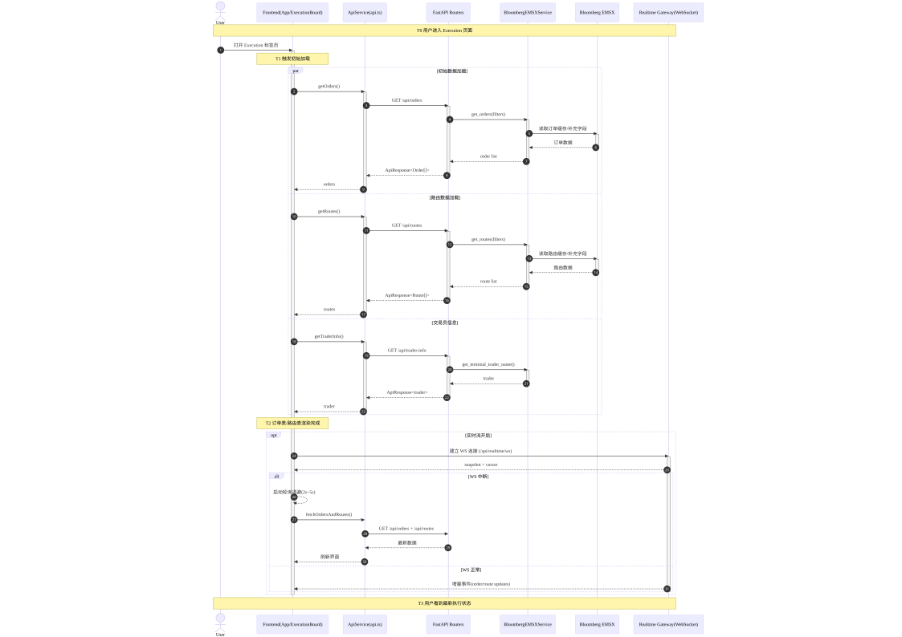
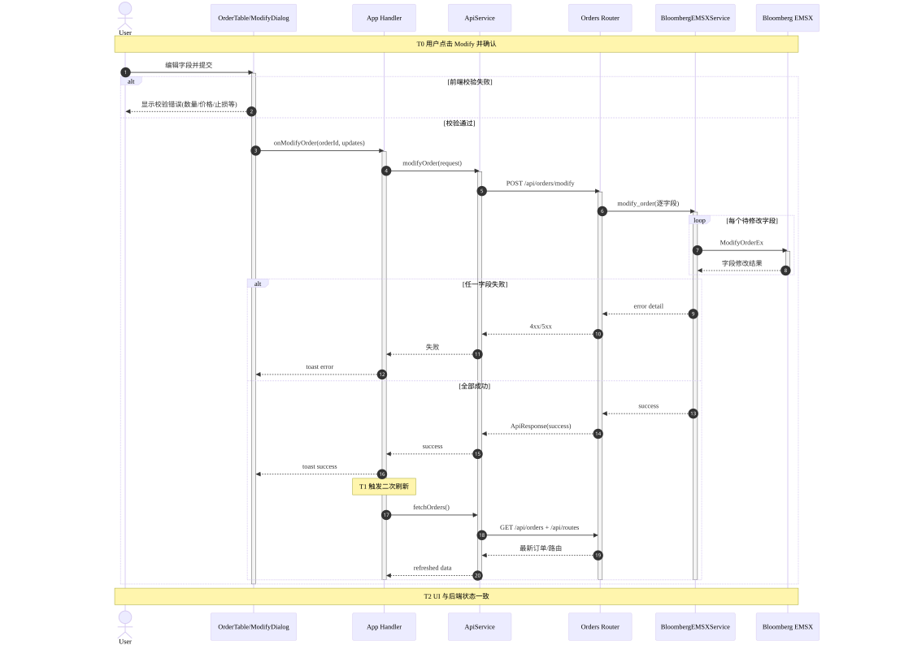
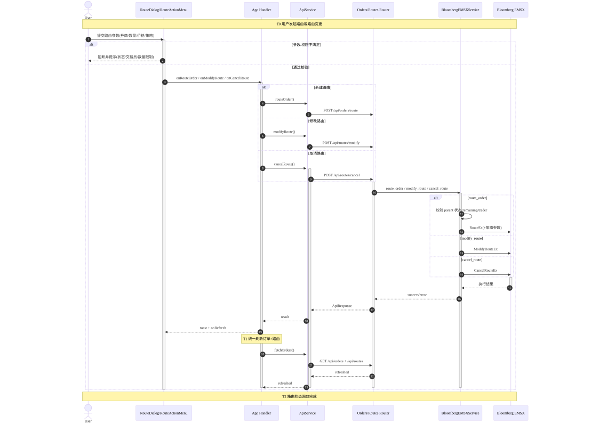
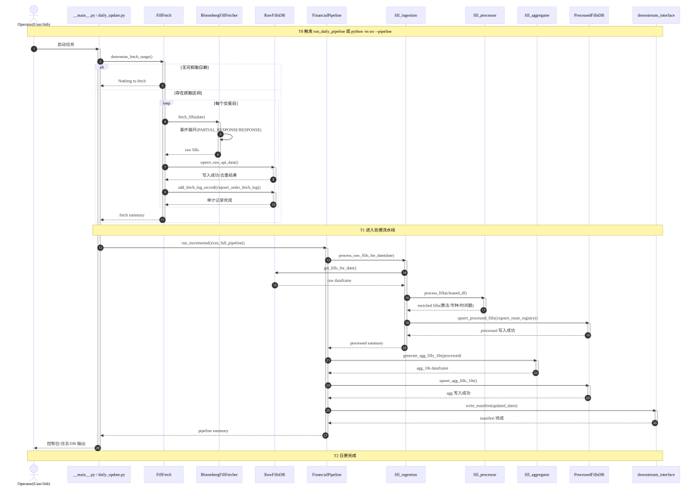
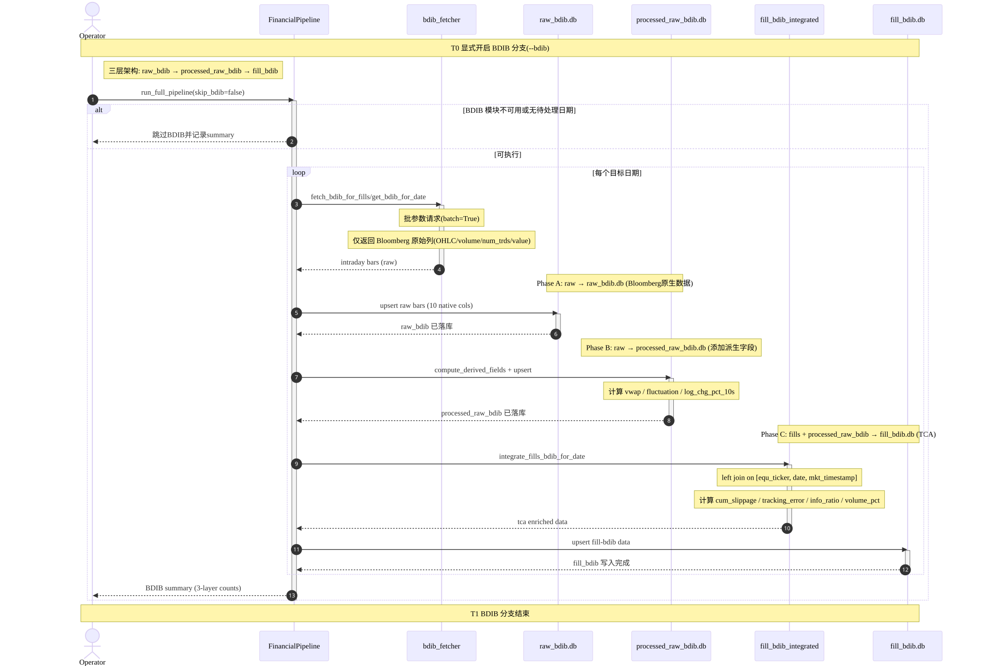

# EMSX 项目模块化时序图（UML Sequence）

> 本文档按功能模块拆分展示端到端调用链，覆盖：参与对象、同步/异步消息、激活条、条件分支、关键时间节点与复杂环节注释。
> ⚠️ 当前无 CI 保证时序图与实际代码一致。修改调用链后应同步更新对应的 Mermaid 源文件。

## 0. 约定与图例

- `->>`：同步消息（请求/调用）
- `-->>`：异步消息（推送/后台回调/非阻塞返回）
- `activate/deactivate`：生命周期激活条
- `alt/else/end`：条件判断分支
- `par/and/end`：并行处理
- 时间节点以 `T0..Tn` 标记，保证时序严格单向递进。

---

## 1) ExecutionView 模块：用户进入执行页到界面完成加载

[Mermaid 源文件](../modular_sequence_diagrams/mermaid/01-execution-initial-load.mmd)

### 复杂交互注释

- 实时链路与轮询链路并存：实时优先，断连后降级轮询，恢复后回归增量流。
- 首屏加载存在三条并行支路（订单/路由/交易员），UI 需在最慢分支返回后达到一致状态。

---

## 2) ExecutionView 模块：订单修改（Modify Order）

[Mermaid 源文件](../modular_sequence_diagrams/mermaid/02-execution-modify-order.mmd)

### 复杂交互注释

- 后端对"多字段修改"按字段依次调用 EMSX，属于"单请求内多子调用"模式。
- 前端成功后主动刷新，避免仅凭局部回执导致的显示偏差。

---

## 3) ExecutionView 模块：路由下单与路由管理（Route/Cancel/Modify Route）

[Mermaid 源文件](../modular_sequence_diagrams/mermaid/03-execution-route-management.mmd)

### 复杂交互注释

- 该模块存在"操作前置权限校验 + 服务层业务校验"双重防线。
- `route_order` 分支逻辑最复杂，含 parent 状态、交易员归属、剩余数量等业务约束。

---

## 4) CostView 模块：日更主流程（抓取 → 入库 → 处理 → 聚合 → 输出）

[Mermaid 源文件](../modular_sequence_diagrams/mermaid/04-costview-daily-pipeline.mmd)

### 复杂交互注释

- 抓取阶段是"按交易日批处理 + 单日事件流收包"的复合时序。
- 处理阶段以日期为最小单元，单日失败通常可记录后继续下一日。

---

## 5) CostView 模块：可选 BDIB 融合分支（异步/批处理标注）

[Mermaid 源文件](../modular_sequence_diagrams/mermaid/05-costview-bdib-branch.mmd)

### 复杂交互注释

- BDIB 在主流程中是"可选增强分支"，默认可被跳过，不阻断主链。
- 该分支以日期循环为主，`batch=True` 仅体现在接口请求参数层面的批处理优化。

---

## 6) 关键时间节点总览

- **ExecutionView**
  - `T0` 用户进入/操作触发
  - `T1` 前端请求发起（并行/分支）
  - `T2` 后端调用 EMSX 完成并返回
  - `T3` 前端刷新或实时推送后状态一致
- **CostView**
  - `T0` CLI/调度启动
  - `T1` 抓取与原始入库完成
  - `T2` 处理/聚合/输出完成
  - `T3`（可选）BDIB 融合完成

## 7) 组件交互完整性检查

- 参与对象：已覆盖用户、前端、API、路由层、服务层、外部 EMSX、DB 与下游输出。
- 消息类型：同步与异步消息均已标注。
- 生命周期：关键参与者均含激活条。
- 条件分支：前端校验、权限校验、失败/成功、可选分支（BDIB）均具备。
- 时间顺序：各图均按 `T0 -> Tn` 严格递增。
