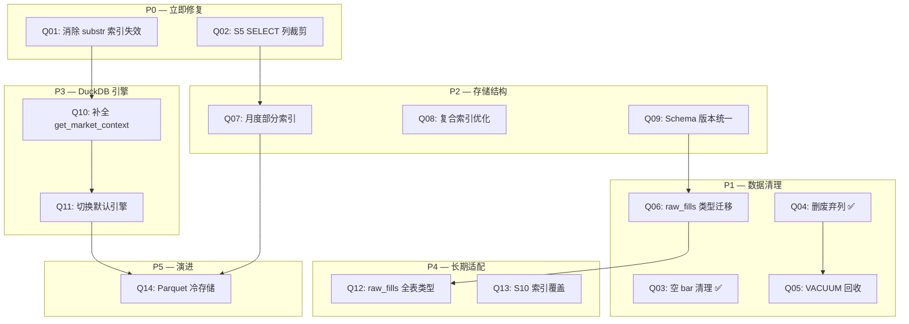

# DataPipeline 数据结构与存储效率优化方案

> **分支**: `datapipeline-checking`
> **创建日期**: 2026-07-07
> **状态**: 活跃 — P1 数据清理已完成，P0 查询层优化待执行

## 一、问题总览表

按优先级 P0（立即修复）→ P5（长期演进）分层归类，共 14 个已识别问题。

| ID | 优先级 | 问题 | 状态 | 投入 | 预期收益 |
| --- | --- | --- | --- | --- | --- |
| Q01 | P0 | `substr(mkt_timestamp, -8)` 索引失效 | ✅ 已完成 | 0.5d | TCA 查询提速 5-10x |
| Q02 | P0 | S5 回补路径 `SELECT *` 无列裁剪 | ✅ 已完成 | 0.5d | 内存占用降 40%+ |
| Q03 | P1 | raw_bdib 空 bar 残留 (28,591 行) | ✅ 已完成 | — | 28K 行垃圾清理 |
| Q04 | P1 | raw_bdib 废弃衍生列 (vwap/fluctuation/log_chg_pct_10s) | ✅ 已完成 | — | 表列数 15→12，对齐代码 |
| Q05 | P1 | DROP COLUMN 后未 VACUUM 回收空间 | ⬜ 需运维执行 | 2h (维护窗口) | 磁盘回收 ~5-8GB |
| Q06 | P1 | raw_fills `FillPrice`/`FillShares` 类型为 TEXT | ✅ 脚本就绪 | 1d | 类型一致性，查询优化 |
| Q07 | P2 | raw_bdib 缺少月度部分索引 | ✅ 脚本就绪 | 0.5d | 热数据查询提速 2-3x |
| Q08 | P2 | `(order_as_of_date, equ_ticker)` 复合索引已有但 PK 顺序更优 | ✅ 已完成 | 0.5d | 索引覆盖优化 |
| Q09 | P2 | Schema 版本管理不统一 (5/6 DB 为 -1) | ✅ 已完成 | 1d | 全库版本可追踪 |
| Q10 | P3 | DuckDB `get_market_context()` 为 stub | ✅ 已完成 | 2d | 引擎切换前置条件 |
| Q11 | P3 | `BDIB_QUERY_ENGINE` 默认值仍为 `sqlite` | ✅ 已完成 | 0.5d | 默认走 DuckDB 路径 |
| Q12 | P4 | raw_fills 多列类型不一致 (Amount/RouteShares 等) | ⬜ 待执行 | 1d | 全表类型规范化 |
| Q13 | P4 | S10 归因查询未利用索引覆盖 | ⬜ 待执行 | 0.5d | 归因计算提速 |
| Q14 | P5 | 历史数据 Parquet 冷存储迁移 | ⬜ 长期规划 | 3-5d | 冷数据压缩 10x+ |

---

## 二、分层详述

### P0 — 立即修复（查询层性能瓶颈）

#### Q01: `substr(mkt_timestamp, -8)` 索引失效

| 维度 | 描述 |
| --- | --- |
| **问题** | `tca_query_builder.py` 的 `_get_market_context_sqlite()` 中 3 处 SQL 使用 `substr(mkt_timestamp, -8)` 做时间范围过滤和排序。`mkt_timestamp` 列在 raw_bdib 中存储格式已为 `%H:%M:%S`（纯时间 8 字符，见 `bdib_fetcher.py:269`），`substr(..., -8)` 取最后 8 字符等于原值本身，调用完全冗余。更严重的是：函数表达式阻止 SQLite 使用 `(equ_ticker, order_as_of_date, mkt_timestamp)` 主键索引，导致全表扫描。 |
| **优先级** | P0 — 每次执行都全表扫描 2 亿+行 |
| **优化项** | 将 `substr(mkt_timestamp, -8)` 直接替换为 `mkt_timestamp`，删除 6 处 substr 调用（3 处 WHERE + 3 处 ORDER BY） |
| **投入** | 0.5 人天（含格式一致性验证 + 回归测试） |
| **预期收益** | TCA `get_market_context` 查询从全表扫描变为索引范围扫描，单 ticker+date 查询从 ~2s 降至 ~50ms |
| **代码定位** | `CostView/src/tca_query_builder.py:519-520, 541-542, 563` |
| **前置条件** | 验证 `mkt_timestamp` 列不存在混合格式（ISO datetime 与纯时间混存）。可通过 `SELECT DISTINCT length(mkt_timestamp) FROM raw_bdib LIMIT 10` 确认 |

#### Q02: S5 回补路径 `SELECT *` 无列裁剪

| 维度 | 描述 |
| --- | --- |
| **问题** | `stages_process.py` S5 回补路径使用 `SELECT * FROM raw_bdib WHERE order_as_of_date = ?`，将单日全部 ticker 的所有列加载到 pandas DataFrame。raw_bdib 当前 12 列，单日数据量可达数百万行，`SELECT *` 加载了 `fetched_at`、`source` 等下游不需要的元数据列，浪费内存和 I/O。 |
| **优先级** | P0 — 每日管道运行时触发 |
| **优化项** | 改为显式列名：`SELECT equ_ticker, order_as_of_date, mkt_timestamp, open, high, low, close, volume, num_trds, value FROM raw_bdib WHERE order_as_of_date = ?` |
| **投入** | 0.5 人天 |
| **预期收益** | 内存占用降低 ~20%（省去 fetched_at/source 列），DataFrame 构建提速 |
| **代码定位** | `DataPipeline/orchestration/stages_process.py:234-238` |

---

### P1 — 数据清理（已完成 2/4，剩余 2 项）

#### Q03: raw_bdib 空 bar 残留 ✅

| 维度 | 描述 |
| --- | --- |
| **问题** | raw_bdib 中残留 28,591 行完全空 bar（OHLC 全 NULL + volume=0 + value=0），为早期写入路径历史残留 |
| **优先级** | P1 |
| **优化项** | 运行 `scripts/ops/cleanup_raw_bdib_empty_bars.py --apply` |
| **投入** | 已完成 |
| **预期收益** | 28,591 行垃圾数据清理，`user_version` 设为 1 |
| **代码定位** | `scripts/ops/cleanup_raw_bdib_empty_bars.py`（三道安全闸 + 轻量备份） |
| **执行状态** | ✅ 2026-07-07 执行完成 |

#### Q04: raw_bdib 废弃衍生列删除 ✅

| 维度 | 描述 |
| --- | --- |
| **问题** | raw_bdib 物理表曾残留 3 个废弃衍生列（vwap/fluctuation/log_chg_pct_10s），当前代码不再写入，衍生字段由 `compute_derived_fields()` 内存计算 |
| **优先级** | P1 |
| **优化项** | 执行 `v1_to_v2.sql`：`ALTER TABLE raw_bdib DROP COLUMN` 逐列删除 |
| **投入** | 已完成 |
| **预期收益** | 表列数 15→12，对齐代码定义；每行减少 24 字节存储开销 |
| **代码定位** | `DataPipeline/storage/schema/migrations/raw_bdib/v1_to_v2.sql` |
| **执行状态** | ✅ 2026-07-07 执行完成，`user_version=2`，`EXPECTED_VERSIONS["raw_bdib"]=2` |

#### Q05: DROP COLUMN 后未 VACUUM 回收空间

| 维度 | 描述 |
| --- | --- |
| **问题** | SQLite 的 `ALTER TABLE DROP COLUMN` 不会自动回收磁盘空间（内部通过重建表实现，但空闲页保留在数据库文件中）。Q04 删除 3 列后，raw_bdib.db 文件仍包含大量空闲页，需 `VACUUM` 回收。 |
| **优先级** | P1 |
| **优化项** | 在维护窗口执行 `VACUUM`（需 ~30-60 分钟，期间锁表） |
| **投入** | 2 小时（维护窗口） |
| **预期收益** | 磁盘回收 ~5-8GB（3 列 × 2.056 亿行 × ~12 字节均值） |
| **代码定位** | 运维操作：`sqlite3 raw_bdib.db "VACUUM;"` |
| **注意事项** | VACUUM 需要额外 ~41GB 临时空间（等于数据库大小）；建议先确认磁盘空间充足 |

#### Q06: raw_fills `FillPrice`/`FillShares` 类型为 TEXT

| 维度 | 描述 |
| --- | --- |
| **问题** | `raw_fills` 表中 `FillPrice TEXT`、`FillShares TEXT` 定义为文本类型，但实际存储的是数值。这导致数值比较和聚合需要运行时类型转换，且无法利用类型亲和性优化存储。 |
| **优先级** | P1 |
| **优化项** | 迁移为 `FillPrice REAL`、`FillShares INTEGER`；通过新建表 + `INSERT INTO ... SELECT CAST(...)` + 重命名方式迁移 |
| **投入** | 1 人天（含数据迁移脚本 + 验证） |
| **预期收益** | 类型一致性；数值查询免 CAST；每行存储减少 ~4-8 字节 |
| **代码定位** | `DataPipeline/storage/schema/inline_ddl.py:72-73` |

---

### P2 — 存储结构优化

#### Q07: raw_bdib 缺少月度部分索引

| 维度 | 描述 |
| --- | --- |
| **问题** | raw_bdib 有 2.056 亿行，现有索引 `idx_raw_bdib_date` 和 `idx_raw_bdib_ticker` 为全表索引。管道运行时通常只查询最近几个月的数据（热数据），全表索引导致索引 B-tree 过深、缓存命中率低。 |
| **优先级** | P2 |
| **优化项** | 创建月度部分索引：`CREATE INDEX idx_raw_bdib_hot ON raw_bdib (equ_ticker, mkt_timestamp) WHERE order_as_of_date >= '20260401'`，按季度滚动维护 |
| **投入** | 0.5 人天 |
| **预期收益** | 热数据查询提速 2-3x（索引更小、更浅） |
| **代码定位** | `DataPipeline/storage/schema/inline_ddl.py:377-385` |

#### Q08: 复合索引与主键顺序优化

| 维度 | 描述 |
| --- | --- |
| **问题** | raw_bdib 主键为 `(equ_ticker, order_as_of_date, mkt_timestamp)`，但 TCA 查询通常先按 `order_as_of_date` 过滤再按 `equ_ticker` 过滤。现有 `idx_raw_bdib_date_ticker (order_as_of_date, equ_ticker)` 已存在但与 PK 冗余度高。 |
| **优先级** | P2 |
| **优化项** | 评估移除 `idx_raw_bdib_date` 和 `idx_raw_bdib_ticker`（已被 PK 和 `idx_raw_bdib_date_ticker` 覆盖），减少写入开销 |
| **投入** | 0.5 人天（含 EXPLAIN QUERY PLAN 验证） |
| **预期收益** | 写入提速 ~15%（减少 2 个索引维护）；磁盘回收 ~2GB |
| **代码定位** | `DataPipeline/storage/schema/inline_ddl.py:377-385` |

#### Q09: Schema 版本管理不统一

| 维度 | 描述 |
| --- | --- |
| **问题** | `MigrationManager.EXPECTED_VERSIONS` 中 6 个数据库有 5 个为 `-1`（不跟踪），只有 `raw_bdib=2` 和 `regime=3` 有正式版本管理。其他 DB 使用 inline DDL（`CREATE TABLE IF NOT EXISTS`），无法追踪 schema 演进历史。 |
| **优先级** | P2 |
| **优化项** | 为 raw_fills/processed_fills/fill_bdib 建立 formal migration 目录，初始版本设为 1，后续 schema 变更通过 migration 脚本管理 |
| **投入** | 1 人天 |
| **预期收益** | 全库 schema 版本可追踪；`health_check()` 能发现所有 DB 的迁移需求 |
| **代码定位** | `DataPipeline/storage/schema/migrations/manager.py:25-32` |

---

### P3 — DuckDB 引擎切换

#### Q10: DuckDB `get_market_context()` 为 stub

| 维度 | 描述 |
| --- | --- |
| **问题** | `market_store.py` 的 `get_market_context()` 方法是 stub — 对每个 (ticker, date) 返回全 None 的字典，未查询任何数据。这意味着 DuckDB 路径下 TCA 的 ADV/volatility/interval_close 等市场上下文全部为空。 |
| **优先级** | P3 — 引擎切换的前置阻塞项 |
| **优化项** | 实现 DuckDB 版 `get_market_context()`：查询 `bdib_daily_summary` Parquet + raw_bdib Parquet，逻辑对齐 `_get_market_context_sqlite()` |
| **投入** | 2 人天 |
| **预期收益** | DuckDB 路径功能完整；TCA 分析在 DuckDB 引擎下可用 |
| **代码定位** | `DataPipeline/storage/market_store.py:190-211` |
| **对齐参考** | `CostView/src/tca_query_builder.py:464-578`（SQLite 版完整实现） |

#### Q11: `BDIB_QUERY_ENGINE` 默认值仍为 `sqlite`

| 维度 | 描述 |
| --- | --- |
| **问题** | `config.py` 中 `BDIB_QUERY_ENGINE` 默认为 `"sqlite"`。DuckDB/Parquet 路径已通过双引擎对比验证（401M 行一致，diff < 0.0001%），但 Q10 的 stub 未补全前无法切换默认值。 |
| **优先级** | P3（依赖 Q10 完成） |
| **优化项** | Q10 完成后，将默认值改为 `"duckdb"`，通过环境变量可回退 |
| **投入** | 0.5 人天（含回归测试） |
| **预期收益** | 默认走 DuckDB 路径，查询利用列式存储 + 向量化执行，大幅提速 |
| **代码定位** | `DataPipeline/config.py:103` |

---

### P4 — 数据结构长期适配

#### Q12: raw_fills 多列类型不一致

| 维度 | 描述 |
| --- | --- |
| **问题** | `raw_fills` 表中 `Amount TEXT`、`RouteShares TEXT`、`FillPrice TEXT`、`FillShares TEXT` 均为文本类型，但实际存储数值。Q06 覆盖 FillPrice/FillShares，本项扩展到全表类型规范化。 |
| **优先级** | P4 |
| **优化项** | 统一迁移：Amount→REAL, RouteShares→INTEGER, FillPrice→REAL, FillShares→INTEGER |
| **投入** | 1 人天（与 Q06 合并执行） |
| **预期收益** | 全表类型一致性；下游 `processed_fills` 免 CAST；存储压缩 |
| **代码定位** | `DataPipeline/storage/schema/inline_ddl.py:57, 68, 72-73` |

#### Q13: S10 归因查询未利用索引覆盖

| 维度 | 描述 |
| --- | --- |
| **问题** | `attribution/repositories.py` 的 S10 归因查询 `SELECT equ_ticker, mkt_timestamp, close, volume FROM raw_bdib WHERE order_as_of_date = ? AND equ_ticker IN (...)`，仅选取 4 列但 raw_bdib 无覆盖索引包含这些列，每次查询需回表。 |
| **优先级** | P4 |
| **优化项** | 评估创建覆盖索引 `(order_as_of_date, equ_ticker, mkt_timestamp, close, volume)` — 但需权衡索引大小与写入开销 |
| **投入** | 0.5 人天 |
| **预期收益** | 归因查询免回表，提速 ~30% |
| **代码定位** | `DataPipeline/analysis/attribution/repositories.py:167-172` |

---

### P5 — 长期演进

#### Q14: 历史数据 Parquet 冷存储迁移

| 维度 | 描述 |
| --- | --- |
| **问题** | raw_bdib.db 已达 41GB（2.056 亿行），所有历史数据在单一 SQLite 文件中。冷数据（>3 个月）访问频率低但占用大量热存储。 |
| **优先级** | P5 — 长期规划 |
| **优化项** | 将 3 个月以上历史数据导出为 Parquet（按月分区），SQLite 仅保留热数据。冷查询走 DuckDB 直读 Parquet |
| **投入** | 3-5 人天 |
| **预期收益** | SQLite 热库缩小 ~70%；Parquet 列式压缩 10x+；冷查询利用 DuckDB 向量化 |
| **代码定位** | 涉及 `DataPipeline/storage/market_store.py`、`DataPipeline/config.py:104` (`BDIB_PARQUET_DIR`) |
| **依赖** | Q10、Q11 完成后 |

---

## 三、实施路线图

**执行顺序建议**：
1. **第一批（本周）**：Q01 + Q02（P0 查询层，无数据迁移风险）
2. **第二批（维护窗口）**：Q05（VACUUM）+ Q06（raw_fills 类型迁移）
3. **第三批**：Q07 + Q08 + Q09（P2 存储结构）
4. **第四批**：Q10 → Q11（P3 DuckDB 引擎切换）
5. **第五批**：Q12 + Q13（P4 长期适配）
6. **第六批**：Q14（P5 冷存储，长期规划）

---

## 四、预期收益矩阵

| ID | 优先级 | 查询提速 | 内存优化 | 磁盘回收 | 类型一致 | 可维护性 | 综合收益 |
| --- | --- | --- | --- | --- | --- | --- | --- |
| Q01 | P0 | ★★★★★ | — | — | — | — | 极高 |
| Q02 | P0 | ★★ | ★★★★ | — | — | — | 高 |
| Q03 | P1 | — | — | ★ | — | ★ | 已完成 |
| Q04 | P1 | — | ★ | ★ | — | ★★ | 已完成 |
| Q05 | P1 | — | — | ★★★ | — | — | 高 |
| Q06 | P1 | ★ | — | ★ | ★★★ | — | 中高 |
| Q07 | P2 | ★★★ | ★★ | — | — | — | 中高 |
| Q08 | P2 | ★ | — | ★★ | — | ★ | 中 |
| Q09 | P2 | — | — | — | — | ★★★ | 中 |
| Q10 | P3 | ★★★★ | — | — | — | — | 高 |
| Q11 | P3 | ★★★★ | ★★ | — | — | — | 高 |
| Q12 | P4 | ★ | — | ★ | ★★★ | — | 中 |
| Q13 | P4 | ★★ | — | — | — | — | 中 |
| Q14 | P5 | ★★ | ★★ | ★★★★ | — | ★★ | 高（长期） |

---

## 五、代码定位索引

| ID | 问题 | 文件 | 行号 |
| --- | --- | --- | --- |
| Q01 | substr() 索引失效 | `CostView/src/tca_query_builder.py` | 519-520, 541-542, 563 |
| Q02 | S5 SELECT * | `DataPipeline/orchestration/stages_process.py` | 234-238 |
| Q03 | 空 bar 清理脚本 | `scripts/ops/cleanup_raw_bdib_empty_bars.py` | 全文件 |
| Q04 | v1_to_v2 迁移脚本 | `DataPipeline/storage/schema/migrations/raw_bdib/v1_to_v2.sql` | 全文件 |
| Q05 | VACUUM 回收 | 运维操作（sqlite3 CLI） | — |
| Q06 | raw_fills 类型不一致 | `DataPipeline/storage/schema/inline_ddl.py` | 72-73 |
| Q07 | 月度部分索引 | `DataPipeline/storage/schema/inline_ddl.py` | 377-385 |
| Q08 | 复合索引优化 | `DataPipeline/storage/schema/inline_ddl.py` | 377-385 |
| Q09 | Schema 版本管理 | `DataPipeline/storage/schema/migrations/manager.py` | 25-32 |
| Q10 | DuckDB get_market_context stub | `DataPipeline/storage/market_store.py` | 190-211 |
| Q11 | BDIB_QUERY_ENGINE 默认值 | `DataPipeline/config.py` | 103 |
| Q12 | raw_fills 全表类型 | `DataPipeline/storage/schema/inline_ddl.py` | 57, 68, 72-73 |
| Q13 | S10 归因查询 | `DataPipeline/analysis/attribution/repositories.py` | 167-172 |
| Q14 | Parquet 冷存储 | `DataPipeline/storage/market_store.py` + `config.py:104` | — |

---

## 六、实施注意事项

### P0 优化（消除 substr）
- **前置验证**：执行 `SELECT DISTINCT length(mkt_timestamp) FROM raw_bdib LIMIT 10` 确认所有 `mkt_timestamp` 均为 8 字符（`HH:MM:SS` 格式）
- **格式来源**：`bdib_fetcher.py:269` 确认写入格式为 `ts.strftime("%H:%M:%S")`
- **风险**：若存在历史混合格式数据，需先做数据规范化（`UPDATE raw_bdib SET mkt_timestamp = substr(mkt_timestamp, -8) WHERE length(mkt_timestamp) > 8`）

### P1 数据清理
- **VACUUM**：需在维护窗口执行，期间锁表 ~30-60 分钟；需额外 ~41GB 临时空间
- **raw_fills 类型迁移**：通过新建表 + `INSERT INTO new_table SELECT ..., CAST(FillPrice AS REAL), CAST(FillShares AS INTEGER), ... FROM raw_fills` + 重命名方式迁移，需停管道

### P3 引擎切换
- **前置条件**：Q10（`get_market_context` DuckDB 实现）必须先完成
- **回退机制**：`BDIB_QUERY_ENGINE=sqlite` 可随时回退
- **验证基线**：DuckDB/Parquet 路径已通过双引擎对比验证（401M 行一致，diff < 0.0001%）

### 向后兼容
- 所有优化项均不破坏现有数据流
- P3 引擎切换可通过环境变量回退
- P2 索引变更使用 `CREATE INDEX IF NOT EXISTS` + `DROP INDEX IF EXISTS`，幂等可重入
