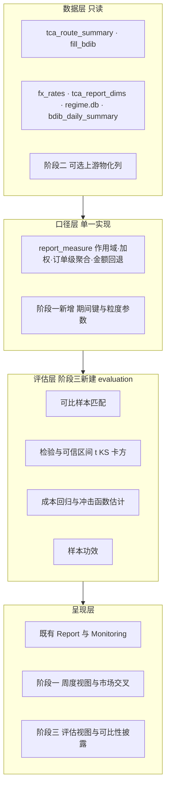

# 实施计划: CostView 券商算法执行质量评估体系

**Branch**: `026-costview-algo-eval`（阶段一 / 二 / 三 / 三收尾分四个 PR，后三个分支为 `-phase2` / `-phase3` / `-phase3b`）　**Date**: 2026-09-21　**状态**: ✅ 已完成并归档（2026-09-21）

**定位**: 把 CostView 从「描述性 TCA 报告系统」推进为「推断性算法评估系统」，分三阶段交付：周度聚合与分市场深化 → 执行环境变量精确化 → 科学方法评估层。

**理论依据**:
- `docs/textbook/股票交易执行质量与交易成本分析（TCA）：跨时期学术研究综述与方法框架.md` —— B2 八类指标框架（`:92-103`）、B3 分层归因与可比性条件（`:105-109`）、B4 五层评价矩阵（`:111-119`）、D1 基准冻结（`:160`）、D2 三重检验（`:162-164`）、D4 分层门槛（`:170-172`）
- `docs/textbook/Algo_TCA.md` —— χ² 检验分步算法（`:726-767`）、Kolmogorov-Smirnov 检验分步算法（`:789-793`）、可比性前置要求（`:764`、`:789`）、非线性回归冲击估计口径（`:116`）

**门控规范**: `docs/spec/plan-design-principles.md`（G0-G3 四门控）、`docs/spec/git-workflow.md`、`docs/spec/adr/0700-git-worktree-parallel-workflow.md`（ADR-0700：worktree 隔离与分支命名）

**证据基线**: [`research.md`](research.md) —— 本计划所有现状断言的行号索引，执行时抽查复核

---

## Summary

CostView 现有 TCA 指标地基完备（到达价 / 决策价 / Wagner IS 分解 / 市场冲击度量 / 成本风险 CVaR·p95 / PWP / 参与率），分市场维度亦已是一等维度并被作用域统一。但四个目标能力存在明确缺口：**「周」只是查询窗口而非聚合维度**、**跨市场只做到「分开看」未做到「可比地看」**、**执行环境分桶全为代理变量**、**无任何统计推断能力**。

本计划把上述四项缺口转化为三个阶段：阶段一为纯读侧聚合（无外部依赖，可立即开工）；阶段二以「探测 → 自给 → 跨仓」降级链解耦上游；阶段三依赖阶段二的真实环境变量才具备可比性控制的基础。**费用口径（K1）明确不纳入**。

核心纪律：**比较结论只有在可比性条件成立时才输出**（B3 逐字要求：「只有在这些维度足够相似时，跨经纪商或跨策略比较才具有解释力」）。

---

## 1. 背景与目标

### 1.1 现状基线

四维度判定（详见 [`research.md` §1](research.md#1-结论速览)）：

| 目标维度 | 判定 | 核心缺口 |
|---|---|---|
| 按周度频率 | 🟡 部分实现 | `TimeRange` 无粒度字段（`CostView/src/monitoring/time_range.py:30-44`）；分组锚在 `order_as_of_date`（`CostView/src/monitoring/report_aggregator.py:589`、`CostView/src/monitoring/metric_coverage.py:257`） |
| 分市场 | 🟢 分组已实现 / 🔴 可比性未实现 | 缺市场中性化与跨市场可比性对齐（全仓 `中性化` / `market neutral` 无实现） |
| 控制执行环境变量 | 🟡 代理式 | `CostView/src/tca_utils.py:196-204`：`time_of_day` 恒 `unknown`、ADV 用 `par_rate` 代理、波动率用 `\|pnl_vwap\|` 代理 |
| 使用科学方法 | 🔴 基本未实现 | 代码 0 命中 t 检验 / 置信区间 / 回归 / 对照；仅描述统计（`CostView/src/tca_utils.py:110,128,138`）+ 人为门槛（`CostView/src/monitoring/report_aggregator.py:46,49`） |

**结构性空白**：`docs/spec/adr/0004-costview-focused-on-evaluation.md:17-29,50` 规划了 `CostView/src/evaluation/`、`models/`、`attribution/`、`regime/`，但 `CostView/src/` 下**这些目录均不存在** —— 阶段三要建的是从未落地的层。

### 1.2 目标形态



### 1.3 四维目标定义（验收口径）

| 维度 | 达成定义（DoD） |
|---|---|
| 按周度频率 | 存在可选的周粒度聚合；周度 KPI / 走势 / 市场交叉可从 API 与报告获取；周键口径显式声明且跨年边界正确；既有按日产出零变化 |
| 分市场 | 跨市场比较在可比性条件成立时才输出结论；不可比时显式标注原因与降级口径 |
| 控制执行环境变量 | `time_of_day` / `liquidity_adv20` / `volatility` 三个 cohort 使用真实环境字段而非代理；任一降级路径显式标注 `metric_field` 与降级原因 |
| 使用科学方法 | 存在统计检验、可信区间、可比样本匹配、成本回归与冲击函数估计、样本功效；比较结论带基准冻结与可比性披露 |

---

## 2. 范围界定

### 2.1 纳入

1. **阶段一**：周度 rollup（含周频时间序列）、粒度参数化、分市场 × 周度交叉、分市场可比性披露的展示层基础。
2. **阶段二**：执行环境变量精确化 —— 交易时段（`time_of_day`）、ADV20、日波动率三个 cohort 换用真实字段；探测 → 自给 → 跨仓三级降级链。
3. **阶段三**：新建 `CostView/src/evaluation/` 推断层 —— 可比样本匹配、统计检验与可信区间、成本回归与市场冲击函数估计、样本功效、治理层（版本锁定 / 基准冻结 / 漂移监测）。
4. **跨仓协作项**：仅登记上游 EMSXDataPipeline 的**可选性能优化型**字段物化需求（见 §6），不作为正确性前置。
5. **口径治理**：`report_spec.py`（`SPEC_VERSION`）、`docs/report-tca-known-limitations.md`、ADR-0018 三处同步。

### 2.2 不纳入（含理由与去向）

| 不纳入项 | 理由 | 去向 |
|---|---|---|
| K1 显性费用 / 返佣 / 税费 | 用户已确认本次维持「价格偏离」口径 | 费用口径另立计划；报告继续明示边界（`CostView/src/monitoring/report_spec.py:52-54`） |
| K2 L2 订单簿流动性 | 无数据源，需 L2 / 逐笔订单簿数据 | 沿用 `docs/report-tca-known-limitations.md:15` 登记 |
| K3 事前成本预测 | 003 计划明确为 P3 后续（`docs/archive/2026-09-16/003-tca-core-benchmarks/plan.md:164`） | 后续独立计划 |
| K4 可操作性维度（订单类型 / 队列 / 延迟 / 场所） | 003 明确范围外（同上） | 后续独立计划 |
| 跨市场「成本中性化」的**交易层**调整（如按市场执行成本基准重定价） | 属业务口径变更，需业务确认 | 阶段三只做**统计可比性控制**，不做业务重定价 |
| 数据管道写入侧改动 | 本仓库为只读消费者（`docs/spec/git-workflow.md:193`） | 只登记需求，不实施 |

---

## 3. 阶段一：周度聚合与分市场深化

> **性质**：纯读侧聚合，无上游依赖，**可立即开工**。
> **对应 todo**：`026-phase1`

### 3.0 目标与完成定义

- 达成定义：API / 报告 / 前端均可按 `day | week | month` 粒度取数；周度分组键口径显式声明且跨年正确；`granularity="day"`（默认）产出与改动前**逐字节等价**。
- 不做的事：本阶段不引入任何统计推断（属阶段三）；不改变既有按日报告的任何数值。

### 3.1 设计要点

#### 3.1.0 前置验证（第 0 步，Q01 式）

**必须先实测，不得臆测**（沿用 `docs/archive/2026-08-26/002-pipeline-guardrail/optimization_plan.md:324-326` 的前置验证范式）：

| 编号 | 待验证 | 方法 | 影响 |
|---|---|---|---|
| Q1-1 | 运行环境的 SQLite 版本及其 `strftime` 是否支持 ISO 周格式符 `%G` / `%V` | `python -c "import sqlite3; print(sqlite3.sqlite_version)"` + 对样例库跑 `SELECT strftime('%G-W%V', '2026-01-01')` | 决定周键实现路线（首选 / 降级 A / 降级 B） |
| Q1-2 | `order_as_of_date` 的实际格式与空值情况 | `SELECT DISTINCT length(order_as_of_date) FROM tca_route_summary LIMIT 10` | 决定日期字符串到 ISO 周的转换写法 |
| Q1-3 | 报告区间内是否存在跨年周（12 月末与 1 月初同日历周） | 按日统计 `MIN` / `MAX(order_as_of_date)` | 决定跨年用例的构造方式 |

> `%G`（ISO 年）与 `%V`（ISO 周号）需 SQLite ≥ 3.46.0（2024-05）。若不可用，见 §3.4 降级链。

**实测结论（2026-09-21，Checkpoint 1-A 已完成）**：

| 编号 | 实测结果 | 结论 |
|---|---|---|
| Q1-1 | SQLite **3.45.3**（< 3.46.0）：`strftime('%G-W%V', '2026-01-01')` 返回 `None`；`%Y-%W` 可用但 `2026-01-01 → 2026-00`、`2025-12-29 → 2025-52` | **不支持 ISO 周格式符**，须走降级路线 |
| Q1-2 | `order_as_of_date` 全部 8 位 `YYYYMMDD`，NULL / 空串 **0 条**；173,672 行，范围 `20250926` ~ `20260918` | 转换写法确定：`substr` 拼接为 `YYYY-MM-DD` 后入日期函数 |
| Q1-3 | 跨年周确实存在：`2025-12-29` ~ `2026-01-04` 同属 `2026-W01`（`2026-01-05` 起为 `2026-W02`） | 必须正确处理 ISO 周年份，不得按自然年切分 |

**周键路线裁定**：原降级 A（`%Y-%W`）**不可用** —— 它把 `2025-12-29`（→ `2025-52`）与 `2026-01-01`（→ `2026-00`）拆成两个键，直接违背跨年归属要求。改用**新增路线 A′：纯 SQL 算术计算 ISO 周**：

```
monday   = date(d, '-6 days', 'weekday 1')            -- 当周周一（ISO 周起点）
iso_year = strftime('%Y', monday, '+3 days')          -- 该周周四所在年（ISO 周年份定义）
w01_mon  = date(iso_year || '-01-04', '-6 days', 'weekday 1')
iso_week = iso_year || '-W' || printf('%02d',
             round((julianday(monday) - julianday(w01_mon)) / 7.0) + 1)
```

原理：ISO 8601 规定 W01 为含 1 月 4 日的那一周，等价于「当周周四所在年份」即 ISO 周年份；用 `julianday` 差除以 7 得到周序号，`round()` 吸收浮点误差（两日期同为周一，差值必为 7 的整数倍）。

**验证证据**（只读探测，一次性脚本已随阶段一清理）：边界日期 73 个 + 真实库 194 个 distinct 交易日全量对照 Python `date.isocalendar()`，**0 不一致**；真实库成功聚出 51 个 ISO 周（`2025-W39` ~ `2026-W38`）。

**性能核验**（Checkpoint 1-B，2026-09-21）：`EXPLAIN QUERY PLAN` 显示三种粒度均命中 `idx_trs_date` 索引（`SEARCH tca_route_summary USING INDEX idx_trs_date`）；实测区间 173,672 行下 day / week / month 分别耗时 **1181ms / 983ms / 181ms** —— 期间聚合**未引入退化**（week 因表达式分组多一次 TEMP B-TREE，但扫描量相同故与 day 同量级）。

#### 3.1.1 周键口径（ISO 周）

- **口径**：ISO 8601 周（周一为首日、周日至周末），与既有 `week` 预设「上周一 ~ 上周日」语义完全对齐（`CostView/src/monitoring/time_range.py:141-146`）。
- **跨年归属**：使用 ISO week-year，键形态 `YYYY-Www`（如 `2026-W01`）。跨年周边界示例：2026-01-01（周四）属 `2026-W01`，该周含 2025-12-29 ~ 2026-01-04。
- **日期字符串转换**：库内 `order_as_of_date` 为 `YYYYMMDD`（`Config.DATE_FORMAT`），需转 `YYYY-MM-DD` 后送 `strftime`。
- **空周 / 单日周**：**不补零**（延续既有约定：`docs/report-tca-known-limitations.md:58`「仅含有数据交易日（不补零）」），但报告须标注覆盖周数；单日周（节假日）照常计入其 ISO 周，不特殊处理。
- **月粒度**：键形态 `YYYY-MM`，取自然月；季度 / 年暂不纳入（既有 `TimeRange` 已支持作为**窗口**，本阶段只做 `day|week|month` 三种**粒度**）。

#### 3.1.2 粒度参数化

- 引入 `granularity: "day" | "week" | "month"`，**默认 `"day"`**，保证向后兼容（既有调用方不传即维持现状）。
- 命名与默认值风格参照既有枚举先例 `platform_data/contracts/tca_contracts.py:52`（`aggregation: str = "per_order"`）。
- 分层开关沿用既有唯一范式：显式形参 + SQL 分组列切换（`CostView/src/monitoring/metric_coverage.py:166-171` 的 `group_by_exchange` 模式、`:257` 的 `group_cols` 切换）。
- 路由层以 Query 参数暴露，照既有写法（`CostView/api/routers/monitoring.py:193`）。

#### 3.1.3 聚合单点（口径唯一实现）

- 周键 SQL 表达式、粒度 → 分组列的映射，**只允许一处定义**，落在 `CostView/src/monitoring/report_measure.py`。
- 依据：`docs/report-tca-known-limitations.md:68-69`「同一口径在多个小节出现时**只允许有一份实现**」，作用域 / 加权 / 订单级聚合 / 金额回退均已在该文件单点化，本计划必须延续该约定。
- 消费方（KPI / 走势 / 覆盖率 / 排行 / 市场交叉 / HTML 渲染）一律引用该单点，**禁止各自拼 SQL 片段**。

#### 3.1.4 分市场 × 周度交叉

- 分组键扩展为 `(period_key, Exchange)`，其中 `period_key` 由 §3.1.3 单点生成。
- 作用域沿用 `resolve_scope` / `scope_condition`（`CostView/src/monitoring/report_measure.py:93-119`），**不得**为新分组另写作用域逻辑。
- 产出：分市场 × 周度的金额 / 成本矩阵，作为「可比地看」的展示层基础（统计可比性控制留待阶段三）。

#### 3.1.5 性能口径

- 全部聚合走 SQL `GROUP BY`；**禁止**「全量路由拉进内存再分组」。
- 保留既有日期范围过滤（`BETWEEN ? AND ?`），`fill_bdib` 重查询必须带日期过滤（参照 `CostView/src/monitoring/report_measure.py:294-331` 的 `fbfx_cte` 参数复用写法）。
- 新增 SQL 需以 `EXPLAIN QUERY PLAN` 确认索引生效（对齐 `docs/spec/plan-design-principles.md:83` 的 G2 手段）。

### 3.2 改动落点（文件级）

| 文件 | 改动性质 | 内容 |
|---|---|---|
| `CostView/src/monitoring/report_measure.py` | 新增 | 周键 / 月键 SQL 表达式 + 粒度 → 分组列映射（**口径单点**） |
| `CostView/src/monitoring/report_aggregator.py` | 改造 | `_query_daily_series`（`:579-599`）泛化为按粒度序列；市场趋势（`:423-452`）与市场排名（`:388-421`）支持粒度；新增分市场 × 周度交叉 |
| `CostView/src/monitoring/metric_coverage.py` | 改造 | `group_cols`（`:257`）支持粒度参数 |
| `CostView/src/monitoring/report_spec.py` | 修改 | 新增周 / 月粒度口径声明；`SPEC_VERSION` bump |
| `CostView/src/monitoring/tca_report_html.py` | 改造 | 报告渲染按粒度出图与出表（轴标签、覆盖周数标注） |
| `CostView/api/routers/costview.py`、`CostView/api/routers/monitoring.py` | 改造 | 新增 `granularity` Query 参数并透传 |
| `CostView/module/services/api.ts` | 改造 | 粒度参数传递 |
| `CostView/module/components/ReportView.tsx`、`MonitoringView.tsx` | 改造 | 粒度切换控件（复用既有「上周」入口位置，`ReportView.tsx:62-69`） |
| `CostView/tests/test_report_metrics.py` | 新增用例 | 跨年周 / 空周 / 单日周 / 按日回归等价 |
| `CostView/tests/test_monitoring.py` | 新增用例 | 覆盖率粒度分组 |
| `CostView/module/**/__tests__/` | 新增用例 | 粒度切换展示层 |
| `docs/report-tca-known-limitations.md` | 修改 | 新增周粒度口径脚注与条目 |
| `docs/spec/adr/0018-tca-report-metrics-conventions.md` | 修改 | 口径约定同步 |

### 3.3 检验方式

| 检验项 | 方法 | 通过标准 |
|---|---|---|
| 按日回归等价 | 全量 `pytest CostView/tests/`（含 golden）；对同区间同参数取 `granularity="day"` 与改动前产出比对 | 数值完全一致 |
| 跨年周归属 | 构造跨年路由数据（2025-12-29 ~ 2026-01-04），按周聚合 | 全部归入 `2026-W01` |
| 空周 | 区间内构造无数据周 | 该周不出现（不补零），覆盖周数正确披露 |
| 单日周 | 构造仅一日有数据的周 | 正常成组，数值等于该日 |
| 分市场交叉 | 多市场多周数据，按 `(week, Exchange)` 聚合 | 分组数与金额守恒（Σ分组 = 全量） |
| 性能 | `EXPLAIN QUERY PLAN` | 命中既有日期索引，无全表扫描 |
| 周键单点 | 静态检查 | 周键 SQL 表达式在 `report_measure.py` 之外无第二处定义 |
| 前端 | vitest | 粒度切换与展示格式断言通过 |

护栏要求：`CostView/tests/golden/README.md:57-62` 明确 golden **不覆盖 monitoring 侧**，因此「改 monitoring 口径必须全量跑 `pytest CostView/tests/`」——本阶段改动命中该边界，**必须全量跑**。

### 3.4 依赖与降级

| 依赖 | 状态 | 降级路径 |
|---|---|---|
| SQLite `%G` / `%V` 支持（Q1-1） | **已实测：不支持**（3.45.3） | **已裁定采用 A′（纯 SQL 算术，见 §3.1.0）** —— 属达标路线而非降级。原降级 A（`%Y-%W`）因**拆跨年周**而废弃；降级 B（Python 侧二次 rollup）仅保留为极端兜底（仅当 A′ 出现无法优化的性能问题时启用） |
| 上游数据 | **无依赖** | 本阶段纯读侧 |

### 3.5 检查点与回退

- **Checkpoint 1-A（开工前）**：Q1-1 ~ Q1-3 三项前置验证完成并记录结论，据此锁定周键实现路线。
- **Checkpoint 1-B（合入前）**：全量 `pytest CostView/tests/` 通过；`granularity="day"` 产出与改动前逐字节等价；前端 vitest 通过。
- **回退路径**：粒度参数默认 `"day"`，且新代码路径与原路径并存；若出现回归，移除 `granularity` 参数与新增查询分支即恢复原状（不涉及数据迁移，无不可逆操作）。

---

## 4. 阶段二：执行环境变量精确化

> **性质**：以真实环境变量替换代理变量，走「探测 → 自给 → 跨仓」三级降级链。
> **对应 todo**：`026-phase2`
> **前置**：阶段一完成（粒度能力是环境分层按周观察的基础，非硬依赖）

### 4.0 目标与完成定义

- 达成定义：`time_of_day` / `liquidity_adv20` / `volatility` 三个 cohort 使用**真实环境字段**；任一仍处降级状态的维度在 HTML / CSV / API 输出中显式标注 `metric_field` 与降级原因。
- 不做的事：本阶段**只保证变量可得且可信**，不做控制与中性化（属阶段三 §5）。

### 4.1 第 0 步：探测（三级降级链第一级）

#### 4.1.1 预研结论（已在 [`research.md`](research.md) §4.4 记录）

原评估假设「三项目标环境变量需跨仓等待上游」**不成立** —— 它们在只读链路内均有可派生来源：

| 目标变量 | 权威来源 | 证据 |
|---|---|---|
| 交易时段 | `fill_bdib.mkt_timestamp` 按 `(OrderId, RouteId, order_as_of_date)` 取 `MIN` | `CostView/tests/test_tca_query_service.py:129-141` |
| `adv20` | `bdib_daily_summary.adv_20d`（**已内置，无需计算**） | `CostView/tests/test_tca_query_service.py:212-218` |
| 日波动率 | `bdib_daily_summary.daily_volatility`（**已内置**） | 同上 |
| 日内波动率（备选） | `fill_bdib.cum_interval_volatility` / `standard_cum_interval_volatility` | `CostView/tests/test_tca_query_service.py:134-139` |

#### 4.1.2 必须实测的前置项（Q2 系列，不得臆测）

| 编号 | 待验证 | 方法 | 影响 |
|---|---|---|---|
| Q2-1 | `fill_bdib.mkt_timestamp` 实际格式 | `SELECT DISTINCT length(mkt_timestamp) FROM fill_bdib LIMIT 10`（范式见 `docs/archive/2026-08-26/002-pipeline-guardrail/optimization_plan.md:324-326`） | 决定 `start_time` 的解析写法 |
| Q2-2 | `bdib_daily_summary.adv_20d` / `daily_volatility` 覆盖率 | 按报告期统计 NULL 比例与 ticker 覆盖数 | 决定降级阈值与触发条件 |
| Q2-3 | `fill_bdib` 在报告期内按路由的数据密度 | 统计有 `mkt_timestamp` 的路由占比 | 决定 `start_time` 可得率 |
| Q2-4 | `fill_bdib.mkt_timestamp` 与 `raw_bdib.mkt_timestamp` 是否异格式 | 两表各取 `DISTINCT length` 比对 | 历史文档记录两套值域并存（`HH:MM:SS` vs 全时间戳），必须实测排除 |

> ⚠️ Q2-1 / Q2-4 是**阻塞性验证**：`bucket_time_of_day`（`CostView/src/tca_utils.py:158-172`）按 `str(start_time)[:2]` / `[3:5]` 解析「小时 / 分钟」，若实际为 `YYYYMMDD HH:MM:SS` 全时间戳，该函数会静默取到年份前两位 → **必须实测并显式处理两种形态，或先归一化再入桶**。这是本阶段最高风险点。

**实测结论（2026-09-21，Checkpoint 2-A 已完成）**：

| 编号 | 实测结果 | 结论 |
|---|---|---|
| Q2-1 | `fill_bdib.mkt_timestamp` **全部 8 字符 = `HH:MM:SS` 纯时间**（样例 `'11:20:20'`）；共 6,680,277 行，NULL / 空串 **0 条** | ✅ 计划担心的「全时间戳导致静默取到年份前两位」**不成立**；`bucket_time_of_day` 现有的 `[:2]` / `[3:5]` 解析**可直接工作**，无需归一化分支 |
| Q2-4 | `raw_bdib.mkt_timestamp` **同为 8 字符纯时间**（样例 `'09:00:10'`） | ✅ 两表**同格式**，「两套值域并存」的风险**不成立** → 跨仓项 **U-2 不触发** |
| Q2-3 | start_time 可得率 **100%**（173,685 / 173,685 路由）；时段分布 close 106,939 / open 35,909 / mid 30,837 | ✅ 时段分层将**真正生效**（当前恒为 `unknown` 的失效状态可解除） |
| Q2-2 | `bdib_daily_summary` 217,406 行：`adv_20d` 非空 **99.39%**、`daily_volatility` **99.94%**、`intraday_volatility` 仅 **38.7%**（日期范围 `20250915` ~ `20260907`） | ✅ 自给路径可行；`intraday_volatility` 覆盖不足，**不作主口径**，仅按计划作 L2 备选 |

**风险状态更新**：本阶段原定「最高风险点」（R-1 时间戳格式）经实测**已消除**。

⚠️ **关键旁证**：测试夹具 `CostView/tests/test_tca_query_service.py` 使用 `'20260418 10:10:00'` 全时间戳，与**真实数据形态不一致**（夹具为简化形态）。阶段二新增用例应**同时覆盖两种形态**，防止未来数据源变更时静默失效；同时该发现提示「以夹具推断生产数据形态」的做法不可靠。

### 4.2 设计决策记录（DP）

#### DP-2-1：环境数据的跨库获取路径

**背景**：`tca_route_summary` / `fill_bdib` 在 `fill_bdib.db`；`bdib_daily_summary` 在 `raw_bdib.db`。且 010-extract-pipeline 后 CostView **主路径已不再消费 `raw_bdib.db`**（`CostView/tests/test_tca_query_service.py:270-275` 明确：「现行主路径只读 `tca_route_summary` 与 `fill_bdib.db`；`raw_bdib.db` / `raw_fills.db` 在本文件的用例上已无消费点」），仅 `BdibHealthService`（数据质量扫描）仍读该库（`CostView/tests/test_monitoring.py:417-421`）。

**选项**：

| 选项 | 说明 | 评价 |
|---|---|---|
| A. 本侧自给（**选定**） | 经 `data_access.ConnectionManager.get_connection("raw_bdib", AccessTier.READ)` 批量读 `bdib_daily_summary`，在应用层按 `equ_ticker` + 日期 join 到路由 | 满足只读边界（ConnectionManager 是仓库唯一数据入口，`AccessTier.READ` 文件系统层拒写）；`BdibHealthService` 已有同库消费先例；不阻塞于上游排期 |
| B. 请上游物化列 | 请 EMSXDataPipeline 将 `adv_20d` / `daily_volatility` 写入 `tca_route_summary` | 更低的查询开销，但阻塞于上游排期；**降级为可选性能优化项**（见 §6） |
| C. SQL ATTACH 跨库 join | 在只读连接上 ATTACH 另一数据库文件 | **否决**：引入第二数据文件依赖、破坏连接单点、只读库 ATTACH 行为在各平台不一致 |

**选 A**，并把 B 登记为「覆盖率 / 开销不可接受时」的备选（§6）。

#### DP-2-2：`liquidity_adv20` 的语义修正

**背景**：现状 `CostView/src/tca_utils.py:199-201` 用 `par_rate` 代理 ADV20，但 `par_rate` 是**区间参与率**（相对区间成交量），而 B3 要求的分层维度是「订单规模 / ADV」（`docs/textbook/股票交易执行质量与交易成本分析（TCA）：跨时期学术研究综述与方法框架.md:109`）。前端映射 `volume_pct_adv20 ← par_rate ×100`（`docs/handoff-costview-html-report.md:65-72`）说明现状把两者等同，属口径漂移。

**决策**：`liquidity_adv20` 改用 **`fill / adv_20d`**（路由成交量 / 该票 20 日均量）作为分层依据；这是一次**口径变更**，必须三处同步（§7）并在报告中显式声明与旧口径的差异，不得静默替换。

#### DP-2-3：`volatility` 的循环论证消除

**背景**：现状用 `|pnl_vwap|`（**成本**）代理波动率（`CostView/src/tca_utils.py:202-204`），再按它分层比较成本，构成循环论证。

**决策**：改用 `bdib_daily_summary.daily_volatility`（真实日波动率）；日内分层备选 `intraday_volatility` 或 `fill_bdib` 的 `cum_interval_volatility`，口径须在 `report_spec` 中择一定明。

#### DP-2-4：环境字段注入分桶函数的方式

**背景**：`cohort_key_and_label(route, cohort)`（`CostView/src/tca_utils.py:179-182`）当前只接受一个路由对象，而环境字段**不在** `TcaRouteSummary` 上 —— `platform_data/contracts/tca_contracts.py:59` 的 docstring 明确该 dataclass「严格匹配新 schema 55 个字段」，真实环境字段位于 `bdib_daily_summary` / `fill_bdib`。因此必须先决定环境数据如何抵达分桶函数，否则 §4.4 的落点不可开工。

**选项**：

| 选项 | 说明 | 评价 |
|---|---|---|
| A. 扩展 `TcaRouteSummary` 增加 Optional 环境字段 | 直接给契约 dataclass 加列 | **否决**：破坏该 dataclass「严格匹配 schema 55 字段」的契约语义；且属 `platform_data` 公共契约变更，影响面超出本计划 |
| B. 分桶函数增设可选环境上下文参数（**选定**） | `cohort_key_and_label(route, cohort, env=None)`，`env` 为 `RouteEnvContext`（`start_time` / `adv20_ratio` / `daily_volatility`）；`aggregate_cohorts(routes, cohort, min_sample_size, env_by_route=None)` 同步接受映射 | 见下 |
| C. 把环境分桶移入 `env_context.py` | 分桶逻辑两处化 | 否决：与「`tca_utils` 是唯一分桶点」冲突 |

**选 B**，理由：

1. **不触碰 `platform_data` 契约**（`TcaRouteSummary` 保持 55 字段语义不变）；
2. **`env=None` 默认值天然构成降级路径** —— 缺失环境数据时自动回退现有代理逻辑，与 §4.3 的 L3 语义完全一致，**无需额外开关**；
3. `cohort_key_and_label` 保持**唯一分桶点**，职责不分裂；
4. 可选参数默认空 → **既有调用方零改动**（向后兼容）。

**落点**：`RouteEnvContext` 定义在 `CostView/src/monitoring/env_context.py`；`tca_utils.py` 仅消费该类型（不反向依赖取数逻辑），依赖方向为 `tca_utils → env_context` 的数据结构，无循环。

### 4.3 三级降级链（运行期行为）

| 级别 | 触发条件 | 行为 |
|---|---|---|
| **L1 真实** | 权威来源可得且覆盖率达标 | 用真实环境字段分层 |
| **L2 自给** | 权威来源缺该 ticker / 该日 | 用同义派生值（如日内波动率备选源）；输出标注 `metric_field` + 派生路径 |
| **L3 跨仓 / 代理** | 派生亦不可得（如 `bdib_daily_summary` 缺库） | 回退到现有代理实现，输出**显式标注** `metric_field` + 降级原因 + 覆盖率；`report_spec` 声明该情形 |

**硬约束**：任何 L2 / L3 输出都必须可见（HTML 脚注 / CSV 列 / API 字段），**禁止静默降级** —— 对齐 `docs/report-tca-known-limitations.md:290`「代理字段用户可见面未附 `metric_field`」的既有 P2 待办。

### 4.4 改动落点（文件级）

| 文件 | 改动性质 | 内容 |
|---|---|---|
| `CostView/src/monitoring/env_context.py` | **新增** | 环境上下文派生单点：`RouteEnvContext` 类型定义 + `start_time`（MIN mkt_timestamp）、`adv20_ratio`、`daily_volatility` 的取数与派生；含降级链判定与 `metric_field` 标注 |
| `CostView/src/monitoring/__init__.py` | 修改 | 同步模块职责清单 docstring 与导出登记（`__all__` 必须与上方 import 严格对应，由 `CostView/tests/test_monitoring.py:126` 的 `TestPackageExports` 护栏守住），并注明 `env_context` 的职责 |
| `CostView/src/tca_utils.py` | 改造 | `cohort_key_and_label`（`:179-205`）三个环境分支改真实字段；分桶函数沿用既有 `bucket_time_of_day`（`:158-172`）并补全时间戳形态归一化；`bucket_liquidity`（`:300-308`）阈值口径按 ADV 比率重定 |
| `CostView/src/tca_query_service.py` | 改造 | 在 scorecard 装配处注入环境上下文（现只有路由列表，需补环境数据） |
| `CostView/src/monitoring/report_spec.py` | 修改 | 新增三 cohort 口径声明 + 降级标注约定；`SPEC_VERSION` bump |
| `CostView/src/monitoring/tca_report_html.py`、`report_aggregator.py` | 改造 | 记分卡表格输出 `metric_field` 与降级标注 |
| `CostView/module/components/ScorecardView.tsx`、`CostView/module/lib/` | 改造 | 前端展示降级标注（与 HTML 逐字对齐） |
| `CostView/tests/test_report_metrics.py` | 新增用例 | 真实性抽验 / 分桶边界 / 降级标注 / 覆盖率披露 |
| `docs/report-tca-known-limitations.md`、`docs/spec/adr/0018-tca-report-metrics-conventions.md` | 修改 | 口径同步（含 DP-2-2 的口径变更声明） |

### 4.5 检验方式

| 检验项 | 方法 | 通过标准 |
|---|---|---|
| 真值抽验 | 抽 ≥3 条路由，人工比对 `adv20` / `daily_volatility` 与 `bdib_daily_summary` 原值 | 完全一致 |
| `start_time` 解析 | 分别构造 `HH:MM:SS` 与 `YYYYMMDD HH:MM:SS` 两种 `mkt_timestamp` | 均正确解析且入桶正确（Q2-1 / Q2-4 的回归护栏） |
| 分桶边界 | 时段 10:29 / 10:30 / 14:29 / 14:30；ADV 比率与波动率分桶端点 | 边界归属符合口径声明 |
| 循环论证消除 | 静态检查 | `volatility` cohort 不再引用 `pnl_vwap` |
| 降级标注 | 构造缺 `bdib_daily_summary` / 缺 ticker / 缺时间戳三类场景 | 均出现显式标注，且覆盖率数字正确 |
| 覆盖率披露 | 各 cohort 输出有效样本率 | 低于 `report_spec` 阈值时告警 |
| 回归 | 全量 `pytest CostView/tests/` + 前端 vitest | 全绿 |

### 4.6 依赖与降级

| 依赖 | 状态 | 降级路径 |
|---|---|---|
| `bdib_daily_summary` 覆盖率（Q2-2） | 待实测 | 覆盖不足的 ticker / 日期走 L3 代理并显式标注 |
| `fill_bdib` 时间戳密度（Q2-3） | 待实测 | 缺时间戳路由的 `time_of_day` 归 `unknown` 并在覆盖率中披露（保持现状语义，不静默） |
| 上游物化列 | **非前置** | 仅在 L1 覆盖率或查询开销不可接受时才启用（§6） |

### 4.7 检查点与回退

- **Checkpoint 2-A（开工前）**：Q2-1 ~ Q2-4 四项实测完成并记录结论；特别确认 `bucket_time_of_day` 的入参形态。
- **Checkpoint 2-B（合入前）**：三 cohort 真值抽验通过；三类降级场景标注用例通过；全量 pytest + vitest 通过。
- **回退路径**：`cohort_key_and_label` 的三个分支为纯函数局部改动，保留原代理实现为可切回分支（或直接 revert 该 commit）；无数据迁移、无 Schema 变更。

---

## 5. 阶段三：科学方法评估层

> **性质**：新建 `CostView/src/evaluation/` 推断层（ADR-0004 已规划但从未落地，`docs/spec/adr/0004-costview-focused-on-evaluation.md:17-29,50`）。
> **对应 todo**：`026-phase3`
> **前置**：阶段二完成 —— **可比性控制需要真实环境变量作为分层键**，故本阶段硬依赖阶段二的 L1 真实变量；阶段一提供周度维度作为可选分层/观察粒度

### 5.0 目标与完成定义

- 达成定义：存在统计检验（t / KS / χ²）、可信区间、可比样本匹配、成本回归与市场冲击函数估计、样本功效；**券商 / 算法比较结论只有在可比性条件成立时才输出**，否则显式返回「不可比」。
- 硬约束（来自 B3 逐字要求）：`docs/textbook/股票交易执行质量与交易成本分析（TCA）：跨时期学术研究综述与方法框架.md:109` ——「只有在这些维度足够相似时，跨经纪商或跨策略比较才具有解释力」。本阶段的接口必须**使这条约束不可绕过**。

### 5.1 模块结构（新增目录）

```
CostView/src/evaluation/          # [NEW] 推断层（ADR-0004 规划位置）
├── __init__.py                   #     公开 API 与 __all__（对齐 monitoring 包的导出护栏约定）
├── comparability.py              #     可比样本匹配（分层 / 配对）与可比性判定
├── stats_tests.py                #     统计检验与可信区间（t / KS / χ²）
├── cost_model.py                 #     成本回归与市场冲击函数估计
├── power.py                      #     样本功效与最小样本量
└── governance.py                 #     版本锁定 / 基准冻结 / 漂移监测元数据
```

> **导出约定**：`CostView/src/monitoring/__init__.py:14-16` 明确「`__all__` 必须与上方 import 严格对应（由 test_monitoring 的导出清单护栏守住）」——护栏位于 `CostView/tests/test_monitoring.py:126` 的 `TestPackageExports`（成因见 `docs/report-tca-known-limitations.md:90` 的 R1「幽灵导出」修复）。新包 `evaluation/` 沿用同一约定：`__init__.py` 定义 `__all__`，并在 `CostView/tests/test_evaluation.py` 增加同款「`__all__` 每个符号可解析」护栏测试。

### 5.2 设计决策记录（DP）

#### DP-3-1：统计检验的依赖选择

**现状**：`scipy` 全仓 **0 匹配**（无声明、无 import）；`numpy` 无直接声明但由 pandas 传递带入（实际 import：`data_access/config.py:19`、`platform_data/adapters/market.py:490`）。`CostView/pyproject.toml:1-41` 仅声明 `pydantic` / `pandas` / `emsxview-platform-data`。

**选项**：

| 选项 | 说明 | 评价 |
|---|---|---|
| A. 引入 `scipy`（**选定**） | 用 `scipy.stats` 的 `ttest_ind` / `ks_2samp` / `chi2_contingency` / `linregress` / `bootstrap` | 检验正确性由同行评审实现保障；numpy 已在树内，无非预期传递负担；BSD-3 许可兼容 |
| B. 基于 numpy/pandas 自实现 | 无新依赖 | t / KS / χ² / 分位数 / 回归均需自写，且需为每个实现配套数值护栏测试，TCO 高于引入依赖 |

**选 A**。理由：检验是核心交付物，**正确性不可妥协**；自实现需额外写大量对照测试，成本更高且风险更大。

**约束**（**修正**：原计划写「两处」有误 —— CI 用 `pip install -e ../../CostView --no-deps`
加显式补装清单，**`pyproject.toml` 的声明在 CI 不生效**，必须三处协同）：
- `CostView/pyproject.toml`：包级依赖声明（开发 / 部署路径生效）；
- `CostView/api/requirements.txt`：注释指向 `pyproject.toml`（避免两处重复声明漂移）；
- `.github/workflows/boundary.yml` 的 pip 补装清单：**CI 实际生效处** —— 首次提交漏改该处，
  已由后端测试失败暴露并修正；
- **不引入 `statsmodels`**：样本功效改用正态近似闭式公式自实现（见 §5.5），仅复用 `scipy.stats` 的分位数；
- 引入前须核实本机可安装（Checkpoint 3-A）。

#### DP-3-2：可比性判定的强制位置

**背景**：若可比性检查只在 UI 层提示，调用方仍可直接取原始均值做比较，等于约束形同虚设。

**决策**：可比性判定放在 `comparability.py`，并**由 API 端点强制调用** —— 不满足可比性条件时返回结构化「不可比」结果（含不满足的维度与各维度样本量），**不返回比较数值**。UI 层只是呈现，不承担约束责任。

#### DP-3-3：基准参数不可默认

**依据**：D1（`docs/textbook/股票交易执行质量与交易成本分析（TCA）：跨时期学术研究综述与方法框架.md:160`）——「建议报告同时呈现至少一个决策基准和一个市场时间基准，而不是事后挑选最有利基准」。

**决策**：评估端点**必须显式传入基准**（如 `arrival` / `vwap` / `close`），服务端**不设默认值**；缺失即报错。多基准时全部呈现，不得只返回最优者。

### 5.3 可比样本匹配（`comparability.py`）

- **分层键**：`(Exchange, asset_class, time_of_day, liquidity_adv20, volatility)` —— 全部来自阶段二的真实环境变量，**禁止**用 `pnl_vwap` 等成本量作分层键（循环论证）。
- **匹配方式**（择一或组合，须在 `report_spec` 声明）：
  1. **精确分层匹配**：按分层键切层，层内比较；层内样本不足即判该层不可比；
  2. **配对**：同 `equ_ticker` + 同 `order_as_of_date` + 同方向的路由配对，消除标的市场环境差异。
- **可比性判定输出**：`{"comparable": bool, "unmet_dimensions": [...], "strata": [{...样本量...}]}`
- **不可比时**：返回该结构，**不返回比较结论**（DP-3-2）。
- 依据：B3 分层归因口径（`:109`）、D4 分层要求（`:172`）、`docs/textbook/Algo_TCA.md:764,789` 的相似特征前置要求。

### 5.4 统计检验与可信区间（`stats_tests.py`）

规格直接取自 `docs/textbook/Algo_TCA.md`（库内已有算法描述，非外部依赖）：

| 方法 | 位置 | 用途 |
|---|---|---|
| Kolmogorov-Smirnov 检验 | `Algo_TCA.md:789-793` | 两组成本**分布**是否有差异（不假设正态） |
| χ² 检验 | `Algo_TCA.md:726-767` | 分桶后的分布差异（10~20 桶，按标准差或百分位切点，`Algo_TCA.md:766`） |
| t 检验 | 经典（B2/B4 隐含） | 两组均值差异（须先做可比性匹配） |

- **可信区间**：优先 bootstrap 置信区间（不依赖分布假设）；正态近似作为降级。
- **多重比较**：同一报告内多个 broker / 算法同时比较时须做多重比较校正（如 Bonferroni / BH），校正方式与阈值进 `report_spec`。
- **输出**：检验统计量、p 值、可信区间、样本量、所用方法 —— 全部随结果返回，供审计。

### 5.5 样本功效与最小样本量（`power.py`）

- **自实现正态近似**（不引入 `statsmodels`）：`n ≈ 2(z_{1-α/2} + z_{1-β})² σ² / Δ²`，`z` 分位数取自 `scipy.stats`。
- **关系**：现有 `min_sample_size`（默认 10，`CostView/src/tca_query_service.py:182`）与排行门槛（n ≥ 5，`CostView/src/monitoring/report_aggregator.py:46`）是**人为阈值**，本模块给出**统计依据**，并在报告中并列呈现「人为门槛」与「功效所需样本量」的差异。
- **输出**：给定效应量 Δ、显著性 α、功效 1-β、成本方差 σ² → 所需样本量；样本不足时显式标注功效不足。

### 5.6 成本回归与市场冲击函数估计（`cost_model.py`）

- **依据**：`Algo_TCA.md:116` ——「market impact costs are often estimated via **non-linear regression estimation**」。
- **现状差距**：现有 `temp_impact_5min_bps` / `temp_impact_10min_bps` / `temp_impact_30min_bps` / `perm_impact_bps`（`platform_data/contracts/tca_contracts.py:115-119`）是**逐路由度量值**，本模块要估计的是**冲击函数**（成本对订单规模 / ADV / 波动率的响应曲面）。
- **模型形态**（须在计划执行时择定并在 `report_spec` 声明）：
  - 经典幂律形式：`impact = a · (order_size / ADV)^b · σ^c`（取对数后线性回归）
  - 或 `Algo_TCA.md` 所述非线性回归
- **输出**：参数估计、标准误、拟合优度、样本量、适用域（超出域外不给外推预测）。
- **禁项**：不得把回归拟合值当作事前预测对外输出（K3 明确不纳入本计划）。

### 5.7 治理层（`governance.py`）

依据 B4 治理层（`:119`）：

| 治理项 | 落地 |
|---|---|
| 版本锁定 | 评估口径版本随结果返回；与 `report_spec.SPEC_VERSION` 同源 |
| 基准冻结 | 基准参数与结果一同存档（回答「这份结论是按哪个基准得出的」） |
| 数据血缘 | 结果携带数据期、作用域、分层键、样本量 |
| 漂移监测 | 沿用既有周期哨兵模式（`scripts/ops/open_validation_sentinel.py`，`docs/report-tca-known-limitations.md:271`）监控结论漂移 |
| 可审计性 | 每次评估输出方法、参数、样本、降级标注的完整快照 |

### 5.8 接口与门控

- **端点**：新增 `POST /api/tca/evaluation/compare`（券商 / 算法可比性比较）。
- **门控**：新增开关 `TCA_EVAL_ENABLED`（形态对齐 `data_access/config.py:223-237` 的 `os.getenv("<NAME>", "1") == "1"`），并在 `GET /api/tca/capabilities`（`CostView/api/routers/costview.py:547-560`）暴露 `evaluation` 能力位。
- **降级语义**：开关关闭或 `scipy` 不可用时，端点返回 **显式不可用**（`enabled: False` + 原因），**不得**回退到"未校验的均值比较" —— 对齐 `TCA_ORDER_AGG_ENABLED` 的既有降级语义（`CostView/api/routers/costview.py:247-263`：返回空结果 + 明示「为空不代表无匹配数据」）。
- **不破坏核心报表**：评估层全部为新增端点与新增模块，既有 Report / Monitoring 路径零改动。

### 5.9 改动落点（文件级）

| 文件 | 改动性质 | 内容 |
|---|---|---|
| `CostView/src/evaluation/*.py` | **新增** | 五个子模块（§5.1） |
| `CostView/src/tca_query_service.py` | 改造 | 编排接入：为评估层提供作用域内路由与环境上下文 |
| `CostView/api/routers/costview.py` | 改造 | 新端点 + 门控分支 + `capabilities` 增列 |
| `data_access/config.py` | 改造 | 新增 `TCA_EVAL_ENABLED`（对齐 `:223-237` 形态） |
| `CostView/pyproject.toml`、`CostView/api/requirements.txt` | 改造 | 显式声明 `scipy`（两处同步） |
| `CostView/src/monitoring/report_spec.py` | 修改 | 评估口径声明（分层键 / 检验方法 / 多重比较校正 / 冲击模型形态 / 功效置信参数）；`SPEC_VERSION` bump |
| `CostView/module/components/` | 改造 | 评估视图（展示可比性判定、检验结果、不可比原因） |
| `CostView/tests/test_evaluation.py` | **新增** | 数值对照 / 可比性拒绝 / 基准强制 / 功效 / 门控降级 |
| `docs/report-tca-known-limitations.md`、`docs/spec/adr/0018-tca-report-metrics-conventions.md` | 修改 | 口径同步 |
| `docs/spec/adr/`（新 ADR） | **可能新增** | 评估层设计与依赖决策（DP-3-1）需 ADR 留痕；是否新建 ADR 在实施时按 ADR 收录标准判断 |

### 5.10 检验方式

| 检验项 | 方法 | 通过标准 |
|---|---|---|
| 数值正确性 | 与 `scipy.stats` 参考结果 + `Algo_TCA.md:726-793` 分步算法**独立实现**做对照 | 统计量 / p 值在容差内一致 |
| 可信区间覆盖 | 蒙特卡洛：构造已知真值的合成样本，重复抽样 | 覆盖率接近名义水平（如 95%） |
| 可比性拒绝 | 构造样本量 / 分层显著失衡的两组 | 返回 `comparable: False` 且**不含**比较数值 |
| 基准强制 | 缺 `benchmark` 参数调用端点 | 报错，不返回结论 |
| 多重比较 | 构造多组比较 | 校正生效，未校正 p 值与校正后 p 值同时可见 |
| 功效正确性 | 给定 Δ/α/β/σ² 与理论公式对照 | 所需样本量在容差内 |
| 冲击模型 | 合成本合成数据（已知参数）拟合 | 参数恢复在容差内；域外不外推 |
| 门控降级 | `TCA_EVAL_ENABLED=0` / 无 scipy | 返回显式不可用，无静默回退 |
| 回归 | 全量 `pytest CostView/tests/` + 前端 vitest | 全绿 |

### 5.11 依赖与降级

| 依赖 | 状态 | 降级路径 |
|---|---|---|
| 阶段二 L1 真实环境变量 | 硬前置 | 若阶段二仅达 L2 / L3，则可比性分层键降级 → 可比性判定更易返回「不可比」（**这是正确行为**，不视为缺陷） |
| `scipy` 可安装 | 待验证（Checkpoint 3-A） | 不可安装 → 门控返回显式不可用；不自实现发布（避免未验证的统计实现进入生产） |
| 样本量 | 数据条件 | 样本不足 → 功效标注 + 判定不可比，不输出结论 |

### 5.12 检查点与回退

- **Checkpoint 3-A（开工前，阻塞）**：`scipy` 可安装性验证 + DP-3-1 决策确认；确认不引入 `statsmodels`。
- **Checkpoint 3-B**：数值对照（独立实现 / scipy 参考）通过；可比性拒绝与基准强制用例通过。
- **Checkpoint 3-C（合入前）**：门控关闭 / 无 scipy 时降级可见；全量 pytest + vitest 全绿；既有 Report / Monitoring 产出零变化。
- **回退路径**：置 `TCA_EVAL_ENABLED=0` 即关闭全部评估能力（对齐「可选路由器绝不可破坏核心 ExecutionView / 核心报表」的既有约定）；评估层为纯新增模块，删除该目录与端点即可完全回退，无数据迁移。

---

## 6. 跨仓协作项

> **性质**：本计划**不以跨仓交付为前置**。以下项均为**可选性能优化型**，仅当本侧自给路径的覆盖率或开销不可接受时才启用。
> **登记形态**：沿用 `docs/open-todos.md` 既有行式登记（参照 T13 行），只写「需要什么 / 为什么 / 触发条件」，**不写上游仓库磁盘路径**（`docs/index.md:101-104`）。

| 编号 | 需求 | 触发条件 | 本侧现状 |
|---|---|---|---|
| U-1 | 请上游 EMSXDataPipeline 将 `adv_20d` / `daily_volatility` 物化到 `tca_route_summary` 列 | 阶段二 Q2-2 实测覆盖率不足，或跨库读取导致报告耗时不可接受 | 本侧已可经 `raw_bdib.db` 的 `bdib_daily_summary` 自给（DP-2-1 选项 A） |
| U-2 | `fill_bdib.mkt_timestamp` 与 `raw_bdib.mkt_timestamp` 的格式口径统一 | Q2-4 实测确认两表异格式，且判定为上游定义不一致 | 本侧可在归一化层兼容两种形态（阶段二 §4.1.2 已列为阻塞性验证） |

---

## 7. 口径治理与同步清单

### 7.1 三处强制同步（每次口径变更）

依据 `docs/report-tca-known-limitations.md:61-69`，以下三处**必须同时更新**：

1. `CostView/src/monitoring/report_spec.py`（含 `SPEC_VERSION` bump）
2. `docs/report-tca-known-limitations.md`
3. `docs/spec/adr/0018-tca-report-metrics-conventions.md`

### 7.2 本计划引入 / 变更的口径项

| 口径项 | 阶段 | 性质 | 同步要求 |
|---|---|---|---|
| 周键口径（ISO 周 / 跨年归属 / 不补零） | 一 | 新增 | 三处同步 + 报告脚注 |
| 粒度参数（`day` / `week` / `month`，默认 `day`） | 一 | 新增 | 三处同步 |
| 分市场 × 周度交叉口径 | 一 | 新增 | 报告脚注 |
| `time_of_day` 分层键（真实 `start_time`） | 二 | 修复（原恒 `unknown`） | 三处同步 |
| `liquidity_adv20` 分层键（`fill / adv_20d`，**替代 `par_rate`**） | 二 | **变更**（DP-2-2） | 三处同步 + 显式声明与旧口径差异 + 回归基线 |
| `volatility` 分层键（真实 `daily_volatility`，**替代 `\|pnl_vwap\|`**） | 二 | **变更**（DP-2-3） | 三处同步 + 消除循环论证的说明 |
| 环境变量降级标注（`metric_field` + 降级原因） | 二 | 新增 | 三处同步（承接 `docs/report-tca-known-limitations.md:290` 的 P2 待办） |
| 评估层口径（分层键 / 检验方法 / 多重比较校正 / 冲击模型形态 / 功效参数） | 三 | 新增 | 三处同步 + 评估结果自带版本 |

### 7.3 单点实现约定（不得违反）

- 作用域 / 加权 / 订单级聚合 / 金额回退：`CostView/src/monitoring/report_measure.py`（既有）
- 期间键与粒度映射：`CostView/src/monitoring/report_measure.py`（本计划阶段一新增）
- 环境上下文派生：`CostView/src/monitoring/env_context.py`（本计划阶段二新增）
- 环境分桶：`CostView/src/tca_utils.py`（既有，本计划不改分桶职责，只改数据来源）
- 评估推断：`CostView/src/evaluation/`（本计划阶段三新增）

**禁止**：调用方各自重写上述 SQL 片段或口径逻辑（`docs/report-tca-known-limitations.md:68-69`）。

---

## 8. 计划护栏（G0–G3）

### G0 / P1 数据零受损

- 全计划为**只读消费**：所有数据访问经 `data_access.ConnectionManager` 的 `AccessTier.READ`（sqlite `mode=ro`），文件系统层拒绝写（`docs/spec/git-workflow.md:193`）。
- **无 Schema 变更、无数据迁移、无回填**；因此不涉及备份与回滚脚本。
- 唯一例外是阶段三新增 `scipy` 依赖（代码层，非数据层）。

### G1 / P2 三性齐备（每阶段开工前）

| 阶段 | 理论依据 | 技术方案 | 检验方法 |
|---|---|---|---|
| 一 | B3 分层观察需要时间维度；ISO 8601 周是可复现的期间定义 | §3.1 设计要点 + §3.2 落点 | §3.3（含按日逐字节等价回归） |
| 二 | B3「按流动性、订单规模/ADV、时段、波动状态分层」；`Algo_TCA.md:764,789` 相似特征前置 | §4.2 DP-2-1~3 + §4.4 落点 | §4.5（含真值抽验与降级标注） |
| 三 | B3 可比性条件；B4 五层矩阵；D1 基准冻结；D2 三重检验；`Algo_TCA.md:116,726-793` | §5.1 模块 + §5.2 DP-3-1~3 | §5.10（含独立实现对照与蒙特卡洛） |

### G2 / P3 全程防漂移

- **前置验证**：Q1-1 ~ Q1-3（阶段一）、Q2-1 ~ Q2-4（阶段二，Q2-1/Q2-4 为阻塞性）、DP-3-1 可安装性（阶段三，阻塞性）。
- **基线对比**：
  - 阶段一：`granularity="day"` 产出与改动前**逐字节等价**；
  - 阶段二：三 cohort 真值抽验 + 旧代理实现可切回；
  - 阶段三：既有 Report / Monitoring 产出**零变化**。
- **范围锁**：每阶段只动 §3.2 / §4.4 / §5.9 列明的文件；超范围即拒绝。
- **性能校验**：新增 SQL 以 `EXPLAIN QUERY PLAN` 确认索引生效（`docs/spec/plan-design-principles.md:83`）。
- **回退**：各阶段均在 §3.5 / §4.7 / §5.12 声明回退路径；阶段三以门控开关整体关闭。
- **护栏测试**：全量 `pytest CostView/tests/`；改 monitoring 口径必须全量跑（`CostView/tests/golden/README.md:57-62`）。

### G3 / P4 充分且必要

见 §9 验收矩阵：每个需求可溯源到改动落点，每个改动落点可回溯到一个需求。

---

## 9. 验收矩阵（改动—需求双向）

| 需求 | 来源 | 改动落点 | 检验 |
|---|---|---|---|
| R1 周度聚合维度 | 四维目标「按周度频率」 | `report_measure.py`（期间键单点）、`report_aggregator.py`、`metric_coverage.py` | §3.3 跨年周 / 空周 / 单日周 / 按日等价 |
| R2 粒度参数化 | R1 的实现前提 | `time_range` 消费方 + API Query + 前端控件 | §3.3 默认 day 产出等价 |
| R3 分市场 × 周度交叉 | 四维目标「分市场」+「周度」 | `report_aggregator.py` 分组键扩展 | §3.3 金额守恒 |
| R4 分市场统计可比性 | 四维目标「分市场」 | `evaluation/comparability.py` | §5.10 可比性拒绝 |
| R5 `time_of_day` 真实化 | 四维目标「控制执行环境变量」 | `env_context.py`、`tca_utils.cohort_key_and_label` | §4.5 双形态时间戳回归 |
| R6 `liquidity_adv20` 真实化 | 同上 | `env_context.py`、`tca_utils.bucket_liquidity` | §4.5 真值抽验 + 口径变更声明 |
| R7 `volatility` 真实化 | 同上 | `env_context.py`、`tca_utils.bucket_volatility` | §4.5 循环论证消除（静态检查） |
| R8 降级可见 | 同上 + `known-limitations:290` | `env_context.py` 标注、HTML / CSV / API 输出 | §4.5 三类降级场景 |
| R9 三级降级链 | 用户澄清「跨仓协作项 + 等待降级路径」 | §4.3 运行期行为 | §4.5 覆盖率披露 |
| R10 统计检验与可信区间 | 四维目标「使用科学方法」 | `evaluation/stats_tests.py` | §5.10 独立实现对照 + 蒙特卡洛覆盖 |
| R11 可比样本匹配 | 同上 | `evaluation/comparability.py` | §5.10 分层失衡拒绝 |
| R12 成本回归与冲击函数 | 同上（完整建模层） | `evaluation/cost_model.py` | §5.10 参数恢复 |
| R13 样本功效 | 同上 | `evaluation/power.py` | §5.10 与理论公式对照 |
| R14 基准不可默认 | D1 | API 参数校验 | §5.10 缺基准报错 |
| R15 治理层 | B4 治理层 | `evaluation/governance.py` | §5.10 版本 / 基准随结果返回 |
| R16 不破坏核心报表 | 既有约定 | 阶段三纯新增 + 门控 | §5.10 既有产出零变化 |
| R17 依赖显式声明 | DP-3-1 | `pyproject.toml` + `requirements.txt` | Checkpoint 3-A |
| R18 计划治理与归档 | 计划规范 | 本目录三文件 + `docs/open-todos.md` | 本计划自身 |

---

## 10. 风险与回退

| 编号 | 风险 | 影响 | 缓解 | 回退 |
|---|---|---|---|---|
| R-1 | **`fill_bdib.mkt_timestamp` 格式与假设不符**（两套值域并存，历史文档已记录） | `bucket_time_of_day` 静默取错字段 → `time_of_day` 分层错误 | Q2-1 / Q2-4 列为**阻塞性**前置验证；解析层显式兼容两种形态；双形态回归护栏 | 该 cohort 保持现状态（`unknown`）并显式标注，不发布错误分层 |
| R-2 | SQLite 不支持 `%G` / `%V` | 无法用 ISO 周键 | Q1-1 实测；降级 A（`%Y-%W` + 口径声明）/ 降级 B（日聚合结果上 Python 二次 rollup） | 降级 A/B，并在 `report_spec` 声明实际周口径 |
| R-3 | `bdib_daily_summary` 覆盖率不足 | 环境分层可信度下降 | Q2-2 实测；按 ticker / 日期粒度走 L2 / L3 并显式标注 | 回退到现有代理实现 + 标注 |
| R-4 | 新增 `scipy` 依赖不可安装 / 与既有环境冲突 | 阶段三无法开工 | Checkpoint 3-A 阻塞性验证；两处显式声明 | 门控返回显式不可用；**不以未经校验的自实现替代** |
| R-5 | DP-2-2 口径变更（`liquidity_adv20` 语义修正）导致报告数值变化 | 读者误判为数据异常 | 三处同步 + 报告显式声明与旧口径差异 + 回归基线记录 | 保留旧口径分支（可切回） |
| R-6 | 样本不足导致评估层长期返回「不可比」 | 功能"看似无用" | 这是**正确行为**（B3）；通过功效分析给出"需要多少样本"的可执行指引 | 无需回退 |
| R-7 | 跨库读取 + 周聚合导致报告耗时上升 | 报告生成变慢 | 批量读取（按报告期一次取全，不做逐日 N+1）；`EXPLAIN QUERY PLAN` 校验；必要时启用 U-1 物化列 | 关闭粒度 / 环境分层开关，回到原路径 |
| R-8 | 评估结论被误读为"未经校验的均值比较也等同" | 方法学回退 | DP-3-2 强制可比性判定在服务端；不可比时**不返回数值**；治理层披露随结果返回 | 无需回退（结构性约束） |

---

## 11. 本次交付范围与不做事项

### 11.1 本次交付（计划工件）

| 文件 | 性质 |
|---|---|
| `docs/archive/2026-09-21/026-costview-algo-eval/plan.md` | 新增（本文件；原落位 `specs/026-costview-algo-eval/`，完成后按归档约定 `git mv`，保留编号与目录名） |
| `docs/archive/2026-09-21/026-costview-algo-eval/research.md` | 新增（证据基线） |
| `docs/archive/2026-09-21/026-costview-algo-eval/checklists/progress.md` | 新增（阶段检查点与遗留登记） |
| `docs/open-todos.md` | 修改（一处行式登记） |

**本次不改动任何 `CostView/` 代码** —— 代码改动属本计划各阶段的实施执行（§3 / §4 / §5）。

### 11.2 不做事项

- 不实施上游字段物化（只登记，见 §6）
- 不引入 `scipy`（属阶段三实施）
- 不改 `docs/index.md`、不改架构规范文档
- 不触碰 `CostView/`、`backend/`、`frontend/`、`platform_data/`、`data_access/` 任何代码
- K1 费用 / K2 L2 / K3 事前预测 / K4 可操作性 全部不纳入（§2.2）

### 11.3 交付顺序与拆分建议

| 顺序 | 阶段 | 建议 PR 数 | 说明 |
|---|---|---|---|
| 1 | 阶段一 | 1~2 | 读侧聚合；若 diff 超 200 行，按「口径单点 + 后端」与「前端 + 文档」拆两个 PR |
| 2 | 阶段二 | 1~2 | 环境派生独立成 PR（含 `env_context.py` 与 cohort 改造）；文档同步可并入 |
| 3 | 阶段三 | 2~3 | 建议拆分：① `comparability` + `power`；② `stats_tests`；③ `cost_model` + `governance` + 端点 / 前端 |

每阶段独立可发布、独立可回退；阶段之间不强制串行（阶段一与阶段二可并行开工，阶段三硬依赖阶段二）。

---

## 12. 关联文档

- 证据基线：[`research.md`](research.md)
- 阶段进度：[`checklists/progress.md`](checklists/progress.md)
- 计划设计原则：`docs/spec/plan-design-principles.md`
- Git 并行工作流：`docs/spec/git-workflow.md`、[ADR-0700](../../../spec/adr/0700-git-worktree-parallel-workflow.md)
- 口径治理：`docs/report-tca-known-limitations.md`、`docs/spec/adr/0018-tca-report-metrics-conventions.md`
- 评估层定位：[ADR-0004](../../../spec/adr/0004-costview-focused-on-evaluation.md)
- 方法论文档：`docs/textbook/Algo_TCA.md`、`docs/textbook/股票交易执行质量与交易成本分析（TCA）：跨时期学术研究综述与方法框架.md`
